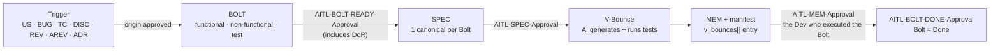

# Onboarding — Avenga DevFlow

**Methodology version:** 5.1

> **Getting started.** Everything you need to know about how we work here and
> how to take your first Bolt. If it is not in this document, it is in the
> source of truth.

## 1. What this is

Avenga DevFlow is the project's AI-assisted development methodology: the **AI
generates**, the **human governs** through mandatory approval checkpoints
(AITL — an actor, human by default) at every step.

- **Source of truth:** [`avenga-devflow/Avenga-DevFlow.md`](avenga-devflow/Avenga-DevFlow.md) (v5.1)
- **Rules the agent enforces:** [`GUARDRAILS.md`](GUARDRAILS.md) (AITL stops, naming, traceability)

---

## 2. Reading order by role (5–10 min each path)

| Role | Read this | Why |
|------|-----------|-----|
| **Everyone** | `analysis/introduction/` (if present) → `README.md` → §0 of `Avenga-DevFlow.md` → `GUARDRAILS.md` (checkpoint map + blocking rules) | The plain-language story of each feature first (no jargon, not a source of truth), then the flow, the mandatory human stops, and what is forbidden |
| **Stakeholder / PO** | `analysis/vision/` + `functional/INDEX.md` | Review and contribute to USs and ACs; signs `AITL-BOLT-DONE-Approval` on every `feature` Bolt (without it the Bolt is not Done); does not write |
| **Functional Analyst** | `input/` + `analysis/README.md` + `functional/` | Create and approve USs, BUGs and functional Bolts |
| **Developer / Dev-validator** | `adrs/INDEX.md` + `spec/README.md` + `memory/README.md` + `metrics/README.md` + `tests/test-cases/` | Run V-Bounces, approve SPECs and MEMs, maintain manifests |
| **Architect / Tech Lead** | `adrs/` + `risks/` | Approve ADRs, non-functional Bolts, and `critical`-severity non-functional BUGs (lower severities may be approved by any team member, author included) and promotions |
| **QA / QA Automation** | `tests/` + `bugs/` + `reviews/` | Design TCs, report BUGs, create Test Bolts |

---

## 3. The one Bolt path

All work follows the **same single path**. Every stop is a named human
approval (`AITL-<CODE>-Approval`) — none is skipped. Terms in **bold** are
defined in the glossary (§4).

Golden rules of the path:

- **No code without an approved Bolt** — not a typo, not a config value (G07; its one scope-out: the agent lifecycle within `devflow/agents/` + `devflow/actors/` is operational config — living data).
- **One V-Bounce = one MEM** — previous MEMs are immutable history; if you request changes, the next attempt is a new V-Bounce with a new MEM.
- **The agent never self-approves** — `AITL-MEM-Approval` is signed by the Dev-validator who executed the Bolt (one approver, any risk; QA/Sec/domain reviewers optional).
- **An artifact without its manifest does not exist** — every US, Bolt and TC has a JSON manifest in `metrics/` that validates against its `manifest-v5*.schema.json`.

---

## 4. Minimal glossary (what you will see on day 1)

| Term | Definition |
|------|------------|
| **V-Bounce** | Execution micro-cycle: approved SPEC → the AI generates and runs tests → creates MEM + updates manifest → a human approves. |
| **Bolt** | Work unit (sizing: 1h–1d of active delivery, estimated per the AI-native rule §2.4 — review and rework dominate, never manual coding time). Three types: `functional` (under a feature US), `non-functional` (under `US-000`), `test` (under an approved TC, `TC-NNN.BOLT-NNN`). |
| **US-000** | Permanent container for technical work (infra, refactors, hardening, CI/CD). Has no approval of its own. |
| **Story points** | Optional Fibonacci value (1\|2\|3\|5\|8\|13) on a feature US: relative functional complexity, confirmed at `AITL-US-Approval`. Informational only — never time, never a gate, no velocity. US-000 has none. |
| **TC** | Test Case: independent verification contract, derived from approved intent — never from current code. |
| **SPEC** | Implementation plan for one Bolt (one canonical SPEC per Bolt; versioned revisions). |
| **MEM** | Narrative record of one V-Bounce: what was done, files with reasons, test evidence, decisions. |
| **Manifest family** | One mechanical JSON per governed artifact, in three levels: feature US (`metrics/user-stories/`), Bolt (`metrics/bolts/`) and TC (`metrics/test-cases/`), each validated by its `manifest-v5*.schema.json`. Created with the document and updated at every step, recording origin, SPEC revisions, V-Bounces, AITL decisions and step timings (`created_at`, `review_ready_at`, `review_started_at`, `decided_at`). An artifact without its manifest does not exist (G23, G33). US-000 carries none. |
| **Actor** | A member of the team who **produces** the governed artifacts its role owns (FA → US, architect → ADR, developer → SPEC + code, QA → TC/tests) as executor and **participates** in AITL approvals as approver when configured, under the independence floor — a **human by default**, a virtual **DevFlow Agent** only by explicit, valid configuration (§3.0.1). Recorded `human:<user>` / `agent:<id>`; the model is an attribute of the agent actor, never the identity. HITL is the default case inside AITL (actor = human); with no agents configured every checkpoint is a human approval and **no AI-signed approval is possible** (the safe-default invariant). |
| **AITL checkpoint** | Mandatory human approval with name, timestamps and evidence: `AITL-US-Approval`, `AITL-BOLT-READY-Approval`, `AITL-BOLT-DONE-Approval`, `AITL-SPEC-Approval`, `AITL-MEM-Approval`, … (there is no `AITL-BOLT-Approval`: the Bolt has two distinct checkpoints, G05). The pre-v5 `HITL-*` prefix is invalid (G05). |
| **DoR / DoD** | Definition of Ready (validated inside `AITL-BOLT-READY-Approval`) / Definition of Done (completion evidence, validated at acceptance). |
| **ADR** | Immutable architecture decision (once approved, it is never edited). |
| **BUG** | Confirmed defect. Requires `AITL-BUG-Approval` before its dedicated Bolt is created. |
| **DISC / REV / AREV** | Investigation / review / adversarial debate — optional (need-driven), but with mandatory approvals once initiated. |
| **UAT** | User Acceptance Testing. The UAT approval checkpoint was removed in v4.2; release/acceptance follows the team's own process until a redesigned model ships in a future version. |
| **`_archive/`** | Per-folder subfolder holding lifecycle-closed documents. Excluded from agent scans for token economy — the agent reads it only if you explicitly ask, or if an active document references an archived artifact (§5.4, W20). |
| **`agents-data/`** | Per-agent shared knowledge area, versioned and visible to the whole team. No pre-created subfolders: each agent creates its own `agents-data/<agent-name>/` on first use and is responsible for it — durable knowledge only, never temporary data (W21), and never a replacement for `memory/` MEMs (§2.12). Not evidence: never citable, no AITL. The `devflow/` folder structure is canonical — agents may not create new folders (G30) and never write into `input/`, which is human-deposited raw evidence (G31, §5.12). |
| **`prompts/`** | Project prompts (`PROMPT-NNN-<description>.md`) — versioned, team-shared, copy-paste ready. Living data: created, modified and improved in this folder, no approval and no manifest; never scattered into `agents-data/` (§5.12). |
| **`reports/`** | Sprint progress reports for project management (`REPORT-YYYY-Www.html`) built from the manifest family — delivery, quality, review latency, AITL coverage and AI usage. **Generation is planned** (tooling track): only a design reference with example data ships today. Derived, never governed: not citable as the source of any artifact (G28, §5.12). |

---

## 5. FAQ

**I found a bug, what do I do?**
Document it in `bugs/BUG-NNN.md` → wait for `AITL-BUG-Approval` → its
dedicated Bolt is created → strict TDD **inside the same V-Bounce** (red test →
fix → green). It is never fixed under another Bolt or directly from a ticket.

**Should I create a DISC or go straight to a US?**
If there is a material unknown to investigate (external API, library, legacy
behavior) → `DISC-NNN`. If you already know what to build → US directly
(business behavior) or a non-functional Bolt under `US-000` with its approved
technical source (ADR/DISC/REV).

**Can I edit an approved ADR?**
No. Decisions in an approved ADR are immutable; if the decision changes, you
create a new ADR that supersedes it.

**Who approves my MEM?**
The Dev-validator who executed the Bolt — the same developer who took it.
One approver at any risk; QA or Security may be added as optional reviewers, never required.

**Can I touch code without a Bolt?**
No. It is a blocker (G07): code, tests, config, IaC, schemas and migrations
require an approved Bolt. Urgency and size create no exception. The one
scope-out: the agent lifecycle (installing/creating/deleting DevFlow Agents
within `devflow/agents/` + `devflow/actors/`) is operational config —
living data, not a code change.

**Can I work on several Bolts at once?**
Ideal WIP: **1 active Bolt per person/agent** (§3.2). No multitasking — if you
get blocked, it gets resolved or returned; Bolts are not left half-done.

**Where is my Bolt's manifest?**
In `metrics/bolts/`, named after the Bolt (`US-NNN.BOLT-NNN-<desc>.json` or
`TC-NNN.BOLT-NNN-<desc>.json`). If it does not exist or does not validate
against `manifest-v5-bolt.schema.json`, the Bolt does not exist. Every US and TC
has its own manifest too (`metrics/user-stories/`, `metrics/test-cases/`).

**Why does the agent not see my archived documents?**
By design (§5.4, W20). Each folder may keep an `_archive/` subfolder for
lifecycle-closed documents, and agents do **not** search, list or read it
proactively — that is what keeps their token cost down as the project grows.
Treat archived files as generally invisible to the agent: it reads them only
when you explicitly ask, or when an active document explicitly references an
archived artifact. If a task needs archived content, the agent will say so
and ask you first.

**Where do agents store their shared knowledge?**
In `devflow/agents-data/` — a versioned area visible to the whole team
(§5.12). There are no pre-created subfolders: each agent creates its own
`agents-data/<agent-name>/` folder on first use and is responsible for its
content. Everything there is **committed to the repository and shared with
everyone**; it holds durable, team-useful knowledge only — **never temporary
data** (that goes to the OS temp directory, W21) and **never a replacement
for `memory/`** (one MEM per V-Bounce stays mandatory, §2.12). It is never
evidence, carries no approvals, and agents do not scan other agents' folders
unless you ask. Agents may **not** create new folders inside `devflow/`
outside the canonical structure (G30), and they never write into `input/`:
that folder is deposited by humans only and is read-only for agents (G31).

---

## 6. Language policy

The **schema** (YAML keys, enums, IDs) is always in
**English** — validators and dashboards require it. The **prose**
(descriptions, decisions, narrative) follows the project's `content_language`,
declared in `devflow/LANGUAGE` (the language of the raw inputs; see §3.15 of
the methodology). Filename `<description>` slugs follow `content_language`
(kebab-case ASCII, no accents); section headings follow `content_language`
in `analysis/`, feature User Stories and Test Cases and stay English
elsewhere; ADR titles and bodies follow `content_language`. `AITL-*-Approval`
codes are never translated. Never mix languages within one field.

---

## 7. Developer development plan (§3.14 — skill atrophy mitigation)

If the agent writes everything, juniors never build the skills to review the
agent. This is managed explicitly. **The plan is descriptive only** — it
creates no artifacts and no evidence of these practices is recorded in
`devflow/` documents (§3.14):

| Practice | Cadence |
|----------|---------|
| Role rotation (Spec-author ↔ Dev-validator ↔ AI-Orchestrator) | ≥1 per quarter |
| AI-review training (common failure modes) | 1-day onboarding module |
| Quarterly skill review | Quarterly |

---

## Deeper reading

- **`avenga-devflow/Avenga-DevFlow.md`** — The complete methodology (normative; §2/§3 govern).
- **`GUARDRAILS.md`** — The 39 blockers, 21 warnings, naming and traceability.
- **`README.md`** — Framework map, full flow and cheat sheet.
- Every subfolder has its own `README.md` — read it before creating documents there.
