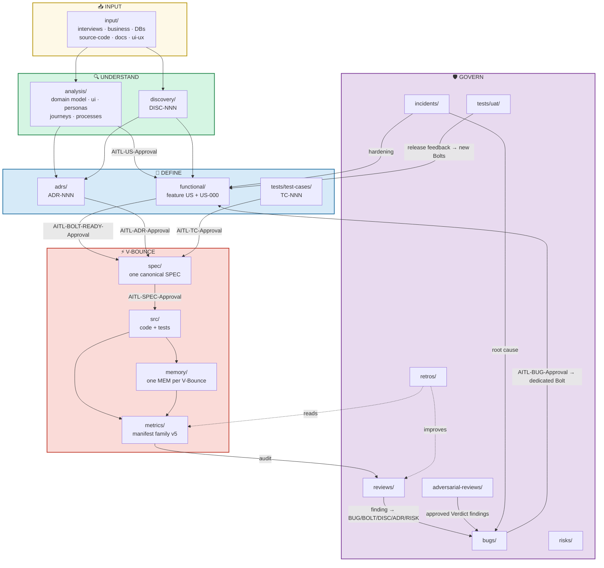
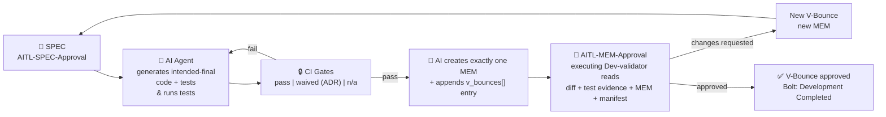
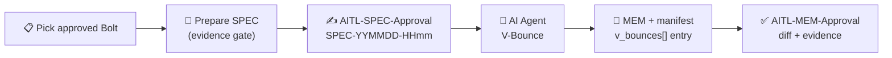

# Avenga DevFlow — Development Flow

**Methodology version:** 5.1

## Purpose

This folder is the **single source of truth** for all project documentation —
business context, analysis, architecture decisions, implementation specs,
reviews, and execution memory. It embodies *Documentation as Code*: the docs
live with the code, are versioned with Git, and are maintained as part of the
normal workflow.

Everything starts in `input/` (raw material from the client or legacy system)
and flows through analysis, discovery, functional definition, architecture
decisions, implementation specs, and finally captured knowledge in `memory/`.

> **Normative hierarchy:** the methodology in
> [`avenga-devflow/Avenga-DevFlow.md`](avenga-devflow/Avenga-DevFlow.md) is the
> single source of truth. §2 owns concepts and artifact contracts; §3 owns
> lifecycle, AITL, gates, autonomy and metrics; §4 is an explanatory
> walkthrough; §5 owns structure, locations and names. When repeated text
> appears to diverge, the section that owns that dimension governs.

---

## Folder Map

```
devflow/
├── input/              ← Raw entry material (read-only, as received)
│   ├── business/           RFPs, BRDs, SOWs, compliance, regulations
│   ├── databases/          Legacy DB schemas, DDL, ER diagrams
│   ├── documentation/      Third-party docs: API manuals, datasheets, vendor PDFs
│   ├── interviews/         Stakeholder conversation transcriptions (INT-NNN)
│   ├── source-code/        Legacy source code and configs
│   └── ui-ux/              Screenshots, mockups, brand guidelines, UX research
│
├── analysis/           ← Domain analysis
│   ├── introduction/       Plain-language feature narratives (derivative, non-governed)
│   ├── vision/             Product vision and strategy
│   ├── business-context/   Business objectives, constraints, market context
│   ├── business-risks/     Pre-execution business risks (BR-NNN)
│   ├── scope/              Scope and phasing decisions per milestone
│   ├── personas/           User archetypes
│   ├── user-journeys/      End-to-end user experience maps
│   ├── glossary/           Ubiquitous language terms
│   ├── domain-model/       Entity definitions, relationships, enums
│   ├── ui/                 Surfaces, patterns, states and parity contracts
│   ├── process/            Business processes (BPMN/Mermaid, PROC-NNN)
│   └── open-questions/     Centralized backlog of analysis questions (OQ-NNN)
│
├── discovery/          ← Need-driven investigations (DISC-NNN, AITL-DISC-Approval)
├── functional/         ← User Stories + Bolts (WHAT to build)
│   ├── user-stories/       Feature US (US-NNN) + US-000-non-functional.md container
│   └── bolts/              Functional (US-NNN.BOLT-NNN) · non-functional (US-000.BOLT-NNN) · Test (TC-NNN.BOLT-NNN)
├── adrs/               ← Architecture Decision Records (ADR-NNN, AITL-ADR-Approval)
├── spec/               ← One canonical SPEC per Bolt (SPEC-YYMMDD-HHmm, AITL-SPEC-Approval)
├── memory/             ← One MEM per V-Bounce (MEM-YYMMDD-HHmm, AITL-MEM-Approval)
├── metrics/            ← Manifest family v5 (bolts/ · user-stories/ · test-cases/) + schemas
├── reports/            ← Sprint progress reports (PM; generator planned, tools track)
├── tests/              ← Human-facing verification
│   ├── test-cases/         Test Cases (TC-NNN, AITL-TC-Approval)
│   └── uat/                UAT minutes (UAT-NNN) — dormant/reserved
├── reviews/            ← Stakeholder-triggered reviews (REV-NNN, AITL-REV-Approval)
├── adversarial-reviews/← LLM-vs-LLM debates (AREV-NNN: Critique → Defense → Verdict)
├── bugs/               ← Confirmed defects (BUG-NNN, AITL-BUG-Approval)
├── incidents/          ← Production incidents & post-mortems (INC-NNN)
├── risks/              ← Risk register (RISK-NNN)
├── retros/             ← Weekly retrospectives (RETRO-NNN)
├── agents-data/        ← Per-agent shared knowledge (each agent creates its own folder)
├── prompts/            ← Project prompts (PROMPT-NNN, copy-paste ready)
├── bin/                ← Compiled tooling executables (optional; replaced on upgrade, §5.16)
├── avenga-devflow/     ← Methodology reference (single source of truth)
├── ONBOARDING.md       ← Onboarding guide for new team members
└── GUARDRAILS.md       ← Agent-enforced rules (AITL stops, naming, traceability)
```

Alongside `devflow/`, the repository root also carries **`AGENTS.md`** — the
cross-tool entry point several agents auto-load — and the **agent definition
for the tool your team uses**, at the location that tool expects (`CLAUDE.md`
at the root, `.github/agents/`, `.opencode/agents/`, `.agents/skills/`). Both
are installed from the Avenga DevFlow distribution (§5.2).

---

## The Complete Flow



### How to read it

Five phases, top to bottom. **Solid arrows** = forward flow. **Dashed arrows** = feedback loops.
Every forward stop is governed by a named AITL checkpoint (see [AITL Checkpoints](#checkpoints-actor-in-the-loop--aitl)).

| Phase | What happens |
|-------|-------------|
| **📥 Input** | Raw material lands here. Read-only. Everything starts from this. |
| **🔍 Understand** | `analysis/` extracts domain knowledge. `discovery/` researches material unknowns (DISC). |
| **📐 Define** | `functional/` defines WHAT (feature US / US-000 + Bolts). `adrs/` decides HOW. `tests/test-cases/` defines the independent verification contracts (TC). |
| **⚡ V-Bounce** | One canonical SPEC per Bolt → AI generates the intended-final change + tests → one MEM + manifest v5 entry → human review. |
| **🛡️ Govern** | Reviews, adversarial reviews, bugs, incidents, risks and retros feed the flow. |

### One path into V-Bounce

All work follows the **same single path** — regardless of whether it originates
from a feature, a defect, a review finding, or a QA Automation need:

```
Trigger (US | BUG | TC | DISC | REV | AREV | ADR)
  → origin approved (AITL-US | AITL-BUG | AITL-TC | AITL-DISC | AITL-REV |
                     AITL-AREV-VERDICT | AITL-ADR)
  → BOLT (AITL-BOLT-READY-Approval — includes DoR)
  → SPEC (AITL-SPEC-Approval)
  → V-Bounce → tests/gates
  → MEM + manifest v5 update
  → AITL-MEM-Approval → AITL-BOLT-DONE-Approval
```

| Step | What happens |
|------|-------------|
| **Trigger** | A feature US, a confirmed BUG, an approved TC, or approved DISC/REV/AREV conclusions or ADR evidence identify work to be done. |
| **Origin approval** | Feature US → `AITL-US-Approval`; BUG → `AITL-BUG-Approval` (before its dedicated Bolt); TC → `AITL-TC-Approval` (before it governs); DISC/REV/AREV conclusions and ADRs carry their own approvals before governing a Bolt. |
| **Bolt** | One of three types: `functional` (feature US), `non-functional` (`US-000`), `test` (`TC-NNN.BOLT-NNN`). Approved individually at `AITL-BOLT-READY-Approval`. |
| **SPEC** | One canonical SPEC per Bolt (`bolt` field mandatory). The agent runs the pre-SPEC evidence gate; a human approves at `AITL-SPEC-Approval`. |
| **V-Bounce** | AI generates the intended-final change, runs tests until green (BUGs: strict red→green TDD inside the same V-Bounce), then creates exactly one MEM and updates the manifest. |
| **Review** | The executing Dev-validator approves the MEM at `AITL-MEM-Approval` (one approver, any risk; QA/Sec/domain reviewers optional). |
| **Acceptance** | `AITL-BOLT-DONE-Approval` marks the Bolt `Done`. Release and promotion follow the adopting team's own process (§4.6). |

**No code change happens without an approved Bolt.** Every SPEC references a
Bolt; every V-Bounce produces exactly one MEM; previous MEMs are immutable
history.

---

## V-Bounce: The Execution Micro-Cycle

Every Bolt is executed through **V-Bounce** — the core execution pattern:



**Key principles:**
- The AI agent generates the **intended-final** artifacts by default (code, tests, config, docs) and **runs its own tests** until green or a stop condition.
- After execution, the agent creates **exactly one MEM** and updates the Bolt manifest in `devflow/metrics/bolts/` — **before** human review.
- The human reviewer receives the **complete package**: code + tests/gates + MEM + manifest.
- `AITL-MEM-Approval` is recorded by the **Dev-validator who executed the Bolt** (one approver, any risk; QA/Sec/domain reviewers optional); the agent never self-approves.
- `changes_requested` preserves the MEM as immutable history; the next execution is a new V-Bounce with a new MEM.
- Every US, Bolt and TC produces a manifest in `devflow/metrics/` that validates against its `manifest-v5*.schema.json`.

---

## Checkpoints (Actor-in-the-Loop — AITL)

An approved checkpoint is **non-negotiable** — the approver is an **actor**, a
**human by default** and a virtual DevFlow Agent only by explicit, valid
configuration (with no or invalid config this is pure Human-in-the-Loop; **no
AI-signed approval is possible**). Checkpoints are named
`AITL-<CODE>-Approval`; the legacy pre-v5 `HITL-*` prefix is invalid.
Every approval requires a named reviewer (a human by default), review timestamps
and review-quality evidence (see [GUARDRAILS.md](GUARDRAILS.md) for the full map).

| Checkpoint | Owner | Validates |
|-----------|-------|-----------|
| `AITL-US-Approval` | Functional Analyst | Feature US + ACs approved; only then decomposable |
| `AITL-BUG-Approval` | Functional Analyst (functional) / Architect-TL recommended if `severity: critical` else any team member (non-functional) — guidance, never a gate: any qualified member, the author included, may approve at any severity | BUG confirmed; only then its dedicated Bolt |
| `AITL-TC-Approval` | QA + domain owner | TC approved as independent verification contract |
| `AITL-BOLT-READY-Approval` | Functional Analyst (functional) / Architect-TL (non-functional; except a non-functional BUG's dedicated Bolt, which mirrors its parent BUG's severity routing) / QA Lead · QA Automation Lead · Architect · TL (test) | Bolt approved (includes DoR) |
| `AITL-ADR-Approval` | Architect / Tech Lead | ADR accepted and immutable |
| `AITL-SPEC-Approval` | Dev-validator + domain owners | One-Bolt implementation plan approved |
| `AITL-MEM-Approval` | Dev-validator who executed the Bolt (one approver, any risk; QA/Sec/domain optional) | MEM + V-Bounce approved |
| `AITL-BOLT-DONE-Approval` | PO/PM (functional) · technical owner (non-functional) · QA Lead / QA Automation Lead (test) | Bolt `Done` |
| `AITL-DISC-Approval` · `AITL-REV-Approval` · `AITL-AREV-{CRITIQUE,DEFENSE,VERDICT}-Approval` | Qualified humans | Conditional: mandatory once triggered |

No Bolt moves forward without its **required checkpoints signed with
review-quality evidence** (coverage by Bolt type in GUARDRAILS.md).

---

## Quick Start — Daily Workflow

Already have a configured project? Here's the day-to-day flow:



### Cheat Sheet

| You need to... | Do this |
|---------------|---------|
| Research something unknown | Create `DISC-NNN` in `discovery/` → `AITL-DISC-Approval` |
| Define business behavior | Create feature US in `functional/user-stories/` → `AITL-US-Approval` |
| Define a technical outcome | Create non-functional Bolt under `US-000` (no US approval needed) |
| Make a technical decision | Create `ADR-NNN` in `adrs/` → `AITL-ADR-Approval` |
| Implement a Bolt | `AITL-BOLT-READY-Approval` → `SPEC-YYMMDD-HHmm` → `AITL-SPEC-Approval` → V-Bounce → MEM + manifest |
| Verify a Bolt independently | Create `TC-NNN` in `tests/test-cases/` → `AITL-TC-Approval` |
| Automate QA | Create Test Bolt `TC-NNN.BOLT-NNN` from the approved TC |
| Document a defect | Create `BUG-NNN` in `bugs/` → `AITL-BUG-Approval` → dedicated Bolt → TDD in one V-Bounce |
| Review quality | Create `REV-NNN` in `reviews/` → `AITL-REV-Approval` |
| Run an adversarial debate | Create `AREV-NNN/` in `adversarial-reviews/` (3 sequential phase approvals) |
| Log a risk | Create `RISK-NNN` in `risks/` |
| Store raw material | Drop in `input/` (business, databases, documentation, interviews, source-code, ui-ux) |

---

## Traceability Rules

Every document references the documents it depends on:

- A **DISC** references the `input/` material it analyzed and carries `AITL-DISC-Approval`.
- A **feature US** references the raw inputs / analysis evidence and carries `AITL-US-Approval`.
- A **BUG** carries `AITL-BUG-Approval` and references its exactly-one dedicated Bolt; the Bolt references the BUG.
- A **TC** references exactly one approved source Bolt (+ US/ACs or governing technical sources) and carries `AITL-TC-Approval`.
- A **Bolt** references its parent (approved feature US, `US-000`, or one approved TC) and carries `AITL-BOLT-READY-Approval`.
- A **SPEC** references exactly one approved Bolt; its `sources` lists every governed artifact actually used.
- An **ADR** references its motivating sources and carries `AITL-ADR-Approval`.
- A **REV** / **AREV** references the artifacts it audits; findings are governed only after their approvals.
- A **MEM** references its Bolt, canonical SPEC revision, V-Bounce number and manifest `v_bounces[]` entry.
- The **manifest family** validates against the `manifest-v5*.schema.json` schemas and records each artifact's lifecycle AITL decisions and step timings (minimal projection).

---

## Golden Rules

1. **Read the folder's README** before creating any document.
2. **Use the template** (`TEMPLATE-*.md`) as your starting point.
3. **The methodology governs** — `avenga-devflow/Avenga-DevFlow.md` is the single source of truth; §2/§3 own the rules, §4 is a walkthrough, §5 owns locations.
4. **No code without an approved Bolt** — no exceptions; urgency and size create none (the one scope-out, G07: the agent lifecycle within `devflow/agents/` + `devflow/actors/` is operational config — living data).
5. **Every approval is a named human checkpoint** — `AITL-<CODE>-Approval`, with timestamps and review-quality evidence. The agent never self-approves.
6. **One canonical SPEC per Bolt; exactly one MEM per V-Bounce** — previous MEMs are immutable history.
7. **An artifact without its manifest does not exist** — every US, Bolt and TC has a manifest in `devflow/metrics/` that validates against its `manifest-v5*.schema.json`.
8. **A failed gate cannot be overridden without an ADR** approved through `AITL-ADR-Approval` (owner + compensating control + expiry); the gate records `waived`, never `pass`.
9. **The reviewer reads the diff and the test evidence**, not the agent's self-summary.
10. **Mermaid for every diagram** (BPMN allowed for business processes); never ASCII art or embedded images as diagram substitutes.

---

## Starting a New Project

1. Install the distribution: the entire `devflow/` folder, `AGENTS.md` at the
   repository root, and the agent definition for your tool at the location it
   expects.
2. Drop all raw material into `input/` organized by subfolder.
3. Process `input/` into `analysis/` (AI-assisted; Functional Analyst governs).
4. Create feature USs and stop at `AITL-US-Approval`; technical work goes under `US-000`.
5. Define and approve candidate Bolts (`AITL-BOLT-READY-Approval`) — functional, non-functional, and (from approved TCs) test.
6. Draft and approve Test Cases (`AITL-TC-Approval`) before the implementation SPEC.
7. Create ADRs (`adrs/`) as technical decisions are made (`AITL-ADR-Approval`).
8. For each Bolt: SPEC → `AITL-SPEC-Approval` → V-Bounce → MEM + manifest → `AITL-MEM-Approval`.
9. Accept Bolts (`AITL-BOLT-DONE-Approval`); release/promotion follows the team's own process (§4.6).
10. Conduct reviews (`reviews/`, `adversarial-reviews/`) as stakeholders trigger them.

---

## Known Limitations & Roadmap

What this version deliberately does **not** cover yet — read before adopting:

| Limitation | Status | Where it is governed |
|------------|--------|----------------------|
| **Unit/UAT approval-and-release layer** | **Removed in v4.2** — the reserved UNIT/UAT approval checkpoints and their promotion sequence did not reflect real corporate environment/promotion complexity. The governed flow ends at Bolt acceptance; release/promotion follows the team's own process. A redesigned model is planned for a future release. | §4.6 |
| **Multi-repo / shared-monorepo `devflow/`** | Out of scope — SPEC, manifest and MEM resolve paths against a single repository baseline. To adapt: relocate `devflow/` and redefine the manifest's repository-relative `ref`/`sources` semantics. | §1 "Repository topology assumption" |
| **Monetary cost** | Deferred — no price catalog, no cost metric. Manifests keep recording provider/model/token usage in `runs[]`, so when pricing returns, costs are computable retroactively over all historical manifests. | §3.12 — `runs[]` keeps the token model; cost stays computable retroactively |
| **Validation tooling** | No validator ships with the methodology — G23/G33 schema and lifecycle validation remains procedural (agents and humans). Tooling arrives with the tools track, not with the methodology: optional by contract, with `devflow/bin/` reserved in the canonical tree for when it lands (§5.1). | `GUARDRAILS.md` G23/G33, §5.1 — tools track (arrives with `devflow/bin/`) |
| **Report generation** | Planned — `reports/TEMPLATE-REPORT.html` ships as a design reference with example data, not a generator. The manifest family already records everything a report needs (§3.12 timing contract), so reports stay computable retroactively once the tooling lands. | `reports/README.md`, §5.12 |

---

## Language Policy

The schema (YAML keys, enum values, IDs) is always in **English**; validators
and INDEX counters require it. The project's `content_language`, declared in
[`LANGUAGE`](LANGUAGE), governs the prose, the filename `<description>` slugs
(kebab-case ASCII, no accents), ADR titles, and the section headings of
`analysis/`, feature User Stories and Test Cases. Headings of every other
artifact family stay in English, and `AITL-*-Approval` codes are never
translated (§3.15).

---

## Further Reading

- **`avenga-devflow/Avenga-DevFlow.md`** — The full methodology (normative source): V-Bounce, three Bolt types, named AITL checkpoints, DORA Five metrics, gates, manifest family v5 and governance.
- **`GUARDRAILS.md`** — Agent-enforced rules: AITL stops, blocking/warning guardrails, naming, traceability.
- **`ONBOARDING.md`** — Recommended reading order and role-based map.
- **`metrics/README.md`** — Manifest family v5 schemas and lifecycle.
- Every subfolder has its own `README.md` — read it before creating documents there.
