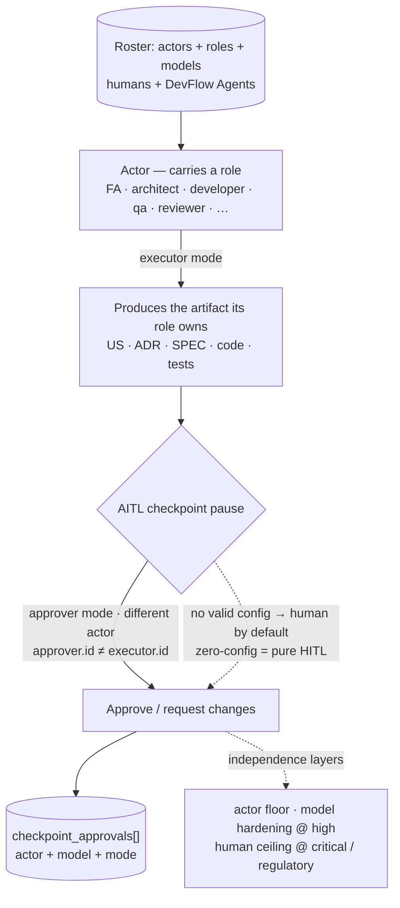

# actors/ — who is in the team

> **Not `agents/`.** `devflow/actors/` is the **roster home**: who is in
> the team, humans and DevFlow Agents together as **actors**. `devflow/agents/`
> holds the **AI-member definitions** — the examples, the templates and
> your project's live agents (`agents/squad/`). A human actor is a roster
> row without a definition file; a DevFlow Agent is a roster row **plus**
> a live definition in `agents/squad/`.

## What is an Actor?

An **Actor** is a **member of the team** — a **human by default**, a
**virtual DevFlow Agent** only by explicit, valid configuration — who
**produces** the governed artifacts its role owns (FA → US, architect →
ADR, developer → SPEC + code, QA → TC/tests) as **executor** and
**participates** in AITL approvals as **approver** when configured, under
the independence floor. The normative definition — grammar, independence
layers, open roles and the safe default — lives in **§3.0.1 The Actor** of
[Avenga-DevFlow.md](../avenga-devflow/Avenga-DevFlow.md); this README only
teaches the concept and points there.

In one picture (the canonical diagram, §3.0.1):

## The family shape

`actors/` follows the standard family shape — **one file per actor, one
list for the team**:

| File | Purpose |
|------|---------|
| `roster.yaml` | **The team list — the single membership authority**: one entry per actor referencing its file. An actor file **not listed here is not in the team** |
| `TEMPLATE-ACTOR.yaml` | The template for creating an actor file (the v1 shape — the `capabilities` block returns with the v2 hardening) |
| `roster.schema.yaml` | Validates an actor file (fail fast; the safe default applies until fixed) |
| `INDEX.md` | The family docs index (the *team* lives in `roster.yaml`) |
| `examples/` | The worked examples — `example-human.yaml` (a human actor), `example-agent.yaml` (a DevFlow Agent actor), `example-roster.yaml` (a filled team list, illustrative) — copy as starting points |
| `actors/<actor-id>.yaml` | One file per actor — created from the template, **listed in `roster.yaml`** |

**Each actor carries** `id` (kebab-case — the identity), a project-chosen
`name` (e.g. "Arq Juan", ".NET Architect"), `role`, `modes`, `approves` —
DevFlow Agent actors **also `model` and a `definition` pointer to a live
agent in `agents/squad/`** (never to `agents/examples/`); **humans omit
both** (`human:<user>` → model null, §3.0.1).
**Definitions are reusable** (N actors : 1 definition — two architects may
share one squad definition), each actor distinct by `id`. The **`model` is
per-instance** (authoritative; enables model-level independence between
actors sharing a definition at `high` risk). **`produces` is derived from
`role`** (the single role → artifacts mapping, §3.0.1) — never a field.

## The roster is the enablement

**Enabling a virtual approver is the human's configuration act — the
roster entry IS the explicit, valid configuration.** A DevFlow Agent whose
schema-valid actor file carries `modes: [approver]` and a non-empty
`approves`, **and is listed in `roster.yaml`**, may occupy those AITL
checkpoint classes exactly like a human — no separate ADR, no policy
switch. The rules that make this safe:

- **Human-authored, always.** A human writes or merges the actor file and
  its `roster.yaml` listing — the git history is the record. **An agent
  never enables its own approval**: the Coordinator may scaffold an actor
  as an executor-only draft, but the authority fields (`modes:
  [approver]`, `approves`) are the human's act.
- **The schema is the validity gate.** A malformed actor file — including
  `approver` in `modes` with an empty `approves` — fails fast, and the
  safe default (humans) applies until fixed.
- **The ceiling is fixed.** `critical` and `regulatory` checkpoints are
  **human-only**, regardless of roster contents (§3.0.1) — not
  configurable.
- **Never a silent flag.** Installing an agent's wrapper never enables
  approval by itself; only the roster grant does.

## Resolution rules

The roster is a deterministic lookup. The rules:

1. **Role → actors.** A checkpoint's recommended role resolves to the
   actors holding it — humans and DevFlow Agents as peers. An **agent**
   holder counts only for the checkpoint classes **its own `approves`
   grants** (the roster entry is the enablement).
2. **Who produces.** An artifact class resolves to the actors holding the
   role that owns it — the production mapping derives from `role` (the
   single role → artifacts mapping, §3.0.1).
3. **Independence ladder.** `approver.id ≠ executor.id` (the actor floor —
   the executor is the producer of the artifacts under review); at `high`
   risk additionally `approver.model ≠ executor.model` (model hardening —
   the per-instance `model` makes this possible); at
   `critical`/`regulatory` the roster resolves to humans regardless of
   contents. A violating routing is refused.
4. **Definitions shared, actors independent.** Two actors sharing one
   `definition` stay independent at the actor level (distinct `id`) — one
   may approve the other's work at low/medium; at `high`, model hardening
   requires distinct per-instance `model`s.
5. **Membership is the list.** Only actors listed in `roster.yaml` exist
   for the lookup — and every listed id must resolve to an existing
   `actors/<actor-id>.yaml` (the consistency check; the validator tooling
   automates it).
6. **Zero-config.** With no roster, an empty list — or no schema-valid
   approver entry — the project behaves byte-for-byte as pure HITL: every
   checkpoint resolves to humans.

## Single-maintainer / human-roster guarantees

The human roster's guarantees hold as a special case of the unified
actors roster:

- **External reviewers.** A single-maintainer team may name an external
  reviewer to fill a required role.
- **Optionality.** An empty roster changes nothing — the methodology
  behaves exactly as before.
- **Migration.** The roster family travels with the §5.16 migration.
- **Living data.** Member join/leave updates require no approval — except
  an *approver's* authority fields (`modes`/`approves`), which are the
  **human's configuration act**: a human writes them, an agent never does.

## The grammar in one glance

| Actor | Recorded as | Model |
|-------|-------------|-------|
| Human | `human:<user>` | `null` |
| DevFlow Agent | `agent:<id>` | its declared model (an attribute) |

## What lives here

- **`roster.yaml`** — the team list (the membership authority; ships
  empty — your team is yours).
- The **actor files** — one per actor (`actors/<actor-id>.yaml`),
  validated by `roster.schema.yaml`, listed in `roster.yaml`.
- The **family shape** — `TEMPLATE-ACTOR.yaml`, `roster.schema.yaml`,
  `INDEX.md`, `examples/`.

**Zero-config unchanged:** with no roster entries — or none declares a
DevFlow Agent approver — every checkpoint resolves to a human actor, pure
HITL, exactly as before.
