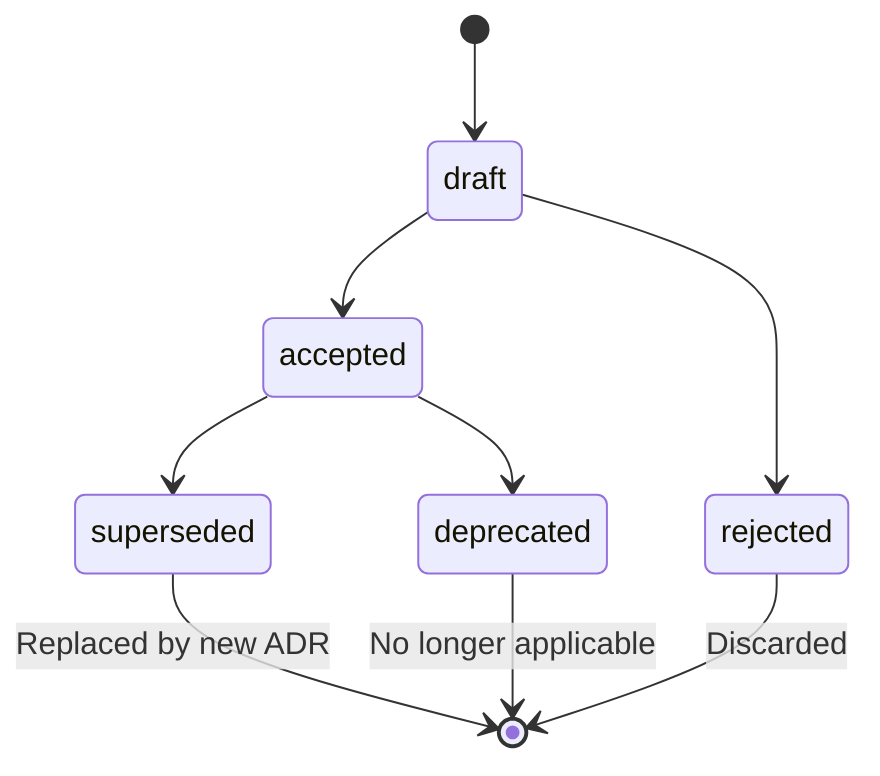

# Architecture Decision Records (ADRs)

**Methodology version:** 5.1

## Purpose

This folder stores the project's **Architecture Decision Records (ADRs)**.
An ADR is a brief, immutable document that captures a significant
architectural decision along with its context, the alternatives considered
and the expected consequences.

The goal is to build a decision log so that **anyone** can understand
**WHY** the system is designed the way it is.

Reference: Avenga DevFlow §2.8, §3.0 (AITL-ADR-Approval), §3.5.

---

## When to create an ADR

| Trigger | Example |
|---------|---------|
| Significant technical decision | DB choice, API style, auth strategy |
| Gate override / waiver | A gate override: the ADR must be approved through `AITL-ADR-Approval` and record **reason, owner, compensating control and expiry date** (§3.6); the gate then records `waived`, never `pass` |
| NFR definition or trade-off | Performance vs. cost, availability vs. consistency — NFRs are governed **inside** approved ADRs (§2.7) |
| L4 autonomy grant | Multi-Bolt scope granted to the agent (§3.3) |

**Timing (§2.8, §3.5):** An ADR that constrains implementation must be
prepared and **approved before the SPEC is generated**. If an unresolved
architectural decision emerges during SPEC preparation or a V-Bounce, the
work stops; the ADR is drafted and approved, then the canonical SPEC is
revised and re-approved before technical execution resumes.

---

## Scope: Dual design

ADRs cover both design layers (§3.5):
- **Domain Design** (tactical DDD) — bounded contexts, aggregates,
  entity boundaries.
- **Logical Design** (patterns / NFR / platform) — architecture patterns,
  infrastructure, performance trade-offs.

---

## Naming convention

```
ADR-NNN-short-description-in-kebab-case.md
```

- `ADR` — Fixed prefix.
- `NNN` — 3-digit sequential number (check `INDEX.md` for the next number).
- Status changes live in the **frontmatter `status` field only** — the
  filename never changes, and no `Deprecated`/`Superseded` filename suffixes
  are used (§5.15).

---

## Approval and immutability (fundamental rule)

**Approval (§2.8, §3.5):** Every ADR remains a **draft** until an Architect
or Tech Lead records `AITL-ADR-Approval`. Approval of a User Story, Bolt,
SPEC, V-Bounce, Review or Adversarial Review **never implies** ADR approval.
A draft ADR cannot govern a
SPEC, establish a non-functional constraint, authorize an exception, or be
treated as an accepted decision. Drafts may be refined in response to
`AITL-ADR-Approval` feedback.

**Immutability (§3.5):** Once approved, an ADR is **READONLY**.

**✅ Allowed:**
- Update the `status` field in the frontmatter (`accepted` → `deprecated` /
  `superseded`).
- Create a **new ADR** that supersedes the old one when a decision reverses.

**❌ Not allowed:**
- Modify substantive content (context, alternatives, decision, consequences)
  after approval.
- If a decision needs to change, create a **new ADR** that supersedes the
  previous one; the old ADR stays as-is with status `superseded`.

---

## ADR conflicts (§2.8, §3.5)

Two **active** ADRs may not contradict each other. If ADR-005 says
"PostgreSQL" and ADR-012 says "MongoDB" for the same use case, neither
superseding the other, the conflict blocks any SPEC that needs both.

**Detection (at creation):** before requesting `AITL-ADR-Approval`, the
drafter checks the decision log for active ADRs contradicted by the new
decision and records them in the `conflicts_with` frontmatter field. The
approver verifies this check during the approval review.

**Resolution (the rule):** a conflict is always resolved by a **new ADR
that supersedes the contradicting one(s)** — it states the contradiction
in its context, lists them in `supersedes`, and the old ADRs are marked
`superseded`. AREV/REV are not required by default; they remain available
as stakeholder escalation for high/critical conflicts.

**Enforcement (at use):** the pre-SPEC evidence gate (§2.4.1) blocks any
SPEC whose `sources` include mutually exclusive active ADRs, with a
conflict report naming the ADRs and the required superseding ADR.

---

## Lifecycle



| Status | Meaning |
|--------|---------|
| **draft** | Under evaluation, pending `AITL-ADR-Approval` — no governing authority |
| **accepted** | Active. Authoritative architecture guidance |
| **rejected** | Evaluated and discarded (record of alternatives not taken) |
| **deprecated** | Fully implemented or no longer relevant |
| **superseded** | Replaced by a more recent ADR |

---

## Recommended structure

1. **Title & metadata** — Number, name, date, status, decision-makers.
2. **Context** — Problem or need that motivated the decision.
3. **Alternatives considered** — Options evaluated with pros and cons.
4. **Decision** — Clear statement of what was decided.
5. **Consequences** — Positive impact, trade-offs, technical debt.
6. **Applicable NFRs** — NFR table when the ADR defines or impacts non-functional requirements (§2.7).
7. **References** — Links to documents, standards, other ADRs.

See [`TEMPLATE-ADR.md`](TEMPLATE-ADR.md) for the complete structure,
including the `AITL-ADR-Approval` review contract.

### Diagrams and visual elements

Use **Mermaid** for all diagrams, charts and any other visual element
(no ASCII art or embedded images).

---

## Rule for AI agents

| Status | Action | Reason |
|--------|--------|--------|
| **accepted** | ✅ **CONSULT AND FOLLOW** | Active authoritative guidance |
| **draft** | 👁️ **READ as context** | Relevant but not binding; cannot govern |
| **rejected** | ⛔ **IGNORE** | Decision discarded, do not apply |
| **deprecated** | ⛔ **IGNORE** | No longer applies to the project |
| **superseded** | ⛔ **IGNORE** | Replaced by a more recent ADR |

> **Rule of thumb:** Only ADRs in `accepted` status are governing. `draft`
> ADRs may be consulted for context but are not binding and cannot govern a
> SPEC or authorize an exception.

---

## What does an ADR define?

**Yes:** Technology platform, layer structure, design patterns,
code conventions, testing strategy, hardware configuration.

**No:** Business rules (→ Discovery / analysis), implementation steps (→ Spec),
review findings (→ Review), record of what was implemented (→ Memory).

---

## Non-Functional Requirements (NFRs)

**Non-functional requirements** (performance, security, availability,
scalability, observability, etc.) are **defined and governed inside approved
ADRs** (§2.7). They are not independent DevFlow artifacts and must not be
defined in User Stories, Acceptance Criteria, Bolts or SPECs.

### How are they recorded?

| Scenario | Where to document |
|----------|------------------|
| An ADR **defines** an NFR (e.g. "we chose Redis to achieve < 50ms p99") | "Applicable NFRs" section of the ADR |
| An NFR **motivates** a decision (e.g. "we need 99.9% uptime") | "Context" field of the ADR + NFRs section |
| An NFR is **cross-cutting** across several decisions (e.g. security policy) | Dedicated ADR such as "ADR-NNN-nfr-security-policy" |

### NFRs section structure

```markdown
## Applicable NFRs

| NFR | Description | Threshold | How it is measured |
|-----|-------------|-----------|-------------------|
| Latency | /api/x endpoint response | < 200ms p95 | APM metrics |
| Availability | Main service | 99.9% monthly | Health checks |
```

> **Rule:** Every ADR that impacts an NFR **must** include this table. If an
> NFR has no associated approved ADR, it is a sign that a documented
> architectural decision is missing.

---

## Document index

See **[INDEX.md](INDEX.md)** for the list of draft, active, rejected,
superseded and deprecated ADRs.

---

## Language

YAML keys, status enums, IDs, and template section headings stay in **English**
(the schema). ADR titles and all prose — context, decision,
consequences — go in the project's `content_language`, declared in
[`../LANGUAGE`](../LANGUAGE) (see §3.15).
