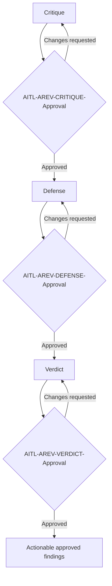
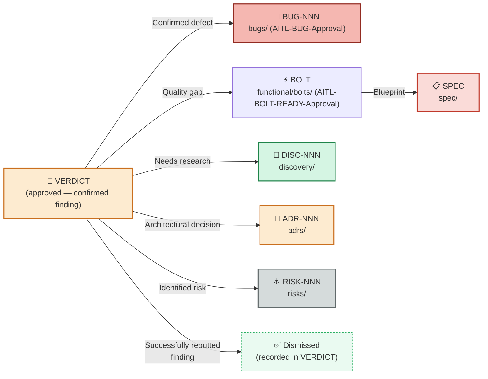

# Adversarial Reviews — Structured Debate Protocol

**Methodology version:** 5.0

## Purpose

This folder contains **structured adversarial debates** between LLM models.
The principle: a model reviewing its own work is too complacent — the same
blind spots persist. A different model brings independent perspective and
detects problems the author (human or AI) cannot see.

The protocol implements a **3-phase debate** (Critique → Defense → Verdict),
where a "Judge" model arbitrates disputes and delivers a consolidated verdict
to the human.

The adversarial review **does not replace** human validation — it **precedes**
it, so the human arrives with a debate already resolved and can focus on
high-level decisions. It is a **pre-filter for later human decisions, never a
replacement** (§2.15, §3.0).

An AREV may take a **specific Bolt's completed V-Bounce package** as its
subject, be **themed** (security, architecture, performance, …), or be
**requested ad-hoc** by any stakeholder or team member on any part of the
code — with no Bolt, SPEC or User Story required to exist.

> **Reference:** Concept inspired by
> [Adversarial Coding — Using Competing Models as Code Reviewers](https://www.subaud.io/adversarial-coding-competing-models-reviewers/)
> (Court Schuett, 2026), extended with the **Challenger → Defender → Judge**
> pattern adapted to the Avenga DevFlow framework.

---

## Optional, but mandatory once triggered

**An Adversarial Review is never a mandatory stage of the standard E2E flow —
including for high- or critical-risk work** (§2.15). Each stakeholder is
responsible for triggering one when adversarial challenge would add value.

Once initiated, however:

- **All three phases and their approvals are mandatory and sequential.**
- Each phase remains **draft** until its named human checkpoint is approved:
  1. `AITL-AREV-CRITIQUE-Approval`
  2. `AITL-AREV-DEFENSE-Approval`
  3. `AITL-AREV-VERDICT-Approval`
- If changes are requested, that phase is revised and submitted again; the
  next phase **cannot begin** until the current one is approved.
- **Critique and Defense are intermediate arguments and do not create usable
  findings.** Only an **approved Verdict** produces actionable findings.
- Any artifact created or updated from those findings follows its **own
  lifecycle and applicable AITL approval** — a code-related outcome still
  requires an approved Bolt.



---

## No manifest impact

AREV status, phase approvals, selected models and Verdict are recorded **only
in the `AREV-NNN` artifacts** (§2.15). They are **never written to or derived
from the Bolt manifest** — the Bolt manifest deliberately excludes AREV. If an
approved Verdict causes a downstream US, BUG, BOLT, ADR or SPEC change, that
downstream artifact follows its own normal lifecycle and is traced through
its own identifiers.

---

## Relationship with the V-Bounce (Bolt-bound AREVs)

**An AREV is not a stage of the V-Bounce** (§2.15). It is a standalone
mechanism, like a Review: it needs no Bolt, SPEC or User Story to exist, and
it never opens, closes or modifies a V-Bounce. A *Bolt-bound* AREV simply
chooses a completed V-Bounce package as its subject.

```mermaid
flowchart LR
    S["SPEC<br>(AITL-SPEC-Approval)"]
    AI["AI AGENT<br>generates intended-final<br>+ runs tests"]
    KC["CAPTURE<br>MEM + manifest<br>(V-Bounce package closed)"]

    subgraph AREV["ADVERSARIAL DEBATE — optional, stakeholder-triggered, NOT a V-Bounce stage"]
        direction LR
        C["① CRITIQUE<br>(Challenger)"]
        D["② DEFENSE<br>(Defender)"]
        V["③ VERDICT<br>(Judge)"]
        C --> D --> V
    end

    HR["HUMAN REVIEW<br>AITL-MEM-Approval<br>(with pre-digested verdict)"]
    AP["APPROVED<br>or CHANGES REQUESTED<br>→ new V-Bounce, new MEM"]

    S --> AI --> KC --> HR --> AP
    KC -.->|"optional"| AREV
    AREV -.->|"approved Verdict<br>informs the decision"| HR

    style AI fill:#fadbd8,stroke:#c0392b,stroke-width:2px
    style AREV fill:#d5f5e3,stroke:#1e8449,stroke-width:2px,stroke-dasharray: 5 5
    style C fill:#f5b7b1,stroke:#922b21,stroke-width:1px
    style D fill:#d6eaf8,stroke:#2471a3,stroke-width:1px
    style V fill:#fdebd0,stroke:#ca6f1e,stroke-width:1px
    style HR fill:#d6eaf8,stroke:#2471a3,stroke-width:2px
```



Reviewing the **closed** package rather than raw output is deliberate: the
Challenger gets the diff, the tests, the gates, the MEM narrative and the
manifest entry, instead of code alone.

Each phase approval is a human checkpoint; the AREV never writes to the Bolt
manifest.

---

## Types of AREV

### 1. Bolt-bound AREV

Triggered on the **closed package of a completed V-Bounce** (diff + tests +
gates + MEM + manifest), before the reviewer records `AITL-MEM-Approval`. It
is a pre-filter for that decision, never a stage of the V-Bounce itself.

**Examples:**
- "Bolt-015 is high risk — run it through AREV."
- "Before merging the auth Bolt, run it through AREV."

**Evaluation criteria:** SPEC + ADRs of the Bolt.

### 2. Themed AREV (specific focus)

A review with a **thematic focus** on a part of the code, not bound to any
particular Bolt. May use external sources as guidance.

**Examples:**
- "Create an AREV focused on security using OWASP Top 10 as guide."
- "Review if there are architecture violations against the ADRs."
- "AREV on performance for the search module."
- "Accessibility review of the frontend using WCAG 2.2 as reference."

**Evaluation criteria:** Active ADRs + provided reference documentation +
industry best practices.

### 3. Ad-hoc AREV (exploratory)

An open review with no predefined Bolt or focus.

**Examples:**
- "Review the payments functionality end-to-end."
- "General AREV for the notifications module."
- "Let's create an AREV to review the new code we added this week."

**Evaluation criteria:** Active ADRs + team conventions + general best
practices.

### External reference sources

Themed AREVs can (and should) rely on **external sources** as additional
evaluation criteria:

| Source | Typical use |
|--------|------------|
| **Reference documentation servers (e.g. a docs MCP)** | Verify correct API/framework usage (Next.js, Prisma, etc.) |
| **OWASP Top 10** | Web security audit |
| **WCAG 2.2** | Accessibility audit |
| **Official framework docs** | Verify patterns, deprecations, breaking changes |
| **Project ADRs** | Compliance with architectural decisions |
| **RFCs / standards** | Protocol compliance (OAuth2, OpenAPI, etc.) |

> The Challenger **must cite the sources consulted** in their Critique. This
> allows the Defender and Judge to evaluate findings against the same sources.

---

## The 3 debate phases

### Phase 1 — CRITIQUE (Challenger)

**Who:** An LLM model selected as Challenger — typically **different** from
the one that implemented the code.

**Role spirit:** The Challenger is an **independent technical auditor**.
Their attitude is skeptical but fair: they don't assume something is correct
just because it compiles or passes tests. They look for edge cases, implicit
assumptions, unhappy paths, and everything that could go wrong. They are not
here to validate — they are here to challenge. But every finding must be
useful and actionable, not destructive.

**What they do:**
- Read code, tests and SPEC in **read-only** mode.
- Document findings with severity (✅/⚠️/🔶/🔴).
- Do not modify code or propose diffs — only describe what should change and why.
- If the AREV has a thematic focus, prioritize that focus but report critical
  findings outside it as well.
- If external sources were consulted (Context7, OWASP, docs), cite them.
- Issue a preliminary verdict.

**Approval:** Remains draft until `AITL-AREV-CRITIQUE-Approval`.

**Output:** `01-CRITIQUE.md` — See [TEMPLATE-01-CRITIQUE.md](TEMPLATE-01-CRITIQUE.md).

### Phase 2 — DEFENSE (Defender)

**Who:** The implementing model (or same type/family), or another selected
model.

**Role spirit:** The Defender is the **defense attorney for technical
decisions**. Their job is not to "win" the debate — it's to provide the
context the Challenger didn't have. They must be honest: if the Challenger
found a real bug, accept it without excuses. If they have evidence that a
finding doesn't apply (an ADR, a technical constraint, a documented
trade-off), present it. The Defender's worst trap is rejecting everything
out of pride.

**What they do:**
- Read the Critique (Phase 1) and respond **finding by finding**.
- For each finding respond with: **ACCEPT** / **REBUT** / **PARTIAL**.
  - **ACCEPT:** Agrees with the finding, confirms it's a real problem.
  - **REBUT:** Explains why the finding is incorrect or doesn't apply (with evidence).
  - **PARTIAL:** Acknowledges part of the finding but provides context that changes severity.
- Can reference ADRs, design decisions, or constraints the Challenger didn't
  have visibility into.
- Includes an honest reflection: did any finding genuinely surprise them?
- Also operates in **read-only** — does not change code in this phase.

**Approval:** Cannot begin until the Critique is approved; remains draft until
`AITL-AREV-DEFENSE-Approval`.

**Output:** `02-DEFENSE.md` — See [TEMPLATE-02-DEFENSE.md](TEMPLATE-02-DEFENSE.md).

### Phase 3 — VERDICT (Judge)

**Who:** A **third model**, different from both the implementor and the Challenger.

**Role spirit:** The Judge is the **final arbiter**. They are neither
accuser nor defender — they are impartial but not passive. They evaluate the
**quality** of arguments, not the quantity of words. A rebuttal without
evidence is worth less than a well-documented finding. Their document is
what the human will read to make decisions, so it must be clear, concise
and actionable. "It depends" is not a verdict.

**What they do:**
- Read both documents (Critique + Defense).
- For each disputed finding, **weigh the arguments** from both sides.
- Assign the **final severity** and resolution (CONFIRMED / DISMISSED / RECLASSIFIED).
- Detect cross-cutting patterns ("4 of 6 findings are about error handling").
- Issue the **final verdict** (PASS / CONDITIONAL PASS / FAIL).
- Generate a **consolidated action plan** ready for the human.
- Evaluate debate quality: was the Challenger rigorous? Was the Defender honest?

**Approval:** Cannot begin until the Defense is approved; only an approved
Verdict (`AITL-AREV-VERDICT-Approval`) produces actionable findings.

**Output:** `03-VERDICT.md` — See [TEMPLATE-03-VERDICT.md](TEMPLATE-03-VERDICT.md).

> **This is the key document for the human.** The dev-validator reads the
> VERDICT and decides actions — they don't need to read all 3 phases unless
> they want to dig into a specific disputed finding.

---

## When to activate?

**Every initiated AREV runs all three phases (Critique → Defense → Verdict),
sequentially, each stopping at its approval** (§2.15: "Once initiated, all
three phases and their approvals are mandatory and sequential"). There is no
modular depth — triggering an AREV means committing to the full debate.

| Criterion | When to trigger |
|-----------|-----------------|
| Bolt with **high** or **critical** risk class | Strong candidate — adversarial challenge adds value |
| Bolt with ≥ 2 V-Bounces stuck | Strong candidate |
| Before merge to main branch | At dev-validator's discretion |
| **Security** review pre-release | Stakeholder decision |
| **Architecture compliance** review | Stakeholder decision |
| **Functionality** / **Performance** review | Stakeholder decision |
| General exploration of a module | Stakeholder decision |
| User-requested with open focus | At user's discretion |

> Risk informs the stakeholder's decision but **never triggers AREV
> automatically** (§3.3). Once the stakeholder initiates it, the full
> three-phase protocol with its sequential approvals is mandatory.

---

## Folder structure per AREV

Each adversarial review creates a **folder** inside `adversarial-reviews/`:

```
adversarial-reviews/
├── README.md
├── INDEX.md
├── TEMPLATE-AREV.md
├── TEMPLATE-01-CRITIQUE.md
├── TEMPLATE-02-DEFENSE.md
├── TEMPLATE-03-VERDICT.md
│
├── AREV-001-jwt-authentication/          # ← Bolt AREV
│   ├── AREV-001-jwt-authentication.md    # index
│   ├── 01-CRITIQUE.md
│   ├── 02-DEFENSE.md
│   └── 03-VERDICT.md
│
├── AREV-002-owasp-security/              # ← Themed AREV
│   ├── AREV-002-owasp-security.md
│   ├── 01-CRITIQUE.md
│   ├── 02-DEFENSE.md
│   └── 03-VERDICT.md
│
└── AREV-003-payments-module/             # ← Ad-hoc AREV
    ├── AREV-003-payments-module.md
    ├── 01-CRITIQUE.md
    ├── 02-DEFENSE.md
    └── 03-VERDICT.md
```

### Naming convention

```
AREV-NNN-short-description-in-kebab-case/
```

The folder follows the same kebab-case pattern. Documents inside are always
named `01-CRITIQUE.md`, `02-DEFENSE.md`, `03-VERDICT.md`.

---

## Per-phase mandates (strict constraints)

### Challenger mandates (Phase 1)

1. **READ-ONLY** — Does not modify source code. Only reads and documents findings.
2. **NO-CODE ENFORCEMENT** — Is a reviewer, not an implementor. Never proposes
   diffs or writes correction code. Only describes what should change and why.
3. **CONSTRUCTIVE CRITICISM** — Every finding must be actionable: explain the
   risk and how it should be addressed.
4. **MANDATORY PRELIMINARY VERDICT** — Every Critique ends with a verdict.
5. **SOURCES CITED** — External references consulted (Context7, OWASP, docs)
   are cited in the relevant findings.

### Defender mandates (Phase 2)

1. **READ-ONLY** — Does not modify code. Only argues about findings.
2. **HONESTY** — Must accept valid findings. It's not about "winning the debate"
   but providing context the Challenger may not have had.
3. **EVIDENCE** — Every rebuttal must cite ADRs, decisions, constraints or
   concrete context. "I disagree" without justification is not valid.
4. **MANDATORY DISPOSITION** — Every finding must have a response (ACCEPT/REBUT/PARTIAL).

### Judge mandates (Phase 3)

1. **READ-ONLY** — Does not modify code. Only arbitrates and consolidates.
2. **IMPARTIALITY** — Evaluates arguments from both sides without bias.
3. **MANDATORY FINAL VERDICT** — Every disputed finding receives final severity.
4. **ACTIONABLE PLAN** — The verdict includes a clear action plan for the human.

---

## Verdicts

| Verdict | Meaning | Action |
|---------|---------|--------|
| **PASS** | No confirmed findings with severity 🔴 or 🔶. Ready for human review. | Proceed to human review (`AITL-MEM-Approval` for Bolt-bound AREVs). |
| **CONDITIONAL PASS** | Confirmed 🔶 findings but no 🔴. Not blocking. | Human reviewer decides whether to fix before or after. |
| **FAIL** | At least one confirmed 🔴 finding. Requires correction. | The findings go to the human, never straight back to the agent. **Bolt-bound:** they inform `AITL-MEM-Approval`; a `changes_requested` decision follows the ordinary rule — the MEM stays as unapproved history and the next execution is a **new V-Bounce with a new MEM and `v_bounces[]` entry** (§2.5, §2.15), so the rework is measured. **Themed / ad-hoc:** the findings route like REV findings (BUG · Bolt · ADR · RISK · DISC), each with its own lifecycle. |

---

## Findings channeling (after an APPROVED Verdict)

Only an approved Verdict (`AITL-AREV-VERDICT-Approval`) produces actionable
findings. Confirmed findings are channeled to the correct artifact. The
**human** decides the final action on each finding; each downstream artifact
follows its own lifecycle and AITL approval:



> Findings that the Defender successfully rebutted and the Judge confirmed as
> non-issues are marked as **dismissed** in the VERDICT. They remain documented
> as a record but generate no action.

---

## AREV lifecycle

| Status | Meaning |
|--------|---------|
| **draft** | Index created; phases pending their approvals |
| **in-progress** | A phase is being executed or revised (approved phases stay immutable) |
| **active** | All phases approved; findings pending action or human review |
| **closed** | All findings processed (fixed, routed or dismissed) |
| **cancelled** | The AREV cannot reach a neutral Verdict (no available third model) and is closed unrun (§3.13, G37) |

Phase-level status in the index: `pending` → `in-review` → `approved` /
`changes_requested`. A phase never starts before the previous one is approved.

---

## How to run the protocol (operations)

### How to start an AREV

An AREV can be started in 3 ways:

**From a Bolt (V-Bounce):**
> "Activate full AREV for Bolt-015 on authentication."

**Themed with focus and sources:**
> "Create an AREV focused on security using OWASP Top 10 as guide."
> "Architecture AREV — verify the payments module complies with ADRs."
> "Review Server Components usage via Context7 Next.js docs."

**Ad-hoc exploratory:**
> "General AREV for the notifications module."
> "Review the search functionality end-to-end."

In all cases, the flow is the same: create the folder, then run the **three
phases sequentially**, stopping at each phase approval.

### Execution steps

1. Create the folder `AREV-NNN-description/` in `adversarial-reviews/`.
2. Create `AREV-NNN-description.md` (index) using TEMPLATE-AREV.md.
3. **Phase 1 (Critique):** The human selects the Challenger agent/model in the
   development tool and launches the Critique. Pass as context:
   - **Bolt AREV:** SPEC, active ADRs, generated code and tests.
   - **Themed AREV:** Relevant code, ADRs, reference sources (e.g. "use
     Context7 to verify Prisma usage").
   - **Ad-hoc AREV:** Module/area code, active ADRs, conventions.
   Ask for a review following Challenger mandates. Save to `01-CRITIQUE.md`.
   **Stop at `AITL-AREV-CRITIQUE-Approval`** — do not start Phase 2 until approved.
4. **Phase 2 (Defense):** The human manually changes the agent/model in the
   tool (if a different model is desired) and launches the Defense. Pass
   `01-CRITIQUE.md` + original code + SPEC/ADRs. Ask for a finding-by-finding
   response. Save to `02-DEFENSE.md`.
   **Stop at `AITL-AREV-DEFENSE-Approval`.**
5. **Phase 3 (Verdict):** The human manually changes the agent/model again and
   launches the Verdict with a **third model** different from both. Pass
   `01-CRITIQUE.md` + `02-DEFENSE.md` + SPEC/ADRs. Ask for the final verdict.
   Save to `03-VERDICT.md`.
   **Stop at `AITL-AREV-VERDICT-Approval`.**
6. Only then the dev-validator reads the approved VERDICT and decides actions.

> **Manual agent/model selection (§3.13):** DevFlow never switches agents or
> models automatically. Between each phase approval, the human selects the
> agent/model for the next phase in whichever development tool is being used.
> Each phase file records the agent/model that produced it so the AREV remains
> self-contained and auditable. This operational selection does not create a
> regression-eval Bolt, does not require a model-change ADR, and does not
> update the Bolt manifest.

---

## Model diversity principle

What matters is that the **three adversarial positions — Implementor,
Challenger and Judge — use three different models**, to maximize diversity of
perspectives; they are selected **manually by the human** between phases. The
Defender is not a fourth position: it is the Implementor defending its own
work, so it shares the Implementor's model by design.

The methodology prescribes **roles, not products** — models and versions
change too fast to be normative, and each team configures what it has
(§3.13). The tables below are the role pattern; the team fills in its own
models:

| Role | Model |
|------|-------|
| **Implementor** | Model A — whichever model implemented the Bolt |
| **Challenger** (Phase 1) | Model B — a different model |
| **Defender** (Phase 2) | Model A normally (the implementor) — a default, not a rule |
| **Judge** (Phase 3) | Model C — distinct from **both** A and B |

### Role pattern (manual selection)

Every row keeps the Judge distinct from **both** the Implementor and the
Challenger — that is the constraint, not a preference.

| If the implementor is… | Challenger | Defender | Judge |
|-------------------------|-----------|----------|-------|
| **Model A** | Any model ≠ A | Any model (normally A) | Any model ∉ {implementor, Challenger} |

> The Defender is **normally** the implementor's model — that is a sensible
> default, not a rule: it lets the Defender argue with context only the author
> has. Any other model may be selected instead. The single **normative**
> constraint is on the Judge (§3.13); the Defender has none. The Judge must **always** be a neutral third party — never
> the implementor's model, never the Challenger's. Running an AREV therefore
> **requires at least three models**; there is no human-arbiter fallback. A team
> without a third model does not run the AREV, and an AREV already open that
> cannot reach a neutral Verdict is set `cancelled`. The normative rule is **§3.13**.

---

## Templates

| Phase | Template | Description |
|-------|----------|-------------|
| — (container) | [TEMPLATE-AREV.md](TEMPLATE-AREV.md) | The AREV itself: scope, phase status and links to the three phase documents |
| ① Critique | [TEMPLATE-01-CRITIQUE.md](TEMPLATE-01-CRITIQUE.md) | Adversarial review by Challenger |
| ② Defense | [TEMPLATE-02-DEFENSE.md](TEMPLATE-02-DEFENSE.md) | Defender response finding-by-finding |
| ③ Verdict | [TEMPLATE-03-VERDICT.md](TEMPLATE-03-VERDICT.md) | Final verdict by Judge |

---

## Document index

See **[INDEX.md](INDEX.md)** for the full listing.

---

## Language

YAML keys, status enums, IDs, and template section headings stay in **English**
(the schema). All prose — descriptions, context, rationale, findings — goes in
the project's `content_language`, declared in [`../LANGUAGE`](../LANGUAGE)
(see §3.15).
