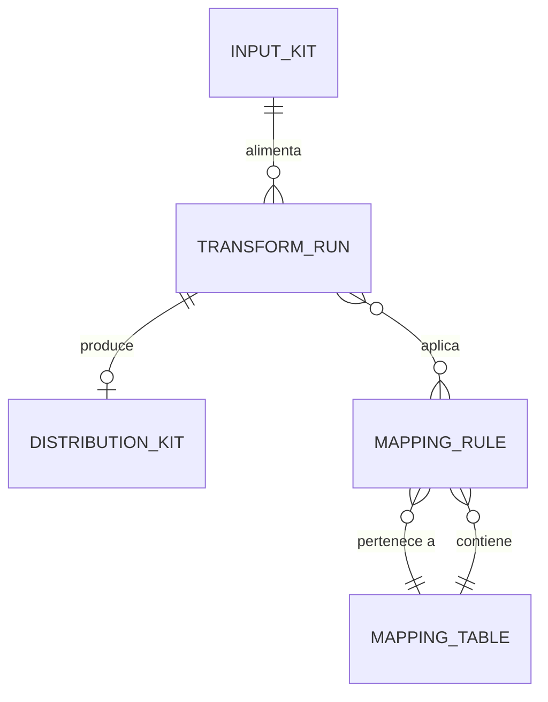

# Relaciones — metaflow-transform

## 1. Diagrama ER

## 2. Catálogo de relaciones

| Fuente | Objetivo | Cardinalidad (fuente — objetivo) | Descripción | Regla de negocio |
|--------|----------|----------------------------------|-------------|------------------|
| `InputKit` | `TransformRun` | 1 — 0..N | Un kit de entrada puede transformarse varias veces (re-runs) | Cada versión produce su run; RULE-02 de InputKit |
| `TransformRun` | `DistributionKit` | 1 — 0..1 | Un run produce como máximo un kit de salida | Si falla la verificación, no hay salida publicable (RULE-01 de TransformRun) |
| `TransformRun` | `MappingRule` | 0..N — N | Un run aplica muchas reglas | Reglas aplicadas se registran en `rules_applied` |
| `MappingTable` | `MappingRule` | 1 — 0..N | La tabla (`mapping.json`) agrupa las reglas | Agregar reglas no toca el engine (RULE-04 de MappingRule) |

> `MappingTable` es el concepto que materializa `mapping.json` — la colección
> ordenada de `MappingRule`. No tiene archivo propio de entidad: se modela
> como contenedor (ver `MappingRule` §3).

## 3. Notas

- El flujo completo entre estas entidades está documentado en
  `PROC-001-transformacion-kit.md` (proceso de transformación).
- La correspondencia 1:1 entrada→salida (O2 de la visión) se garantiza por la
  cardinalidad `InputKit` → `DistributionKit` 1:1 vía `TransformRun`. La
  numeración del kit de salida es la del kit de entrada **− 4** (mayor − 4,
  menor igual: 5.1 → 1.1; decisión 2026-08-27).

## 4. Historia

| Fecha | Cambio | Autor |
|-------|--------|-------|
| 2026-08-27 | Creado | @eugenioserrano |
