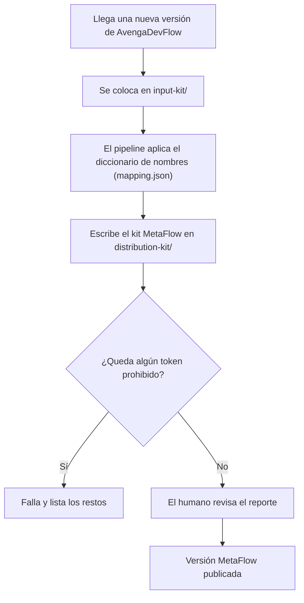

# MetaFlow — Qué es y cómo se construye

## 1. Para quién es esto

> Dos o tres líneas: quién debería leerlo, cuánto toma, qué NO requiere saber.
> Luego el banner, tal cual, en el idioma de contenido del proyecto.

> ⚠️ **Este documento no es una fuente de verdad.** Es un resumen narrativo
> derivado de los artefactos de `analysis/` y `discovery/`. Si algo aquí
> discrepa con esos documentos, **ellos ganan**.

---

## 2. El mundo antes del sistema

Eugenio Serrano usa (y en parte desarrolla) una metodología de desarrollo de
software asistida por IA llamada AvengaDevFlow. Es una metodología completa:
define cómo se crean los artefactos (User Stories, planes, memorias), cómo se
aprueban los cambios (checkpoints), qué reglas bloquean o advierten a los
agentes, y cómo se mide el flujo de trabajo. Todo eso funciona, está probado y
tiene años de refinamiento.

Pero hay un problema de identidad: la metodología lleva el nombre y la
atribución de Avenga LATAM. Quien la use ve una marca ajena, y su propietario
no puede presentarla como algo propio.

## 3. El problema

MetaFlow necesita ser **la misma metodología, con identidad propia**: misma
funcionalidad, mismos conceptos, mismo flujo — pero con nombres nuevos
(`Avenga DevFlow` → `MetaFlow`, checkpoints `AITL-*` → `CP-*`, `Bolt` →
`TASK`, `V-Bounce` → `Delivery Loop`, atribución a Eugenio Serrano) y sin
rastros de la marca previa.

Hacerlo a mano es inviable: el kit tiene ~150 archivos y más de 150 menciones
de la marca. Y hacerlo con reemplazos a ciegas es peligroso: un replace mal
ordenado rompe el texto (por ejemplo, tocar `§4.1` de las secciones al
buscar números de versión). Hace falta un pipeline que transforme con reglas
ordenadas y verificables.

## 4. La historia, de punta a punta

### Paso 1 — Ingresa el kit fuente

Cada nueva versión de AvengaDevFlow se coloca entera en `input-kit/`. El
kit nunca se modifica: es solo lectura.

### Paso 2 — Se aplica el diccionario

El pipeline lee `mapping.json`, la tabla de reglas derivada del diccionario
de nombres. Las reglas se aplican en orden (las cadenas más largas primero),
renombran contenido y rutas (`avenga-devflow/` → `ai-sdlc/`,
`AvengaDevFlow.agent.md` → `MetaFlow.agent.md`), convierten los checkpoints
con regex (`AITL-SPEC-Approval` → `CP-SPEC-Approval`) y eliminan lo que se
decidió remover (citas a Raja SP / DORA, referencias históricas) — siempre
registrando cada remoción en el reporte.

### Paso 3 — Se escribe el kit de salida

El resultado es `distribution-kit/`: el mismo árbol y la misma funcionalidad
— solo nombres nuevos. Antes de escribir, el pipeline **borra el contenido
previo** de `distribution-kit/` (cero residuos de corridas anteriores). La
numeración de la versión es la del kit de entrada
− 4 (mayor − 4, menor igual: 5.1 → 1.1).

### Paso 4 — Se verifica

El verificador barre todo el kit de salida buscando tokens prohibidos
(`Avenga`, `AITL`, `HITL`, `Bolt`, `V-Bounce`, `v_bounces`, `Raja`, `DORA`).
Si encuentra uno, el pipeline falla. Si no, queda el reporte para que el
humano revise el diff antes de publicar. Además, cada corrida deja su
evidencia guardada en `transform-reports/` (reporte, diffs por archivo y
log), disponible para revisión posterior — humana o con IA.

## 5. Qué estamos construyendo

Un toolkit en Python en `src/` (decisión: cero build, stdlib completa) con
cuatro piezas: el engine de transformación, la tabla de reglas como datos
(`mapping.json`), el verificador y el reporte. El proyecto completo se
desarrolla gobernado por la propia metodología: análisis (esta carpeta),
luego User Story → TASK → SPEC → Delivery Loop → MEM.

Lo incómodo, con honestidad: el kit de salida **no es open source** (licencia
propietaria a nombre de Eugenio Serrano, decidida), el idioma del contenido
del kit se hereda del input (inglés, decidido) mientras el proyecto habla
castellano, y el schema de los manifests de MetaFlow ya no es compatible con
el de AvengaDevFlow (era la consecuencia buscada del renombrado total).

## 6. Lo esencial

1. **MetaFlow es AvengaDevFlow renombrado** — misma funcionalidad, nombres propios (Eugenio Serrano), cero menciones de la marca previa.
2. **El diccionario es el corazón** — las reglas viven en `mapping.json` como datos; agregar una regla no toca código.
3. **El orden de los reemplazos importa** — las cadenas más largas primero, los checkpoints con regex; un orden mal hecho rompe el texto.
4. **Nada es silencioso** — cada remoción y cada regla aplicada aparecen en el reporte para revisión humana.
5. **El verificador es la garantía** — si queda un token prohibido, el pipeline falla y no hay versión publicable.

## 7. Dónde leer más

| Para entender… | Ir a |
|----------------|------|
| Por qué hacemos esto y qué queremos lograr | [vision/vision.md](../vision/vision.md) |
| Qué entra y qué no en el MVP | [scope/mvp-scope.md](../scope/mvp-scope.md) |
| El flujo, paso a paso, en detalle | [process/PROC-001-transformacion-kit.md](../process/PROC-001-transformacion-kit.md) |
| El diccionario completo de nombres | [glossary/metaflow.md](../glossary/metaflow.md) |
| Las "cosas" del dominio | [domain-model/INDEX.md](../domain-model/INDEX.md) |
| Quién usa esto y qué necesita | [personas/MetaFlowMaintainer.md](../personas/MetaFlowMaintainer.md) |
| Qué puede salir mal y cuánto importa | [business-risks/INDEX.md](../business-risks/INDEX.md) |
| Lo que todavía no sabemos | [open-questions/INDEX.md](../open-questions/INDEX.md) |

## 8. Historia

| Fecha | Cambio | Autor |
|-------|--------|-------|
| 2026-08-27 | Versión inicial (derivada de los artefactos de análisis) | @eugenioserrano |
| 2026-08-27 | Validado por el propietario — status `stable` | @eugenioserrano |
