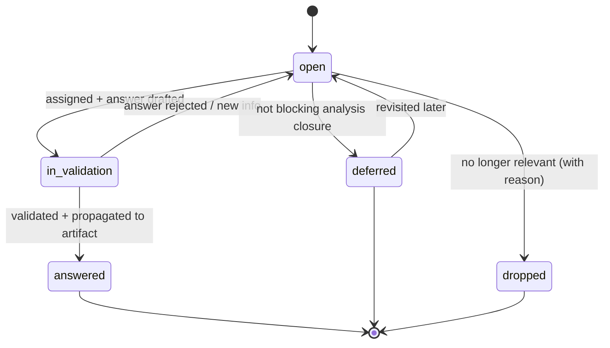

# Open Questions (analysis-phase question tracker)

**Methodology version:** 5.0

## Purpose

This folder is the **single, centralized backlog of unresolved questions and
assumptions** generated during the analysis phase. While analysis is in
progress (`vision/`, `business-context/`, `scope/`, `personas/`,
`user-journeys/`, `glossary/`, `domain-model/`, `ui/`, `process/`), gaps
appear constantly: a missing business rule, an ambiguous term, a stakeholder
we still need to interview, a property whose data type is not yet decided.

Instead of scattering those gaps across the *Open questions* sections of the
four templates that have one (`vision/`, `business-context/`, `scope/`,
`ui/`),
**during analysis we centralize them here** so the team only has to look in
one place to know:

> *"What do we still need to clarify before we can call the analysis stable
> and start writing User Stories?"*

> This folder is **scoped to the analysis phase**. Bugs, technical risks,
> ADR-class decisions and project risks have their own homes — see
> ["What does NOT belong here"](#what-does-not-belong-here).

---

## Why a dedicated folder

- **Single pane of glass.** The PO, analyst, agent and stakeholders all read
  one INDEX instead of scanning seven subfolders.
- **AI-friendly.** The agent can be pointed at `open-questions/` to: (a)
  detect duplicates before opening a new one, (b) re-ask in the next
  interview, (c) refuse to mark an artifact as `stable` while it still has
  blocking OQs.
- **Closure discipline.** Each OQ has a clear lifecycle (`open → in-validation
  → answered | deferred | dropped`) and a rule: an answer is not "done" until
  it has been **propagated to the canonical artifact** (the entity, the
  process, the persona…). The OQ file is the *tracker*, not the *home* of the
  answer.
- **Sunset on purpose.** Once analysis closes for a Bolt's parent (readiness
  for `AITL-BOLT-READY-Approval`, G35), the OQs targeting that parent and its
  governing artifacts must be `answered`, `deferred` or `dropped`. No `open`
  OQs survive into delivery as analysis questions — they get converted into
  project risks, ADRs or product backlog.

---

## What belongs here

Anything that, **if left unanswered, would make a downstream artifact wrong,
incomplete or risky**. Concretely:

| Kind of question                                                  | Example |
|-------------------------------------------------------------------|---------|
| Missing business rule                                             | *"Can a customer have more than one active subscription?"* |
| Ambiguous / conflicting term                                      | *"Stakeholders use 'Order' and 'Request' interchangeably — same thing?"* |
| Undecided enumeration / data type                                 | *"Statuses for `Invoice`: 4 or 6 values?"* |
| Unknown actor / persona                                           | *"Who approves a refund above 5k — supervisor or finance?"* |
| Unverified assumption flagged during AI ingestion                 | *"Assumed 24/7 service window — confirm with ops."* |
| Pending stakeholder access / interview                            | *"Need 30 min with the compliance officer."* |
| Source-of-truth conflict between input documents                  | *"PDF says X, interview says Y — which wins?"* |

## What does NOT belong here

| It's actually a…              | Goes to                                              |
|-------------------------------|------------------------------------------------------|
| Project / technical / team risk | [`../../risks/`](../../risks/)                     |
| Business risk                  | [`../business-risks/`](../business-risks/) |
| Architectural decision         | [`../../adrs/`](../../adrs/)                         |
| Legacy-system / DB / API gap   | [`../../discovery/`](../../discovery/)               |
| Bug in delivered code          | [`../../bugs/`](../../bugs/)                         |
| Feature request / scope item   | [`../../functional/`](../../functional/)             |

Rule of thumb: if it's a **question about what we are building** during
analysis → here. If it's a **decision, risk, bug or scope item** → its own
folder.

---

## Lifecycle (`open → in-validation → answered | deferred | dropped`)



### States

| Status          | Meaning |
|-----------------|---------|
| `open`          | Identified, not yet investigated. **Default state for any new OQ.** |
| `in-validation` | Owner has drafted an answer; awaiting stakeholder confirmation. |
| `answered`      | Stakeholder confirmed **and** the answer has been propagated to the canonical artifact (link recorded in the OQ). |
| `deferred`      | Real question, but not blocking analysis closure — re-evaluated at the next milestone. Must have a `revisit_on` date or trigger. |
| `dropped`       | No longer relevant (scope cut, duplicate, invalidated by another decision). Must include a reason. |

> **Hard rule:** Analysis cannot be marked **stable** for a scope milestone
> while any OQ tied to that milestone's artifacts is still `open` or
> `in-validation`. All related OQs must be `answered`, `deferred` (with
> revisit trigger) or `dropped` (with reason). Per Bolt, the same rule is
> enforced at readiness by G35 (§2.9, §3.2) — the practical effect at the
> first Bolt of a milestone is the same.

---

## How to create an OQ

1. **Check for duplicates** in [`INDEX.md`](INDEX.md) and via grep on the
   `question` field.
2. **Pick the next ID** — `OQ-NNN` (zero-padded, monotonic, never reused).
3. **Create the file** `OQ-NNN-<short-kebab-slug>.md` from
   [`TEMPLATE-OQ.md`](TEMPLATE-OQ.md).
4. **Fill the frontmatter**: `status: open`, `owner` (who will chase the
   answer), `priority` (`P0` blocks analysis closure / `P1` blocks a specific
   artifact / `P2` nice-to-have), `targets` (the canonical artifacts that
   will absorb the answer), `sources` (input/interview/document where the
   gap surfaced).
5. **Write the question once, sharp and atomic.** One OQ = one question.
   Compound questions get split.
6. **In the source artifact, leave a pointer**, e.g.:
   ```
   ## Open questions
   - See `../open-questions/OQ-014-customer-multi-subscription.md`
   ```
   Do **not** copy the question text into the artifact — link only. This is
   what makes this folder the single source of truth.
7. **Update [`INDEX.md`](INDEX.md)** (one row per OQ).

## How to maintain an OQ

- The `owner` is responsible for moving the OQ forward (scheduling the
  interview, drafting the answer, requesting validation).
- When a partial answer arrives, append to the *Investigation log* — never
  overwrite. We want the trail.
- If the question is rephrased after new information, keep the original in
  *History* and update the `question` field with a `(rev N)` marker.
- When an answer is drafted: status → `in-validation`, name the validator,
  set a target date.
- **Review cadence:** the analyst sweeps the INDEX **at least weekly** (or
  before every stakeholder interview) and re-prioritizes.

## How to finalize an OQ

Closing an OQ requires **all four** of:

1. **Validated answer** from the named stakeholder (interview link, email,
   meeting note — recorded in `sources`).
2. **Propagation**: the canonical artifact(s) in `targets` have been updated
   with the resolution, and the OQ file links to the exact section / commit.
3. **Status set** to `answered` (or `deferred` / `dropped` with reason).
4. **`closed_on` date + `closed_by`** filled in the frontmatter, and the
   *History* table updated. INDEX row moved to the matching closed section —
   "Answered" or "Dropped" (still visible — we never delete).

**Sunset rule for the folder (normative — part of the Bolt DoR):** before
recording `AITL-BOLT-READY-Approval`, the approver confirms that no OQ whose
`targets` include that Bolt's parent US or one of its governing artifacts is
still `open` or `in-validation`. If any is, `AITL-BOLT-READY-Approval`
**cannot be recorded** — the Bolt is not ready. Each blocking OQ must first be
`answered` and propagated to its target, `deferred` with a revisit trigger, or
`dropped` with a reason.

This is a DoR criterion, not a separate checkpoint: an unanswered question
about the Bolt's parent is missing context by definition. See Avenga DevFlow
**§2.9** and **§3.2** (DoR) and **G35** in `GUARDRAILS.md`. The scope is the
Bolt's own governing artifacts rather than a Unit, because `units/` governance
remains reserved (§3.11); the practical effect at the first Bolt of a Unit is
the same.

---

## File naming and structure

- `OQ-NNN-<short-kebab-slug>.md` — one file per question.
- IDs are **monotonic and never reused**, even if dropped.
- Slug is short, lowercase, kebab-case, ≤ 6 words.

Examples:
- `OQ-001-customer-multi-subscription.md`
- `OQ-014-invoice-status-enum.md`
- `OQ-027-refund-approval-threshold.md`

---

## Relation to other folders

| Folder                                      | Relation |
|---------------------------------------------|----------|
| `../vision/`, `../business-context/`, `../scope/`, `../ui/` | The four templates with their own *Open questions* section; it just links back here, never duplicating the text. Every other `analysis/` artifact has no such section — its gaps live here from the start, referenced through `targets`. |
| [`../../input/interviews/`](../../input/interviews/) | OQs are **fed from** these and **resolved through** new interviews recorded here. |
| [`../../risks/`](../../risks/)              | If an OQ turns out to be a real project risk, it is **converted** (new RISK created, OQ dropped with reason = "promoted to RISK-NNN"). |
| [`../../adrs/`](../../adrs/)                | If answering an OQ requires an architectural decision, an ADR is opened and the OQ closes by linking to it. |
| [`../../discovery/`](../../discovery/)      | If an OQ is actually a tech / legacy gap, it is **moved** to a DISC and the OQ is dropped. |
| [`../../functional/`](../../functional/)    | Once analysis closes, US/Bolts assume all OQs are resolved. An OQ should never block a Bolt in flight — that becomes a risk or a Spec defect. |

---

## Operating notes for the AI agent

- When ingesting an interview/document (see `../README.md` routing table),
  every finding that reads as *"we don't know yet"*, *"we'll need to confirm
  with X"*, *"assumption: …"* must produce an OQ here — not just a TODO
  inside the artifact.
- Before opening a new OQ, **search the INDEX for duplicates** (semantic
  match, not just keyword).
- When updating an artifact to absorb an answer, **also** update the matching
  OQ (status, closed_on, closed_by, link to the change). Half-closed OQs
  rot the folder.
- Never silently delete an OQ. Use `dropped` with a reason.
- **Language:** this folder follows the **methodology-wide language policy**
  — schema (frontmatter keys, `status` / `priority` enums, IDs `OQ-NNN`)
  in English; section headings (anchors are matched semantically, e.g.
  `## Resolución` instead of `## Resolution`) and prose (question,
  context, hypothesis, options, resolution) in the project's
  `content_language`. See
  [`../../LANGUAGE` → *Language declaration*](../../LANGUAGE) and Avenga DevFlow
  **§3.15**.

---

## Index

See **[INDEX.md](INDEX.md)** for the active and closed OQ listing.

---

## Language

YAML keys, status enums, and IDs stay in **English**
(the schema). Section headings and all prose — descriptions, context,
rationale, findings — go in the project's content_language (see
[devflow/README.md](../../README.md) -> Language policy, §3.15).

---

## Feeds the introduction narrative

Once this artifact exists — draft is enough — it feeds
[`../introduction/`](../introduction/), the plain-language entry point written
**last** in the analysis phase. It supplies "what we still do not know", which is part of the story.

That narrative is **derivative** (§5.5): it never introduces a rule of its own
and is never governed input (G28). When a change here alters something the
narrative states, update the narrative in the same pass — or mark it
`deprecated` rather than let it keep circulating.
