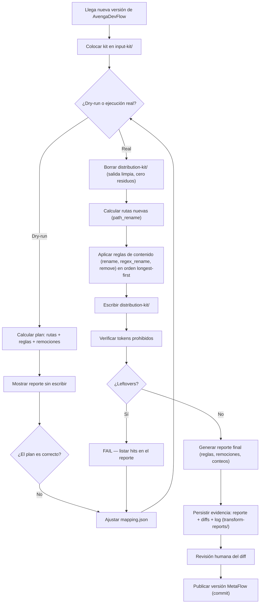

# PROC-001 — Transformación del kit (AvengaDevFlow → MetaFlow)

## 1. Descripción

Proceso que convierte una versión de AvengaDevFlow (`input-kit/`) en la
versión equivalente de MetaFlow (`distribution-kit/`) aplicando el diccionario
de nombres (`glossary/metaflow.md` → `mapping.json`), con verificación
automática de tokens prohibidos y reporte revisable por el humano.

## 2. Disparador

Llega una nueva versión del kit de AvengaDevFlow y se coloca en `input-kit/`
(raíz del repositorio).

## 3. Participantes

- **MetaFlowMaintainer** — opera el pipeline, revisa el reporte, decide publicar.
- **Pipeline (script Python en `src/`)** — ejecuta el transform, el verificador y el reporte.

## 4. Entidades de dominio involucradas

| Entidad | Operación (CRUD) | Notas |
|---------|:----------------:|-------|
| `InputKit` | R | Solo lectura — nunca se modifica |
| `MappingRule` | R | Las reglas viven en `mapping.json` |
| `TransformRun` | C | Se crea en cada ejecución |
| `DistributionKit` | C | Se escribe en cada ejecución (recreado desde cero: borrado previo del contenido) |

## 5. Diagrama BPMN (Mermaid)

## 6. Reglas de negocio

- **Regla 1** — Las cadenas más largas se reemplazan primero (`AvengaDevFlow` antes que `Avenga Dev Flow`/`Avenga`); los códigos de checkpoint usan regex con captura (`AITL-<CODE>-Approval` → `CP-<CODE>-Approval`) — ver `../glossary/metaflow.md`.
- **Regla 2** — Toda remoción se lista en el reporte; nunca es silenciosa.
- **Regla 3** — Si el verificador encuentra un token prohibido, el run es `failed` y no hay versión publicable.
- **Regla 4** — La versión del kit de salida = versión del kit de entrada **− 4** (mayor − 4, menor igual): 5.1 → 1.1 (decisión 2026-08-27).
- **Regla 5** — Antes de la ejecución real, el contenido completo de `distribution-kit/` se borra (cero residuos de corridas anteriores, re-transformación completa); el dry-run nunca borra.
- **Regla 6** — Cada ejecución real deja su evidencia persistida en `transform-reports/<versión>/<run>/` (reporte, diffs por archivo, lista de archivos sin cambios, log); se conservan las **2 corridas más recientes por versión** y las anteriores se purgan automáticamente al final de cada corrida real, listadas en el log (nada silencioso).
- **Regla 7** — `devflow/reports/TEMPLATE-REPORT.html` no se migra: el pipeline lo excluye (lista `exclude` del mapping), no lo copia al output y la exclusión se registra en el reporte del run; el template nuevo de MetaFlow es un entregable aparte.

## 7. Excepciones y caminos alternativos

- **Excepción 1 — Regla nueva no contemplada:** se agrega la entrada al `mapping.json` (o al diccionario primero) y se re-ejecuta. Quien interviene: MetaFlowMaintainer.
- **Excepción 2 — Contenido nuevo que el diccionario no cubre (versión futura con features nuevas):** el verificador lo detecta como leftover o el diff lo muestra; se decide manualmente cómo transformarlo (ver OQ-004).
- **Excepción 3 — Remoción ambigua (frase que mezcla marca y contenido útil):** se revisa en el reporte y se decide manualmente antes de publicar.

## 8. Métricas del proceso

| Métrica | Objetivo | Frecuencia de medición |
|---------|----------|------------------------|
| Tiempo de ejecución (dry-run y real) | < 1 min | por ejecución |
| Tokens prohibidos residuales | 0 | por ejecución |
| Cambios fuera del diccionario | 0 | por ejecución |
| Intervenciones manuales por versión | → 0 | por versión |

## 9. Trazabilidad

- **User Stories derivadas:** US-001 (a crear — toolkit de transformación)
- **ADRs relacionados:** (ninguno aún; si el diseño del engine requiere una decisión de arquitectura, se crea)
- **Entrevistas fuente:** conversación de diseño 2026-08-27 (no hay `input/interviews`)

## 10. Historia

| Fecha | Cambio | Autor |
|-------|--------|-------|
| 2026-08-27 | Borrador inicial | @eugenioserrano |
| 2026-08-27 | Validado por el propietario — status `active` | @eugenioserrano |
| 2026-08-27 | Revisión — Regla 5 y paso de borrado de `distribution-kit/` antes de la ejecución real (cero residuos; dry-run no borra) | @eugenioserrano |
| 2026-08-27 | Revisión — Regla 6 y paso de persistencia de evidencia (`transform-reports/`: reporte, diffs, log) | @eugenioserrano |
