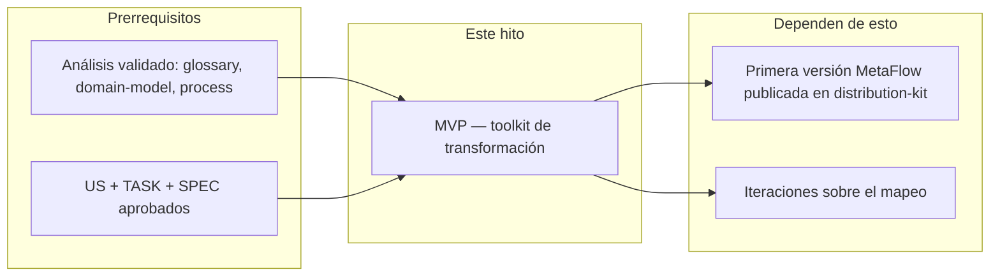

# Alcance — MVP (Toolkit de transformación MetaFlow)

## 1. Resumen

El MVP entrega el toolkit de transformación que convierte el kit de
AvengaDevFlow (`input-kit/`) en el kit de MetaFlow (`distribution-kit/`)
aplicando el diccionario de nombres completo (marca, checkpoints
CP/CITL, TASK, Delivery Loop, remociones) con verificación automática y
reporte. Es el resultado que permite cumplir los resultados de visión O1
(cero contaminación de marca) y O2 (correspondencia de versiones 1:1, con
numeración de salida = entrada − 4: 5.1 → 1.1).

**Resultados de visión vinculados:** O1, O2, O3.

## 2. En alcance (este hito)

| # | Ítem | Descripción | Razón | Artefacto vinculado |
|---|------|-------------|-------|---------------------|
| S1 | Toolkit en `src/` (Python) | Scripts: CLI de transformación, engine de renames, verificador, reporte | La decisión de lenguaje fue Python (cero build, stdlib completa) | `../glossary/metaflow.md`, PROC-001 |
| S2 | Mapeo de nombres como datos | `mapping.json` con todas las reglas de rename/remoción ordenadas (más largas primero, regex para códigos CP) | Las reglas son datos, no código: cada nueva regla se agrega sin tocar el engine | `../glossary/metaflow.md` |
| S3 | Renombrado de archivos y carpetas | Rutas nuevas para `avenga-devflow/`→`metaflow/`, wrappers, templates, schemas, `metrics/` | El rebrand incluye nombres de archivos y carpetas, no solo contenido | `../glossary/metaflow.md` |
| S4 | Verificador de tokens prohibidos | Barrido final del output: falla si queda `Avenga`, `AITL`, `HITL`, `Bolt`, `V-Bounce`, `v_bounces`, `Raja`, `DORA` | Es la garantía de O1 — nada de contaminación de marca | `../glossary/metaflow.md` (sección banned) |
| S5 | Reporte de transformación | Por archivo: reglas aplicadas, conteos, remociones listadas para revisión humana | Nada se borra o cambia silenciosamente | PROC-001 |
| S6 | Tests | Unitarios (orden de reglas, variantes de caso, regex) + E2E con fixtures + aceptación contra el kit real | La transformación debe ser verificable y repetible | PROC-001 |
| S7 | `distribution-kit/` como salida | El pipeline escribe el kit MetaFlow transformado | Es el producto del repositorio | `../domain-model/entities/DistributionKit.md` |
| S8 | Idioma del proyecto en castellano | `devflow/LANGUAGE` = `es`; artefactos del proyecto en castellano | Decisión del propietario (2026-08-27) | — |

## 3. Fuera de alcance (este hito)

| # | Ítem | Razón de exclusión | Revisitar en | Artefacto vinculado |
|---|------|--------------------|--------------|---------------------|
| X1 | Archivo de licencia en el kit | Decidido: licencia propietaria a nombre de Eugenio Serrano (OQ-002); falta definir cómo se materializa en el kit (regla de transformación o archivo del proyecto) | v1 | OQ-002 (respondida) |
| X2 | Traducción del contenido de la metodología | Decidido: el kit queda en inglés (hereda `en` — OQ-001); traducir es otro proyecto | — | OQ-001 (respondida) |
| X3 | Migración del `devflow/` raíz de este repositorio | Decidido: migrar cuando el kit esté estable (§5.16 — OQ-003); mientras tanto el árbol de gobernanza sigue operando bajo AvengaDevFlow instalado (v5.0) | Cuando el kit esté estable | OQ-003 (respondida) |
| X4 | Pista de herramientas `tools/` (binario Go, validator, etc.) | No es parte del kit de entrada; es del repo original | Cuando se decida el futuro de la pista | OQ-004 |
| X5 | Merge inteligente de contenido nuevo de futuras versiones | Decidido: re-transformación completa por versión (OQ-004); diff/merge queda como futuro | Futuro | OQ-004 (respondida) |
| X6 | Template HTML de reportes de MetaFlow | El template de Avenga (`devflow/reports/TEMPLATE-REPORT.html`) tiene branding embebido (CSS/logo); no se migra — el pipeline lo excluye (lista `exclude` de `mapping.json`, glossary §7) | v1 (entregable nuevo con branding propio) | glossary §7 |

## 4. Diferido (planeado para después)

| # | Ítem | Hito objetivo | Razón del diferimiento |
|---|------|---------------|------------------------|
| D1 | Integración CI del verificador | v1 | El MVP lo ejecuta local; CI agrega valor cuando haya releases |
| D2 | Wrapper MCP / integración con agentes | v1 | No es necesario para la primera transformación |

## 5. Dependencias de fase

| Dependencia | Tipo | Detalle |
|-------------|------|---------|
| Análisis validado | **Bloquea este** | Glossary con el diccionario completo, domain-model, PROC-001 |
| US + TASK + SPEC aprobados | **Bloquea este** | El MVP se ejecuta bajo la metodología (G07) |
| Primera versión MetaFlow | **Bloqueado por este** | El output del pipeline |

## 6. Registro de decisiones de alcance

| # | Decisión | Alternativas consideradas | Razón | Decidido por | Fecha |
|---|----------|---------------------------|-------|--------------|-------|
| D1 | Python para el toolkit | TypeScript, Go | Sin build, stdlib completa para texto, diffs/reportes triviales | Eugenio Serrano | 2026-08-27 |
| D2 | Renombrado total (todo ocurrencia) | Renombrado parcial | El propietario eligió "renombrar todo todo todo" | Eugenio Serrano | 2026-08-27 |
| D3 | Idioma del proyecto en castellano | Inglés | El propietario lo pidió (proyecto de transformación) | Eugenio Serrano | 2026-08-27 |
| D4 | `src/` como ubicación de los scripts | `tools/` | `tools/` es la pista del repo original; `src/` está vacía y disponible | Eugenio Serrano | 2026-08-27 |

## 7. Evaluación de impacto

| Área | Impacto |
|------|---------|
| **Personas** | MetaFlowMaintainer es el usuario principal del toolkit |
| **Journeys** | El journey "publicar nueva versión" depende del pipeline |
| **Modelo de dominio** | Entidades InputKit, DistributionKit, MappingRule, TransformRun |
| **Procesos** | PROC-001 describe el pipeline completo |
| **Riesgos** | BR-001 (contaminación) mitigado por S4; BR-002/BR-003 asumidos y monitoreados |

## 8. Preguntas abiertas

Cerradas el 2026-08-27 (propietario):

- [x] OQ-001 — el kit de salida queda en inglés (hereda `en`; sin traducción).
- [x] OQ-002 — licencia propietaria a nombre de Eugenio Serrano.
- [x] OQ-003 — la raíz migra a MetaFlow cuando el kit esté estable (§5.16); no bloquea el MVP. Además: numeración de salida = entrada − 4 (5.1 → 1.1).
- [x] OQ-004 — re-transformación completa por versión; diff/merge como futuro.

## 9. Fuentes

| Fuente | Dónde |
|--------|-------|
| Visión | `../vision/vision.md` §5 |
| Diccionario de rename | `../glossary/metaflow.md` |
| Conversación de diseño | 2026-08-27 |

## 10. Historia

| Fecha | Cambio | Autor |
|-------|--------|-------|
| 2026-08-27 | Versión inicial | @eugenioserrano |
| 2026-08-27 | Validado por el propietario — status `stable` | @eugenioserrano |
