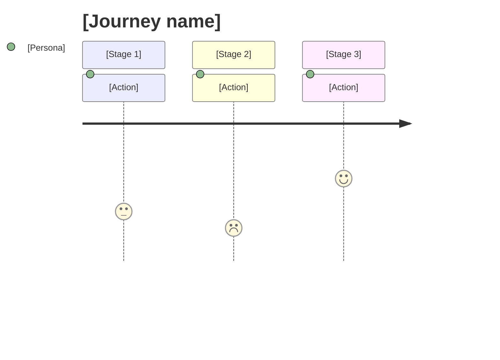

<!--
  LANGUAGE POLICY (§3.15): YAML keys, status enums, IDs stay in English
  (the schema). Section
  headings (##) follow the project's content_language. All prose — journey
  descriptions, stages, touchpoints, pain points — goes in the
  project's content_language. See devflow/README.md -> Language policy.
  `AITL-*-Approval` codes are never translated.
-->

# [Journey name]

## 1. Context

- **Persona:** [PersonaName](../personas/PersonaName.md)
- **Goal:** [what they want to accomplish]
- **Trigger:** [what makes them start]
- **Success:** [what "done" looks like for them]

## 2. Stages

| # | Stage | Touchpoint / channel | Action | Thought | Emotion (1-5) | Pain points | Opportunity |
|:-:|-------|----------------------|--------|---------|:-------------:|-------------|-------------|
| 1 |       |                      |        |         |               |             |             |
| 2 |       |                      |        |         |               |             |             |
| 3 |       |                      |        |         |               |             |             |

## 3. Emotional curve

## 4. Moments of truth

The interactions where the journey is won or lost.

- **MOT-1:** [Stage X] - [why it is critical]
- **MOT-2:** [Stage Y] - [why it is critical]

## 5. Metrics

| Stage | Metric | Target |
|-------|--------|--------|
|       | Time to complete |        |
|       | Drop-off rate    |        |
|       | NPS / CSAT       |        |

## 6. Cross-references

- **Processes touched:** PROC-NNN, PROC-NNN
- **Related User Stories:** US-NNN
- **Related personas:** [Other persona that lives a variant of this journey]

## 7. Sources

| Source  | Where |
|---------|-------|
| INT-NNN | `../../input/interviews/INT-NNN.md` |
| Notes   | [observation / analytics reference]   |

## 8. History

| Date | Change | Author |
|------|--------|--------|
| YYYY-MM-DD | Initial draft | @user |
