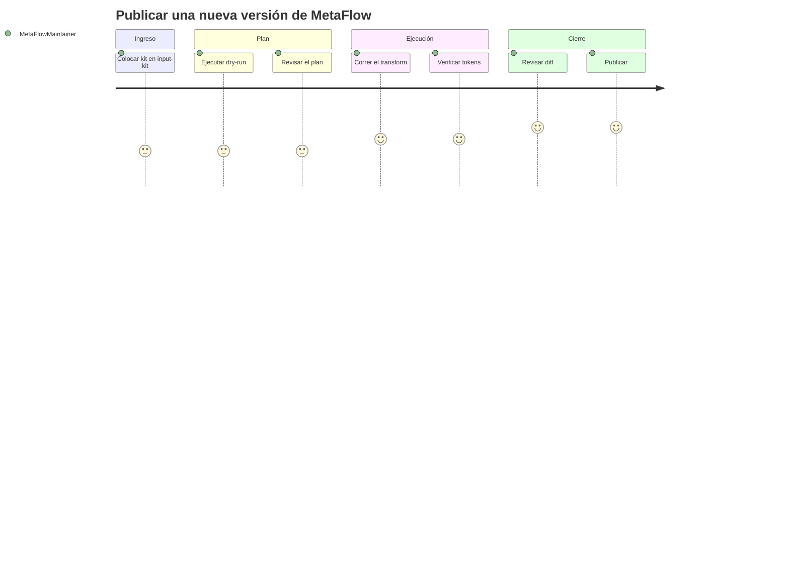

# Publicar una nueva versión de MetaFlow

## 1. Contexto

- **Persona:** [MetaFlowMaintainer](../personas/MetaFlowMaintainer.md)
- **Objetivo:** convertir una nueva versión de AvengaDevFlow en la versión equivalente de MetaFlow
- **Disparador:** llega una nueva versión del kit de AvengaDevFlow (se coloca en `input-kit/`)
- **Éxito:** `distribution-kit/` contiene el kit MetaFlow de la versión correspondiente (entrada − 4: 5.1 → 1.1), verificado en cero tokens prohibidos, y el reporte fue revisado por el humano

## 2. Etapas

| # | Etapa | Touchpoint / canal | Acción | Pensamiento | Emoción (1-5) | Puntos de dolor | Oportunidad |
|:-:|-------|--------------------|--------|-------------|:-------------:|-----------------|-------------|
| 1 | Ingresar el kit | Filesystem / git | Colocar la nueva versión de AvengaDevFlow en `input-kit/` | "Otra versión que heredar" | 3 | Asegurarse de que sea el kit completo | Verificar que `input-kit/` tenga los ~150 archivos |
| 2 | Ejecutar dry-run | CLI | `python src/transform.py --dry-run` | "Veamos el plan antes de escribir" | 3 | — | Revisar el plan sin tocar nada |
| 3 | Revisar el plan | Reporte | Leer reglas aplicadas y remociones propuestas | "¿Nada raro?" | 3 | Remociones ambiguas | El reporte lista cada remoción |
| 4 | Ejecutar el transform | CLI | `python src/transform.py` | "A generar el kit" | 4 | — | — |
| 5 | Verificar | CLI (verificador) | Correr el barrido de tokens prohibidos | "Cero Avenga, cero Bolt…" | 4 | Un leftover rompe la publicación | El pipeline falla si hay leftovers |
| 6 | Revisar diff final | Reporte + git diff | Comparar input vs output | "Solo nombres cambiaron" | 5 | Diffs ruidosos | Equivalencia funcional verificable |
| 7 | Publicar | git | Commitear la versión MetaFlow | "Listo, versión X.Y publicada" | 5 | — | — |

## 3. Curva emocional

## 4. Momentos de verdad

- **MOT-1:** [Etapa 3] — La revisión del plan: si el reporte no deja ver las remociones, el humano no puede confiar en el pipeline.
- **MOT-2:** [Etapa 5] — El verificador: si pasan leftovers, la identidad de MetaFlow queda contaminada silenciosamente.

## 5. Métricas

| Etapa | Métrica | Objetivo |
|-------|---------|----------|
| 2–4 | Tiempo de ejecución del pipeline | < 1 min |
| 5 | Tokens prohibidos residuales | 0 |
| 6 | Cambios fuera del diccionario | 0 (solo renames) |
| 7 | Tiempo ingreso → publicación | < 1 jornada |

## 6. Referencias cruzadas

- **Procesos tocados:** PROC-001
- **User Stories relacionadas:** US-001 (a crear — toolkit de transformación)
- **Personas relacionadas:** MetaFlowMaintainer (única)

## 7. Fuentes

| Fuente | Dónde |
|--------|-------|
| Conversación de diseño | `../../glossary/metaflow.md` |

## 8. Historia

| Fecha | Cambio | Autor |
|-------|--------|-------|
| 2026-08-27 | Borrador inicial | @eugenioserrano |
| 2026-08-27 | Validado por el propietario — status `stable` | @eugenioserrano |
