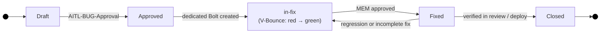
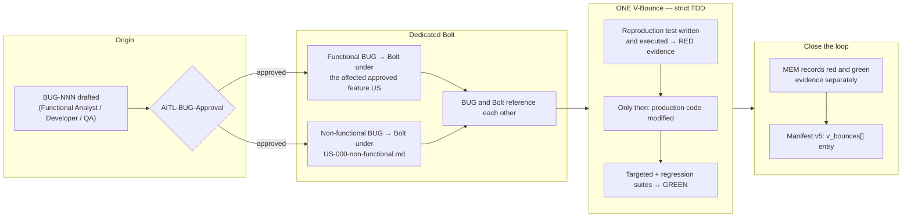

# Bugs (Confirmed Defects)

**Methodology version:** 5.0

## Purpose

This folder contains **confirmed defects** (`BUG-NNN`), documented with
observation, evidence, affected context, reproduction conditions, expected
and actual result, impact, severity, and known links (§2.16).

A BUG is **not a work authorization** — it never authorizes code by itself.
Every approved BUG receives **exactly one dedicated Bolt**, which then goes
through the standard SPEC → V-Bounce → MEM lifecycle.

Bugs feed **Defect escape rate** (§3.7.3) and, when caused by a deployment,
**D4 Change Fail Rate** after causal classification (computed at deployment
level from CI/CD and incidents, not from BUG documents).

---

## What goes here

- Defects confirmed with reproduction evidence and root-cause analysis.
- Bugs extracted from reviews (`REV-NNN`) or approved adversarial verdicts
  (`AREV-NNN`).
- Defects caught by CI gates, QA, UAT or production monitoring.
- Race conditions, logic errors, data inconsistencies.
- Regressions identified by automated test suites.

## What does NOT go here

- **Production incidents** (service disruption) → `incidents/`
  (`INC-NNN`). An incident *may produce* a BUG when the root cause is
  confirmed, but the incident timeline and response live there.
- **Risk of something breaking** → `risks/` (`RISK-NNN`).
- **Architectural decision on how to prevent** → `adrs/`
  (`ADR-NNN`, linked back here).

---

## Naming convention

```
BUG-NNN-short-description-in-kebab-case.md
```

---

## Lifecycle



| Status      | Meaning |
|-------------|---------|
| **draft**   | Defect reported, pending `AITL-BUG-Approval` — no Bolt may be created yet. |
| **approved**| `AITL-BUG-Approval` recorded (recommended: Functional Analyst for functional; Architect/Tech Lead when `severity: critical`, otherwise any team member for non-functional — guidance, never a gate: any qualified team member, the BUG's own author included, may record it at any severity). Its one dedicated Bolt is created. |
| **in-fix**  | Dedicated Bolt in execution: reproduction test → red evidence → fix → green, inside ONE V-Bounce. |
| **fixed**   | Fix V-Bounce approved (`AITL-MEM-Approval`); red→green evidence recorded in the MEM. |
| **closed**  | Fix verified in a subsequent review or deploy cycle. |

> **Reopening has a boundary (§3.11).** `fixed → in-fix` is valid only while
> the Bolt has **not** been accepted: an incomplete fix caught before
> `AITL-BOLT-DONE-Approval` is another V-Bounce on the same Bolt. Once the
> Bolt is accepted, acceptance is **never revoked retroactively** — a defect
> found afterwards, including a regression of this same fix, is a **new
> `BUG-NNN`** with its own approval and its own dedicated Bolt. The closed
> BUG stays closed; the new one links back to it.

`INDEX.md` reflects status: Draft / Approved + In-fix / Fixed + Closed.

---

## Bug-fix policy: strict TDD, one dedicated Bolt

Every bug follows **strict TDD** and, like all work, **must go through its own
dedicated Bolt** (§2.16, §3.3.1). No exceptions, not even under hotfix
pressure (§4.10). **A BUG can never be fixed under an unrelated existing
Bolt** — not directly from a ticket, not as an untracked addition to another
V-Bounce.

```
BUG (draft) → AITL-BUG-Approval → exactly one dedicated Bolt
  → AITL-BOLT-READY-Approval → one SPEC → AITL-SPEC-Approval
  → ONE V-Bounce: reproduction test (RED evidence) → fix → GREEN
  → MEM (red + green evidence) → AITL-MEM-Approval
```

> **Pre-SPEC evidence gate (§3.3.1):** before generating the BUG SPEC, the
> agent verifies `AITL-BUG-Approval`, the dedicated Bolt's
> `AITL-BOLT-READY-Approval`, and the functional parent's `AITL-US-Approval`
> when applicable. No checkpoint is implied by another.



### Rules

1. **BUG first, approval before Bolt.** A BUG remains `draft` until
   `AITL-BUG-Approval` confirms the defect, its evidence, its nature
   (functional / non-functional) and its routing. Only then may its one
   dedicated Bolt be created.
2. **Exactly one dedicated Bolt per approved BUG.** Functional BUG → Bolt
   under the affected approved feature US. Non-functional BUG → Bolt under
   `US-000-non-functional.md`. The BUG and the Bolt reference each other.
   Never reuse an unrelated Bolt, never fix from a ticket.
3. **One SPEC per BUG Bolt, approved before execution.** The canonical SPEC
   explicitly references the approved BUG and prescribes the single-V-Bounce
   TDD order. It is generated only after the pre-SPEC evidence gate
   (`AITL-BUG-Approval` + `AITL-BOLT-READY-Approval` + functional parent's
   `AITL-US-Approval` when applicable, §3.3.1) and executed only after
   `AITL-SPEC-Approval`.
4. **Red before fix.** Production code may not change before objective red
   evidence exists. If the defect cannot be reproduced as an automated test,
   the agent stops, creates the MEM + manifest entry with the blocker, and
   pauses — no fix applied.
5. **Green with regression.** The targeted test and all applicable
   regression suites must pass before the V-Bounce is submitted for review.
6. **MEM records both.** Red command/result and green command/result are
   recorded separately in the V-Bounce's MEM; the manifest records the
   V-Bounce and its MEM reference. A BUG V-Bounce without both pieces of
   evidence cannot receive approved `AITL-MEM-Approval`.
7. **Decomposition.** If the defect contains several independently
   confirmable defects or outcomes, `AITL-BUG-Approval` may request
   decomposition into independently traceable BUGs — each approved
   separately, each with its own dedicated Bolt.
8. **Additional V-Bounces are fine, never a new Bolt.** Continuation on the
   next day or extra V-Bounces (changes requested) keep the same Bolt —
   elapsed time alone never splits the BUG or its Bolt.
9. **Severity-based routing recommendation for non-functional BUGs — guidance,
   never a gate.** A non-functional BUG with `severity: critical` recommends
   `AITL-BUG-Approval` from an Architect or Tech Lead; `severity: high`,
   `medium`, or `low` recommends **any team member**. But the recommendation
   never blocks: any qualified team member, the person who drafted it included,
   may record it at **any severity**. The dedicated
   Bolt's `AITL-BOLT-READY-Approval` follows the same rule (§2.16).
   Functional BUGs recommend the Functional Analyst, regardless of
   severity. (The AI self-approval prohibition, G18/G24, is a separate axis.)

---

## Defect escape and DORA connection

The BUG document captures **where the defect was caught** (`detected_in`),
which feeds **Defect escape rate** (§3.7.3: defects that reached UAT/prod).

Deployment-caused production defects feed **D4 Change Fail Rate** — but DORA
is computed at **deployment level** from CI/CD deployment events joined to
deployment-caused incidents (`incidents/`), never from individual BUG
documents (§3.7.1). The BUG links to the incident (`incident_ref`) when one
exists.

---

## Relations to other folders

| Folder | Relation |
|--------|----------|
| `functional/` | The dedicated Bolt lives under the affected approved feature US (functional) or `US-000-non-functional.md` (non-functional) |
| `spec/` | One canonical SPEC per BUG Bolt, referencing the approved BUG |
| `memory/` | The fix V-Bounce produces a MEM (red + green evidence) and updates the manifest |
| `metrics/bolts/` | Manifest family v5 `v_bounces[]` entry; BUG never authorizes code by itself |
| `incidents/` | Production incident (`INC-NNN`) may produce a BUG when root cause is confirmed |
| `reviews/` | Bugs are often extracted from `REV-NNN` findings |
| `adversarial-reviews/` | An approved Verdict may produce a BUG; AREV is optional and stakeholder-triggered — never automatic |
| `risks/` | A pattern of related bugs may warrant a `RISK-NNN` entry |
| `adrs/` | Structural fixes may require an `ADR-NNN` |

---

## Index

See **[INDEX.md](INDEX.md)** for the full listing.

---

## Language

YAML keys, status enums, IDs, and template section headings stay in **English**
(the schema). All prose — descriptions, context, rationale, findings — goes in
the project's `content_language`, declared in [`../LANGUAGE`](../LANGUAGE)
(see §3.15).
