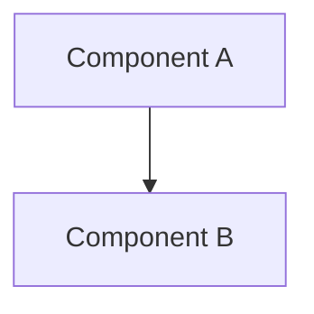

<!--
  LANGUAGE POLICY (§3.15): YAML keys, status enums, IDs, and section
  headings (##) stay in English (the schema). All prose — findings,
  observations, recommendations — goes in the project's content_language
  (declared in devflow/LANGUAGE).

  ⚠️ AITL-DISC-Approval (§2.13): this Discovery remains DRAFT until a
  qualified human records AITL-DISC-Approval. Until then, its conclusions
  cannot be used as governed input. Approval does not approve any
  downstream artifact. Executable spike/prototype code requires an
  approved non-functional Bolt under US-000 first.
-->

# DISC-NNN — [Descriptive title]

| Field               | Value |
|---------------------|-------|
| **Category**        | [api / library / legacy / integration / technology / data / vendor / regulation] |
| **Status**          | [draft / approved / deprecated] |
| **Research question** | [the material unknown being reduced] |
| **Date**            | [YYYY-MM-DD] |
| **Author**          | [name] |
| **Sources**         | [datasheets, docs, URLs] |

---

## 1. Research question

[What material unknown is this Discovery reducing, and why does it block the
definition of a US or Bolt?]

---

## 2. Scope

[What this Discovery covers and what it explicitly does not — the boundary of
the investigation.]

---

## 3. Executive summary

[Main finding or most relevant conclusion in 2-3 sentences.]

---

## 4. Inventory / Mapping

[Detailed listing of what was found: endpoints, tables, signals, pins,
components, configurations, etc.]

| Element | Description | Notes |
|---------|-------------|-------|
|         |             |       |

---

## 5. Detailed findings

[In-depth description. Use code snippets, pseudocode or Mermaid diagrams.]

---

## 6. Experiments performed (if any)

[POCs, probes, calls or simulations executed during the investigation, with
results.]

| Experiment | What was tested | Result |
|------------|-----------------|--------|
|            |                 |        |

---

## 7. Assumptions and limits

| # | Assumption / Limit | Severity | Impact |
|---|--------------------|----------|--------|
| 1 |                    | critical / high / medium / low |        |

[What was NOT found, could not be determined, or is assumed. Explicit limits
of the investigation (§2.13).]

---

## 8. Conclusions and recommendations

[Conclusions reliable enough to guide backlog or architecture work, next
steps, ADRs needed, risks surfaced, estimated impact.]

| # | Recommendation | Generates | Reference |
|---|----------------|-----------|-----------|
| 1 |                | ADR-NNN / RISK-NNN / BOLT → SPEC / US-NNN / — |           |
| 2 |                |           |           |

**Affected analysis artifacts:** [analysis/ files updated or informed by this
Discovery, e.g. `analysis/domain-model/`, `analysis/business-context/` — or
"None".]

---

## 9. Sources

| Source | Where |
|--------|-------|
| [Datasheet / API doc] | [URL or `input/documentation/` path] |

---

## 10. History

| Date | Change | Author |
|------|--------|--------|
| YYYY-MM-DD | Initial investigation (draft) | @user |
| YYYY-MM-DD | AITL-DISC-Approval recorded | @user |

---

## 11. AITL-DISC-Approval

> **Avenga DevFlow §2.13, §3.0.** This Discovery remains a draft until a
> qualified human designated for the research domain records
> `AITL-DISC-Approval` (in the `review` frontmatter block). Approval confirms
> the research question was answered with adequate evidence, the limits and
> assumptions are explicit, and the conclusions are reliable enough to guide
> backlog or architecture decisions. It does **not** approve any downstream
> artifact — each US, Bolt, ADR or risk created from this Discovery follows
> its own lifecycle and AITL approval.

| Field | Value |
|-------|-------|
| **Reviewer** | `human:<user>` (git-email local part) or `agent:<id>` — actor grammar (§3.0) |
| **Role** | [qualified human for the research domain] |
| **Decision** | approved / changes_requested / rejected |
| **review_ready_at** | `YYYY-MM-DDTHH:mm:ss±HH:MM` |
| **review.started_at** | `YYYY-MM-DDTHH:mm:ss±HH:MM` |
| **review.decided_at** | `YYYY-MM-DDTHH:mm:ss±HH:MM` |
| **Findings** | [findings or acknowledged_without_comment + reason] |
