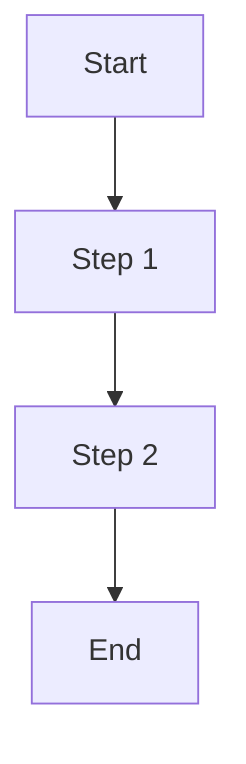

<!--
  LANGUAGE POLICY (§3.15): YAML keys, status enums, IDs stay in English
  (the schema). Section
  headings (##) follow the project's content_language. All prose — descriptions,
  acceptance criteria, scenarios — goes in the project's content_language
  (declared in devflow/LANGUAGE).
  `AITL-*-Approval` codes are never translated.

  ⚠️ AITL-US-Approval (§2.6, §3.0): a feature US remains DRAFT until a
  Functional Analyst records AITL-US-Approval. Only then may it be
  decomposed into candidate functional Bolts. US-000 is outside this
  lifecycle. Approval is never inherited from related artifacts.

  ⚠️ Manifest v5 (§3.12, G33): when creating this feature US, create its
  manifest JSON in devflow/metrics/user-stories/ (schema_version "5.0", us,
  story_points, bolts: [], checkpoint_approvals: []). A feature US without
  its manifest does not exist. Validate against manifest-v5-us.schema.json.
  US-000 has no manifest — it is a permanent container with no approval
  lifecycle.
-->

> **Naming convention (mandatory):** Files go in `user-stories/` with the
> format `US-NNN-<description>.md`. Example: `US-001-payment-processing.md`.
> The `US-NNN` prefix is required for traceability across ADRs, SPECs, MEMs,
> BUGs, and Bolt manifests.

# US-NNN — [User Story title]

| Field          | Value |
|----------------|-------|
| **Unit**       | [Unit / Epic] |
| **ADRs**       | [links to applicable ADRs] |
| **Status**     | [draft / approved / deprecated] |
| **Story points** | [1 / 2 / 3 / 5 / 8 / 13 — relative functional complexity, never time (§2.6)] |

---

**As a** [role], **I want** [capability], **so that** [value].

## 1. Acceptance criteria

- **Given** [context], **When** [action], **Then** [expected result].
- **Given** [context], **When** [action], **Then** [expected result].
- **Given** [context], **When** [action], **Then** [expected result].

> ACs are verifiable functional criteria only — non-functional constraints
> live in ADRs (§2.7).

## 2. Bolts

| # | Bolt | Type | Layer | Description | Est. active delivery |
|---|------|------|-------|-------------|----------------------|
| 1 | `BOLT-001` (`../bolts/US-NNN.BOLT-001-short-title.md`) | functional | Backend | [Description] | 3h |
| 2 | `BOLT-002` (`../bolts/US-NNN.BOLT-002-short-title.md`) | functional | Frontend | [Description] | 4h |

> **Note:** Bolts are detailed in separate documents using
> [TEMPLATE-BOLT.md](../bolts/TEMPLATE-BOLT.md) and MUST be placed in the
> `bolts/` subfolder with the naming convention
> `US-NNN.BOLT-NNN-<description>.md`. Only approved USs decompose into
> candidate functional Bolts. Each Bolt has its own `AITL-BOLT-READY-Approval`,
> DoR (validated within it) and DoD.
>
> **Estimation:** the `Est. active delivery` column follows the AI-native
> estimation rule (§2.4) — composed from expected V-Bounces, review budgets
> per risk_class and setup/integration overhead, never from manual coding
> effort. Typical low/medium Bolts: 1–4h.
>
> **Plausibility check (§2.6):** the Bolt count should roughly match the
> US's story points band (1–2 SP → 1–2 Bolts; 3–5 → 2–4; 8 → 4+). Far
> outside the band → re-examine the score or the slicing — never force a
> decomposition to fit the band, and never convert points to hours (W18).

---

## 3. Business rules

[Domain constraints and conditions.]

| # | Rule | Condition | Action |
|---|------|-----------|--------|
|   |      |           |        |

---

## 4. User flows

---

## 5. Impact

[Affected modules, dependencies, risks.]

---

## 6. SDLC tool alignment

[Associated Work Items, Sprint, Board — optional, per the team's own SDLC
integration.]

---

## 7. AITL-US-Approval

> **Avenga DevFlow §2.6, §3.0.** This feature US remains a draft until a
> Functional Analyst records `AITL-US-Approval` (recorded in the `review`
> frontmatter block), confirming that the US and its ACs faithfully
> represent the evidence in `input/` and the analysis in `analysis/`.
> Only then may it be decomposed into candidate functional Bolts. US-000
> is outside this lifecycle.

---

## 8. Manifest creation (mandatory)

> ⚠️ **MANDATORY** — When this feature US is created, also create its
> manifest JSON in `devflow/metrics/user-stories/` with the same name
> (`.md` → `.json`): `schema_version: "5.0"`, the
> `us{id,ref,sources,generation,review_ready_at,review_started_at}`
> block, `story_points`, and empty `bolts` / `checkpoint_approvals`
> arrays. A feature US without its manifest **does not exist** (§3.12,
> G33). Validate against
> [`devflow/metrics/manifest-v5-us.schema.json`](../../metrics/manifest-v5-us.schema.json);
> use [`TEMPLATE-MANIFEST-US.json`](../../metrics/TEMPLATE-MANIFEST-US.json)
> as the example. The agent appends `bolts[]` and the `AITL-US-Approval`
> decision — with its `review_ready_at`, `review_started_at` and
> `decided_at` timings — as the lifecycle progresses.
>
> **US-000 is excluded:** it is a permanent traceability container with no
> approval lifecycle, and therefore carries no manifest.
