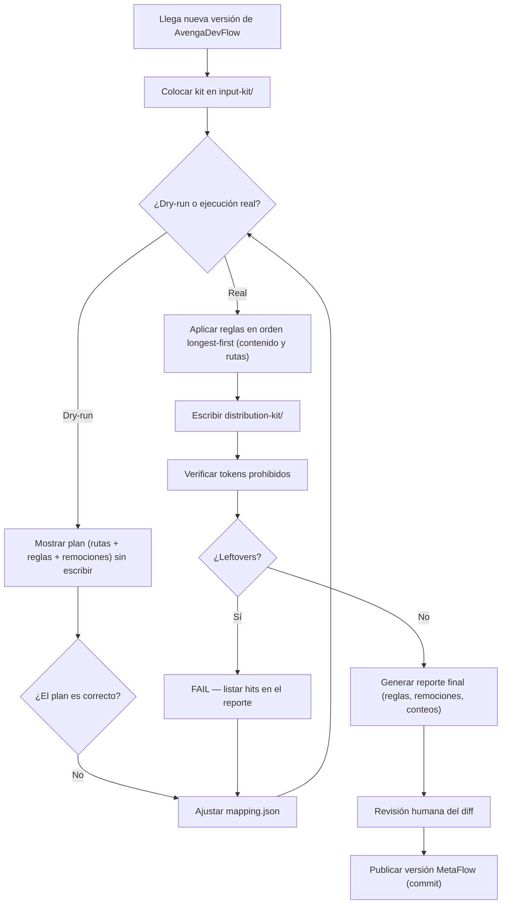

# US-001 — Toolkit de transformación del kit (AvengaDevFlow → MetaFlow)

| Field          | Value |
|----------------|-------|
| **Unit**       | MVP — Toolkit de transformación |
| **ADRs**       | [ADR-001](../adrs/ADR-001-toolkit-transformacion.md) |
| **Status**     | approved |
| **Story points** | 5 (propuestos — confirmados en AITL-US-Approval) |

---

**Como** MetaFlowMaintainer (propietario y mantenedor del repositorio), **quiero**
un toolkit que transforme cada versión de AvengaDevFlow colocada en `input-kit/`
en la versión MetaFlow correspondiente en `distribution-kit/` — aplicando el
diccionario de nombres con verificación automática de tokens prohibidos y
reporte para revisión humana, **para** publicar versiones MetaFlow con identidad
propia (cero contaminación de marca), correspondencia 1:1 y sin reescrituras
manuales.

## 1. Criterios de aceptación

- **Given** un kit de AvengaDevFlow completo en `input-kit/` (versión X.Y,
  ~150 archivos), **When** se ejecuta el pipeline de transformación, **Then**
  `distribution-kit/` contiene el kit MetaFlow equivalente — misma
  funcionalidad, solo cambios de nombres según el diccionario — y la versión
  de salida es X.Y − 4 (5.1 → 1.1).
- **Given** el diccionario de transformación disponible como datos editables
  (`mapping.json`), **When** se agrega una regla nueva, **Then** la regla se
  aplica sin modificar el código del engine.
- **Given** reglas de longitudes distintas para un mismo término (p. ej.
  `AvengaDevFlow`, `Avenga DevFlow`, `Avenga`), **When** se aplican sobre el
  contenido, **Then** la cadena más larga se reemplaza primero y ningún
  término queda parcialmente transformado.
- **Given** códigos de checkpoint variables en el contenido (`AITL-SPEC-Approval`,
  `HITL-MEM-Approval`, etc.), **When** se transforma, **Then** pasan a
  `CP-<CODE>-Approval` conservando el código variable.
- **Given** contenido marcado para remoción en el diccionario (citas a
  Raja SP / DORA, referencias históricas, cláusulas de legado `HITL-*`),
  **When** se transforma, **Then** el contenido se elimina del kit de salida y
  cada remoción aparece listada en el reporte (nada silencioso).
- **Given** un kit en `input-kit/` y el diccionario cargado, **When** se
  ejecuta el pipeline en modo dry-run, **Then** se muestra el plan completo
  (rutas nuevas, reglas, remociones) sin escribir **ni borrar** nada en
  `distribution-kit/`.
- **Given** un kit transformado, **When** corre el verificador, **Then** el run
  falla (código de salida != 0) y lista los hits si queda algún token
  prohibido (`Avenga`, `AITL`, `HITL`, `Bolt`, `V-Bounce`, `v_bounces`,
  `Raja`, `DORA`); si no queda ninguno, el run es exitoso.
- **Given** una ejecución real, **When** termina, **Then** se genera un reporte
  con las reglas aplicadas, conteos por regla y remociones listadas, como
  evidencia para la revisión humana antes de publicar.
- **Given** el toolkit, **When** se ejecuta la suite de tests, **Then** pasan
  los tests unitarios (orden de reglas, variantes de caso, regex) y la
  aceptación E2E contra el kit real (verificador en cero).
- **Given** una ejecución real del pipeline (no dry-run), **When** comienza la
  transformación, **Then** el contenido completo de `distribution-kit/` se
  borra antes de escribir el kit nuevo — cero residuos de corridas anteriores
  (y solo esa carpeta, nunca otra).
- **Given** una ejecución real, **When** termina la transformación, **Then**
  la evidencia del run queda persistida en
  `transform-reports/<versión>/<run>/` — reporte (JSON + MD), diffs por
  archivo (original → convertido), lista de archivos sin cambios y log del
  pipeline — disponible para revisión humana o procesamiento con IA posterior.

> ACs funcionales verificables únicamente — las restricciones no funcionales
> (tiempo < 1 min, portabilidad) viven en la ADR-001 (§2.7).

## 2. Bolts candidatos

| # | Bolt | Type | Layer | Description | Est. active delivery |
|---|------|------|-------|-------------|----------------------|
| 1 | `BOLT-001` (`../bolts/US-001.BOLT-001-engine-transformacion.md`) | functional | CLI/Backend | Engine de transformación + CLI: aplicación de reglas (rename, regex_rename, remove, path_rename) en orden longest-first, dry-run y ejecución real con borrado de salida; incluye tests unitarios del engine | 4h |
| 2 | `BOLT-002` (`../bolts/US-001.BOLT-002-verificador-reporte.md`) | functional | CLI/Backend | Verificador de tokens prohibidos (falla el run ante leftovers) + reporte de transformación (reglas, conteos, remociones, cobertura) + aceptación E2E contra el kit real | 4h |
| 3 | `BOLT-003` (`../bolts/US-001.BOLT-003-versionado-y-limpieza.md`) | functional | CLI/Backend | Versionado −4 por contexto (VERSION file, "Methodology version:", v5.1 — sin tocar §5.1 ni schema_version) + limpieza de citas en-texto a *Accelerate* (hallazgo de la revisión crítica 2026-08-27) | 3h |
| 4 | `BOLT-004` (`../bolts/US-001.BOLT-004-numeracion-carpetas-kit.md`) | functional | CLI/Backend | Numeración de carpetas internas por ciclo de uso (ADR-002: `01-input`…`53-actors`, gaps de 10, sin espacios) + reescritura completa de referencias + test de integridad de links (REV-001, F-02) | 4h |
| 5 | `BOLT-005` (`../bolts/US-001.BOLT-005-correccion-numeracion.md`) | functional | CLI/Backend | Corrección del sobre-match de numeración (REV-002: reglas con barra, enum del schema) + rename `32-adv-reviews` (ADR-003) | 3h |
| 6 | `BOLT-006` (`../bolts/US-001.BOLT-006-fix-numeracion-plataforma.md`) | functional | CLI/Backend | Fix BUG-001: no numerar las carpetas de plataforma (`.github/agents`, `.opencode/agents`) — TDD red→green | 2h |

> **Nota:** descomposición ajustada a 2 Bolts (decisión del propietario
> 2026-08-27): la aceptación E2E se absorbió en BOLT-002 y los unitarios en
> BOLT-001. Cada Bolt lleva su propio `AITL-BOLT-READY-Approval`, DoR y DoD.
>
> **Plausibility check (§2.6):** 5 SP → banda 2–4 Bolts; 2 Bolts dentro de la
> banda.

## 3. Reglas de negocio

| # | Regla | Condición | Acción |
|---|-------|-----------|--------|
| R1 | `input-kit/` es solo lectura | El pipeline procesa el kit de entrada | Nunca se modifica el contenido de entrada (InputKit RULE-01) |
| R2 | Correspondencia 1:1 de versiones | Una versión en `input-kit/` | Produce exactamente una salida con versión = entrada − 4 (O2 de la visión; decisión 2026-08-27) |
| R3 | Un run con tokens prohibidos no publica | El verificador encuentra ≥ 1 token | El run es `failed`; no hay versión publicable (BR-001) |
| R4 | Remociones nunca silenciosas | Se ejecuta una regla de remoción | La remoción se registra en el reporte (MappingRule RULE-03) |
| R5 | Salida limpia antes de transformar | Se ejecuta el pipeline en modo real | Se borra el contenido completo de `distribution-kit/` antes de escribir el kit nuevo; el dry-run nunca borra |
| R6 | Evidencia persistente por run (retención acotada) | Se ejecuta el pipeline (ejecución real) | El run deja reporte, diffs por archivo, lista de sin-cambios y log en `transform-reports/`; se conservan las **2 corridas más recientes por versión** (suficientes para comparar) y las anteriores se purgan automáticamente, listadas en el log del run (nada silencioso) |

## 4. Flujo de usuario

## 5. Impacto

- **Entidades de dominio:** InputKit (solo lectura), MappingRule (reglas),
  TransformRun (ejecución), DistributionKit (salida) — ver
  `../analysis/domain-model/`.
- **Proceso:** implementa `PROC-001` (transformación del kit).
- **Riesgos:** BR-001 (contaminación) mitigado por el verificador (AC-7);
  BR-002 (divergencia) mitigado por reporte + diccionario extensible (AC-2);
  BR-003 (schema divergente) es consecuencia buscada, sin acción en esta US.
- **Gobernanza:** la implementación queda restringida por la ADR-001
  (Python 3 + stdlib, código en `src/`, `mapping.json` en la raíz).

## 6. Alineación con herramientas SDLC

— (repositorio local; sin board externo configurado).

## 7. AITL-US-Approval

> **Avenga DevFlow §2.6, §3.0.** Esta feature US permanece en draft hasta que
> un Functional Analyst registra `AITL-US-Approval` (registrado en el bloque
> `review` del frontmatter), confirmando que la US y sus ACs representan
> fielmente la evidencia del análisis en `analysis/`. Solo entonces puede
> descomponerse en Bolts funcionales candidatos.

## 8. Creación del manifest (obligatorio)

> ⚠️ **OBLIGATORIO** — el manifest JSON vive en
> `devflow/metrics/user-stories/US-001-toolkit-transformacion.json`
> (schema_version "5.0", bloque `us{...}`, `story_points`, `bolts` y
> `checkpoint_approvals`). Una feature US sin su manifest **no existe**
> (§3.12, G33). Validado contra `manifest-v5-us.schema.json`.

---

## 9. Historia

| Fecha | Cambio | Autor |
|-------|--------|-------|
| 2026-08-27 | Borrador inicial (derivado de scope MVP, glossary, PROC-001 y journey) | @eugenioserrano |
| 2026-08-27 | **AITL-US-Approval** — `approved` por human:eugenioserrano (Functional Analyst autoasignado), sin hallazgos; 5 SP confirmados | @eugenioserrano |
| 2026-08-27 | Revisión 2 — AC-10 y R5: borrado completo de `distribution-kit/` antes de la ejecución real, cero residuos (solicitado por el propietario; dry-run nunca borra) | @eugenioserrano |
| 2026-08-27 | Revisión 3 — descomposición ajustada a 2 Bolts (BOLT-001 engine+CLI, BOLT-002 verificador+reporte+E2E) por decisión del propietario | @eugenioserrano |
| 2026-08-27 | Revisión 4 — AC-11 y R6: evidencia persistente por run en `transform-reports/` (reporte, diffs por archivo, sin-cambios, log) para revisión humana o análisis con IA (solicitado por el propietario) | @eugenioserrano |
| 2026-08-27 | Revisión 4 **revalidada** por el propietario — AC-11 y R6 confirmados | @eugenioserrano |
| 2026-08-27 | Revisión 5 — R6: retención acotada a las **2 corridas más recientes por versión** en `transform-reports/` (purgas automáticas listadas en el log; solicitado por el propietario) | @eugenioserrano |
| 2026-08-27 | Revisión 5 **revalidada** por el propietario — R6 de retención confirmada | @eugenioserrano |
| 2026-08-27 | Revisión 6 — BOLT-003 creado (versionado −4 por contexto + limpieza de citas *Accelerate*) a partir de la revisión crítica del kit real | @eugenioserrano |
| 2026-08-27 | Revisión 7 — BOLT-004 creado (numeración de carpetas por ciclo de uso, ADR-002 + REV-001 Plan B) | @eugenioserrano |
| 2026-08-27 | Revisión 8 — BOLT-005 creado (corrección del sobre-match de numeración — REV-002 — + rename 32-adv-reviews — ADR-003) | @eugenioserrano |
| 2026-08-27 | Revisión 9 — BOLT-006 creado (fix BUG-001: no numerar carpetas de plataforma) | @eugenioserrano |
