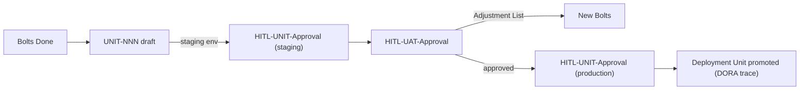

<!--
  LANGUAGE POLICY (§3.15): YAML keys, status enums, IDs stay in English
  (the schema). Section headings (##) follow the project's content_language.
  All prose — descriptions, acceptance criteria, scenarios — goes in the
  project's content_language (en, declared in devflow/LANGUAGE).

  ⚠️ HITL-US-Approval (§2.6, §3.0): this feature US remains DRAFT until a
  Functional Analyst records HITL-US-Approval. Only then may it be
  decomposed into candidate functional Bolts.

  ⚠️ Manifest v4 (§3.12, G33): the manifest JSON exists in
  devflow/metrics/user-stories/ (schema_version "4.0"). A feature US
  without its manifest does not exist.
-->

> **Transferred from US-015 (2026-08-22):** this US inherits **part (b)** of
> US-015 — the full operationalization of the `units/` family — which was
> deferred when US-015 was rescoped to the delivered interim removal (part
> (a), US-015.BOLT-001 Done). US-015 is closed; this US is its v5.0
> continuation and lives in the backlog until `HITL-US-Approval`.

# US-019 — Operationalize the units/ family

| Field          | Value |
|----------------|-------|
| **Unit**       | — |
| **ADRs**       | — |
| **Status**     | draft |
| **Story points** | 5 (proposed — the part-(b) scope of US-015; real-world-informed redesign carries unknowns) |

**As a** project manager, **I want** the Unit-level governance that the
methodology reserves to become fully operational — a `units/` family, the
per-environment `HITL-UNIT-Approval` flow and the UAT sign-off sequence —
**so that** a group of Bolts can be validated, accepted and promoted as one
cohesive deliverable, with each environment's approval recorded and
traceable.

## 1. Acceptance criteria

- **Given** the kit's governance flow, **When** a Unit record is needed,
  **Then** a canonical `units/` folder exists with an INDEX, a `UNIT-NNN`
  template and §5.15 routing for Unit records.
- **Given** a Unit, **When** its record is created, **Then** the `UNIT-NNN`
  document defines its frontmatter (status, named environment, composed
  Bolts with their manifests, deployment evidence, gates) and its lifecycle
  (`draft` → `in-validation` → `approved` per environment).
- **Given** a Unit being released, **When** the environment sequence runs,
  **Then** the operational contract is explicit: staging `HITL-UNIT-Approval`
  → `HITL-UAT-Approval` → production `HITL-UNIT-Approval`, with the evidence
  each step requires, what blocks what, and how an UAT Adjustment List opens
  new Bolts.
- **Given** the methodology's DORA definition, **When** a Unit is promoted,
  **Then** the promotion is recorded against the deployment definition
  (release tag / image digest / equivalent identifier linking the deployment
  to its Bolts and commits).
- **Given** the Unit model, **When** Bolts are grouped into a Unit, **Then**
  the grouping rule (sprint / milestone / environment target), the gate
  aggregation from member Bolts and the interaction with per-Bolt 100%
  coverage are defined.
- **Given** an adopting team, **When** it reads the Unit machinery, **Then**
  it can operate the full Unit lifecycle without unresolvable references to
  reserved or non-operational checkpoints (AREV-002 F-03).

> **Design note:** US-015's approval recorded that the reserved model "does
> not reflect real corporate environment/promotion complexity" — this US
> must begin with a real-world-informed redesign (likely its own Discovery)
> rather than build-what-was-reserved.

## 2. Bolts

| # | Bolt | Type | Layer | Description | Est. active delivery |
|---|------|------|-------|-------------|----------------------|
| — | (future — none yet) | — | — | Decomposed only after `HITL-US-Approval` (§2.6) | — |

## 3. Business rules

| # | Rule | Condition | Action |
|---|------|-----------|--------|
| 1 | Unit approvals are per named environment | Unit being released | Record each environment's `HITL-UNIT-Approval` with its evidence |
| 2 | UAT precedes production | Staging UNIT approved | Stakeholders sign off before production promotion |
| 3 | Unit-level checkpoints are NOT per-Bolt coverage | Bolt accepted | Coverage stays 100% per Bolt; Unit gates apply to the group (§3.7.3) |

## 4. User flows

## 5. Impact

- **Kit:** new `devflow/units/` family (INDEX, template), §3.0/§3.11/§3.15
  updates, §5.15 routing row, the four agents' HITL tables if UNIT/UAT rows
  return, `tests/uat/` re-activated from dormant (US-015 part (b)).
- **Risks:** the reserved model's mismatch with real corporate
  environment/promotion complexity (unknowns → Discovery first); G39 order
  if the §3.15 vocabulary gains states.
- **Dependencies:** US-015 (closed — this US continues it); ADR family for
  the redesign decisions.

## 6. SDLC tool alignment

Backlog for v5.0 — candidate for the first 5.0 planning.

---

## 7. HITL-US-Approval

> **Avenga DevFlow §2.6, §3.0.** This feature US remains a draft until a
> Functional Analyst records `HITL-US-Approval` (recorded in the `review`
> frontmatter block). Only then may it be decomposed into candidate
> functional Bolts.

---

## 8. Manifest creation (mandatory)

> ⚠️ **MANDATORY** — this US's manifest JSON exists at
> `devflow/metrics/user-stories/US-019-operationalize-units-family.json`
> (schema_version "4.0"; G33). A feature US without its manifest does not
> exist.
