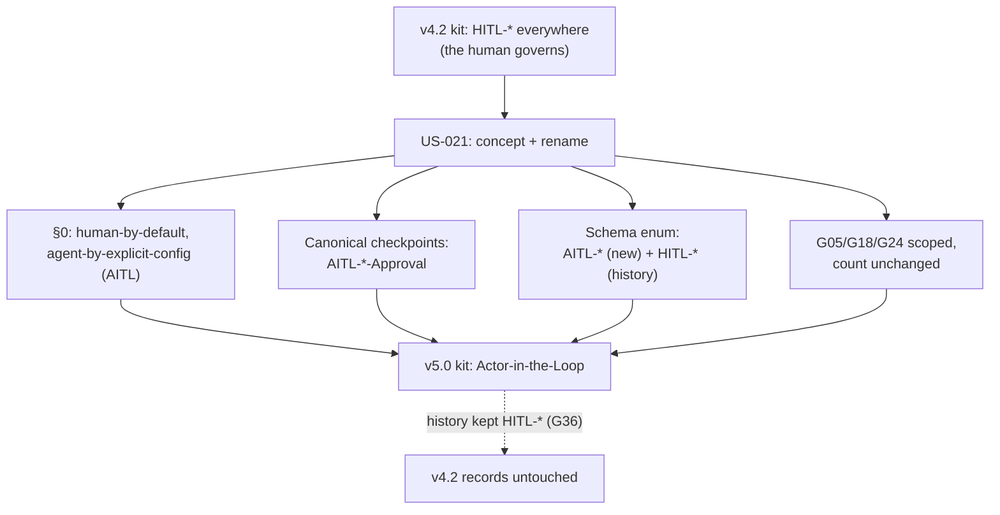

<!--
  LANGUAGE POLICY (§3.15): schema in English; prose content_language (en).
  Kit-only product surface (ADR-004); root operating methodology stays v4.2.
  DOGFOODING SPLIT (ADR-008 §3.1): this US is authored NOW under the v4.2
  operating methodology, so its OWN checkpoints are HITL-* (HITL-US-Approval,
  etc.). Its DELIVERABLE is that the v5.0 PRODUCT (the kit) speaks AITL-*.
  No contradiction — we build v5.0 using v4.2.
-->

# US-021 — HITL → AITL (concept + kit-wide checkpoint rename)

| Field          | Value |
|----------------|-------|
| **Unit**       | v5.0 — AITL (concept + checkpoint rename) |
| **ADRs**       | ADR-008 (the precept), ADR-007 (actor identity), ADR-005 (sweep), ADR-004 (kit-only), ADR-006 (versioning) |
| **Status**     | draft |
| **Story points** | 8 (proposed) — kit-wide surface + conceptual reframe of §0 + delicate guardrail scoping; one coherent change |

---

**As a** methodology maintainer, **I want** the v5.0 kit to express **Actor-in-the-Loop**
— the concept *and* every checkpoint identifier — **so that** the product states
"human-by-default, agent-by-explicit-configuration" (ADR-008) instead of the pure
"the human governs" of HITL, without weakening a single pause or identity
guarantee.

## 1. Acceptance criteria

- **Given** the kit's core methodology (§0 and the paradigm it states), **When**
  v5.0 defines its precept, **Then** it reads **"human-by-default,
  agent-by-explicit-configuration"** and defines **AITL — Actor-in-the-Loop**,
  where the actor is a **human by default** or a virtual DevFlow Agent by explicit
  valid configuration; HITL is named as the **default case** (actor = human)
  inside AITL, not a separate thing (ADR-008 §3.1).
- **Given** any **canonical** checkpoint identifier in the kit, **When** it names a
  v5.0 gate, **Then** it reads **`AITL-<CODE>-Approval`** — the full set
  (`AITL-US`, `AITL-BUG`, `AITL-TC`, `AITL-BOLT-READY`, `AITL-ADR`, `AITL-SPEC`,
  `AITL-MEM`, `AITL-BOLT-DONE`, `AITL-DISC/REV/AREV-*`) — and **no canonical
  `HITL-<CODE>-Approval` remains**, except allowlisted historical/legacy
  references (ADR-005 phrase-family sweep over a fixed location set).
- **Given** the v5 manifest schema, **When** a **new** approval is recorded,
  **Then** the `checkpoint` enum accepts `AITL-*` names (and the SPEC/MEM
  subject conditionals apply to the `AITL-*` forms too), **while `HITL-*` remains
  accepted** for migrated history (G36) — a `checkpoint_approvals[]` entry with an
  `AITL-SPEC-Approval` requiring `subject.revision`, and one with a historical
  `HITL-SPEC-Approval`, both validate.
- **Given** GUARDRAILS, **When** G05 defines the canonical checkpoint vocabulary,
  **Then** the canonical set is `AITL-*` and `HITL-*` is listed as **legacy**
  (alongside H1–H6); **G18/G24** read as **scoped** per ADR-008 §3.4 (the AI never
  approves *unless* an explicit valid virtual-approver configuration exists for
  that checkpoint class *and* the independence rule holds; the record never
  fabricates a human); **G37** (AREV neutrality) and the **handoff** rule are
  excluded from any no-holder fallback. The **blocking-rule count is unchanged**
  (text of existing rules evolves; no rule added or removed).
- **Given** the four platform agents, **When** they state checkpoints and the
  precept, **Then** they use `AITL-*` and the AITL concept, and remain
  **byte-identical** in their shared methodology regions (four-agent sync
  preserved; the G-count invariant holds).
- **Given** existing v4.2 approvals (in this repo and any adopter's history),
  **When** the rename lands, **Then** their recorded `HITL-*` names are
  **preserved verbatim** — never rewritten to `AITL-*` (G36).
- **Given** the root operating methodology (v4.2), **When** this US executes,
  **Then** **only the kit** (`distribution-kit/`) changes; the root stays `HITL-*`
  (ADR-004 kit-only; the dogfooding split, ADR-008 §3.1).
- **Given** the safe-default invariant (ADR-008 §3.2), **When** the rename lands,
  **Then** renaming changes **names and concept only** — it does **not** enable any
  agent approval by itself; delegation still requires explicit per-project
  configuration (a later US).

> ACs are verifiable functional criteria only; the non-functional constraints
> (approval-integrity, independence, safe-default) live in ADR-008.

## 2. Bolts

Tentative decomposition (detailed as candidate Bolts after `HITL-US-Approval`):

| # | Bolt | Type | Layer | Description | Est. active delivery |
|---|------|------|-------|-------------|----------------------|
| 1 | US-021.BOLT-001 | functional | Docs (core) | §0 precept reframe + the HITL→AITL concept narrative (Actor-in-the-Loop, human-by-default) in the core methodology + charter | 3–4h |
| 2 | US-021.BOLT-002 | functional | Docs (sweep) | Kit-wide `HITL-<CODE>-Approval` → `AITL-<CODE>-Approval` identifier sweep across methodology text, templates, READMEs — ADR-005 phrase family + allowlist | 3–4h |
| 3 | US-021.BOLT-003 | functional | Guardrails | Scope G05 (canonical→AITL, HITL legacy), G18/G24 (per §3.4), G37/handoff no-fallback note; preserve the blocking-rule count | 2–3h |
| 4 | US-021.BOLT-004 | functional | Schema | Add `AITL-*` to the v5 `checkpoint` enum + SPEC/MEM conditionals for both prefixes; keep `HITL-*` (history); worked examples validate | 2–3h |
| 5 | US-021.BOLT-005 | functional | Agents | Align the four platform agents to AITL (concept + checkpoints), byte-sync + G-count | 2h |

> Plausibility (§2.6): 8 SP → 4+ Bolts. This is one coherent evolution (ADR-008
> fully specifies it), so it stays one US; the delivery is sliced by surface
> (core / sweep / guardrails / schema / agents), each independently demonstrable.

---

## 3. Business rules

| # | Rule | Condition | Action |
|---|------|-----------|--------|
| 1 | Dogfooding split | Artifact authored under the v4.2 operating methodology | Its own checkpoints stay `HITL-*`; only the **kit product** becomes `AITL-*` |
| 2 | History preserved (G36) | A recorded `HITL-*` approval exists | Never rewrite it to `AITL-*`; it is historical record |
| 3 | Allowlist (ADR-005) | A `HITL-*` reference is historical, a legacy mention, or the §5.16 migration source | It stays `HITL-*`; the sweep does not touch it |
| 4 | Safe default intact (ADR-008 §3.2) | The rename lands | No agent approval is enabled; that needs explicit per-project config (separate US) |
| 5 | Count invariant | GUARDRAILS scoping edits | The blocking-rule count is unchanged (evolve text, never add/remove a rule) |

---

## 4. User flows

---

## 5. Impact

- **Touches the entire kit's checkpoint vocabulary** (core methodology, GUARDRAILS,
  the four agents, templates, READMEs) and the v5 schema enum — a large but
  mostly mechanical sweep governed by ADR-005.
- **Depends on:** ADR-008 (approved — the precept), ADR-007 (actor identity),
  US-020 (manifest v5, delivered — the enum lives there), ADR-005 (sweep),
  ADR-004 (kit-only).
- **Delicate area:** G18/G24 are the trust guarantees. Scoping (not deleting) them
  must follow ADR-008 §3.4 exactly — the record can never fabricate a human, and
  G37/handoff never become a self-approval licence.
- **Does NOT include:** enabling virtual approvers (per-project AITL-enable
  config), the `agents/` registry, the Coordinator, the roster, the pilot — those
  are later USs (ADR-008 §3.9, DISC-002).
- **Risk:** an incomplete rename leaves a mixed HITL/AITL kit → controlled by the
  ADR-005 phrase-family sweep with a declared location set + allowlist, phrased as
  an absence (the discipline that caught three misses during US-020).

---

## 6. SDLC tool alignment

Maintainer-internal (the methodology dogfoods itself); no external tracker.

---

## 7. HITL-US-Approval

> **Avenga DevFlow §2.6, §3.0.** This feature US remains a draft until a
> Functional Analyst records `HITL-US-Approval` (in the `review` frontmatter
> block). Only then may it be decomposed into candidate functional Bolts.
> Confirm the `story_points` value (proposed: **8**) at approval.

| Field | Value |
|-------|-------|
| **Approver** | eugenio.serrano (functional_analyst) |
| **Decision** | **approved** |
| **review_ready_at** | `2026-08-22T17:54:40-03:00` |
| **review.started_at** | `2026-08-22T18:09:22-03:00` |
| **review.decided_at** | `2026-08-22T18:09:22-03:00` |
| **Story points** | **8** (confirmed) |

---

## 8. Manifest creation (mandatory)

Manifest at `devflow/metrics/user-stories/US-021-hitl-to-aitl-evolution.json`
(`schema_version 4.0` — root operating partition is v4.2; `us` block,
`story_points: 8` proposed → confirmed at approval, empty `bolts` /
`hitl_approvals`). Validates against `manifest-v4-us.schema.json`.
