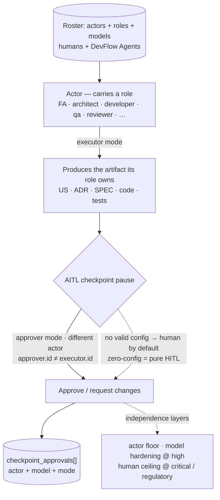

<!--
  LANGUAGE POLICY (§3.15): YAML keys, status enums, IDs stay in English
  (the schema). Section headings (##) and prose follow the project's
  content_language (en, devflow/LANGUAGE; ADR-012).
  `AITL-*-Approval` codes are never translated.

  ⚠️ AITL-US-Approval (§2.6, §3.0): a feature US remains DRAFT until a
  Functional Analyst records AITL-US-Approval. Only then may it be
  decomposed into candidate functional Bolts. US-000 is outside this
  lifecycle. Approval is never inherited from related artifacts.

  ⚠️ Manifest v5 (§3.12, G33): manifest JSON in
  devflow/metrics/user-stories/US-022-actor-concept.json — created with
  this document (schema_version "5.0"; story_points 3 proposed).

  ⚠️ FOLDER DECISION (2026-08-23, maintainer + review): the roster home is
  `devflow/actors/` (who is in the team), NOT `agents/` (the AI-member
  definitions, US-023). ADR-007 §3.5/§4 explicitly delegates the folder
  layout to the registry US — this choice contradicts no approved ADR and
  needs no superseding ADR. G30-sanctioned by this US.
-->

# US-022 — Actor: producer + approver

| Field          | Value |
|----------------|-------|
| **Unit**       | v5.1 — DevFlow Agents family (foundation) |
| **ADRs**       | ADR-007 (identity model), ADR-008 (AITL precept), ADR-010 (actor grammar), ADR-005 (sweep discipline) |
| **Status**     | approved (AITL-US-Approval 2026-08-23; **re-approved 2026-08-23 — producer+approver reframe**) |
| **Story points** | 5 (confirmed at AITL-US-Approval) |

**As a** methodology maintainer, **I want** the kit to define the **Actor**
as a member of the team — a human by default, a DevFlow Agent by explicit
valid configuration — with **two responsibilities**: **(1) producing** the
governed artifacts its role owns (functional analyst → US, architect →
ADR, developer → SPEC + code, QA → TC/tests) in **executor** mode, and
**(2) participating** in AITL approvals in **approver** mode when
configured, under the independence floor — with the actor grammar, the
independence layers, an open role taxonomy and a dedicated `actors/`
folder (the roster home) stated canonically, **so that** the DevFlow
Agents family (US-023, US-024), the manifest record and every adopter
speak one consistent identity language.

## 1. Acceptance criteria

- **Given** the kit's core methodology (v5.1), **When** it states the
  precept, **Then** it defines the **Actor** as a **member of the team**
  with two responsibilities: **(1) producing** the governed artifacts its
  role owns — functional analyst → US, architect → ADR, developer →
  SPEC + code, QA → TC/tests — in **executor** mode; and **(2)
  participating** in AITL approvals in **approver** mode when configured,
  under the independence floor — a **human by default**, a **virtual
  DevFlow Agent** only by explicit valid configuration; HITL is named as
  the **default case** (actor = human) inside AITL, not a separate thing
  (ADR-008 §3.1). The Actor is **not** merely "the participant who
  occupies a checkpoint pause" — production is first-class.
- **Given** the §Actor section, **When** it describes responsibilities,
  **Then** it states that an Actor **produces** the governed artifacts its
  role owns (US, ADR, SPEC, code, tests) as executor, and **participates
  in approvals** under the independence floor — the AI generates, the
  human governs at every checkpoint.
- **Given** the identity model (ADR-007), **When** the kit describes
  actors, **Then** it states that identity belongs to the **actor**, not the
  model: a human actor is `human:<user>`, a DevFlow Agent actor is
  `agent:<id>`, and the model is an **attribute** of the agent actor
  (`model: null` for humans) — ADR-010 grammar.
- **Given** the two independence layers, **When** the kit states approval
  independence, **Then** it expresses the **actor floor** (`approver.id ≠
  executor.id`, generalizing the human handoff rule), the **model
  hardening** at `high` risk (`approver.model ≠ executor.model`) and the
  **human ceiling** at `critical`/`regulatory` — per ADR-008 §3.3.
- **Given** the v5 manifest record (US-020 delivered), **When** a
  checkpoint approval is recorded, **Then** the `checkpoint_approvals[]`
  entry carries the actor (`human:<user>` / `agent:<id>`) + model + mode;
  this US **makes no schema change** — it references the landed record as
  the operational expression of the Actor concept.
- **Given** the safe-default invariant (ADR-008 §3.2), **When** no virtual
  agent is configured, **Then** every checkpoint resolves to a human actor
  (zero-config = pure HITL, byte-for-byte) — the Actor concept never
  weakens the floor.
- **Given** the four platform agents, **When** they state the precept/AITL
  sections, **Then** they express the Actor concept (human by default /
  agent by explicit valid configuration) and remain **byte-identical** in
  their shared methodology regions (four-agent sync preserved; G-count
  invariant holds) — verified with the US-016 audit tool.
- **Given** the vocabulary (glossary, ONBOARDING), **When** the kit defines
  terms, **Then** "Actor" is defined as the umbrella term covering humans
  and DevFlow Agents, consistent with the pure v5 vocabulary (ADR-010).
- **Given** the kit's `devflow/actors/` folder (G30-sanctioned by this US),
  **When** a maintainer inspects it, **Then** it contains a README;
  `devflow/actors/` is the **roster home** (schema + example added by
  US-024), and it is disambiguated on its first line from
  `devflow/agents/` (the AI-member definitions, US-023).
- **Given** the `actors/` README, **When** a reader opens it, **Then** it
  teaches the Actor concept (definition, grammar, independence layers) with
  the flow diagram (mermaid) and points to the **normative** definition in
  Avenga-DevFlow.md — the README is explanatory, never a second source of
  truth; the mermaid's **canonical home is the §Actor section of the
  methodology**, and the README references/embeds it (no diagram drift).
- **Given** the role taxonomy, **When** the kit names roles, **Then** it
  treats **role as an open archetype** — the methodology does not freeze a
  role enum; the kit names recommended archetypes as examples
  (coordinator · functional-analyst · architect · developer · qa ·
  reviewer · project-defined…, ADR-007 §3.3) and projects extend them.
  Independence is measured on the actor `id`, **never** on the role
  taxonomy.
- **Given** the Actor vocabulary family ("Actor", "Actor-in-the-Loop",
  "human-by-default, agent-by-explicit-configuration"), **When** the kit is
  swept, **Then** the phrase-family sweep (ADR-005 discipline) covers it
  over a fixed location set with an allowlist, verified as an **absence**
  of stale/competing terms — the same discipline that caught misses in
  US-020/US-021.

> ACs are verifiable functional criteria only; the non-functional
> constraints (approval-integrity, independence, safe-default) live in
> ADR-008.

## 2. Bolts

Tentative decomposition (detailed as candidate Bolts after
`AITL-US-Approval`):

| # | Bolt | Type | Layer | Description | Est. active delivery |
|---|------|------|-------|-------------|----------------------|
| 1 | US-022.BOLT-001 | functional | Docs (core) | The Actor concept section in the core methodology (definition as **producer + approver**, grammar, the two independence layers, safe-default, the executor/approver/neither relationship) + the flow diagram (mermaid — its canonical home, the producer→checkpoint→approver flow) + the canonical tree §5.1 gains the `actors/` entry | 2–3h |
| 2 | US-022.BOLT-002 | functional | Kit folder | The `devflow/actors/` folder + README (concept + mermaid referencing the canonical one in §Actor + disambiguation from `agents/`), G30-sanctioned | 2h |
| 3 | US-022.BOLT-003 | functional | Docs (vocabulary + agents + sweep) | Glossary + ONBOARDING "Actor" entries; the AITL sections of the four platform agents express the concept (byte-sync + G-count via US-016); the Actor phrase-family sweep (ADR-005) | 2–3h |

> Plausibility (§2.6): 5 SP → 3 Bolts (within the 2–4 band). The concept is fully specified by
> ADR-007/008/010; this US is the kit surface that states it canonically —
> deliberately small, deliberately load-bearing (US-023/024 reference it).

## 3. Business rules

| # | Rule | Condition | Action |
|---|------|-----------|--------|
| 1 | Already-landed scope excluded | The manifest record (US-020), the grammar sweep (ADR-010 Bolts) and the checkpoint rename (US-021) are delivered | This US does not re-implement them; it defines the concept text the kit references |
| 2 | History preserved (G36) | A recorded approval exists | Its actor form is never rewritten; it is historical record |
| 3 | Count invariant | Guardrails text is touched | The blocking-rule count is unchanged (evolve text, never add/remove a rule) |
| 4 | Safe default intact | The Actor concept lands | No agent approval is enabled; delegation still requires per-project explicit configuration (US-023/US-024 + per-project AITL-enable ADR) |
| 5 | No authority here | The concept is stated | Who may sign what is decided by ADR-008 + the roster (US-024); this US grants no delegation authority |
| 6 | README is explanatory | The `actors/` README exists | It points to the normative definition (Avenga-DevFlow.md); it is never a second source of truth and never citable as governed evidence (G28 discipline); the mermaid's canonical home is the §Actor section — the README references/embeds it, never forks it |
| 7 | Roles are open | The kit names roles | Recommended archetypes are examples, not a closed enum; independence checks use the actor `id`, never the role taxonomy |
| 8 | Folder split | `actors/` vs `agents/` | `actors/` = the team (roster home, created here); `agents/` = AI-member definitions (US-023); both READMEs disambiguate on their first line |

## 4. User flows

## 5. Impact

- **Creates:** the `devflow/actors/` folder + README (G30-sanctioned by
  this US); the Actor concept section in the core methodology; the
  canonical tree §5.1 entry for `actors/`; glossary + ONBOARDING entries;
  the four agents' concept paragraphs (shared body — byte-sync preserved).
- **Depends on:** ADR-007/ADR-008/ADR-010/ADR-005 (approved — the
  substance), US-020/US-021 (delivered — the manifest record and the
  rename this US references), US-016 (delivered — automates the sync/G-count
  evidence).
- **Precedes:** US-023 (DevFlow Agent definitions reference the Actor
  concept; creates `agents/`), US-024 (fills `actors/` with the roster
  schema + example and the AITL-enable ADR template). **Hard
  prerequisite:** US-022 should be approved before US-024 (concept +
  folder decision stable), and US-024's roster Bolts cannot start until
  US-022.BOLT-002 has created the `actors/` folder.
- **Does NOT include:** the agent definition contract, the Coordinator,
  charters, wrappers (US-023); the roster schema, validation, AITL-enable
  ADR template (US-024); the Claude Code pilot.
- **Risk:** overlap with already-landed grammar (US-020/ADR-010) — scoped
  out by rule #1; an inconsistent concept across the four agents —
  controlled by the byte-sync + G-count invariants (US-016); the
  `actors/`/`agents/` name similarity — controlled by rule #8 (first-line
  disambiguation).

## 6. SDLC tool alignment

Maintainer-internal (the methodology dogfoods itself); no external tracker.

## 7. AITL-US-Approval

> **Avenga DevFlow §2.6, §3.0.** This feature US remains a draft until a
> Functional Analyst records `AITL-US-Approval` (recorded in the `review`
> frontmatter block), confirming that the US and its ACs faithfully
> represent the evidence in its sources. Only then may it be decomposed
> into candidate functional Bolts. US-000 is outside this lifecycle.

| Field | Value |
|-------|-------|
| **Approver** | eugenio.serrano (functional_analyst) |
| **Decision** | **approved** (initial) + **re-approved** (producer+approver reframe, 2026-08-23T14:01:28) |
| **review_ready_at** | initial `2026-08-23T13:10:00-03:00` · re-approval `2026-08-23T13:55:00-03:00` |
| **review.started_at** | initial `2026-08-23T13:18:00-03:00` · re-approval `2026-08-23T13:58:00-03:00` |
| **review.decided_at** | initial `2026-08-23T13:22:43-03:00` · re-approval `2026-08-23T14:01:28-03:00` |
| **Story points** | **5** (confirmed) |
| **Findings** | none — acknowledged_without_comment (reason in the frontmatter `review:` block) |

## 8. Manifest creation (mandatory)

Manifest at `devflow/metrics/user-stories/US-022-actor-concept.json`
(`schema_version 5.0`; `us` block; `story_points: 5` confirmed at
AITL-US-Approval; `bolts` appended as the candidate Bolts are created).
Validates against `manifest-v5-us.schema.json`.
