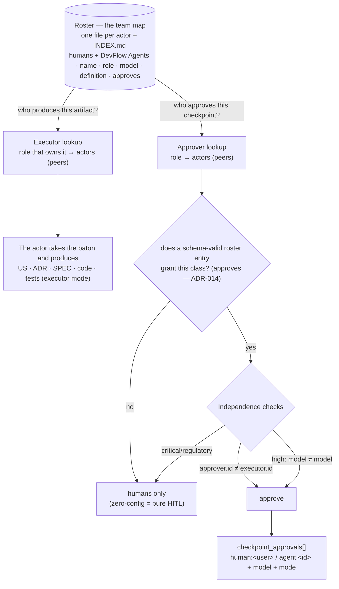

<!--
  LANGUAGE POLICY (§3.15): YAML keys, status enums, IDs stay in English
  (the schema). Section headings (##) and prose follow the project's
  content_language (en, devflow/LANGUAGE; ADR-012).
  `AITL-*-Approval` codes are never translated.

  ⚠️ AITL-US-Approval (§2.6, §3.0): a feature US remains DRAFT until a
  Functional Analyst records AITL-US-Approval. Only then may it be
  decomposed into candidate functional Bolts. US-000 is outside this
  lifecycle. Approval is never inherited from related artifacts.

  ⚠️ Manifest v5 (§3.12, G33): manifest JSON in
  devflow/metrics/user-stories/US-024-unified-actors-roster.json — created
  with this document (schema_version "5.0"; story_points 5 proposed).

  ⚠️ SUPERSEDES US-001 (team roster, deprecated 2026-08-23): the human-only
  roster of the v4.2 era becomes a special case of the unified actors
  roster (humans + DevFlow Agents as peers). US-001's ACs are absorbed
  here; its own checkpoints were never approved (draft), so no recorded
  decision is affected (G36).
-->

# US-024 — Unified actors roster

| Field          | Value |
|----------------|-------|
| **Unit**       | v5.1 — DevFlow Agents family (roster) |
| **ADRs**       | ADR-007 (identity model), **ADR-014** (precept carried from ADR-008 + the roster enablement), ADR-010 (actor grammar) |
| **Status**     | draft — **revision 3 (roster-as-enablement, G15) pending re-approval** |
| **Story points** | 5 (confirmed) |

**As a** methodology maintainer and adopting team, **I want** the roster to
be the **team map** — **actors**, humans and DevFlow Agents together, each
with its roles, model, **what it produces** (executor side) and approval
authority (approver side) — **so that** one lookup answers three
questions: who **produces** this artifact (the actors holding the role
that owns it), who holds a role (availability), and who can **approve**
without violating independence (is the approver a different actor?) —
without weakening the zero-config pure-HITL default.

## 1. Acceptance criteria

- `AC-1` — **Given** the kit's `actors/` folder (created by US-022; `agents/`
  holds only the AI-member definitions, US-023), **When** a project builds
  its team, **Then** the folder follows the family shape fixed by ADR-014
  §3.9: a **`TEMPLATE-ACTOR`** (the kit template for creating an actor —
  **simplified in v1**, the `capabilities` block deferred to the v2
  hardening), the actor **schema** (`roster.schema.yaml` — validates an
  actor file), **`roster.yaml`** (**the team list — the single membership
  authority**: one entry per actor referencing its file; an actor file
  **not listed is not in the team**), an **`INDEX.md`** listing the family
  docs, an **`examples/`** subfolder holding the worked examples, and a
  `README`. **Each actor is its own file** `actors/<actor-id>.yaml`
  (naming convention, N-rule), created from `TEMPLATE-ACTOR` and listed in
  `roster.yaml` — humans
  and DevFlow Agents as **peers**, each carrying `id`, a project-chosen
  `name`, `role`, `model`, `modes`, `approves` (agents also a `definition`
  pointer) — per DISC-002 §5.3. **Actors are named freely** (`name` — e.g.
  "Arq Juan", ".NET Architect") distinct from the kebab `id`; the
  `definition` is a **reusable blueprint** and **many actors may share one
  `definition`** (two architects both on `dotnet-architect`), each a
  distinct actor by `id`; each actor's `model` is **per-instance** (the
  actor file's `model` is authoritative and may differ from the definition's default). **The productive outputs of each agent
  are derived from its `role`** — the single role → artifacts mapping
  (FA → US, architect → ADR, developer → SPEC + code, QA → TC/tests)
  defined once in the role charter templates (US-023 BOLT-001) and §3.0.1;
  **no per-agent `produces` field** (no duplication, no drift — reconciled
  with the US-023 contract, which keeps the productive mandate in the
  charter body).
- `AC-2` — **Given** the zero-config invariant (ADR-014 §3.2), **When** no
  actor files exist — or none declares a DevFlow Agent — **Then** the project behaves
  **byte-for-byte as pure HITL**: every checkpoint resolves to humans
  (DISC-002 §5.3 rule 5).
- `AC-3` — **Given** a lookup for who produces an artifact class, **When** the team
  needs an executor, **Then** the roster returns the actors holding the
  role that owns it (humans and agents as peers) — the production mapping
  **resolves from `role`** (the charters' enumerated outputs, US-023
  BOLT-001), so the roster needs no duplicated field — the roster is the
  **team map** (production), not only an approval routing table.
- `AC-4` — **Given** a checkpoint's recommended role, **When** an approver must be
  resolved, **Then** the roster returns the actors holding that role
  (humans and agents as peers in the lookup); an **agent** holder counts
  only for the checkpoint classes **its own `approves` grants** (ADR-014
  §3.8 — the roster entry is the enablement; there is no separate policy
  switch).
- `AC-5` — **Given** the independence floor (ADR-014 §3.3), **When** an approval is
  routed, **Then** `approver.id ≠ executor.id` — the actor floor
  generalizing the human handoff rule (the executor side of the lookup is
  the **producer** of the artifacts under review); at `high` risk
  additionally `approver.model ≠ executor.model` (model hardening); at
  `critical`/`regulatory` the roster resolves to humans **regardless of
  contents** (rule 4). A violating routing is refused by the Coordinator
  (US-023). **Two actors sharing one `definition`** stay independent at the
  actor level (distinct `id`) — one may approve the other's work at
  low/medium; at `high`, model hardening requires them to carry distinct
  per-instance `model`s (the roster's per-actor `model` makes this possible).
- `AC-6` — **Given** the human-roster ACs of the deprecated US-001, **When** the
  unified roster lands, **Then** they hold as a special case:
  single-maintainer teams may name external reviewers; an empty roster
  changes nothing; the roster family travels with the §5.16 migration;
  roster updates (members join/leave) require **no approval** (living
  data) — except an *approver's* authority fields (`modes: [approver]`,
  `approves`), which are **the human's configuration act** (ADR-014 §3.8):
  a human writes or merges them, an agent never does.
- `AC-7` — **Given** the roster enablement (ADR-014 §3.8), **When** a project
  enables virtual approvers, **Then** the **schema-valid actor entry**
  (`modes` containing `approver` + a non-empty `approves`), **listed in
  `roster.yaml`**, IS the enablement — human-authored and versioned (the
  git history is the record), never a silent flag, never self-enabled (the
  lifecycle scaffolds executor-only drafts; the authority fields are the
  human's act). **No per-project ADR and no policy switch exist**: the
  retired `TEMPLATE-AITL-ENABLE-ADR.md` and `project-policy.yaml` do not
  ship (the `human_only` floor `[critical, regulatory]` is a fixed
  methodology rule, ADR-014 §3.3.3). *(Revised — G15, revision 3: the
  original per-project AITL-enable ADR mechanism is superseded by ADR-014;
  DISC-001 §5.6.3's suggestion is the part replaced. See §7 history.)*
- `AC-8` — **Given** validation, **When** an actor file is edited, **Then** it
  validates against `roster.schema.yaml` (validator tooling, US-012
  family) — including the **v1 rule** (`modes` contains `approver` ⇒
  `approves` is non-empty, ADR-014 §3.8.4) — and **`roster.yaml` is
  consistency-checked** (every listed id resolves to an existing
  `<actor-id>.yaml`); a malformed actor file or an inconsistent listing
  fails fast and the **safe default (humans)** applies until fixed.
- `AC-9` — **Given** the actor grammar (ADR-010), **When** the roster records
  actors, **Then** it uses the `human:<user>` / `agent:<id>` forms,
  consistent with `checkpoint_approvals[]` entries in the manifest family.

> ACs are verifiable functional criteria only; the non-functional
> constraints (approval-integrity, independence, safe-default) live in
> ADR-014 (carrying ADR-008's precept).

## 2. Bolts

Tentative decomposition (detailed as candidate Bolts after
`AITL-US-Approval`):

| # | Bolt | Type | Layer | Description | Est. active delivery |
|---|------|------|-------|-------------|----------------------|
| 1 | US-024.BOLT-001 | functional | Kit docs + tooling | `actors/` family: **`TEMPLATE-ACTOR`** + `roster.schema.yaml` + `INDEX.md` + the `project_policy` roster file + an example actor file — **one file per actor** (naming N-rule); production **derived from `role`** (no `produces` field); `definition` reusable N:1; `model` per-instance — + validation integration (validator tool, US-012 family) — **Done as history; its `project_policy` deliverable is retired by ADR-014 and removed by BOLT-004** | 3–4h |
| 2 | US-024.BOLT-002 | functional | Kit docs | The per-project AITL-enable ADR template + the resolution-rule text in the methodology (role → actors; independence floor/hardening/ceiling; zero-config) — **Done as history; its template deliverable is retired by ADR-014 and removed by BOLT-004** | 3h |
| 3 | US-024.BOLT-003 | functional | Docs (absorption) | Absorb US-001's ACs (external reviewers, optionality, migration travel, living data) into the roster docs; close the US-001 deprecation record (doc + INDEX) | 1–2h |
| 4 | US-024.BOLT-004 | functional | Kit docs + schema + 4 agents | **The roster-as-enablement deployment (ADR-014 §3.8–3.9 — the ADR is maintainer-only, the kit is the sole place adopters see the norm):** delete `TEMPLATE-AITL-ENABLE-ADR.md` + `project-policy.yaml`; add `roster.yaml` (the team list) + the `examples/` subfolder (move the worked example); simplify `TEMPLATE-ACTOR.yaml` (defer `capabilities` to v2); extend `roster.schema.yaml` with the v1 rule; rewrite `actors/README`; fix `agents/roles/README` and the methodology §3.0.1 ("the AITL-enable ADR" → the human-authored roster grant); **the four MainAgents name the mechanism** — "explicit, valid configuration" defined inline as the schema-valid, human-authored roster entry (byte-sync ×4, G-count, US-016 discipline); ADR-005 phrase-family sweep over the kit for the retired mechanism; self-containment | 3–4h |

> Plausibility (§2.6): 5 SP → 2–4 Bolts. The roster consumes US-022's
> actor concept and US-023's agent definitions; US-001's absorption is
> small because it was a never-approved draft.

## 3. Business rules

| # | Rule | Condition | Action |
|---|------|-----------|--------|
| 1 | Zero-config = pure HITL | No actor files, or none is a DevFlow Agent | Every checkpoint resolves to humans; pure-HITL behavior (ADR-014 §3.2) |
| 2 | **Production is visible** | The roster is read | It is the team map: it shows who produces what — **derived from each actor's `role`** (the single role → artifacts mapping in the charter templates / §3.0.1, never a duplicated per-agent field) AND who approves what (approver side) — the producer + approver reframe (US-022/023) in one file |
| 3 | Independence floor | An approval is routed | `approver.id ≠ executor.id` (the executor = the producer of the artifacts under review); at `high` also `approver.model ≠ executor.model`; `critical`/`regulatory` → humans only (ADR-014 §3.3 — a fixed rule, no tighten knob in v1) |
| 4 | The roster is the enablement | A project wants virtual approvers | The schema-valid actor entry (`modes: [approver]` + non-empty `approves`), listed in `roster.yaml`, IS the enablement (ADR-014 §3.8) — human-authored, never a silent flag, never self-enabled; no per-project ADR, no policy switch |
| 5 | Living data vs authority | A member joins/leaves | Roster update requires no approval; an approver's authority fields (`modes`/`approves`) are the human's configuration act (ADR-014 §3.8) — an agent never writes them |
| 6 | US-001 absorption | The unified roster lands | The deprecated US-001 ACs hold as a special case (external reviewers, optionality, migration travel) |
| 7 | Template + schema = product, files = config | The roster is used | `TEMPLATE-ACTOR` + `roster.schema.yaml` + `examples/` ship in the kit (product); the per-actor files (one per actor) + `roster.yaml` (the team list) are project config |
| 8 | Fail-fast validation | A malformed roster is edited | Validation fails; the safe default (humans) applies until fixed |
| 9 | **Definitions reusable, actors named** | A project builds its team | Each actor carries a **project-chosen `name`** (free label, e.g. "Arq Juan", ".NET Architect") distinct from the kebab `id`; the `definition` is a reusable blueprint — **N actors : 1 definition** (two architects may share `dotnet-architect`), each distinct by `id`; the roster's per-actor `model` is authoritative (per-instance), enabling model-level independence between actors that share a definition |

## 4. User flows

## 5. Impact

- **Creates:** in the kit's `actors/` folder (created by US-022) —
  **`TEMPLATE-ACTOR`** (simplified, v1), `roster.schema.yaml` (+ the v1
  rule), **`roster.yaml`** (the team list — the membership authority),
  `INDEX.md`, the `examples/` subfolder with the worked example, and the
  `README` — plus the resolution-rule text. **One file per actor** (naming
  N-rule), listed in `roster.yaml`. *(Revision 3 retires the
  `project_policy` file and the per-project AITL-enable ADR template —
  ADR-014 §3.9; removed by BOLT-004.)*
- **Depends on:** US-022 (actor concept + the `actors/` folder — **hard
  prerequisite: US-022 approved before US-024; the roster Bolts cannot
  start until US-022.BOLT-002 has created the folder**), US-023 (agent
  definitions the roster references — **including the role → artifacts
  mapping from the charter templates, US-023.BOLT-001, which US-024 cites
  as its single production source: US-023.BOLT-001 must be delivered
  before the roster Bolts execute**), ADR-007/010/014 (the substance —
  ADR-014 carries the superseded ADR-008's precept), the validator tooling
  (US-012 family).
- **Absorbs:** US-001 (team roster — deprecated 2026-08-23; its ACs are a
  special case here).
- **Makes operative:** the **producer side** of the Actor (US-022) at the
  team level — the roster maps who produces what (executor side, **derived
  from `role`** — the single role → artifacts mapping in the charter
  templates / §3.0.1) alongside who approves (approver, `approves`);
  consistent with US-023's true-actor charters. No autonomous initiative:
  production happens inside the approved flow (option A of the reframe).
- **Does NOT include:** the agent definition contract or the Coordinator
  (US-023), the pilot flow (later US), the conductor/engine evaluation
  (separate DISC, DISC-001 rec #5).
- **Risk:** divergence between the roster schema and the manifest actor
  grammar — controlled by reusing the ADR-010 forms in both; an agent
  silently enabling itself as approver — controlled by rule #4/#5 (the
  authority fields are the human's configuration act, ADR-014 §3.8) and
  rule #8 (fail-fast validation + the roster.yaml consistency check).

## 6. SDLC tool alignment

Maintainer-internal (the methodology dogfoods itself); no external tracker.

## 7. AITL-US-Approval

> **Avenga DevFlow §2.6, §3.0.** This feature US remains a draft until a
> Functional Analyst records `AITL-US-Approval` (recorded in the `review`
> frontmatter block), confirming that the US and its ACs faithfully
> represent the evidence in its sources. Only then may it be decomposed
> into candidate functional Bolts. US-000 is outside this lifecycle.

| Field | Value |
|-------|-------|
| **Approver** | eugenio.serrano (functional_analyst) |
| **Decision** | **approved** (initial) + **re-approved** (Modelo B — names/reusable definitions/per-instance model, 2026-08-23T17:37:47) + **re-approved (revision 3, roster-as-enablement, G15 — ADR-014, 2026-08-24T00:40:35)**: AC-1/4/5/6/7/8 + rules 3/4/5/7 + §5 rewritten to the roster-as-enablement model; the two retired files leave the scope; BOLT-004 added |
| **review_ready_at** | initial `2026-08-23T16:05:00-03:00` · re-approval `2026-08-23T16:35:14-03:00` · revision 3 `2026-08-24T00:19:28-03:00` |
| **review.started_at** | initial `2026-08-23T16:05:30-03:00` · re-approval `2026-08-23T17:37:00-03:00` · revision 3 `2026-08-24T00:40:35-03:00` |
| **review.decided_at** | initial `2026-08-23T16:06:31-03:00` · re-approval `2026-08-23T17:37:47-03:00` · revision 3 `2026-08-24T00:40:35-03:00` |
| **Story points** | **5** (confirmed) |
| **Findings** | none — acknowledged_without_comment (reason in the frontmatter `review:` block) |

## 8. Manifest creation (mandatory)

Manifest at `devflow/metrics/user-stories/US-024-unified-actors-roster.json`
(`schema_version 5.0`; `us` block; `story_points: 5` proposed → confirmed
at approval; empty `bolts` / `checkpoint_approvals`). Validates against
`manifest-v5-us.schema.json`.
