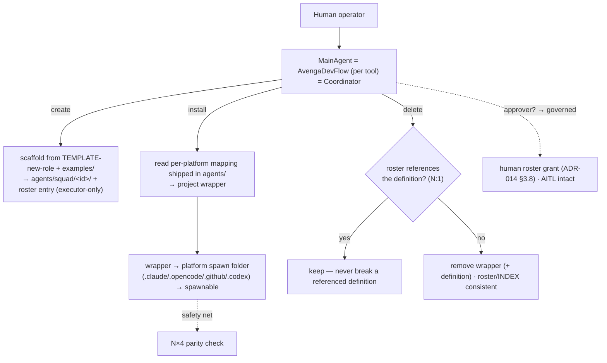

<!--
  LANGUAGE POLICY (§3.15): YAML keys, status enums, IDs stay in English
  (the schema). Section headings (##) and prose follow the project's
  content_language (en, devflow/LANGUAGE; ADR-012).
  `AITL-*-Approval` codes are never translated.

  ⚠️ AITL-US-Approval (§2.6, §3.0): draft until a Functional Analyst records
  it. Only then decompose into candidate functional Bolts.

  ⚠️ Manifest v5 (§3.12, G33): manifest JSON in
  devflow/metrics/user-stories/US-025-mainagent-agent-lifecycle.json —
  created with this document (schema_version "5.0"; story_points 8 proposed).

  ⚠️ PREREQUISITE — ADR-013 (agent lifecycle governance): this US
  operationalizes the lifecycle whose GOVERNANCE (scoping G07: executor =
  living data, approver = governed) is fixed by ADR-013. Do NOT approve
  US-025 before AITL-ADR-Approval on ADR-013 (G13/G27) — ADR-013 is DRAFT,
  revised to cite ADR-014 (accepted 2026-08-24: the roster is the
  enablement), pending its re-approval. Depends on US-022/023/024 delivered
  and on the per-platform install mapping shipped in the kit
  (US-023.BOLT-003 / VERIFICATION.md).
-->

# US-025 — MainAgent agent lifecycle (the Coordinator's operational capability)

| Field | Value |
|-------|-------|
| **Unit** | v5.1 — DevFlow Agents family (operation) |
| **ADRs** | ADR-007 (identity), ADR-014 (precept + roster enablement), **ADR-013** (lifecycle governance — base), ADR-004 (kit partition) |
| **Status** | approved (2026-08-24 — ADR-013/014 accepted, prerequisites satisfied) |
| **Story points** | 8 (confirmed) |

**As an** adopting team, **I want** each of the four MainAgents — AvengaDevFlow on
Claude Code, GitHub Copilot, OpenCode and Codex, which *are* the **Coordinator** on
their platform — to **install, create and delete DevFlow Agents**: take a definition
from `agents/`, project it into the platform's wrapper and place it in that tool's
spawn folder so the agent becomes spawnable; scaffold a new agent from
`TEMPLATE-new-role`; and remove one safely — **so that** each team builds and operates
its own squad without a manual build step, entirely **within the governed flow** (the
producer side of the Actor, US-022/023, made operational).

## 1. Acceptance criteria

- `AC-1` — **Given** the four platform MainAgents, **When** the capability lands,
  **Then** the install/create/delete lifecycle lives **only in the four MainAgents**
  (the Coordinator) as a **byte-identical shared body** (four-agent sync + G-count via
  US-016); **role agents carry none of it** — they stay focused executors/approvers.
- `AC-2` (install) — **Given** a live DevFlow Agent definition (`agents/squad/<id>/`),
  **When** the MainAgent installs it, **Then** it projects the platform wrapper and
  places it in that tool's spawn folder (`.claude/agents/`, `.opencode/agents/`,
  `.github/agents/`, `.codex/agents/`) so the agent is **spawnable**.
- `AC-3` (create) — **Given** `TEMPLATE-new-role` and the `agents/examples/`
  references, **When** a team asks for a new agent ("create me a reviewer agent"),
  **Then** the MainAgent scaffolds the definition from the template + the closest
  example **into `agents/squad/<id>/`** (structured fields, authority never in
  prose; the shipped examples are copied, never edited in place), adds it to the
  roster as an **executor-only draft** (`actors/`, US-024 — the approver authority
  fields are the human's act, ADR-014 §3.8) and installs it into the platform's
  spawn folder.
- `AC-4` (delete) — **Given** an agent to remove, **When** the MainAgent deletes it,
  **Then** it first **checks the roster** — if any actor references the `definition`
  (reuse N:1, US-024), it never breaks it — then removes the wrapper (and the
  definition when unreferenced), keeping the roster + INDEX consistent.
- `AC-5` (governance — ADR-013) — **Given** the lifecycle, **When** it runs, **Then**
  executor install/create/delete is **living data** (operational config — no Bolt, no
  approval, like a roster update); **approver** creation/authority change is
  **governed** (the human's roster configuration act, ADR-014 §3.8 — the
  authority fields are human-authored, US-024); installing an
  already-enabled approver's wrapper is **execution of that governed act**.
- `AC-6` (AITL intact) — **Given** an installed agent, **When** it is available,
  **Then** installing it **never enables approval** by itself: an approver still
  requires the human-authored roster grant (ADR-014 §3.8) and the safe default holds (no AI-signed
  approval under absent/invalid config).
- `AC-7` (per-platform) — **Given** the four MainAgents, **When** they carry the
  lifecycle, **Then** only the **destination folder + the wrapper format** differ per
  platform (the per-platform preamble); the lifecycle logic itself is byte-identical.
- `AC-8` (deterministic projection, docs-primary) — **Given** the projection, **When**
  the MainAgent installs, **Then** it reads the **per-platform install mapping shipped
  in the kit's `agents/` docs** (the contract + the field-level per-platform mapping —
  it must be self-contained in the kit, not only in `tools/`) and projects the wrapper
  itself (the primary, self-sufficient path); the **N×4 parity check is the safety
  net**; and a **compiled generator** (`devflow/bin/`, distributed per US-017) is an
  **optional acceleration**, never a requirement of the primary path.
- `AC-9` (kit-only, self-contained) — **Given** the deliverable, **When** it lands,
  **Then** the lifecycle instructions live in the kit's four MainAgents (ADR-004
  kit-only); the kit files carry **no maintenance-partition references** (`US-`/`ADR-`/
  `DISC-`/`BOLT-`); the G-count invariant is preserved.
- `AC-10` (MainAgent identity) — **Given** the four platform files, **When** a reader
  opens any, **Then** it states explicitly that the **MainAgent is AvengaDevFlow — one
  per tool** (Claude Code, GitHub Copilot, OpenCode, Codex) — and **that MainAgent IS
  the Coordinator** (the orchestrator that carries the lifecycle). The equivalence
  **MainAgent ≡ AvengaDevFlow (per tool) ≡ Coordinator** is stated **inline as a
  synonym** (no new glossary term), consistent and byte-sync across the four.

> ACs are verifiable functional criteria only; the non-functional constraints
> (approval-integrity, independence, safe-default, lifecycle-governance) live in
> ADR-014 and ADR-013.

## 2. Bolts

> Tentative decomposition (detailed as candidate Bolts after `AITL-US-Approval`).
> **ADR-013 is a prerequisite, NOT a Bolt** (ADRs have no Bolt) — created and approved
> first, cited as the governing source.

| # | Bolt | Type | Layer | Description | Est. |
|---|------|------|-------|-------------|------|
| 1 | US-025.BOLT-001 | functional | Kit docs (4 agents) | The shared install/create/delete lifecycle body in the four MainAgents (byte-sync + G-count, US-016) + the MainAgent-identity clause (AC-10) + the governance clauses from ADR-013 (executor=living data / approver=governed) | 3–4h |
| 2 | US-025.BOLT-002 | functional | Kit docs (4 agents) | The per-platform specifics: destination spawn folder + wrapper format per tool; the docs-primary projection wiring (reads the shipped per-platform mapping) with the parity-net + optional-generator note | 3h |
| 3 | US-025.BOLT-003 | functional | Kit docs + tooling | Delete-safe: the roster reference check (N:1) + INDEX/roster consistency on install/delete | 2–3h |
| 4 | US-025.BOLT-004 | functional | Smoke | Pilot (Claude Code): a MainAgent installs a definition → agent spawns → is deleted, roster consistent — the lifecycle proven end-to-end | 2h |
| 5 | US-025.BOLT-005 | functional | Kit docs (GUARDRAILS) | Update the kit GUARDRAILS with the agent-lifecycle rule (executor=living data / approver=governed; the G07 scoping) **citing ADR-013**; count invariant preserved | 2h |

> Plausibility (§2.6): 8 SP → 5 Bolts. One coherent capability (lifecycle → per-platform
> → delete-safe → smoke → the guardrail), each independently demonstrable.

## 3. Business rules

| # | Rule | Condition | Action |
|---|------|-----------|--------|
| 1 | Coordinator-only | The lifecycle lands | Lives only in the four MainAgents; role agents carry none of it |
| 2 | Executor = living data | Install/create/delete an executor | No Bolt, no approval — operational config (ADR-013), like a roster update |
| 3 | Approver = governed | Create/change an approver's authority | The human's roster configuration act (ADR-014 §3.8 — `modes`/`approves` are human-authored, never self-enabled); never silent |
| 4 | Docs-primary projection | The MainAgent installs a wrapper | Read the per-platform mapping shipped in `agents/`; parity as the net; compiled generator optional (US-017) |
| 5 | Delete-safe | Remove a definition | Check the roster (reuse N:1) — never break a referenced definition |
| 6 | AITL intact | An agent is installed | Installing ≠ enabling approval; safe default holds |
| 7 | Bounds | The lifecycle operates | Never edit the kit's shipped templates in place; never act outside the definition/roster system (ADR-013) |
| 8 | Self-contained | The kit files change | No maintenance-partition references; G-count preserved (US-016) |
| 9 | MainAgent identity | The four agents state who they are | MainAgent ≡ AvengaDevFlow (per tool) ≡ Coordinator — inline synonym, byte-sync |
| 10 | Ship model | The kit is delivered | Only the four MainAgents + the definitions/templates/mapping ship; **no pre-built role wrappers** — the Coordinator installs every wrapper in the adopting project (ADR-013 §3.9) |

## 4. User flows

## 5. Impact

- **Creates/changes:** the install/create/delete lifecycle in the kit's four MainAgents
  (byte-sync) + the MainAgent-identity clause; the per-platform specifics; the
  delete-safe roster check; the GUARDRAILS agent-lifecycle rule (citing ADR-013).
- **Depends on:** **ADR-013** (lifecycle governance — the base; draft/parked, US-025
  approval waits for its AITL-ADR-Approval), US-022/023/024 (the actor concept /
  agent definitions / roster; the wrapper generator is maintainer-side, the
  compiled one optional per US-017), ADR-007/008 (identity + precept), and the
  **ship model**
  (ADR-013 §3.9: the kit ships only the four MainAgents + the
  definitions/templates/mapping — no pre-built role wrappers) with the
  **per-platform install mapping self-contained in the kit** (`agents/` —
  US-023.BOLT-003 / VERIFICATION.md; no reference to the maintainer-only `tools/`).
  Optionally **US-017** (ships the compiled generator as an optional acceleration,
  never a requirement of the docs-primary path).
- **Makes operational:** the DevFlow Agents family — teams build and run their squad
  (the Coordinator installs/creates/deletes agents), within the governed flow
  (Option A — no autonomous initiative; the human governs at every checkpoint).
- **Does NOT include:** the agent definition contract/templates (US-023); the roster
  (US-024); the conductor/engine evaluation (separate DISC).
- **Risk:** hand-projection drift if the mapping isn't precise/shipped — controlled by
  the shipped per-platform mapping + the N×4 parity net; silent approver enabling —
  controlled by rule #3 (the human-authored roster grant is the only door,
  ADR-014 §3.8).

## 6. SDLC tool alignment

Maintainer-internal (the methodology dogfoods itself); no external tracker.

## 7. AITL-US-Approval

> **Avenga DevFlow §2.6, §3.0.** Approved 2026-08-24 (`AITL-US-Approval`,
> `human:eugenio.serrano`, functional_analyst — recorded in the frontmatter
> `review:` block). Prerequisites verified at approval: ADR-013 + ADR-014 accepted
> (2026-08-24), US-022/023/024 delivered, the per-platform mapping shipped.
> Decomposition into the 5 candidate Bolts is authorized.

## 8. Manifest creation (mandatory)

> ⚠️ **MANDATORY** — create
> `devflow/metrics/user-stories/US-025-mainagent-agent-lifecycle.json`
> (`schema_version "5.0"`; the `us` block; `story_points: 8`; empty `bolts` /
> `checkpoint_approvals`). Validates against `manifest-v5-us.schema.json`.
