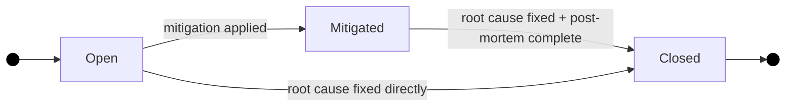

# Incidents

**Methodology version:** 5.0

## Purpose

This folder records **production incidents** (`INC-NNN`, severity `sev1`–
`sev4`) — any event that causes degradation or outage of a service visible
to end-users or that breaches an SLO. Each incident gets a **blameless
post-mortem** that captures root cause, timeline and corrective actions.

Incidents provide the incident/recovery data feeding three DORA metrics
(Avenga DevFlow §3.7.1, §5.12):

- **D3 Failed Deployment Recovery Time** — recovery time from a deployment
  failure that needed immediate intervention.
- **D4 Change Fail Rate** — deployment-caused incidents counted against
  the percentage of deployments that caused a failure.
- **D5 Deployment Rework Rate** — production-fix deployments that are
  unplanned work to address a user-facing issue.

DORA is computed at **deployment level** from CI/CD deployment events joined
to deployment-caused incidents — the incident document links the data; it
does not compute the metrics itself (§3.7.1). Incidents link to the affected
deployment and originating Bolts **without forcing single-model attribution**
(§5.12).

---

## What belongs here?

- Every incident with user or SLO impact → an `INC-NNN`.
- Blameless post-mortem (root cause, timeline, actions).
- Links to the deployment that introduced the failure and the originating
  Bolt (`caused_by_bolt`), when identifiable.
- Gate-gap analysis: what specific gap in gates / AREV / DoR / DoD allowed
  the failure through.

## What does NOT belong here?

- Non-prod or pre-prod bugs → `bugs/` (`BUG-NNN`). A production incident
  *may produce* a BUG once the root cause is confirmed, but the incident
  timeline and response live here.
- Identified but unmaterialised risks → `risks/` (`RISK-NNN`).
- Long-term remediation decisions → `adrs/` (`ADR-NNN`, linked back here).
- DORA computation or deployment metrics → computed from CI/CD + incidents
  (§3.7.1); the Bolt manifest carries **no** DORA or incident data (§3.12).

---

## Naming convention

```
INC-NNN-short-description-in-kebab-case.md
```

- `INC` — Fixed prefix.
- `NNN` — 3-digit sequential number.

---

## Severity levels

| Severity | Meaning | Expected response |
|----------|---------|-------------------|
| **sev1** | Total outage / data loss / security breach | Immediate war-room, all-hands |
| **sev2** | Major feature unavailable, significant user impact | Immediate response, dedicated team |
| **sev3** | Degraded service, partial impact, workaround exists | Response within business hours |
| **sev4** | Minor issue, cosmetic, minimal user impact | Scheduled fix |

---

## Lifecycle



| Status | Meaning |
|--------|---------|
| **open** | Incident detected, investigation and/or mitigation in progress. |
| **mitigated** | User impact resolved (hotfix, rollback, feature flag), root cause analysis pending. |
| **closed** | Root cause identified, post-mortem complete, derived actions created. |

---

## Rules

1. **Blameless post-mortem** — focus on process gaps, not people. Every
   closed INC must have a completed post-mortem section.
2. **Traceability** — an INC with `caused_by_bolt = US-NNN.BOLT-NNN` links
   the incident to the originating Bolt and the deployment that introduced
   the failure. The link is **referential** — the Bolt manifest
   deliberately carries no DORA or incident data (§3.12); deployment-caused
   incident data feeds D3/D4 and production-fix deployments support D5
   from CI/CD and `incidents/` (§3.7.1, §5.12).
3. **Derived actions become Bolts** — every corrective action is tracked as
   a Bolt referenced in the INC: a **non-functional Bolt with
   `work_category: hardening`** under `US-000-non-functional.md` (or the
   affected feature US when the correction is functional). New gates or
   prompt fixes also become Bolts.
4. **Gate-gap analysis is mandatory** — every post-mortem must answer:
   *"Why did the gates not catch it?"* This drives continuous improvement
   of quality gates (§3.7.4: if D4 rises, tighten gates and consider
   targeted REV/AREV).
5. **No single-model attribution** — do not force `model_version` /
   `code_origin` onto the incident. If the originating Bolt's code was
   AI-generated, that attribution is a diagnostic join at the dashboard
   level (§3.7.1, §5.12), never a mandated incident field.

---

## DORA connection (D3 / D4 / D5)

Every incident document links the data the DORA dashboard needs; the
metrics are computed at deployment level:

| DORA metric | What the incident provides | Template field |
|-------------|---------------------------|----------------|
| **D3 Failed Deployment Recovery Time** | Detection → resolution timestamps for recovery duration | `detected_at`, `resolved_at` |
| **D4 Change Fail Rate** | Deployment-caused flag + deployment link | `deployment_caused`, `deployment_ref` |
| **D5 Deployment Rework Rate** | Whether the fix was unplanned production rework | `unplanned_rework` |
| Origin | The Bolt whose change was implicated | `caused_by_bolt` |

See §3.7.1 and §3.7.3 of the methodology for full definitions. Recovery
time (`detected_at` → `resolved_at`) feeds D3 only for **deployment-caused**
incidents; non-deployment incidents show recovery time for operational
visibility, not as a DORA input.

---

## Recommended structure (per incident)

1. **Summary** — 1–2 sentences: what failed, how it was detected, impact.
2. **Timeline** — Chronological events from detection to resolution (UTC).
3. **Impact** — Users affected, duration, SLOs breached.
4. **Root cause** — Technical cause + process cause. Blameless.
5. **Gate-gap analysis** — Specific gap in gates / AREV / DoR / DoD.
6. **Actions** — Derived Bolts with owners.
7. **Origin Bolt link** — `caused_by_bolt` reference (referential, not a
   manifest update).

### Diagrams and visual elements

Use **Mermaid** for all diagrams, charts and any other visual element
(no ASCII art or embedded images).

---

## Document index

See **[INDEX.md](INDEX.md)** for the full listing and
**[TEMPLATE-INCIDENT.md](TEMPLATE-INCIDENT.md)** as the starting point for a
new incident.

---

## Language

YAML keys, status enums, IDs, and template section headings stay in **English**
(the schema). All prose — descriptions, context, rationale, findings — goes in
the project's `content_language`, declared in [`../LANGUAGE`](../LANGUAGE)
(see §3.15).
