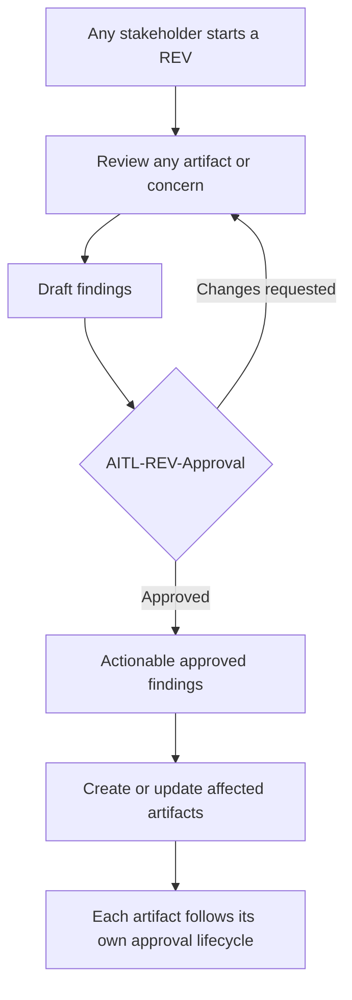
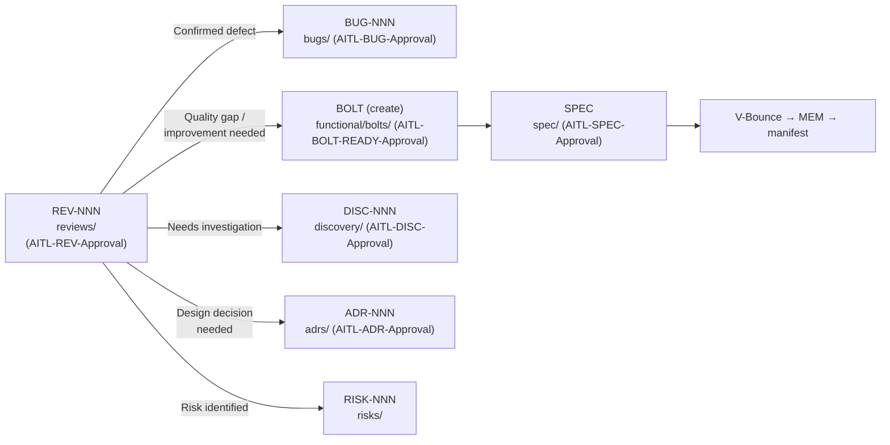

# Reviews (Open Structured Examination)

**Methodology version:** 5.1

## Purpose

This folder contains **open, structured examinations** (`REV-NNN`) of any
functional or non-functional characteristic or artifact: User Stories, Bolts,
ADRs, SPECs, code, tests, architecture, security, performance, processes,
risks, documentation — or any other relevant concern (§2.14).

A Review may be initiated by **any stakeholder or team member**, regardless
of role.

> **Cardinal rule (§3.0):** the reviewer reads the **diff and the test
> evidence**, not only the agent's summary. "AI says it's fine" is not
> approval — always inspect the actual code changes and evidence.

---

## Optional, but mandatory once triggered

A Review is **never a mandatory stage** of the standard E2E flow (§2.14).
Each stakeholder is responsible for initiating one when additional scrutiny,
evidence, or a second perspective is warranted. **Once initiated, however,
its approval and traceability rules are mandatory:**

- Findings remain **draft** and cannot be used as governed input until a
  qualified human records `AITL-REV-Approval`.
- `AITL-REV-Approval` validates the Review and its findings (scope,
  supporting evidence, clarity, classification, actionability). It does
  **not** approve any downstream artifact.
- Every artifact created or updated from an approved finding follows its
  **own lifecycle and applicable AITL approval**. If a finding requires a
  code-related change, that change must be authorized by an **approved
  Bolt** before a SPEC or V-Bounce can begin.
- A REV closes only when **all findings are routed** (operational folder
  convention — §2.14 defines findings and approvals, not a closure status).



---

## Reviews vs. Discovery vs. Adversarial Review

| Dimension | Discovery (`DISC`) | Review (`REV`) / Adversarial Review (`AREV`) |
|-----------|--------------------|----------------------------------------------|
| Starting point | A material unanswered question **before** a US or Bolt is defined or refined | An existing project artifact, implementation, characteristic, or concern to inspect |
| Primary purpose | Learn, gather evidence, reduce uncertainty | Evaluate, challenge, identify findings |
| Typical subjects | External APIs, unfamiliar libraries, legacy behavior, technology options, data/integration constraints | Documentation, code, tests, USs, Bolts, ADRs, SPECs, architecture, security, performance, process |
| Governed output | Approved evidence, assumptions, limits, conclusions | Approved findings; AREV exposes them only after its approved Verdict |
| AITL governance | `AITL-DISC-Approval` | `AITL-REV-Approval`, or the three sequential AREV phase approvals |
| Downstream effect | Informs analysis and the creation/refinement of governed artifacts | May create or update any governed artifact |

> An AREV is a **specialized adversarial form of Review** (§2.13) — it
> follows the Critique → Defense → Verdict protocol with its own sequential
> phase approvals (§2.15). AREV is **optional for all risk classes**:
> stakeholder-triggered, never automatic.

---

## What goes here

- **Architecture audits** — does the implementation match the ADRs?
- **Code reviews** (formal, beyond PR-level) — patterns, naming, layering,
  SOLID, error handling.
- **Test quality reviews** — coverage, test design, flaky tests, missing
  edge cases.
- **User Story / AC reviews** — are the stories well-formed? Do ACs match
  the domain model?
- **Security audits** — OWASP, dependency vulnerabilities, secrets handling.
- **Performance audits** — load tests, profiling, resource consumption.
- **Documentation audits** — are READMEs, ADRs, specs up to date?
- **Compliance reviews** — do we meet the standards we committed to?
- **DevFlow reviews** — is the team following the methodology? (AITL
  checkpoints, manifest quality, DORA reporting)

## What does NOT go here

- **Material unknown investigation** — `discovery/` (`DISC-NNN`).
- **Confirmed defects** — `bugs/` (`BUG-NNN`). A review *surfaces*
  bugs; the bug itself is tracked there.
- **Architectural decisions** — `adrs/` (`ADR-NNN`). A review may
  recommend an ADR; the ADR lives there.
- **Adversarial AI-vs-AI debates** — `adversarial-reviews/`
  (`AREV-NNN`). Those follow a different protocol (Critique, Defense,
  Verdict) with their own sequential phase approvals.

---

## Naming convention

```
REV-NNN-short-description-in-kebab-case.md
```

---

## How review findings route downstream (after approval)

A review **never fixes anything**. It only identifies and classifies.
Every approved finding must be routed to the right artifact:



> **Bolt-first rule (T10):** When a review finding requires code changes, a
> Bolt **must** be created first — never REV → SPEC directly. The SPEC then
> references that Bolt (`bolt` field mandatory). Every downstream artifact
> follows its own lifecycle and AITL approval; nothing is implied by
> `AITL-REV-Approval`.

### Quick classification guide

| Finding type | Routes to | Example |
|-------------|-----------|---------|
| Runtime bug or incorrect logic | `bugs/` BUG-NNN (after AITL-BUG-Approval) | "Thread.Abort() throws in .NET 5+" |
| Quality gap, improvement needed | `functional/` → BOLT → `spec/` SPEC | "Missing validation on endpoint X" |
| Unknown area needing study | `discovery/` DISC-NNN | "We don't know how module Y behaves under load" |
| Pending technical decision | `adrs/` ADR-NNN | "Should we use distributed or local cache?" |
| Threat to the project | `risks/` RISK-NNN | "Dependency on API without defined SLA" |
| Everything correct | Documented in the REV, no further action | "Audit found no actionable findings" |

---

## Connection to quality gates (§3.6)

Reviews are one of the mechanisms that enforce quality gates. The
methodology defines two gate families:

- **Classic gates** — linter, build, unit tests, integration tests,
  security scan, coverage threshold.
- **AI-native gates** — prompt-injection scan, secret-leak, hallucination
  lint, IP/license provenance, PII/DLP, dependency-confusion, test-first
  evidence, behavioral reproducibility, Bolt-manifest validation.

A review should verify that **all applicable gates passed green** before
approving. If a gate failed and was waived, the review must confirm that a
waiver ADR exists with reason, owner, compensating control and expiry date
(§3.6). Applicable gates end `pass` or approved `waived`; `n/a` requires a
reason in the approved SPEC.

> **Rule (§3.6):** `fail` blocks merge, `AITL-MEM-Approval`, Bolt acceptance
> and promotion.

---

## Severity legend

| Category | Meaning |
|----------|---------|
| **Compliant** | Implemented correctly per ADR / standard |
| **Documented deviation** | Justified difference, recorded in MEM |
| **Minor gap** | Inconsistency without functional impact, reduces quality |
| **Major gap** | Problem that can cause runtime errors or security exposure |

**Mapping to BUG `severity` when a finding becomes a defect.** REV, AREV and
BUG use three different vocabularies, and the BUG one **routes its approval**
(§2.16), so the translation is explicit rather than left to judgement:

| REV category | AREV severity | BUG `severity` |
|--------------|---------------|----------------|
| Major gap (security exposure, data loss, outage) | 🔴 | `critical` or `high` — `critical` when the recommended approver for a non-functional BUG is an Architect/Tech Lead (guidance, never a gate — any qualified team member, the author included, may approve) |
| Major gap (runtime error, no workaround) | 🔴 / 🔶 | `high` |
| Minor gap (works, degrades quality or UX) | 🔶 / ⚠️ | `medium` |
| Minor gap (cosmetic, no functional impact) | ⚠️ | `low` |
| Compliant / Documented deviation | ✅ | no BUG — recorded in the REV or the MEM |

The reporter proposes the severity; the approver confirms or corrects it at
`AITL-BUG-Approval`, because for a non-functional BUG that value recommends who
should approve it (guidance, never a gate — any qualified team member, the
author included, may record it).

---

## Lifecycle

| Status     | Meaning |
|------------|---------|
| **draft**  | Review in progress; findings not yet usable as governed input. |
| **approved** | `AITL-REV-Approval` recorded; findings are actionable. |
| **closed** | All findings routed to BUG / BOLT→SPEC / DISC / ADR / RISK. No pending actions. |

`INDEX.md` reflects status: Draft / Approved / Closed (all routed).

---

## Recommended structure

1. **Title and metadata** — ID, scope, date, author, methodology.
2. **Artifacts reviewed** — files, modules, systems evaluated.
3. **Findings** — categorized by severity (Compliant / Deviation / Minor / Major).
4. **Summary** — overall state in 2-3 sentences.
5. **Action plan** — prioritized corrections with routing destination.
6. **Conclusions** — can we proceed? Is another review cycle needed?

Diagrams in **Mermaid** (mandatory).

---

## Relations to other folders

| Folder | Relation |
|--------|----------|
| `bugs/` | Confirmed defects found in review (after AITL-BUG-Approval) |
| `spec/` | Quality gaps become implementation specs (Bolt-first) |
| `discovery/` | Material unknowns trigger investigations |
| `adrs/` | Design decisions surfaced during review |
| `risks/` | Threats identified during review |
| `adversarial-reviews/` | AREV is a specialized adversarial form of Review — optional, stakeholder-triggered |
| `memory/` | MEM documents justified deviations found in reviews |
| `functional/` | US / AC quality is a reviewable artifact |

---

## AITL-REV-Approval

The Review's own checkpoint is **`AITL-REV-Approval`** (§2.14, §3.0) — a
qualified human validates scope, evidence, clarity, classification and
actionability of the findings. This is **separate from the V-Bounce
checkpoint**: V-Bounce output is approved at **`AITL-MEM-Approval`** (by the
Dev-validator who executed the Bolt, §3.0), which is recorded in the Bolt
manifest's `checkpoint_approvals[]` — not in the REV. A REV and a V-Bounce
approval are different events; never conflate them.

| Field | Value |
|-------|-------|
| **review.reviewers** | [qualified human(s) designated for the Review] |
| **review.decision** | approved / changes_requested / rejected |
| **review_ready_at** | `YYYY-MM-DDTHH:mm:ss±HH:MM` |
| **review.started_at** | `YYYY-MM-DDTHH:mm:ss±HH:MM` |
| **review.decided_at** | `YYYY-MM-DDTHH:mm:ss±HH:MM` |
| **Findings** | [findings or acknowledged_without_comment + reason] |

The **V-Bounce first-review approval rate** (§3.7.2) is computed from
`checkpoint_approvals[]` in the Bolt manifest, not from REV documents.

---

## Index

See **[INDEX.md](INDEX.md)** for the full listing.

---

## Language

YAML keys, status enums, IDs, and template section headings stay in **English**
(the schema). All prose — descriptions, context, rationale, findings — goes in
the project's `content_language`, declared in [`../LANGUAGE`](../LANGUAGE)
(see §3.15).
