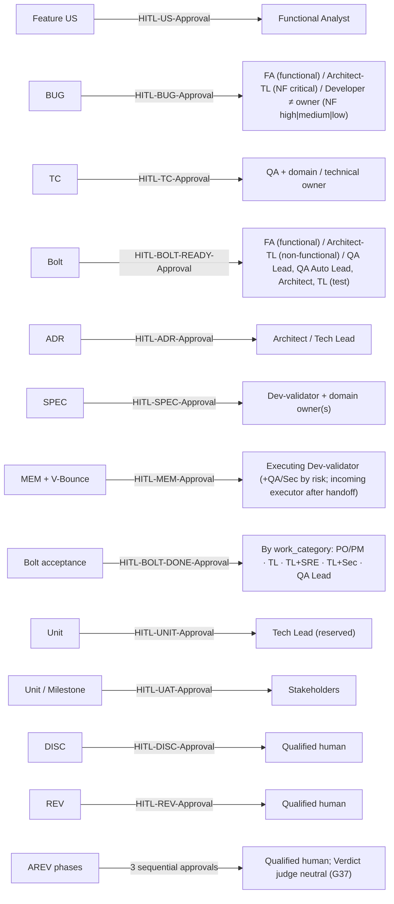

# REV-001 — HITL checkpoint and role-routing inventory

| Field           | Value |
|-----------------|-------|
| **Scope**       | The complete HITL checkpoint map of the installed methodology (v4.2) and the role permissions each one carries |
| **Methodology** | Static inspection / grep analysis of the normative documentation |
| **Criteria**    | The methodology itself (§3.0, §2.16, §3.3, §3.11, §3.7.3), the GUARDRAILS checkpoint map, and the ONBOARDING role map — consistency across the three, plus actionability of every role requirement |

---

## 1. Purpose

This Review exists to answer one question, fully and in one place: **who may
approve what at every HITL checkpoint, and under which conditions?** The
trigger was the G29 "solo-maintainer" finding surfaced during the acceptance
of `US-000.BOLT-001`: the team needs the complete checkpoint × role map before
deciding how to handle role availability in small teams. This Review is
**inventory + classification** — it changes nothing; findings remain draft
until `HITL-REV-Approval` and then route to their own artifacts.

---

## 2. Artifacts reviewed

| Artifact | Files | Notes |
|----------|-------|-------|
| HITL Charter — core and conditional checkpoint tables | `devflow/avenga-devflow/Avenga-DevFlow.md` §3.0 (lines 1356–1534) | 10 core + 5 conditional identifiers; canonical naming rule; no-inheritance rules; operating rules |
| BUG nature and severity routing | `Avenga-DevFlow.md` §2.16 (lines 1263–1282) | functional vs non-functional; `severity: critical` route; the "other than author" exception |
| Review budgets, escalation, coverage targets | `Avenga-DevFlow.md` §3.0 (lines 1628–1699) | risk-class budgets; 4h/8h/24h escalation; 100% coverage targets per Bolt type |
| Risk-class approver counts + handoff | `Avenga-DevFlow.md` §3.3 (lines 2080–2095, 2160–2165) | 1/1/2/3 min approvers at `HITL-MEM-Approval`; incoming-executor rule |
| Acceptance routing by work category | `Avenga-DevFlow.md` §3.11 (lines 2769–2787) | `feature`/`refactor`/`infra`/`hardening`/`debt`/`qa_automation` → approver + demo form |
| Guardrails checkpoint map and G29 | `devflow/GUARDRAILS.md` (lines 24–33, 58, 373–402) | enforcement projection of the same routing |
| Role reading order and glossary | `devflow/ONBOARDING.md` (§2, §4, §5) | who reads what; role vocabulary |

---

## 3. Severity legend

| Category | Meaning |
|----------|---------|
| **Compliant** | Implemented correctly per ADR / standard |
| **Documented deviation** | Justified difference, recorded in MEM |
| **Minor gap** | Inconsistency without functional impact, reduces quality |
| **Major gap** | Problem that can cause runtime errors or security exposure |

---

## 4. Findings

### 4.1 — The checkpoint × role inventory (F-01, the core deliverable)

#### F-01 [Compliant] — Complete inventory: 15 HITL checkpoints and their role permissions

The methodology defines **10 core mandatory checkpoints** (none skippable when
applicable) and **5 conditional ones** (mandatory once triggered). The table
below is the full map extracted from §3.0, cross-checked against the
GUARDRAILS checkpoint map (lines 24–33) — both agree on every row.

**Core checkpoints:**

| Identifier | Applies to | Approver(s) — who may approve | What the decision validates | Notes / limits |
|------------|------------|-------------------------------|-----------------------------|----------------|
| `HITL-US-Approval` | Feature User Story (never US-000) | **Functional Analyst** | US + ACs + source traceability accurately represent the business need | Confirms `story_points`; only then decomposable into functional Bolts; re-applies on material US changes |
| `HITL-BUG-Approval` | Every BUG, before its dedicated Bolt exists | **Functional Analyst** (functional BUGs); **Architect or Tech Lead** (non-functional, `severity: critical`); **a Developer other than the BUG's own `owner`** (non-functional, `severity: high\|medium\|low`) | Real, evidenced defect; clear expected vs actual; correct classification and parent route | Never authorizes code; self-approval never permitted (G29); severity never downgrades the `critical` route |
| `HITL-TC-Approval` | Every Test Case, before use as verification contract or Test Bolt parent | **QA + Functional Analyst/domain owner** (functional expectations); **QA + applicable technical owner** (non-functional expectations) | TC independently derived from approved intent; complete, executable, no implementation-derived expected results | Two roles required (QA **and** owner); approval never inherited from US/Bolt/code |
| `HITL-BOLT-READY-Approval` | Every Bolt (3 types) | **Functional Analyst** (functional); **Architect or Tech Lead** (non-functional — except the dedicated Bolt of a non-functional BUG mirrors its BUG's severity routing, §2.16); **QA Lead, QA Automation Lead, Architect, or Tech Lead** (test) | Valid, appropriately sliced outcome under the correct parent, no implementation detail (G09) | Includes DoR; authorizes SPEC preparation, not execution; one per Bolt, never inherited |
| `HITL-ADR-Approval` | Every ADR | **Architect / Tech Lead** | ADR complete, technically sound, accepted as governing decision | Makes the ADR immutable; needed for waivers, gate overrides (G21) and any SPEC/V-Bounce that uses the ADR |
| `HITL-SPEC-Approval` | One canonical SPEC per Bolt + every material revision | **Dev-validator + applicable domain owner(s)** | Plan complete, grounded in approved governed artifacts and the real repository, feasible, testable, safe | Independent of `HITL-BOLT-READY-Approval`; authorizes the code-run / V-Bounce (G14) |
| `HITL-MEM-Approval` | Every V-Bounce + its unique MEM | **The Dev-validator who executed the Bolt** (+ QA *or* Sec for `high` risk; + QA **and** Sec for `critical`; + domain as needed) | MEM faithfully accounts for the V-Bounce; direct inspection of diff, tests, gates, evidence; output correct, safe, aligned with SPEC/ADRs | Min approvers by risk: 1 / 1 / 2 / 3; after a recorded handoff the **incoming** executor reviews the pending MEM — the outgoing cannot; approved MEM → Bolt `Development Completed` |
| `HITL-BOLT-DONE-Approval` | Bolt acceptance (DoD) | **PO/PM** (`feature`); **routed technical owner** by work_category (non-functional); **QA Lead or QA Automation Lead** (`test`) | The approved V-Bounce output satisfies the Bolt's completion evidence | Work-category routing below; a `feature` Bolt without PO sign-off is **not Done** regardless of green gates |
| `HITL-UNIT-Approval` | Unit, per named environment | **Tech Lead** | Unit approved as a cohesive deliverable | **Reserved** — full governance pending the `units/` folder; staging UNIT precedes UAT |
| `HITL-UAT-Approval` | Unit / Milestone sign-off | **Stakeholders** | Unit meets business ACs | Requires staging `HITL-UNIT-Approval` first; unblocks production UNIT |

**Conditional checkpoints (mandatory once the mechanism is initiated):**

| Identifier | Applies to | Approver(s) | What the decision validates |
|------------|------------|-------------|-----------------------------|
| `HITL-DISC-Approval` | Discovery | **Qualified human designated for the research domain** | Investigation sufficiently evidenced, explicit about limits, reliable enough to guide backlog/architecture |
| `HITL-REV-Approval` | Review | **Qualified human designated for the Review** | Findings evidence-based, clear, correctly classified, actionable |
| `HITL-AREV-CRITIQUE-Approval` | AREV phase 1 | **Qualified human designated for the AREV** | Critique rigorous, relevant, supported |
| `HITL-AREV-DEFENSE-Approval` | AREV phase 2 | **Qualified human designated for the AREV** | Defense addresses the approved Critique completely, with evidence |
| `HITL-AREV-VERDICT-Approval` | AREV phase 3 | **Qualified human designated for the AREV** | Verdict fairly adjudicates and produces actionable findings; the Judge's model must differ from both implementor and Challenger (G37) — with only two models available, a qualified human arbitrates |

**Cross-cutting role-routing rules that complete the picture:**

1. **Routing by Bolt type** — functional → Functional Analyst; non-functional → Architect/Tech Lead; test → QA Lead / QA Automation Lead / Architect / Tech Lead. No approval is inherited from a related artifact (§3.0).
2. **`HITL-BOLT-DONE-Approval` routing by `work_category`** (§3.11): `feature` → PO/PM (business demo); `refactor` → Tech Lead (diff + test parity); `infra` → Tech Lead + SRE (deployment evidence + perf-smoke); `hardening` → Tech Lead + Sec (fixed control + regression test); `debt` → Tech Lead (metric improvement); `qa_automation` → QA Lead / QA Automation Lead (TC automated with evidence).
3. **Minimum approvers at `HITL-MEM-Approval` by risk class** (§3.3): `low` → 1 (executing Dev-validator); `medium` → 1; `high` → 2 (Dev-validator + QA *or* Sec); `critical` → 3 (Dev-validator + QA + Sec). Risk is assigned at `HITL-BOLT-READY-Approval`, may be escalated at any review, never reduced after the first MEM approval without formal re-review.
4. **No-inheritance rules** — every checkpoint is recorded separately with name, role, timestamps and evidence; a US approval never implies Bolt/TC/SPEC/MEM approvals, and vice versa (G18, G24, G26, G27).
5. **Coverage targets by Bolt type** (§3.7.3): `functional` → US + BOLT-READY + SPEC + MEM + BOLT-DONE (+ BUG when applicable) = **100%**; `non-functional` → BOLT-READY + SPEC + MEM + BOLT-DONE (+ BUG) = **100%**; `test` → TC + BOLT-READY + SPEC + MEM + BOLT-DONE = **100%**. Plus `HITL-ADR-Approval` for every applicable ADR and all conditional approvals for any DISC/REV/AREV used. Unit-level checkpoints are not part of per-Bolt coverage.
6. **Review-time budgets** (recommended, §3.0): SPEC/MEM/acceptance/promotion/UAT scale with risk (`low` 5/15/5/5/15 min … `critical` 30/90/30/30+ADR/90). US/BUG/TC/ADR/DISC/REV/AREV budgets are project-defined.
7. **Handoff** (§3.3): one active executor per Bolt; after a recorded handoff, the **incoming** executor is the Dev-validator who reviews and approves the pending MEM — the outgoing executor cannot.
8. **G37 (AREV Verdict neutrality)** — the Verdict's model must differ from both the implementor's and the Challenger's; with only two models available, a qualified human arbitrates (`judge_model: human:<user>`).

**Location:** `Avenga-DevFlow.md` §3.0 (lines 1371–1397, 1484–1534), §3.11 (2769–2787), §3.3 (2160–2165); `GUARDRAILS.md` (24–33).

**Actual:** the full map above exists and is consistent between the methodology
and the guardrails.

**Expected:** same. The inventory is complete and internally consistent.

**Impact:** none — this is the reference the team asked for.

**Recommendation:** use this table as the single reference when deciding the
roles topic; keep it updated if the methodology changes.

---

### 4.2 — Role-availability blockers (the G29 family)

#### F-02 [Major gap] — Non-functional BUG routing is structurally unsatisfiable in a single-person team

**Location:** `GUARDRAILS.md` line 58 (G29); `Avenga-DevFlow.md` §3.0 table (line 1374), §2.16 (lines 1263–1282).

**Actual:** a non-functional BUG with `severity: high|medium|low` must be
approved by a Developer who is **not** the BUG's own `owner`; with
`severity: critical` it must be approved by an Architect or Tech Lead. In a
team where one person drafts every BUG and is also the only Developer,
Architect and Tech Lead, **no valid approver exists** — the whole
non-functional BUG route is closed by construction (no `HITL-BUG-Approval`,
therefore no dedicated Bolt, per G02).

**Expected:** every guardrail's routing must be satisfiable by the teams the
methodology is sold to, or must provide an explicit documented resolution
(waiver, external reviewer, compensating control).

**Impact:** a single-maintainer team cannot fix non-functional defects through
the governed route at all — it is forced to choose between violating G29/G02
or abandoning the methodology for that work.

**Recommendation:** decision → ADR (small-team / single-maintainer policy:
named compensating control, e.g. external reviewer, or an explicitly approved
self-review-with-extended-evidence exception), then a Bolt to implement the
chosen policy in the kit if the methodology text changes.

---

#### F-03 [Major gap] — Acceptance routing assumes SRE and Sec roles that small teams may not have

**Location:** `Avenga-DevFlow.md` §3.11 (lines 2773–2780); `GUARDRAILS.md` (lines 398–402).

**Actual:** `infra` Bolts route `HITL-BOLT-DONE-Approval` to **Tech Lead +
SRE** and `hardening` Bolts to **Tech Lead + Sec**. In a team without SRE or
Security roles, the acceptance of those categories is structurally blocked.

**Expected:** same satisfiability requirement as F-02; the routing table should
state what happens when the paired role does not exist.

**Impact:** `hardening`/`infra` Bolts can never reach `Done` in teams lacking
those roles — exactly what this repository hit at the acceptance of
`US-000.BOLT-001` (`hardening` → TL + Sec, recorded with a single approver).

**Recommendation:** same route as F-02 — one ADR covering the whole family.

---

#### F-04 [Major gap] — Other implicit multi-approver requirements are also unsatisfiable solo

**Location:** `Avenga-DevFlow.md` §3.3 (lines 2160–2165, min approvers);
§3.0 table (line 1375, `HITL-TC-Approval`).

**Actual:** three more rules silently require **two or three distinct people**:
(1) `HITL-MEM-Approval` at `high` risk needs Dev-validator + QA *or* Sec, at
`critical` needs Dev-validator + QA **and** Sec — 2 and 3 approvers
respectively; (2) `HITL-TC-Approval` always requires **QA plus** a domain or
technical owner — two roles; (3) the coverage table demands `HITL-TC-Approval`
for every Test Bolt parent, so the two-person TC rule cannot be avoided by
choosing another Bolt type.

**Expected:** each of these should be satisfiable (same criterion as F-02/F-03)
or explicitly resolved for small teams.

**Impact:** in a one-person team, `high`/`critical` Bolts and every TC are
structurally unapprovable — beyond G29 itself, the role model silently assumes
a team of at least two (TC) to five (critical MEM) distinct people.

**Recommendation:** fold into the same ADR as F-02/F-03; the ADR must decide
what "QA", "Sec" and "domain owner" mean for teams that have no such members
(e.g. delegation to the single maintainer with recorded evidence, or external
review).

---

### 4.3 — Ambiguity and precision gaps

#### F-05 [Minor gap] — Role multiplicity is undefined: nothing says a person may not hold several roles

**Location:** `Avenga-DevFlow.md` §3.0 (entire Charter); `ONBOARDING.md` §2 (reading order by role).

**Actual:** the methodology names roles (Functional Analyst, Architect, Tech
Lead, Dev-validator, QA, QA Lead, Stakeholders) but never states whether one
person may hold several of them simultaneously, nor what the identity
separation rules are beyond the two explicit cases (G29's "other than the
author" and the handoff's incoming executor).

**Expected:** an explicit statement — either "roles are per-person and a person
may hold several; where a rule requires a different person, identity
separation applies" — or a defined policy for resolving role conflicts.

**Impact:** ambiguity in every small team; the letter of the rules is
satisfiable (a named role approves), while the spirit (independent review) can
be silently lost. It also feeds F-02/F-03/F-04: a team cannot even discuss
mitigations without knowing whether roles may be combined.

**Recommendation:** decision → ADR (role-multiplicity policy), same ADR family.

---

#### F-06 [Minor gap] — Approver counts are explicit for MEM but fuzzy for SPEC and UAT

**Location:** `Avenga-DevFlow.md` §3.0 (line 1378 `HITL-SPEC-Approval`, line 1382 `HITL-UAT-Approval`).

**Actual:** `HITL-MEM-Approval` has a precise minimum-approver table (1/1/2/3 by
risk), but `HITL-SPEC-Approval` says "Dev-validator + applicable domain
owner(s)" with no minimum, and `HITL-UAT-Approval` says "Stakeholders" with no
quorum. The review-time budget table does include a SPEC row (~5–30 min), so
SPEC review is expected, but the approver count is not quantified.

**Expected:** a consistent counting convention across all checkpoints (e.g.
"at least the Dev-validator; one domain owner minimum when the SPEC touches
domain behavior" and "at least one stakeholder, two for `critical` Units").

**Impact:** teams cannot measure whether SPEC/UAT reviews meet the intended
bar; the counting inconsistency makes the role map harder to apply mechanically.

**Recommendation:** Bolt (documentation precision) once the ADR family settles
the role policy, or fold into the same pass.

---

### 4.4 — What is correct beyond the inventory

#### F-07 [Compliant] — The three documents tell the same story

**Location:** `Avenga-DevFlow.md` §3.0 vs `GUARDRAILS.md` (24–33) vs `ONBOARDING.md` (§2, §4).

**Actual:** the checkpoint map, the G-rule enforcement and the role reading
order agree on every approver and routing — no contradiction found between the
methodology, the guardrails and the onboarding.

**Expected:** same.

**Impact:** none — the documentation is internally consistent; the gaps are in
what the rules *assume about team size*, not in contradictions.

**Recommendation:** none; keep it that way when the ADR family lands.

---

#### F-08 [Compliant] — The handoff protocol is the one place identity separation is fully specified

**Location:** `Avenga-DevFlow.md` §3.3 (lines 2080–2095).

**Actual:** after a recorded handoff the **incoming** executor reviews and
approves the pending MEM; the outgoing executor cannot; `created_by` records
each executor; the handoff is documented in the Bolt's History.

**Expected:** same.

**Impact:** none — this rule works even in a one-person team because a handoff
implies a second person exists.

**Recommendation:** none.

---

## 5. Summary

The methodology defines **15 HITL checkpoints** (10 core + 5 conditional) with
precise, consistent role routing across the methodology, the guardrails and
the onboarding. The role model, however, is **role-based, not identity-based**,
and it silently assumes a team large enough to fill distinct roles: four rules
(G29's non-functional BUG routing, the `infra`/`hardening` acceptance pairing
with SRE/Sec, the `high`/`critical` MEM approver counts, and the two-person TC
approval) become structural blockers when the named roles do not exist, and
role multiplicity itself is never addressed. Everything else — no-inheritance
rules, coverage targets, budgets, escalation, handoff — is coherent and
complete.

## 6. Action plan

> Applies only after `HITL-REV-Approval`. Each destination follows its own
> lifecycle and HITL approval (code → approved Bolt first, T10).

| # | Finding | Severity | Action | Routes to |
|---|---------|----------|--------|-----------|
| 1 | F-02 (non-functional BUG routing unsatisfiable solo) | Major | Decide the small-team policy (compensating control / external reviewer / extended-evidence exception) | ADR-NNN |
| 2 | F-03 (acceptance routing assumes SRE/Sec) | Major | Same ADR — one decision family covering role availability | ADR-NNN |
| 3 | F-04 (implicit multi-approver requirements: high/critical MEM, TC) | Major | Same ADR — define what QA/Sec/domain owner mean when absent | ADR-NNN |
| 4 | F-05 (role multiplicity undefined) | Minor | Same ADR — declare the role-combination policy | ADR-NNN |
| 5 | F-06 (SPEC/UAT approver counts fuzzy) | Minor | Align the counting convention | BOLT → SPEC |
| 6 | F-01, F-07, F-08 | Compliant | Recorded; no action | — |

## 7. Conclusions

The Review delivers the complete checkpoint × role map the team asked for
(F-01), confirms the documentation is internally consistent (F-07, F-08), and
groups the four role-availability blockers (F-02–F-05) into one decision
family that should become **a single ADR** before any Bolt touches the kit.
The role topic is a *policy* decision, not a documentation bug: the
methodology is coherent — it just assumes a team size the user's teams may not
have. No further review cycle is needed before the ADR discussion.

## 8. HITL-REV-Approval

> **Avenga DevFlow §2.14, §3.0.** This Review remains a draft until a
> qualified human records `HITL-REV-Approval` (in the `review` frontmatter
> block). Approval makes the findings actionable; it does not approve any
> downstream artifact. The V-Bounce checkpoint is `HITL-MEM-Approval`
> (recorded in the Bolt manifest's `hitl_approvals[]`) — a REV and a
> V-Bounce approval are different events.

| Field | Value |
|-------|-------|
| **Reviewer** | eugenio.serrano (tech_lead) |
| **Decision** | approved |
| **review_ready_at** | `2026-08-21T00:30:09-03:00` |
| **review.started_at** | `2026-08-21T00:40:47-03:00` |
| **review.decided_at** | `2026-08-21T00:40:47-03:00` |
| **Findings** | None — acknowledged_without_comment (reason in frontmatter `review:` block) |

---

## 9. History

| Date | Change | Author |
|------|--------|--------|
| 2026-08-21 | Initial review (draft) — inventory of all 15 HITL checkpoints and their role routing; 3 Major + 2 Minor gaps, 3 Compliant | @eugenio.serrano |
| 2026-08-21 | HITL-REV-Approval recorded — findings actionable | @eugenio.serrano |
| 2026-08-21 | **Closed** — all findings routed: F-02 resolved (US-000.BOLT-002, Done); F-03..F-06 → US-014 (role availability policy, draft); F-01/F-07/F-08 Compliant, no action | @eugenio.serrano |
