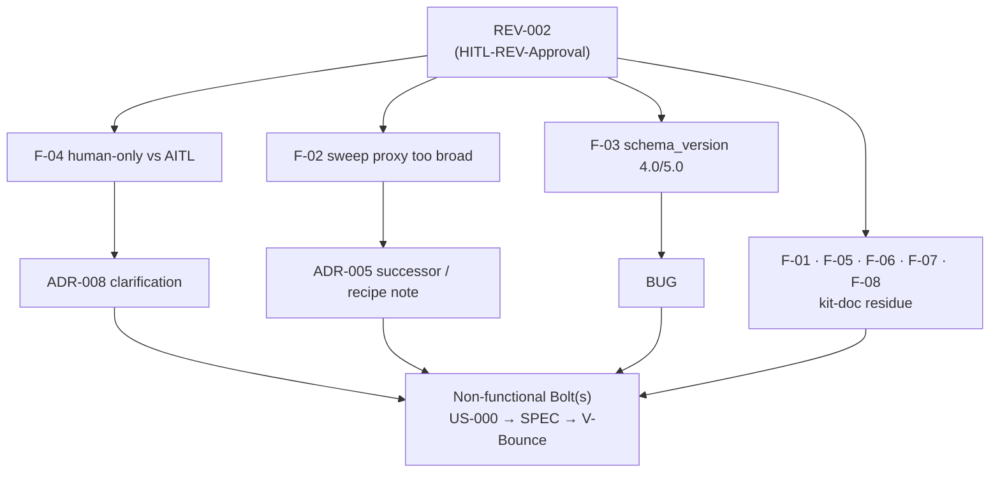

<!--
  LANGUAGE POLICY (§3.15): YAML keys, status enums, IDs and section headings
  (##) stay in English (the schema); prose is content_language (en).

  ⚠️ HITL-REV-Approval (§2.14, §3.0): these findings are DRAFT until a
  qualified human records HITL-REV-Approval. Approval does NOT approve any
  downstream artifact. Code-related outcomes (kit doc edits are code-related)
  require an approved Bolt first (T10 — never REV → SPEC directly). This REV
  reviews the kit (the product); the REV itself lives in root devflow/ (v4.2),
  so its own checkpoints are HITL-*.
-->

# REV-002 — Avenga DevFlow v5.0 kit internal-consistency audit

| Field           | Value |
|-----------------|-------|
| **Scope**       | `distribution-kit/` — the v5.0 methodology product under construction (root `devflow/` excluded, ADR-004) |
| **Methodology** | Static inspection · JSON-Schema validation · multiline grep · on-disk cross-reference resolution · four-agent byte diff |
| **Criteria**    | The v5 JSON Schemas (machine contract), the methodology §3.0/§3.12/§3.15, GUARDRAILS G18/G24/G37/G39, and US-021.BOLT-004's own AC-1/AC-3/AC-4 |

---

## 1. Purpose

Answer one question end to end: **is the v5.0 kit internally consistent — does the
normative prose agree with the machine contract, do READMEs agree with their
templates and INDEXes, do the four agent definitions agree with each other and with
the methodology — and did the US-021.BOLT-004 HITL→AITL sweep actually reach the
"kit is fully AITL" state it recorded as GREEN?**

The trigger was a completeness cross-check of US-021.BOLT-004 that widened, on
inspection, into a full kit audit. The findings below are what survived verification
against the files themselves (not against any summary): every count was re-derived,
every manifest example was validated against its schema, and every cross-reference
was resolved on disk.

---

## 2. Artifacts reviewed

| Artifact | Files | Notes |
|----------|-------|-------|
| Machine contract | `metrics/manifest-v5-{bolt,us,tc}.schema.json` + 5 `TEMPLATE-MANIFEST-*.json` | All 5 examples validated (`Draft202012` + format checker) |
| Methodology | `avenga-devflow/Avenga-DevFlow.md` | §3.0, §3.12, §3.15 read in full |
| Guardrails | `GUARDRAILS.md` | Checkpoint map, G18/G24/G37/G39, T12, gate note |
| Agents | `CLAUDE.md`, `SKILL.md`, `.github/…agent.md`, `.opencode/…md`, `AGENTS.md` | Byte-level diff of the shared bodies |
| AREV family | `adversarial-reviews/{README,INDEX}.md`, `TEMPLATE-AREV.md` | Lifecycle-vocabulary consistency |
| Sweep evidence | `SPEC-260822-1916`, `MEM-260822-1931` | §4a allowlist, AC-1/AC-3/AC-4, §9 absence sweep |

---

## 3. Severity legend

| Category | Meaning |
|----------|---------|
| **Compliant** | Implemented correctly per schema / methodology |
| **Documented deviation** | Justified difference, recorded in MEM |
| **Minor gap** | Inconsistency without functional impact, reduces quality / accuracy |
| **Major gap** | Problem that can cause runtime errors or security exposure |

> This kit is a **documentation product**; no finding causes a runtime crash, so
> none is a Major gap in the template's runtime sense. The impact of each Minor gap
> is stated explicitly, and **F-04 is the highest-priority Minor** because it
> concerns the correctness of the flagship v5 feature (AITL).

---

## 4. Findings

### 4.1 — AITL sweep completeness (US-021.BOLT-004)

#### F-01 [Minor gap] — 26 non-allowlisted `HITL-*` mentions survive the "fully AITL" acceptance

**Location:** kit-wide — 25× the language-policy line + 1× GUARDRAILS T12:
- `avenga-devflow/Avenga-DevFlow.md:3354` and `:3378` (§3.15) — `` `HITL-*-Approval` codes are never translated ``
- The four agents: `CLAUDE.md:668`, `.agents/skills/avenga-devflow/SKILL.md:685`, `.github/agents/AvengaDevFlow.agent.md:713`, `.opencode/agents/AvengaDevFlow.md:696`
- `AGENTS.md:16`, `devflow/README.md:367`, `devflow/ONBOARDING.md:150`, `tests/test-cases/README.md:104`, `tests/test-cases/TEMPLATE-TC.md:33`, `functional/user-stories/TEMPLATE-US.md:39`
- 13 analysis templates (`business-context:17`, `business-risks:17`, `domain-model/{entities:19,enumerations:19,relationships:17}`, `glossary:17`, `introduction:47`, `open-questions:28`, `personas:22`, `process:20`, `scope:19`, `ui:18`, `user-journeys:20`)
- `GUARDRAILS.md:245` (T12) — `` each artifact's `HITL-*` decision is recorded ``

**Actual:** these read `HITL-*` / `HITL-*-Approval`. Verified kit total: **53** `HITL`
occurrences; **27 allowlisted** (schema `.json` enums, G05, the §5.16 migration
mentions, the `Human-in-the-Loop (HITL)` defining sentences) and **26 non-allowlisted**
(this finding).

**Expected:** per SPEC-260822-1916 §4 (cat-3 includes the `HITL-<CODE>-Approval`
placeholders) and AC-1/AC-3, every `HITL-*` outside the declared §4a allowlist should
read `AITL-*`. None of these 26 falls under §4a (not a BOLT-001 defining sentence, not
§5.16, not a schema enum, not G05/G18/G24, not an upgrade note, not H1–H6). The intended
target is confirmed by `adrs/TEMPLATE-ADR.md`, already swept to `AITL-ADR-Approval`.

**Impact:** low — semantics are AITL everywhere (guardrails, schema, gates); this is
vocabulary only. But it falsifies US-021's AC-3 ("zero non-allowlisted `HITL`") and the
acceptance claim "the kit is fully AITL end to end," and a reader could infer `HITL-*` is
still canonical.

**Recommendation:** rename the 25 language-policy occurrences and T12 to `AITL-*-Approval`
/ `AITL-*` (a single allowlist-aware pass). Do it under an approved Bolt (T10).

---

#### F-02 [Minor gap] — the AC-3 absence sweep used an allowlist proxy broader than §4a, masking F-01 (false GREEN)

**Location:** `MEM-260822-1931:150-154` (V-Bounce verification evidence)

**Actual:** the GREEN "absence" was computed as
`grep 'HITL' … MINUS (HITL-* | hitl_approvals | Human-in-the-Loop (HITL)) => EMPTY`.
Every one of F-01's 26 lines *contains the substring* `HITL-*`, so the allowlist proxy
excluded them from the check. The sweep therefore returned empty **because the residue
was filtered out**, not because it was absent — and the same lines were counted into
`` "HITL-* legacy refs: 41 (preserved)" `` (`MEM…:160`).

**Expected:** the §4a allowlist is defined by **zone** (file / rule / section / defining
sentence), not by the literal token `HITL-*`. AC-3's operationalization must exclude the
allowlist zones, not every line that happens to contain `HITL-*`.

**Impact:** low functionally, but this is the reason a Done Bolt shipped with F-01
undetected. It is a verification-method defect that will recur on the next `HITL-*`
sweep unless the proxy is corrected.

**Recommendation:** amend the ADR-005 absence-sweep recipe (or add a checklist note) so
the allowlist is applied by zone; re-run the corrected sweep as the acceptance evidence
for the F-01 fix.

### 4.2 — Methodology ↔ machine contract

#### F-03 [Minor gap] — §3.12 contradicts itself (and the schema) on `schema_version`

**Location:** `avenga-devflow/Avenga-DevFlow.md:3151-3153` vs `:2868` / `:3158-3160`;
schema `metrics/manifest-v5-bolt.schema.json:16`

**Actual:** line 3151 states `` `schema_version` is exactly `4.0` for this family `` —
inside the section titled *"Manifest family v5"* — while the embedded example (`:2868`)
and the schema `const` say `"5.0"`, and the very next paragraph (`:3158-3160`) says "a
schema change means `5.0` … which is exactly what the normative filenames
(`manifest-v5*.schema.json`) already say."

**Expected:** one consistent statement — the family's `schema_version` is `5.0`.

**Impact:** an implementer reading the 3151 bullet literally would write `4.0` and fail
schema validation (G23). It is the residue of the v4→v5 manifest bump reaching the
schemas/examples but not the §3.12 rule prose.

**Recommendation:** correct line 3151 to `5.0`; reconcile the "`<major>.0` of `VERSION`"
wording with the shipped state. (Kit-doc change → Bolt-first.)

---

#### F-04 [Minor gap — highest priority] — "Human-only checkpoint" contradicts the AITL virtual-approver model

**Location:**
- `avenga-devflow/Avenga-DevFlow.md:1400-1424` — both checkpoint tables carry a column headed **"Human-only checkpoint"** with ✅ on every checkpoint
- `GUARDRAILS.md:18` — "Every checkpoint … **is human-only (never delegated to AI)**"
- vs the AITL charter `avenga-devflow/Avenga-DevFlow.md:1369-1376` and §1 `:241-246` — "a **human by default**, and a virtual DevFlow Agent only by explicit, valid configuration"
- vs `GUARDRAILS.md:95` (G18) and `:106` (G24) — an AI actor **may** approve under an explicit, valid virtual-approver configuration with independence
- vs the schema — `manifest-v5-bolt.schema.json` `mode: virtual` + `agent:<id>` approvers (`checkpointApproval` / `approver`, ~395-516)

**Actual:** the tables and `GUARDRAILS.md:18` assert, without qualification, that every
checkpoint is human-only and never delegable to AI. The charter, G18, G24 and the schema
all permit a virtual (agent) approver under valid configuration.

**Expected:** the "human-only" statements should be phrased as the **safe default**
(actor = human unless a valid virtual-approver configuration exists), consistent with the
AITL charter and G18/G24.

**Impact:** this is the most consequential finding. `GUARDRAILS.md:18` contradicts its own
G18/G24 in the same file, and an agent that follows the "human-only / never delegated to
AI" wording literally would refuse a validly-configured virtual approval — i.e. it negates
the flagship v5 feature. Documentation only, but behavioral in effect.

**Recommendation:** decide the intended wording (an ADR-008 clarification is the natural
home), then align the §3.0 table column header and `GUARDRAILS.md:18` to "human by default"
under an approved Bolt.

### 4.3 — Cross-reference and vocabulary hygiene

#### F-05 [Minor gap] — `§2.15/ADR` mis-citation for the AITL/virtual-approver model

**Location:** `avenga-devflow/Avenga-DevFlow.md:3128` + all four agents (`CLAUDE.md:514`,
`SKILL.md:531`, `.github/…:559`, `.opencode/…:542`)

**Actual:** the manifest `mode` note cites "(AITL, §2.15/ADR)". §2.15 is *Adversarial
Review* (`avenga-devflow/Avenga-DevFlow.md:1164`); the AITL/virtual-approver model is
defined in §3.0 (and §1).

**Expected:** the pointer should reference §3.0 (the AITL charter) / ADR-008.

**Impact:** low — a reader chasing the citation lands on the wrong topic. Identical in all
four agents (faithfully copied from the source), so not an agent-divergence.

**Recommendation:** change `§2.15` → `§3.0` in the source and re-propagate to the agents.

---

#### F-06 [Minor gap] — AREV `cancelled` status has no home in the README lifecycle table or the INDEX

**Location:** `adversarial-reviews/README.md:423-428` (lifecycle table) and
`adversarial-reviews/INDEX.md:21-39` (status buckets)

**Actual:** the lifecycle table lists `draft | in-progress | active | closed`; the INDEX
has Draft / In-progress / Active / Closed buckets. Neither includes `cancelled`.

**Expected:** `cancelled` is mandated by `TEMPLATE-AREV.md:13`, by the §3.15 status
vocabulary, and by G37 (an unrunnable AREV is set `cancelled`). A cancelled AREV currently
has nowhere to be recorded — a G39-class vocabulary gap.

**Impact:** low — no cancelled AREV exists yet in the kit, but the status is unlistable.

**Recommendation:** add the `cancelled` row to the README lifecycle table and a
`⛔ Cancelled` bucket to the INDEX.

---

#### F-07 [Minor gap] — mojibake in a shipped example manifest comment

**Location:** `metrics/TEMPLATE-MANIFEST-BOLT.json:204`

**Actual:** `"Agregar manejo explícito de concurrencia."` — `explícito`
is a double-encoded "explícito". (The comment is also Spanish while the kit's `LANGUAGE`
is `en`.)

**Expected:** a correctly-encoded example value (and, ideally, an English example to match
`LANGUAGE=en`).

**Impact:** cosmetic; the manifest still validates. But it is a corrupted string shipped in
a copy-me example.

**Recommendation:** fix the encoding (and consider an English example comment).

---

#### F-08 [Minor gap] — "the Unit will cover it" uses a removed-layer term

**Location:** `GUARDRAILS.md:468`

**Actual:** "a boundary-crossing Bolt cannot record its own contract/E2E gate as `n/a`
because **the Unit** will cover it." The parallel sentence in the methodology
(`avenga-devflow/Avenga-DevFlow.md:2413`) says "a later **release suite** will cover it."
"Unit" is the name of the Unit/UAT approval layer removed in v4.2, and "the Unit" reads
like "unit tests."

**Expected:** "the release suite" (or the methodology's wording).

**Impact:** cosmetic clarity risk.

**Recommendation:** align GUARDRAILS.md:468 to "release suite."

### 4.4 — Verified compliant (no action)

#### F-09 [Compliant] — machine contract, cross-references and agent parity are sound

- **All 5** `TEMPLATE-MANIFEST-*.json` examples validate against their v5 schemas
  (`Draft202012` + format checker); `v_bounces[]` carries exactly the 8 required fields.
- **All cross-references resolve** — 47/47 distinct `§` references point to existing
  headings (F-05 resolves but points at the wrong topic).
- **Enumerations complete and contiguous** — G01-G39, W01-W21, N01-N23, T01-T12.
- **Four-agent parity** — the methodology bodies of `CLAUDE.md` / `SKILL.md` / `.github` /
  `.opencode` are byte-identical; only the sanctioned exempt zone differs (tool names, todo
  mechanism, memory wording, `agents-data/<agent>/`); G-count 39×5.
- **Analysis family** — status enums consistent across README ↔ template ↔ INDEX in all 12
  subfolders.

---

## 5. Summary

The v5.0 kit is broadly healthy: the machine contract is airtight (every example validates),
cross-references resolve, enumerations are complete, and the four agents are in genuine
parity. The real issues are **eight documentation inconsistencies**, all low functional
impact but two of them substantive: the methodology contradicts itself on `schema_version`
(F-03) and, more importantly, on whether a checkpoint can ever be signed by an AI actor
(F-04) — the latter negating the flagship AITL feature if read literally. The US-021 sweep
left **26 non-allowlisted `HITL-*` mentions** (F-01) that its own absence-sweep could not
detect because the verification proxy was broader than the declared allowlist (F-02).

---

## 6. Action plan

> Applies only after `HITL-REV-Approval`. Each destination follows its own lifecycle and
> HITL approval; kit-doc edits are code-related, so a Bolt precedes any SPEC (T10). Routing
> below is a **proposal** — confirmed at approval.

| # | Finding | Severity | Proposed action | Routes to |
|---|---------|----------|-----------------|-----------|
| 1 | F-04 | Minor (highest) | Decide intended wording ("human by default"), then align §3.0 table header + GUARDRAILS.md:18 | ADR (ADR-008 clarification) → BOLT → SPEC |
| 2 | F-03 | Minor | Correct §3.12 `schema_version` to `5.0`; reconcile the `<major>.0` wording | BUG → BOLT → SPEC |
| 3 | F-01 | Minor | Rename 25 language-policy lines + T12 to `AITL-*` | BUG (defect vs US-021) → BOLT → SPEC |
| 4 | F-02 | Minor | Amend ADR-005 absence-sweep recipe (allowlist by zone, not token); re-run as F-01 evidence | ADR (ADR-005 successor) / process |
| 5 | F-05 | Minor | `§2.15` → `§3.0` in source + re-propagate to agents | BOLT → SPEC |
| 6 | F-06 | Minor | Add `cancelled` to AREV README lifecycle table + INDEX bucket | BOLT → SPEC |
| 7 | F-07 | Minor | Fix mojibake (and English example comment) | BOLT → SPEC |
| 8 | F-08 | Minor | "the Unit" → "release suite" (GUARDRAILS.md:468) | BOLT → SPEC |

> Efficiency note: items 3, 5, 6, 7, 8 are pure kit-doc corrections and can be delivered by
> **one non-functional Bolt** (a single allowlist-aware pass); F-03/F-04/F-02 involve a
> decision (schema-version wording, AITL wording, sweep recipe) and are best sequenced
> first so the doc-fix pass encodes the agreed wording.

---

## 7. Conclusions

The kit is close to release-ready on structure and parity, but it is **not yet "fully
AITL end to end"** as US-021 recorded: F-01/F-02 show the sweep completeness claim was
overstated, and F-04 shows a genuine self-contradiction about AI approvers on the flagship
feature. Recommend approving this REV, resolving the two wording decisions (F-04, F-03) and
the sweep-recipe fix (F-02) first, then delivering F-01/F-05/F-06/F-07/F-08 in one
allowlist-aware doc pass. Another review cycle is not required after the fixes — a corrected
absence sweep plus a re-diff of the four agents is sufficient acceptance evidence.

---

## 8. HITL-REV-Approval

> **Avenga DevFlow §2.14, §3.0.** This Review remains a draft until a qualified human
> records `HITL-REV-Approval` (in the `review` frontmatter block). Approval makes the
> findings actionable; it does not approve any downstream artifact. The V-Bounce checkpoint
> is `HITL-MEM-Approval` (recorded in the Bolt manifest) — a REV and a V-Bounce approval are
> different events.

| Field | Value |
|-------|-------|
| **Reviewer** | eugenio.serrano (tech_lead) |
| **Decision** | **approved** |
| **review_ready_at** | `2026-08-22T20:06:04-03:00` |
| **review.started_at** | `2026-08-22T20:20:44-03:00` |
| **review.decided_at** | `2026-08-22T20:20:44-03:00` |
| **Findings** | F-01 … F-08 (8 gaps) + F-09 (compliant) — actionable; routing in §6 |

---

## 9. History

| Date | Change | Author |
|------|--------|--------|
| 2026-08-22 | Initial review (draft) — 8 findings + 1 compliant, from a full kit audit + US-021.BOLT-004 completeness cross-check | @eugenio.serrano |
| 2026-08-22 | HITL-REV-Approval recorded (approved); origin attribution added — F-01/F-02/F-04→US-021, F-03/F-05/F-07→US-020, F-06→US-014, F-08→pre-5.0 | @eugenio.serrano |
| 2026-08-22 | All findings routed to one non-functional Bolt: US-000.BOLT-007 (candidate, pending HITL-BOLT-READY-Approval) | @eugenio.serrano |
| 2026-08-22 | Closed — US-000.BOLT-007 Done (V-Bounce 1, MEM-260822-2048): all 8 findings F-01..F-08 remediated and verified GREEN | @eugenio.serrano |
