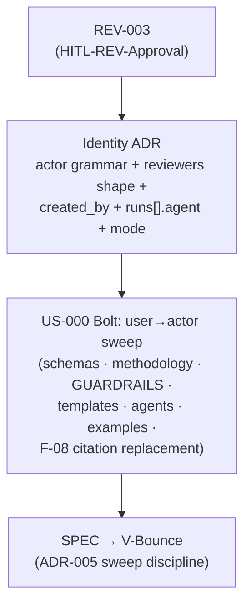

<!--
  LANGUAGE POLICY (§3.15): YAML keys, status enums, IDs and section headings
  (##) stay in English (the schema); prose is content_language (en).

  ⚠️ HITL-REV-Approval (§2.14, §3.0): these findings are DRAFT until a
  qualified human records HITL-REV-Approval. Approval does NOT approve any
  downstream artifact. Kit doc/schema edits are code-related: an approved
  Bolt precedes any SPEC (T10 — never REV → SPEC directly). This REV lives
  in root devflow/ (v4.2), so its own checkpoints are HITL-*.
-->

# REV-003 — user→actor: the identity-vocabulary inventory

| Field           | Value |
|-----------------|-------|
| **Scope**       | `distribution-kit/` — every site that records an identity (who created, who owns, who reviewed, who decided), across methodology, GUARDRAILS, schemas, manifest examples, templates and the four agents |
| **Methodology** | Full-kit grep inventory (single + multiline) · schema `$defs` inspection · per-class classification |
| **Criteria**    | ADR-007 decision 2 ("the actor is the unit of identity — humans and DevFlow Agents are peers… everywhere the methodology today says 'person'"), ADR-008 §3.4, §3.0 canonical identity, §3.12, G36 |

---

## 1. Purpose

The maintainer's direction: now that AITL makes any task — not only approving —
performable by a human **or** a virtual actor, the kit should stop recording
identity as `user:`/bare-human and adopt the **actor** vocabulary everywhere.
This REV answers, exhaustively: **where does the kit record an identity today,
in which of three inconsistent shapes, which sites must generalize, which must
not, and what does the change cost given that the v5 manifest family is still
unreleased?** It is the site inventory ADR-007 decision 2 needs to become
implementable.

---

## 2. Artifacts reviewed

| Class | Files | Sites |
|-------|-------|-------|
| Machine contract | 3 `manifest-v5-*.schema.json` + 5 `TEMPLATE-MANIFEST-*.json` | `generation.created_by` (×all generation blocks), `$defs.approver`, `$defs.hitlSubject`, `runs[]` |
| Normative prose | `Avenga-DevFlow.md` §3.0, §3.3, §3.12, §5.16 | review contract, canonical identity, risk_history, created_by rule, conversion tables |
| Enforcement projection | `GUARDRAILS.md` | review contract block, manifest projection, W11, G18/G24/G29/T02 |
| Templates | 28 with `author:`; 16 `review:`/`acceptance_review:` blocks; `owner:` ×5, `validator:`/`closed_by:` (OQ), `facilitator:` (UAT), `risk_history`/handoff History (BOLT) | frontmatter person fields |
| Agents | the 4 platform definitions | `created_by` (human) line, §5.16 mapping, `checkpoint_approvals[]` summary |

---

## 3. Severity legend

| Category | Meaning |
|----------|---------|
| **Compliant** | Already actor-shaped or correctly out of scope |
| **Documented deviation** | Justified difference, recorded |
| **Minor gap** | Inconsistency without functional impact |
| **Major gap** | Blocks a decided capability (here: blocks recording what ADR-007/ADR-008 already permit) |

---

## 4. Findings

### F-01 [Major gap] — three identity shapes coexist; only the approval record is actor-shaped

**Actual:** the kit records identity in three inconsistent grammars:

1. **Actor-shaped (target):** `checkpoint_approvals[].decided_by[]` =
   `{actor: "human:<user>"|"agent:<id>", role, model}` — schema `$defs.approver`
   with the conditional model rule (`manifest-v5-bolt.schema.json`), prose at
   `Avenga-DevFlow.md:3126-3134`.
2. **User-shaped:** the artifact-side review contract
   `reviewers: [{user, role}]` — normative example `Avenga-DevFlow.md:1571-1583`,
   `GUARDRAILS.md:253-265`, and **16 template blocks** (ADR:23, AREV
   01:10/02:11/03:14, BUG:25, DISC:15, BOLT:22 + :31 acceptance, US:25, MEM:19,
   REV:16, SPEC:21, TC:18, UAT:16) — plus `risk_history[].decided_by[].user`
   (`Avenga-DevFlow.md:2191`, `TEMPLATE-BOLT.md:37`).
3. **Bare-human:** `generation.created_by` (schema: unconstrained string;
   examples: bare local-part) and the frontmatter person fields — `author:` in
   **28 templates** + US-000, `owner:` (BUG:10 — the G29 self-approval
   comparand —, BOLT:8, US:8, TC:9, OQ:9), `validator:`/`closed_by:` (OQ:10,19),
   `facilitator:` (UAT:7).

**Expected:** one actor grammar (`human:<git-email-local>` | `agent:<id>`)
wherever an identity is recorded, per ADR-007 decision 2.

**Impact:** the split is not cosmetic. A virtual approver — already permitted by
ADR-008 and recordable in the manifest — **cannot be recorded on the artifact
itself** (`reviewers[].user` has no virtual form), so the §3.0 projection rule
("a mismatch between artifact evidence and its manifest projection is a
validation error") makes every valid virtual approval a validation error by
construction. And identity comparisons the methodology relies on (G18 approver
actor ≠ executor actor; G29/T02 approver ≠ BUG `owner`) compare fields that live
in different grammars.

**Recommendation:** `reviewers: [{actor, role, model}]` — same shape as
`decided_by[]`, turning the §3.0/GUARDRAILS projection from a *transform* into a
*copy*; `risk_history[].decided_by` follows. W11's field list updates in the
same pass.

---

### F-02 [Major gap] — generation identity is hard-coded human, and `runs[]` cannot say which agent generated

**Actual:** `Avenga-DevFlow.md:3220` — *"`created_by` identifies the **human**
who initiated or controlled the generation"*; the schemas type it as a bare
string (`$defs.generation.created_by`, `minLength: 1`, no pattern); all five
manifest examples carry bare local-parts; the four agents state *"`created_by`
(human)"* (e.g. `CLAUDE.md:512`). `runs[]` records `tool/provider/model/tokens`
— there is **no field for the DevFlow Agent id**, so an agent-executed
generation records the *model* but not the *actor* (two role agents sharing a
model are indistinguishable, exactly what ADR-007 Alternative B was rejected
for).

**Expected:** `created_by` takes the actor grammar (or a documented bare=human
default — ADR decision), the §3.12 sentence rewords "the human" → "the actor",
and `runs[]` gains an optional `agent` field (the DevFlow Agent id; `null`/absent
when the run was not executed by a role agent).

**Impact:** blocks the executor/initiator half of the DevFlow Agents vision: an
FA-agent drafting a US or a developer-agent running a V-Bounce is structurally
attributed to a human today.

---

### F-03 [Minor gap] — the §3.0 canonical identity defines "person fields" only; the two-namespace rule is missing

**Actual:** `Avenga-DevFlow.md:1594-1604` — *"the identity string for every
**person** field … is the local part of the person's `git config user.email`"* —
correctly defines the **human** namespace but is the only identity definition
the kit has; `author:`/`owner:`/`validator:`/`closed_by:`/`facilitator:` inherit
it via their `# local part of git config user.email (§3.0)` comments (28+
templates).

**Expected:** §3.0 defines identity as two namespaces — `human:<git-email-local>`
(source: git config, as today) and `agent:<id>` (source: the roster / agent
definition, ADR-007) — plus one explicit policy decision: whether bare values
remain legal as a human-default shorthand (ergonomic, backward-compatible) or
every field becomes prefix-mandatory (uniform, unambiguous). G29/T02/handoff
comparisons then work verbatim as actor comparisons.

---

### F-04 [Minor gap — design tension] — `mode` is a stored derived state

**Actual:** `checkpoint_approvals[].mode` is defined as *"`virtual` **iff** an
approver is an agent"* (`Avenga-DevFlow.md:3126-3134`) — i.e. fully derivable
from `decided_by[].actor` prefixes. G39's principle is that derived states are
never stored.

**Expected:** the identity ADR decides explicitly: keep `mode` as a sanctioned
query-convenience denormalization (documenting the exemption), or drop it and
derive. Either is fine; undocumented redundancy is not.

---

### F-05 [Minor gap] — legacy `$defs.hitlSubject` in the v5 Bolt schema

**Actual:** `manifest-v5-bolt.schema.json:451` defines — and `:502` references —
`$defs.hitlSubject`. Internal def names are non-normative, but this is `HITL-*`
phrase-family residue (ADR-005 class) inside the flagship v5 contract.

**Recommendation:** rename to `checkpointSubject` in the same schema pass.

---

### F-06 [Compliant — scope guard] — sites that must NOT change

- **AREV phase fields** (`challenger_model`/`defender_model`/`judge_model`) —
  deliberately model-based: G37 neutrality is between *models*; DISC-002
  explicitly scoped AREV out of the actor model.
- **`git config user.email`** — remains the *source* of the human namespace,
  not a field to rename.
- **Role and domain fields** — `role`, `decision_makers` (ADR), `participants`
  (PROC/RETRO), `stakeholders` (US), `real_name` (persona) are roles or domain
  data, not recorded identities.
- **History (G36)** — nothing recorded is rewritten: v4.2 artifacts keep
  `{user, role}`; the §5.16 `4.0`→`5.0` conversion is where old shapes become
  actor-shaped, and it already converts `decided_by` (`Avenga-DevFlow.md:4643`);
  it extends naturally to `reviewers` (`{user, role}` →
  `{actor: "human:<user>", role, model: null}`) and `created_by` (prefix or
  bare-default per F-03's decision). The reconstruction table row
  (`:4666`, "reviewers as `human:<user>` actors") already anticipates exactly
  this.

---

### F-07 [Documented deviation — timing] — the change is free now, a new major later

The v5 family is unreleased: §3.12's one-family rule means reshaping
`reviewers`/`created_by` **now** folds into the already-mandatory `4.0`→`5.0`
conversion at zero migration cost. After the v5.0 release, the same change is a
`6.0` with a full manifest conversion. The pending DevFlow-Agents work (the
initiative-governance ADR, the `agents/` registry US, the roster) all consume
this vocabulary — deciding it first avoids re-sweeping those artifacts.

---

### F-08 [Minor gap] — the kit cites maintainer-repo ADR ids that do not travel with the kit

**Actual:** the shipped product cites **this repository's** governance ADRs by
id and section: G18 carries "(ADR-008 §3.2–§3.4)" in `GUARDRAILS.md` **and in
the four agents** (`CLAUDE.md:234`, `SKILL.md:251`, `.github/…:279`,
`.opencode/…:262`); the manifest summary carries "(AITL, §3.0/ADR-008)" in the
four agents; the §1/§3.0 charter carries "(ADR-007, ADR-008)"
(`Avenga-DevFlow.md:243, :1372`); the kit `AGENTS.md:7` carries "(ADR-008)";
`spec/README.md` also references them. But ADR-007/ADR-008 live in the
**maintainer repository's** root `devflow/adrs/` and are **not distributed** —
the kit ships an empty `adrs/` (README/INDEX/TEMPLATE only).

**Expected:** the kit cites only anchors that exist in every adopting project —
the methodology's own sections (§3.0 charter, which already absorbed the
normative content) — never maintainer-repo artifact ids.

**Impact:** in every adopting project the citations dangle on day one; worse,
the moment the adopter creates *their own* `ADR-008`, G18's citation silently
points at an unrelated document in their decision log — an id collision by
construction, in the file that governs approval integrity.

**Recommendation:** replace the ADR-id citations with the methodology anchor
(§3.0 / the AITL charter) across GUARDRAILS, the four agents, `AGENTS.md` and
`spec/README.md` — foldable into the same sweep Bolt as F-01…F-05.

---

## 5. Summary

The kit records identity in **three grammars** — actor-shaped only in
`decided_by[]`, user-shaped in the 16 artifact review contracts and
`risk_history`, bare-human in `created_by` and ~35 frontmatter person fields.
The generalization the maintainer proposes is not new design: it is the
**implementation of ADR-007 decision 2**, and two gaps are blocking today —
a virtual approver cannot be recorded on the artifact side (F-01), and
generation cannot be attributed to an agent at all (F-02). The remaining
findings are the design decisions the identity ADR must make (bare-default vs
prefix-mandatory, keep-or-drop `mode`) and the scope guards (AREV, git email as
human source, G36 history). The window to do this inside the `5.0` family
closes at release (F-07). A related reference-hygiene defect surfaced while
verifying the citation cost of the supersede question: the kit cites
maintainer-repo ADR ids (ADR-007/ADR-008) that do not travel with the kit and
will collide with adopter ADR numbering (F-08).

---

## 6. Action plan

> Applies only after `HITL-REV-Approval`. Kit doc/schema edits are code-related:
> Bolt first (T10). Routing below is a **proposal** — confirmed at approval.

| # | Finding | Proposed action | Routes to |
|---|---------|-----------------|-----------|
| 1 | F-01/F-02/F-03/F-04 | **The identity ADR** (widening the "manifest ADR" ADR-008 §3.9 already plans): actor grammar `human:<u>`\|`agent:<id>` everywhere identity is recorded; `reviewers[{actor, role, model}]`; `created_by` actor-shaped; `runs[].agent` optional; bare-default vs prefix-mandatory; keep/drop `mode`; §3.0 two-namespace canonical identity | ADR → `HITL-ADR-Approval` |
| 2 | F-01…F-05, F-08 sweep | One non-functional Bolt under US-000: schemas (+`hitlSubject` rename) + 5 manifest examples + §3.0/§3.3/§3.12/§5.16 + GUARDRAILS + 16 template blocks + ~35 frontmatter comments + 4 agents, under the ADR-005 phrase-family discipline (`[{user, role}]`, `created_by`, the canonical-identity paragraph) — including the F-08 citation replacement (maintainer ADR ids → §3.0 anchors) | BOLT → SPEC → V-Bounce |
| 3 | Sequencing | US-000.BOLT-007 (REV-002 remediation) is now Done — no blocker; coordinate only with any follow-up touching §3.0/GUARDRAILS wording | — |

---

## 7. Conclusions

Proceed — the proposal is coherent with the decided substrate and cheaper now
than it will ever be again. The one decision that genuinely needs the ADR's
judgment is the **bare-default vs prefix-mandatory** policy for frontmatter
person fields (F-03); everything else is mechanical once that falls. The sweep
itself is a single allowlist-aware pass of the same shape as US-021, over a
smaller phrase family.

---

## 8. HITL-REV-Approval

> **Avenga DevFlow §2.14, §3.0.** This Review remains a draft until a qualified
> human records `HITL-REV-Approval` (in the `review` frontmatter block).
> Approval makes the findings actionable; it does not approve any downstream
> artifact.

| Field | Value |
|-------|-------|
| **Reviewer** | eugenio.serrano (tech_lead) |
| **Decision** | **approved** |
| **review_ready_at** | `2026-08-22T21:01:00-03:00` |
| **review.started_at** | `2026-08-22T21:04:25-03:00` |
| **review.decided_at** | `2026-08-22T21:04:25-03:00` |
| **Findings** | F-01 … F-05, F-08 (gaps) + F-06 (scope guard) + F-07 (timing); routing in §6 |

---

## 9. History

| Date | Change | Author |
|------|--------|--------|
| 2026-08-22 | Initial review (draft) — full-kit identity-site inventory for the user→actor generalization (maintainer direction), on top of ADR-007/ADR-008 and the REV-002 remediation baseline | @eugenio.serrano |
| 2026-08-22 | F-08 added (kit cites maintainer-repo ADR ids that do not ship — dangling/colliding references in adopters), surfaced while verifying the supersede-vs-new-ADR question; action plan updated (BOLT-007 now Done, no sequencing blocker) | @eugenio.serrano |
| 2026-08-22 | HITL-REV-Approval recorded (approved) — findings actionable; routing: identity ADR (ADR-009) + US-000 sweep Bolt | @eugenio.serrano |
| 2026-08-22 | Closed — all findings routed and remediated: ADR-010 (accepted, supersedes ADR-009) + US-000.BOLT-008 (Done — grammar) + US-000.BOLT-009 (Done — vocabulary purge); F-06 scope guard and F-07 timing require no action | @eugenio.serrano |
