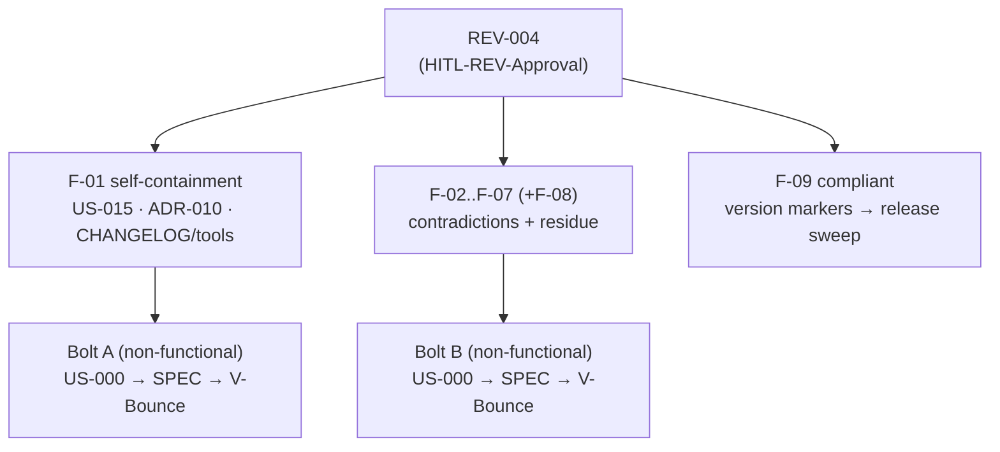

<!--
  LANGUAGE POLICY (§3.15): YAML keys, status enums, IDs and section headings
  (##) stay in English (the schema); prose is content_language (en).

  ⚠️ HITL-REV-Approval (§2.14, §3.0): these findings are DRAFT until a
  qualified human records HITL-REV-Approval. Approval does NOT approve any
  downstream artifact. Code-related outcomes (kit doc edits are code-related)
  require an approved Bolt first (T10 — never REV → SPEC directly). This REV
  reviews the kit (the product); the REV itself lives in root devflow/ (v4.2),
  so its own checkpoints are HITL-*.
-->

# REV-004 — Avenga DevFlow v5.0 kit self-containment + residual-consistency audit

| Field           | Value |
|-----------------|-------|
| **Scope**       | `distribution-kit/` — the v5.0 methodology product under construction (root `devflow/` excluded, ADR-004) |
| **Methodology** | Static inspection · multiline grep with re-derived counts · on-disk cross-reference & `adrs/` inventory · de-duplication against REV-002 / REV-003 closed findings |
| **Criteria**    | Distributable self-containment (an adopter can resolve every referenced ID from the kit alone) and internal consistency of the normative prose after the REV-002/003 remediation |

---

## 1. Purpose

Answer two questions end to end: **(1) is the v5.0 kit self-contained** — can a team
that installs only `distribution-kit/` resolve every identifier the methodology
references, or does the product leak IDs that exist solely in this maintainer
repository — **and (2) is the normative prose internally consistent** after REV-002
(kit-consistency) and REV-003 (actor grammar) were remediated and closed?

The findings below are what survived verification against the files themselves, not
against any summary: every occurrence count was re-derived with multiline grep, the
`adrs/` folder was inventoried on disk, every cross-reference was resolved, and each
candidate was checked against the REV-002 and REV-003 closed-finding sets so nothing
already fixed is re-raised. Two findings (F-03, F-04) are **surviving instances of
families REV-002 touched**, at locations that Bolt's pass did not reach — the same
"sweep by zone, not by token" gap REV-002 F-02 identified.

---

## 2. Artifacts reviewed

| Artifact | Files | Notes |
|----------|-------|-------|
| Methodology | `avenga-devflow/Avenga-DevFlow.md` | §0, §3.1, §3.9, §3.11, actor-grammar citations, US-015 |
| Guardrails | `GUARDRAILS.md` | W09, G05, G20/coverage US-015 |
| Folder docs | `README.md`, `ONBOARDING.md`, `reviews/README.md`, `tests/**`, `analysis/README.md` | H1–H6 line, CHANGELOG/tools refs, "must reach", US-015 residue |
| INDEX | `avenga-devflow/INDEX.md` | Checkpoint enumeration |
| ADR inventory | `adrs/` | INDEX + README + TEMPLATE only — **no `ADR-NNN` ships** |
| Agents | `CLAUDE.md`, `SKILL.md`, `.github/…agent.md`, `.opencode/…md` | AITL preamble H1–H6 line vs inline G05 |
| Design ref | `reports/TEMPLATE-REPORT.html` | US-011/US-015 as sample data |

---

## 3. Severity legend

| Category | Meaning |
|----------|---------|
| **Compliant** | Implemented correctly per methodology / distributable contract |
| **Documented deviation** | Justified difference, recorded in MEM |
| **Minor gap** | Inconsistency without functional impact, reduces quality / accuracy |
| **Major gap** | Problem that can cause runtime errors or security exposure |

> This kit is a **documentation product**; no finding causes a runtime crash, so none is
> a Major gap in the template's runtime sense. The impact of each gap is stated
> explicitly. **F-01 is the highest priority** — it is the only finding that breaks the
> kit's defining promise (a self-contained, distributable methodology), and it is the
> most expensive to fix after release. **F-02 is the highest-priority contradiction** — a
> reader of §3.9 gets a rule that the rest of the kit, and G29, explicitly forbid.

---

## 4. Findings

### 4.1 — Distributable self-containment

#### F-01 [Minor gap — highest priority] — the kit leaks maintainer-repository identifiers an adopter cannot resolve

**Location:** three families of leak:

- **(a) `US-015`** — 10 files, 29 occurrences: `avenga-devflow/Avenga-DevFlow.md` (§3.0, §3.11, §4.7), `GUARDRAILS.md` (G20 + coverage, 2×), `README.md` (2×), `tests/README.md` (4×), `tests/uat/{README.md, INDEX.md, TEMPLATE-UAT.md}` (1× each), `analysis/README.md` (3×), `ONBOARDING.md` (1×), and `reports/TEMPLATE-REPORT.html` (11×, sample data — acceptable in a design reference but inconsistent with real repo IDs).
- **(b) `ADR-010`** — 6× in `avenga-devflow/Avenga-DevFlow.md` (1602, 3188, 3272, 3279, 4698, 4700) as the **normative basis of the actor grammar** ("the actor grammar (ADR-010)", "ADR-010 §3.1–§3.4", …). The kit ships **no ADRs** — `adrs/` contains only `INDEX.md`, `README.md`, `TEMPLATE-ADR.md`. The adopter cannot read the decision the methodology declares normative.
- **(c) CHANGELOG / tools references** — `README.md:354` cites `CHANGELOG 4.0 "cross-model review round"` and `README.md:355` cites `tools/README.md`. The kit distributes neither a `CHANGELOG` (removed from `devflow/`, §5.16) nor `tools/` (arrives with the tools track, §5.1) — the first is a dangling citation of this repo's internal history; the second a forward-reference to an unshipped file.

**Actual:** these identifiers resolve only inside this maintainer repository (or not at all in the shipped kit).

**Expected:** a distributable kit resolves every referenced ID from its own contents. `US-015` references should be replaced by a neutral version-phrase ("a redesigned model is planned for a future version"); the actor grammar should be made self-contained (drop the `ADR-010` citations or ship the decision as an appendix); the CHANGELOG citation should be removed and the `tools/README.md` reference gated behind "when the tools track lands".

**Impact:** this is the kit's defining promise — a team installs `distribution-kit/` and it is complete. Each leak forces the adopter to chase an artifact that does not exist. Cheap to fix now (text), expensive after release (every adopter copy carries it).

**Recommendation:** one non-functional Bolt (US-000) — a self-containment pass over (a)+(b)+(c). Bolt-first (T10).

### 4.2 — Normative contradictions

#### F-02 [Minor gap — highest-priority contradiction] — §3.9 reintroduces a BUG-approval gate the kit explicitly abolished

**Location:** `avenga-devflow/Avenga-DevFlow.md:2597-2598` (§3.9 Dev-validator role) — the phrase spans a line break: "approve `high`/`medium`/`low`-severity non-functional BUGs (and their dedicated Bolt) — never one they themselves / drafted or authored."

**Actual:** §3.9 forbids the Dev-validator from approving a non-functional BUG they authored.

**Expected:** the pervasive rule everywhere else — §3.11 (2668-2670), §2.16 (132, 1447-1448), G29, `TEMPLATE-BUG`, `TEMPLATE-BOLT`, `bugs/README` — is "guidance, never a gate: any qualified team member, **the BUG's own author included**, may approve at any severity." G29 states the inverse of §3.9 outright: "excluding the author is the violation." §3.9's clause is stale v4-era text.

**Impact:** an agent or reviewer reading §3.9 literally would **block** an author-approval that G29 and §3.11 expressly permit — a direct rule conflict on who may approve a BUG. Note the direction is already settled (G29 governs); §3.9 is the outlier, so no ADR is needed, only alignment.

**Recommendation:** remove the "never one they themselves drafted or authored" clause from §3.9 and align it to the G29 / §3.11 wording. Bolt-first (T10).

#### F-03 [Minor gap] — §0 retains the absolute "cannot be delegated to AI" the AITL charter (and REV-002 F-04) superseded

**Location:** `avenga-devflow/Avenga-DevFlow.md:141` (§0 Quick Start) — "A human checkpoint cannot be delegated to AI."

**Actual:** an unqualified absolute statement.

**Expected:** the AITL charter (§3.0, §1) and the landed REV-002 F-04 wording say a checkpoint is occupied by "a human **by default**, a virtual DevFlow Agent only by explicit, valid configuration; absent/invalid config → human-only." `GUARDRAILS.md:18` and G24 already carry exactly this phrasing after `US-000.BOLT-007`.

**Impact:** same class as REV-002 F-04, at a location that Bolt's pass did not cover (it aligned the §3.0 tables and `GUARDRAILS.md:18`, not §0). An agent following §0 literally negates the flagship AITL feature. Documentation only, but behavioral in effect.

**Recommendation:** align §0:141 to the "human by default / only under explicit valid configuration" wording already used in `GUARDRAILS.md:18`. Bolt-first (T10).

### 4.3 — Vocabulary / cross-reference residue

#### F-04 [Minor gap] — the checkpoint INDEX lists UNIT and UAT as named checkpoints

**Location:** `avenga-devflow/INDEX.md:13`

**Actual:** the checkpoint enumeration reads "… AREV-CRITIQUE/DEFENSE/VERDICT, **UNIT, UAT**)".

**Expected:** §3.0 defines exactly 13 checkpoint codes with no UNIT or UAT; the UAT template is dormant/reserved and §4.7 records the Unit/UAT approval layer as removed. Same family as REV-002 F-08 ("the Unit"), different location.

**Impact:** low — an obsolete enumeration in a summary line; a reader could infer two checkpoints that do not exist. (The same line also still reads "v4.2" — that marker belongs to the release sweep, F-08 below, not this fix.)

**Recommendation:** drop `UNIT, UAT` from the enumeration. Bolt-first (T10).

#### F-05 [Minor gap] — "legacy H1–H6" prose omits the pre-v5 `HITL-*` prefix that G05 includes

**Location:** `README.md:244` and the AITL preamble of the four agents (`CLAUDE.md` and its three peers) — "legacy numbered aliases (H1–H6) are invalid."

**Actual:** the prose names only `H1–H6` as legacy.

**Expected:** G05 (and its inline row in the same four agents) defines the legacy set as "H1–H6, **or the pre-v5 `HITL-*` prefix**." An agent guided only by the prose could treat `HITL-SPEC-Approval` (visible in migrated history) as canonical.

**Impact:** low — the correct rule is present inline via G05 in the same files; only the summary prose is narrower.

**Recommendation:** add "or the pre-v5 `HITL-*` prefix" to the README line and the four agent preambles. Bolt-first (T10).

#### F-06 [Minor gap] — reviews/README states an obligation the kit's routing makes guidance

**Location:** `reviews/README.md:183` (REV→BUG severity mapping) — "`critical` when a non-functional BUG **must reach** an Architect/Tech Lead."

**Actual:** an obligation ("must reach").

**Expected:** under the kit's routing (G29, §3.11) the Architect/TL is the **recommended** approver for a `critical` non-functional BUG, never a gate — any qualified member, the author included, may approve. Same root cause as F-02.

**Impact:** low — a folder README overstating a role requirement that the normative rule softens.

**Recommendation:** reword to "recommended", consistent with G29. Bolt-first (T10).

#### F-07 [Minor gap] — the W09 `llm`-field exception for AREV templates is enforced but never declared in the methodology

**Location:** `GUARDRAILS.md:130` (W09) declares the exception; `avenga-devflow/Avenga-DevFlow.md:1822` (§3.1) states the rule without it.

**Actual:** W09 exempts the AREV phase templates from the `llm:` field (they record `challenger_model` / `defender_model` / `judge_model` instead), and the templates implement that. But §3.1 asserts absolutely "Every AI-generated Markdown artifact carries an `llm` field", with no exception — and the methodology body never mentions `challenger_model` / `defender_model` / `judge_model` at all. W09's own cited sections (§2.15, §3.13) do not contain the exception either.

**Expected:** the guardrail should enforce a rule the methodology states. The exception belongs in §3.1 (or §2.15/§3.13, which W09 cites).

**Impact:** low — a guardrail applying a rule the normative source does not enunciate; the enforcement is correct, the source is silent.

**Recommendation:** add the AREV per-phase-model exception sentence to §3.1. Bolt-first (T10).

### 4.4 — Cosmetic

#### F-08 [Minor gap — cosmetic] — placeholder cross-links in templates resolve only after instantiation

**Location:** `adversarial-reviews/TEMPLATE-AREV.md` → `01-CRITIQUE.md`; `functional/user-stories/TEMPLATE-US.md` → `../bolts/US-NNN.BOLT-00X-*.md`.

**Actual:** intentional placeholders that a link checker flags as broken.

**Expected:** harmless; wrapping the placeholder paths in code spans would silence link-check noise.

**Impact:** cosmetic; no reader is misled.

**Recommendation:** optional — fold into the F-04/F-05 consistency pass or defer.

### 4.5 — Verified compliant (no action)

#### F-09 [Compliant] — the 4.2 version markers are intentional WIP, and the "G29 self-approval" cross-reference is correct

- **Version markers (`VERSION`, `CLAUDE.md`, INDEX/README headers, the four agents all read `4.2`)** are **not a defect**: the maintainer partition (root `devflow/`) is genuinely v4.2, and §5.16 writes `VERSION` **last**, at release. Flipping `4.2 → 5.0` across the kit is the **release sweep**, a process step, not a Bolt. Recorded here so it is not mistaken for a fix to schedule now.
- **`avenga-devflow/Avenga-DevFlow.md:1618` — "self-approval routing (G29) … mismatch detection (G18, G24)"** was checked and is **correct**: in the v5 kit, G29 explicitly carries the author-inclusion clause ("the author included"), so citing G29 for author self-approval routing is accurate; G18/G24 correctly cover the AI-self-approval axis. No change. (Recorded so it is not re-raised.)

---

## 5. Summary

The v5.0 kit is structurally healthy and, on the machine contract and agent parity,
already validated by REV-002. This pass finds **seven documentation gaps plus one
cosmetic**, in two themes. The substantive one is **self-containment (F-01)**: the kit
leaks `US-015` (10 files), `ADR-010` (6×, and the kit ships no ADRs) and CHANGELOG/tools
references — an adopter cannot resolve them, and it is the only finding that breaks the
kit's defining promise. The rest are consistency residue: one genuine contradiction
(F-02, §3.9 vs G29 on BUG approval) and surviving instances of families REV-002 touched
(F-03 human-only in §0; F-04 UNIT/UAT in the INDEX), plus three minor cross-reference
gaps (F-05, F-06, F-07). Nothing blocks release, but **F-01 and F-02 are release-quality
issues, not polish.**

---

## 6. Action plan

> Applies only after `HITL-REV-Approval`. Each destination follows its own lifecycle and
> HITL approval; kit-doc edits are code-related, so a Bolt precedes any SPEC (T10). The
> direction of both contradictions is already settled by existing governance (G29 for
> F-02, the AITL charter/ADR-008 for F-03), so **no new ADR is required** — routing is
> two non-functional Bolts under US-000, confirmed at approval.

| # | Finding | Severity | Proposed action | Routes to |
|---|---------|----------|-----------------|-----------|
| 1 | F-01 | Minor (highest) | Self-containment pass: `US-015` → neutral version phrase; actor grammar self-contained (drop `ADR-010` cites or ship as appendix); remove CHANGELOG cite + gate `tools/README.md` | **Bolt A** (non-functional, US-000) → SPEC |
| 2 | F-02 | Minor (contradiction) | Remove "never one they themselves drafted or authored" from §3.9; align to G29 / §3.11 | **Bolt B** → SPEC |
| 3 | F-03 | Minor | Align §0:141 to "human by default / only under explicit valid config" (mirror `GUARDRAILS.md:18`) | **Bolt B** → SPEC |
| 4 | F-04 | Minor | Drop `UNIT, UAT` from `avenga-devflow/INDEX.md:13` | **Bolt B** → SPEC |
| 5 | F-05 | Minor | Add "or the pre-v5 `HITL-*` prefix" to README:244 + four agent preambles | **Bolt B** → SPEC |
| 6 | F-06 | Minor | `reviews/README.md:183` "must reach" → "recommended" (per G29) | **Bolt B** → SPEC |
| 7 | F-07 | Minor | Declare the AREV per-phase-model `llm` exception in §3.1 | **Bolt B** → SPEC |
| 8 | F-08 | Cosmetic | Optional: code-span the placeholder links | **Bolt B** (fold in) or defer |
| — | F-09 | Compliant | Version-marker sweep `4.2 → 5.0` at release (§5.16); "G29 routing" verified correct | **No Bolt** — release process |

> Efficiency note: **F-01 is one Bolt** (a self-containment pass, the real work, 29
> occurrences across 9 prose files). **F-02..F-07 (+F-08) are one Bolt** (localized text
> corrections). Both are non-functional Bolts under US-000, mirroring how REV-002 routed
> its findings into `US-000.BOLT-007`.

---

## 7. Conclusions

The kit is close to release-ready and REV-002/REV-003 did their jobs, but it is **not yet
self-contained** (F-01) and still carries one live contradiction (F-02) plus residue from
prior sweeps (F-03, F-04). Recommend approving this REV and delivering the fixes in **two
non-functional Bolts under US-000** — one for self-containment, one for the consistency
corrections — with the F-02/F-03 wording confirmed at approval (both already settled by
G29 and the AITL charter, so no ADR). Another review cycle is not required after the
fixes: a re-derived `US-015`/`ADR-010` grep returning zero, an `adrs/` self-containment
check, and a re-read of §3.9/§0 against G29 are sufficient acceptance evidence. The
`4.2 → 5.0` marker sweep (F-09) is deferred to the release step, not these Bolts.

---

## 8. HITL-REV-Approval

> **Avenga DevFlow §2.14, §3.0.** This Review remains a draft until a qualified human
> records `HITL-REV-Approval` (in the `review` frontmatter block). Approval makes the
> findings actionable; it does not approve any downstream artifact. The V-Bounce
> checkpoint is `HITL-MEM-Approval` (recorded in the Bolt manifest) — a REV and a
> V-Bounce approval are different events.

| Field | Value |
|-------|-------|
| **Reviewer** | eugenio.serrano (qualified human) |
| **Decision** | **approved** |
| **review_ready_at** | `2026-08-23T00:35:28-03:00` |
| **review.started_at** | `2026-08-23T00:44:14-03:00` |
| **review.decided_at** | `2026-08-23T00:44:14-03:00` |
| **Findings** | F-01 … F-08 (7 gaps + 1 cosmetic) + F-09 (compliant) — actionable; routing in §6. Cosmetic nit on F-02 line citations recorded in the frontmatter `acknowledgment_reason` |

---

## 9. History

| Date | Change | Author |
|------|--------|--------|
| 2026-08-23 | Initial review (draft) — self-containment + residual-consistency audit of the v5.0 kit: 7 gaps + 1 cosmetic + 1 compliant, verified against the files and de-duplicated against REV-002/REV-003 | @eugenio.serrano |
| 2026-08-23 | `HITL-REV-Approval` recorded (approved) — findings actionable; routing: US-000.BOLT-011 (F-01) + US-000.BOLT-012 (F-02..F-07 + F-08), both created as candidates | @eugenio.serrano |
| 2026-08-23 | **Closed** — all findings routed and remediated: F-01 → US-000.BOLT-011 (Done, 01:18:50); F-02..F-08 → US-000.BOLT-012 (Done, 01:18:50 — F-05 fully via SPEC rev 2 / V-Bounce 2); F-09 compliant → release sweep (`4.2 → 5.0`). Status → `closed`. | @eugenio.serrano |
