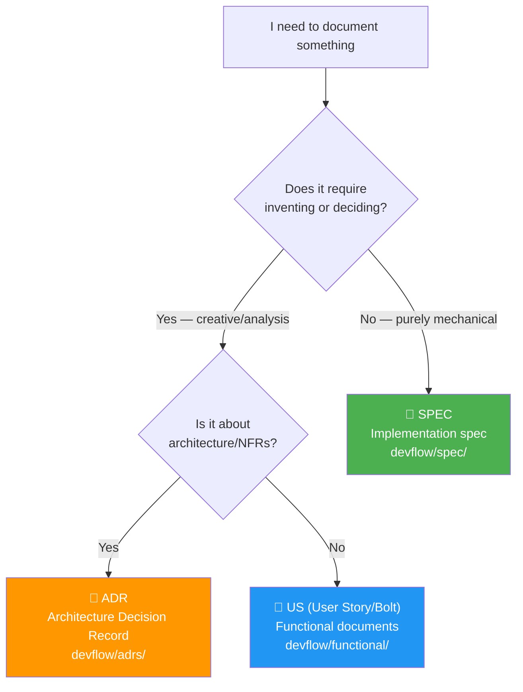

# Spec (Implementation Specifications)

**Methodology version:** 5.0

## Purpose

This folder contains **implementation specifications**: documents that define
EXACTLY how a Bolt must be built. They are the construction "blueprints."

A Spec is not creative — it is **mechanical**. Functional analysis and decisions
have already been made; here we only define components, configuration,
data structures, APIs, and flow.

> **Normative boundary (§2.4):** Bolt = WHAT must be delivered. ADR = which
> architectural decisions and constraints govern it. **SPEC = HOW the Bolt
> will be implemented.** A Bolt never contains implementation instructions;
> they live here.

---

## One canonical SPEC per Bolt (§2.4.1, §3.2.1)

- Every approved Bolt has **exactly one current canonical SPEC**, and every
  SPEC references **exactly one Bolt** through its mandatory `bolt` field.
- A second concurrent SPEC for the same Bolt, or a SPEC spanning multiple
  Bolts, is **invalid**.
- A SPEC may be **revised and versioned in place** (`spec_revisions[]` in
  the manifest) — material changes revise the canonical SPEC and require
  re-approval at `AITL-SPEC-Approval`. **One V-Bounce never spans two SPEC
  revisions** (§3.3).
- A SPEC without `AITL-SPEC-Approval` **cannot start a code-run or
  V-Bounce** (§0).

---

## Quick Start: Creating a SPEC in 6 steps

1. **Verify the approved Bolt** — Every SPEC MUST reference an **approved**
   Bolt (`AITL-BOLT-READY-Approval` recorded, which includes its DoR). If the Bolt
   corrects a BUG, the BUG must have `AITL-BUG-Approval`; a functional
   Bolt's parent US must have `AITL-US-Approval`; a Test Bolt's parent TC
   must have `AITL-TC-Approval`.
2. **Run the pre-SPEC evidence gate** — Before writing any content, verify
   that every governed source you will use is approved (BUG, TC, Bolt, US,
   ADR, DISC/REV/AREV evidence). Any draft/rejected/stale source → emit a
   **blocking report**, never a partial SPEC (§2.4.1).
3. **Get the timestamp** — Run `Get-Date -Format "yyMMdd-HHmm"` (PowerShell) or
   `date +"%y%m%d-%H%M"` (Bash/Zsh). This becomes your SPEC ID (e.g., `SPEC-260521-1430`).
4. **Copy the template** — Use [`TEMPLATE-SPEC.md`](./TEMPLATE-SPEC.md) as your
   starting point. Save it as `SPEC-YYMMDD-HHmm-brief-description.md`.
5. **Fill in the frontmatter** — Complete `id`, `title`, `date`, `author`, `llm`,
   `status: draft`, `origin`, `bolt` (MANDATORY), `associated_adrs`, `risk_class`,
   `autonomy_level` (defaults by risk: low/medium→L3, high→L2, critical→L1),
   `turn_budget` (optional; agent loops without green before stop-and-ask,
   default = the platform/agent default, §3.3),
   `data_classification`, and the review-contract fields.
   No implementation starts while the SPEC is a draft.
6. **Stop at `AITL-SPEC-Approval`** — The Dev-validator (+ applicable domain
   owners) approves the plan. Only then the V-Bounce executes: SPEC →
   agent generates code + tests → runs tests until GREEN (BUGs: red→green
   in the same V-Bounce) → creates `MEM-YYMMDD-HHmm` → appends a
   `v_bounces[]` entry to the Bolt manifest → **PAUSES at
   `AITL-MEM-Approval`**.

> 💡 **Bolt-first rule (G12):** No SPEC without a Bolt. Whether the work
> comes from a feature, a review finding, or a bug report — the Bolt is
> created and approved first, then the SPEC references it. **Bugs do NOT
> get two SPECs**: the BUG Bolt uses ONE canonical SPEC and strict TDD
> (red → green) inside ONE V-Bounce (§2.16, §3.3.1).

---

## What documents go here?

- Detailed component configuration definitions (peripherals, services, infrastructure).
- Exact APIs (functions, parameters, return values).
- Data structures and their layouts.
- Step-by-step execution flows.
- Environment configuration and dependencies.
- Sequence and state diagrams.
- Test strategy and expected evidence; gates; migration/rollback; risks and
  stop conditions (§2.4.1 required contents).

---

## Naming convention

```
SPEC-YYMMDD-HHmm-brief-description.md
```

Where:
- `SPEC` — Fixed prefix.
- `YYMMDD` — Creation date (2-digit year, month, day).
- `HHmm` — Creation time (hour, minutes).
- `brief-description` — Topic summary in kebab-case.
- `.md` — Markdown extension.

**Example:** `SPEC-260802-1042-invoice-download.md`

> ⚠️ **IMPORTANT — System timestamp:** The `YYMMDD` and `HHmm` values MUST be
> obtained from the REAL operating system date and time at the moment of file creation.
> **NEVER invent or estimate** the time. Use the system command to obtain it:
> - **PowerShell:** `Get-Date -Format "yyMMdd-HHmm"`
> - **Bash/Zsh:** `date +"%y%m%d-%H%M"`
>
> If the AI agent cannot execute system commands, it must ask the user
> to provide the current date/time, or use the date/time from the conversation context.

---

## SPEC structure

The authoritative structure is [`TEMPLATE-SPEC.md`](TEMPLATE-SPEC.md) — its
**19 numbered sections**, plus the frontmatter, in this order:

- **Frontmatter** — ID (`SPEC-YYMMDD-HHmm`), title, date, status, author, `llm`, the governed `bolt`, `turn_budget`, `data_classification` and the `review` block.
1. **Objective** — What to build.
2. **Context** — The originating US/TC/BUG, ADRs, constraints.
3. **Source inventory and approval references** — Every governed source used + repository baseline (from the pre-SPEC evidence gate).
4. **Scope** — In scope and out of scope, explicitly.
5. **Prerequisites and baseline** — Build state, prior SPECs, environment.
6. **Phases** — Explanatory, with files, patterns, ADR references.
7. **Acceptance criteria** — Given/When/Then, mapped to source US/ACs or measurable technical outcomes.
8. **Testing strategy** — Unit/integration/E2E, edge cases, expected evidence.
9. **Quality gates** — Applicable gates; `n/a` with reasons.
10. **Security and data** — Security considerations + data handling per `data_classification`.
11. **Monitoring and observability** — Logs, metrics, traces, alerts.
12. **Migration, compatibility and rollback** — Schema changes, feature flags, rollback.
13. **Risk matrix** — Probability × impact + mitigation.
14. **Decisions and trade-offs** — Micro-decisions that don't warrant a full ADR.
15. **Stop conditions** — Explicit conditions that halt the V-Bounce.
16. **Definition of Done (DoD)** — What must hold for the SPEC to be considered fulfilled.
17. **References** — Related documents (US, ADRs, prior SPECs, DISCs, BUGs, RISKs).
18. **Revision history** — One row per revision, mirrored in `spec_revisions[]` of the Bolt manifest.
19. **`AITL-SPEC-Approval`** — The checkpoint that authorizes the V-Bounce.

### Level of detail

If what you are about to write requires *inventing or deciding*, the document should be
a US (User Story) or ADR, not a Spec. If what you are about to write is *purely mechanical*, it is a Spec.

### Diagrams and visual elements

**Mermaid** must be used for all diagrams, charts, and any other visual elements
(no ASCII art or embedded images).

---

## Minimum quality standard (MANDATORY)

A SPEC **must be self-contained and explanatory**. Any person (or AI agent) reading it
months later must be able to understand WHAT will be built, WHY, and HOW without reading
other documents or doing commit archaeology.

> ⚠️ **Quantitative floor (GUARDRAILS W02):** A SPEC without the required
> contents triggers a warning. This is a heuristic — a short SPEC that meets
> all quality criteria below is acceptable; a long SPEC that fails them is
> not.

### Minimum content rules

1. **Context and motivation** — ALWAYS explain where the need comes from, what problem
   it solves, and what happens if it is NOT implemented. At least one paragraph of
   business context.
2. **Source inventory and approval references** — Record every governed source used
   (Bolt, US/ACs, TC, BUG, ADRs, DISC/REV/AREV evidence) and the repository baseline
   (from the pre-SPEC evidence gate).
3. **Explicit scope** — List what it covers AND what it does NOT cover. Never leave
   ambiguity.
4. **Phases with technical detail** — Each phase must describe:
   - What files are created or modified and for what purpose.
   - What patterns or conventions are applied (and reference ADRs).
   - How it interacts with existing components.
5. **Acceptance criteria** — Each AC must be verifiable and testable with Given/When/Then format.
6. **Stack and dependencies** — If something new is introduced, document version and
   reason.
7. **Gates, risks and stop conditions** — Applicable gates (`pass`/`waived`/`n/a`),
   risks, migration/rollback, and explicit stop conditions.

### Anti-patterns (DO NOT DO)

| ❌ Anti-pattern | ✅ Correct approach |
|----------------|---------------------|
| 5-line SPEC with no context | Minimum: context + scope + phases + ACs |
| "Create endpoint GET /api/v1/foo" (nothing more) | Explain what it returns, where data comes from, how it relates to the domain |
| Phases as a bullet-point list without explanation | Each phase explains the WHAT, WHY, and HOW |
| Omitting prerequisites or baseline | Always declare current build state and prior dependencies |
| Copying the US verbatim without elaboration | The SPEC must translate the US into concrete implementation instructions |
| Generating a SPEC while any governed source is draft/unapproved | Pre-SPEC evidence gate: emit a blocking report (G13) |
| Continuing after a material source change | Stop, revise the canonical SPEC, re-approve (G15) |
| Filling a conflicting/missing evidence gap with an assumption | Stop and request resolution — never invent behavior, architecture, APIs, schemas or constraints (§2.4.1) |

### Example: Bad vs. Good SPEC (excerpt)

**❌ Bad (telegram style):**
```markdown
## Phase A — Auth endpoint
- Create POST /api/auth
- Return JWT token
- 1 unit test
```

**✅ Good (explanatory):**
```markdown
### Phase A — Authentication endpoint (BOLT-001)

**Duration:** 2h total cycle — **Complexity:** Medium

#### A.1 Create `AuthController` in `src/controllers/auth.controller.ts`

Adds a `POST /api/v1/auth/login` endpoint that accepts `{ email: string, password: string }`
and returns `{ accessToken: string, expiresIn: number }`. Follows ADR-003 (Hexagonal
Architecture): Controller → UseCase → Port → Adapter. The UseCase delegates password
verification to the existing `BcryptHashService` (defined in ADR-005) and token generation
to `JwtTokenService` (secret from `AUTH_JWT_SECRET` env var, configured via an approved ADR).

**Files created:**
- `src/controllers/auth.controller.ts` — REST endpoint handler
- `src/use-cases/auth/login.use-case.ts` — Business logic orchestration
- `tests/unit/use-cases/auth/login.use-case.spec.ts` — 5 test cases
- `tests/integration/controllers/auth.controller.spec.ts` — 3 test cases

**Files modified:**
- `src/app.module.ts` — Register AuthController and dependencies
```

---

### Decision guide: US, SPEC, or ADR?

When creating a DevFlow document, use this Mermaid flowchart to determine the right type:



**Key principle from DevFlow methodology:** The SPEC must be *implementable without
asking questions*. If the document still has open decisions, it belongs in a US or ADR,
not in SPEC.

---

### Completeness metric

A well-written SPEC answers these questions:
- Can I implement this without asking anyone anything? → If not, detail is missing.
- Do I understand WHY this is being done? → If not, context is missing.
- Do I know when I'm done? → If not, acceptance criteria are missing.
- Can a new developer understand this? → If not, explanation is missing.

---

## SPEC lifecycle

| Status | Meaning |
|--------|---------|
| **draft** | Generated but not yet approved — cannot start a code-run or V-Bounce. |
| **approved** | `AITL-SPEC-Approval` recorded — the code-run / V-Bounce may begin. |
| **blocked** | Implementation blocked by external dependency or unresolved prerequisite. |
| **obsolete** | The feature was cancelled — no successor document exists. No further action. |

> **Why `blocked` and `obsolete` instead of the common
> `deprecated | superseded`:** a SPEC is the only artifact that can be
> *correct and approved yet unexecutable* — `blocked` records an external
> dependency, not a defect in the document, and the SPEC resumes unchanged
> once the blocker clears. `obsolete` is terminal in a way `deprecated` is
> not: no successor document exists, because the work itself was cancelled.
> Same precedent as `process/`'s `active` and `uat/`'s
> `approved-with-observations` — an artifact-specific document status, never
> a divergence in the `review.decision` enum, which stays universal
> (`approved | changes_requested | rejected`, §3.0, W11).

> A material change to any governing source (BUG, TC, Bolt, US/ACs, ADR,
> DISC/REV/AREV finding, code baseline) **invalidates** the current SPEC
> approval: stop, revise the canonical SPEC, and re-approve before resuming
> (§2.4.1, G15). Silent mid-run edits are forbidden.

### SPEC revisions (not new files)

A SPEC is **one canonical document**, versioned in place (§2.4.1):

| Scenario | Action |
|----------|--------|
| **Revision** (material change, new phase, scope expansion, source change) | Revise the SAME canonical SPEC; append a `spec_revisions[]` entry in the manifest; re-approve at `AITL-SPEC-Approval`. One V-Bounce never spans two revisions. |
| **Minor correction** (typo, clarification) — only while the SPEC is still `draft` | Edit in place; document in the `## Revision history` section. **Any change to an approved revision is material** — stop, revise, re-approve (G15); silent mid-run edits are forbidden (§2.4.1). |
| **Bug found post-completion** | Create a `BUG-NNN` → `AITL-BUG-Approval` → dedicated Bolt → ONE canonical SPEC with strict TDD (red → green) in ONE V-Bounce (§3.3.1). |
| **ADR change during implementation** | If an applicable ADR changes, stop the code-run; revise the SPEC, re-approve, then resume. |

Each SPEC's frontmatter `prerequisites` field must list any prior SPECs it depends on,
creating a traceable chain of implementation history.

---

## Documents

This folder does not use an INDEX.md — documents are listed by timestamp.
Each file follows the `SPEC-YYMMDD-HHmm-description.md` convention and is
identified by its unique timestamp. Revisions keep the same filename; the
manifest's `spec_revisions[]` tracks them (§3.12).

---

## Language

YAML keys, status enums, IDs, and template section headings stay in **English**
(the schema). All prose — descriptions, context, rationale, findings — goes in
the project's `content_language`, declared in [`../LANGUAGE`](../LANGUAGE)
(see §3.15).
