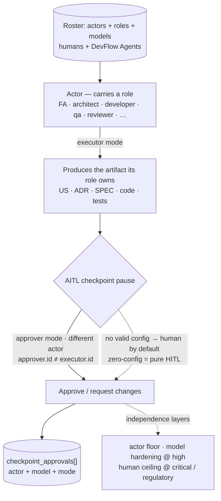

<!--
  LANGUAGE POLICY (§3.15): YAML keys, status enums, IDs, and section
  headings (##) stay in English (the schema). Prose follows the project's
  content_language (en, devflow/LANGUAGE; ADR-012).

  ⚠️ AITL-SPEC-Approval: a draft SPEC cannot start a code-run or V-Bounce.
  Material source changes invalidate the approval → stop, revise, re-approve
  (G15). One V-Bounce never spans two SPEC revisions.

  ⚠️ PRE-SPEC EVIDENCE GATE (§2.4.1): verified — every governed source used
  below is approved (US-022 AITL-US-Approval ✓; ADR-007/008/010 accepted ✓;
  DISC-001/002 approved ✓; US-016 approved ✓). 0 open OQs (G35).
-->

# SPEC-260823-1335 — Actor concept & §5.1 tree (US-022.BOLT-001)

| Field | Value |
|-------|-------|
| **Origin** | [US-022](../functional/user-stories/US-022-actor-concept.md) (approved) |
| **Bolt** | [US-022.BOLT-001](../functional/bolts/US-022.BOLT-001-actor-concept-core.md) (approved) |
| **ADRs** | ADR-007 (identity model), ADR-008 (precept), ADR-010 (grammar) |
| **Risk Class** | low · **Autonomy** L3 |
| **Revision** | 2 |

---

## 1. Objective

Add the **normative §Actor section** to the kit's core methodology
(`distribution-kit/devflow/avenga-devflow/Avenga-DevFlow.md`): the
definition of the **Actor as producer + approver** — a member of the team
who **(1) produces** the governed artifacts its role owns (functional
analyst → US, architect → ADR, developer → SPEC + code, QA → TC/tests) in
executor mode, and **(2) participates** in AITL approvals in approver mode
when configured, under the independence floor (a human by default, a
virtual DevFlow Agent only by explicit valid configuration); the actor
grammar (`human:<user>` / `agent:<id>`); the two independence layers
(actor floor, model hardening at `high`, human ceiling at
`critical`/`regulatory`); the open role taxonomy; the safe default
(zero-config = pure HITL); and the canonical Actor flow diagram (mermaid —
the producer → checkpoint → approver flow). The canonical folder tree
(§5.1) gains the `actors/` entry.

**Why:** US-022's three Bolts build on this section as the single source of
truth — the `actors/` README (BOLT-002) points to it, and the four agents /
ONBOARDING (BOLT-003) express it. **If not done:** the folder, the README
and the vocabulary would have no normative anchor to reference — the family
would drift, and the executor side of the Actor (production) would remain
implicit.

**Revision 2 (material):** the Actor concept is reframed as **producer +
approver** (per the re-approved US-022, G15) — production is first-class,
the Actor is no longer defined merely as "the participant who occupies a
checkpoint pause"; the canonical mermaid is replaced; and the placement
rule is hardened: **§3.0.1 must remain the LAST subsection of §3.0**
(immediately before `## 3.1`), containing ONLY the Actor definition + its
mermaid — never the checkpoint/routing charter content (the nesting fix
found in review).

---

## 2. Context

US-022 (approved, 5 SP) defines the Actor concept; ADR-007 fixes the
identity model (actor = unit of identity, model as attribute, authority in
structured fields), ADR-008 fixes the precept (human-by-default,
agent-by-explicit-configuration; safe-default invariant; independence
layers) and ADR-010 fixes the grammar. The concept is *decided* — this Bolt
places it *normatively* in the methodology, in the AITL section (§0
precept area / §3.0 Charter region, exact location resolved at
implementation), plus the §5.1 canonical tree entry for `actors/` and the
canonical mermaid (referenced by BOLT-002's README).

This is documentation-only, kit-only (ADR-004): the root `devflow/`
governance tree is never touched.

---

## 3. Source inventory and approval references

| Source | Ref | Approval |
|--------|-----|----------|
| Bolt | US-022.BOLT-001-actor-concept-core.md | AITL-BOLT-READY-Approval ✓ (2026-08-23, risk low) |
| Feature US | US-022-actor-concept.md | AITL-US-Approval ✓ (2026-08-23, 5 SP) |
| ADRs | ADR-007, ADR-008, ADR-010 | accepted ✓ |
| DISC evidence | DISC-001, DISC-002 | approved ✓ |
| Prior work | US-020 (manifest v5), US-021 (AITL rename), US-016 (audit tool) | delivered ✓ |
| Repository baseline | commit `45d553f` (working tree with the US-022 family drafts) | — |

Pre-SPEC evidence gate: **all governed sources approved**; no active-ADR
conflict (§3.5); 0 open OQs (G35).

---

## 4. Scope

### In scope (kit, documentation only)

- `distribution-kit/devflow/avenga-devflow/Avenga-DevFlow.md` — the new
  normative §Actor section (definition, grammar, independence layers, open
  roles, safe default) + the canonical mermaid + the `actors/` entry in the
  §5.1 canonical folder tree.

### Out of scope

- The `actors/` folder + README (BOLT-002); glossary + ONBOARDING + the
  four platform agents + the phrase-family sweep (BOLT-003); any manifest
  or schema change (US-022 AC-4 guard — `checkpoint_approvals[]` is
  landed and only referenced); any guardrail added/removed (count
  invariant); the root `devflow/` (ADR-004).

---

## 5. Prerequisites and baseline

- US-020/US-021 delivered (the manifest record and the AITL rename this
  section references — in place).
- Baseline commit `45d553f`; kit currently at version 5.1 (VERSION bump
  delivered).
- No prior SPEC prerequisite (first of US-022).

---

## 6. Phases

### Phase A — The §Actor section

**Duration:** ~1.5h total cycle — **Complexity:** Low

#### A.1 Normative text

Add the **new §Actor section** to the core methodology as the **LAST
subsection of the AITL Charter**: `### 3.0.1 The Actor` immediately before
`## 3.1 Principles (non-negotiable)` — the doc's existing `### N.M.K`
heading scheme (3.2.1, 3.3.1, 3.7.1…), so **no existing section number
changes** (§3.0 has no children today; nothing shifts; every §N reference
in the kit keeps resolving — GUARDRAILS, the four byte-identical agents
and templates included). **Placement rule: §3.0.1 contains ONLY the Actor
definition + its mermaid — it must NOT contain checkpoint/routing charter
content** (the nesting fix): the charter content (role routing, checkpoint
tables, per-checkpoint prose) stays directly under `## 3.0`, before §3.0.1.
Content per US-022 AC-1..AC-5, the production AC and AC-10:

- **Definition** — the Actor is a **member of the team** with two
  responsibilities: **(1) producing** the governed artifacts its role owns
  (functional analyst → US, architect → ADR, developer → SPEC + code, QA →
  TC/tests) in **executor** mode; **(2) participating** in AITL approvals
  in **approver** mode when configured, under the independence floor —
  human by default, DevFlow Agent by explicit valid configuration; HITL is
  the default case (actor = human) inside AITL. The Actor is **not** merely
  "the participant who occupies a checkpoint pause" — production is
  first-class. An actor's relationship to a checkpoint is **executor**,
  **approver** or **neither** (the Coordinator routes and records but never
  signs).
- **Grammar** — `human:<user>` / `agent:<id>`; the model is an attribute
  of the agent actor (`model: null` for humans) — ADR-010 forms.
- **Independence layers** — actor floor (`approver.id ≠ executor.id`,
  generalizing the handoff rule); model hardening at `high`
  (`approver.model ≠ executor.model`); human ceiling at
  `critical`/`regulatory` — ADR-008 §3.3.
- **Open role taxonomy** — recommended archetypes as examples
  (coordinator · functional-analyst · architect · developer · qa ·
  reviewer · project-defined…), never a closed enum; independence on the
  actor `id`, never on the role taxonomy — ADR-007 §3.3.
- **Safe default** — zero-config = pure HITL, byte-for-byte; enabling
  virtual approvers requires explicit per-project configuration (ADR-008
  §3.2).

**Files modified:**
- `distribution-kit/devflow/avenga-devflow/Avenga-DevFlow.md` — the §Actor
  section

#### A.2 The canonical mermaid

Add the Actor flow diagram (mermaid) to the §Actor section (§3.0.1) — the
canonical home that BOLT-002's README references/embeds (US-022 AC-9, rule
#6). **Revision 2: the new canonical diagram** — the producer →
checkpoint → approver flow (identical to US-022 §4):

**Files modified:**
- `distribution-kit/devflow/avenga-devflow/Avenga-DevFlow.md` — the
  mermaid block

### Phase B — The canonical tree entry

**Duration:** ~0.5h total cycle — **Complexity:** Low

#### B.1 §5.1 canonical folder tree

Add the `actors/` entry to the canonical folder structure section (§5.1)
with its one-line purpose (the roster home — who is in the team), mirroring
how sibling entries are described.

**Files modified:**
- `distribution-kit/devflow/avenga-devflow/Avenga-DevFlow.md` — §5.1 tree

### Phase C — Verification (GREEN)

**Duration:** ~0.5h total cycle — **Complexity:** Low

#### C.1 Evidence collection

Run the verification checks: (a) the §Actor section exists with the six
elements and the mermaid; (b) the §5.1 tree lists `actors/`; (c) the
blocking-rule count in GUARDRAILS is unchanged (39 — no guardrail edited);
(d) `git status` shows only `distribution-kit/` + governance records
(kit-only, ADR-004).

**Files created (evidence):** none — evidence recorded in the MEM.

---

## 7. Acceptance criteria

### AC-1: Normative §Actor section exists (producer + approver)

**Given** the kit's core methodology,
**When** the §Actor section is inspected,
**Then** it defines the Actor as a **member of the team** with two
responsibilities — producing the governed artifacts its role owns
(FA → US, architect → ADR, developer → SPEC + code, QA → TC/tests) in
executor mode, and participating in AITL approvals in approver mode when
configured, under the independence floor — a human by default / DevFlow
Agent by explicit valid configuration, with HITL as the default case
inside AITL; the Actor is **not** merely "the participant who occupies a
checkpoint pause" (US-022 AC-1 re-approved).

### AC-1b: Production is first-class

**Given** the §Actor section,
**When** it describes responsibilities,
**Then** it states that an Actor produces the governed artifacts its role
owns (US, ADR, SPEC, code, tests) as executor and participates in
approvals under the independence floor — the AI generates, the human
governs at every checkpoint (US-022 production AC).

### AC-2: Grammar stated

**Given** the §Actor section,
**When** it describes actors,
**Then** it uses `human:<user>` / `agent:<id>` and states the model is an
attribute of the agent actor (US-022 AC-2).

### AC-3: Independence layers stated

**Given** the §Actor section,
**When** it states approval independence,
**Then** it expresses actor floor / model hardening at `high` / human
ceiling at `critical`-`regulatory` (US-022 AC-3).

### AC-4: No schema change

**Given** the v5 manifest record,
**When** the §Actor section references `checkpoint_approvals[]`,
**Then** no manifest or schema file changes (US-022 AC-4 guard).

### AC-5: Safe default stated

**Given** the §Actor section,
**When** no virtual agent is configured,
**Then** the text states every checkpoint resolves to a human actor
(zero-config = pure HITL) (US-022 AC-5).

### AC-6: Open roles

**Given** the §Actor section,
**When** it names roles,
**Then** role is an open archetype (examples, not a closed enum) and
independence is measured on the actor `id`, never on the role taxonomy
(US-022 AC-10).

### AC-7: Canonical mermaid + §5.1 tree

**Given** the §Actor section and the canonical tree,
**When** both are inspected,
**Then** the mermaid flow diagram is present (the canonical home) and §5.1
lists `actors/` (US-022 AC-9 rule, Bolt §2).

### AC-8: Kit-only, count invariant

**Given** the diff,
**When** the Bolt lands,
**Then** `git status` shows only `distribution-kit/` + governance records,
and the GUARDRAILS blocking-rule count is unchanged (39).

### AC-9: Section-number preservation (renumbering risk)

**Given** the kit's heading scheme,
**When** the §Actor section lands as `### 3.0.1 The Actor`,
**Then** no existing section number changes — the set of numeric headings
(`§N`, `§N.M`, `§N.M.K`) in the kit is **identical** before/after, and
every existing §N reference still resolves (verified by an ADR-005-style
token-set check over the kit, including GUARDRAILS, the four agents and
templates).

### AC-10: §3.0.1 contains only the Actor definition (nesting rule)

**Given** the §Actor section,
**When** the section boundaries are inspected,
**Then** `### 3.0.1 The Actor` is the **last subsection of §3.0**
(immediately before `## 3.1 Principles`) and contains **only** the Actor
definition + its mermaid — no checkpoint/routing charter content (role
routing, checkpoint tables, per-checkpoint prose) sits inside it; the next
heading after §3.0.1's content is `## 3.1` (or a sibling body heading), not
charter content nested under it (the nesting fix from the review finding).

### AC mapping to source

| Source AC | How this SPEC satisfies it | Verifying test/evidence |
|-----------|----------------------------|--------------------------|
| US-022 AC-1 (re-approved), production AC | §Actor section text (producer + approver) | AC-1 + AC-1b presence checks |
| US-022 AC-2..5, AC-10 | grammar / independence / no-schema / safe-default / open roles | AC-2..AC-6 presence checks |
| US-022 AC-9 (canonical mermaid) | new canonical mermaid in §Actor | AC-7 (diagram present, new producer→checkpoint→approver flow) |
| US-022 AC-8/Bolt §2 (tree) | §5.1 `actors/` entry | AC-7 |
| US-022 AC-4 (no schema change) | scope guard | AC-4 + git status |
| US-022 rule #3 (count invariant) | no guardrail edited | AC-8 (count 39) |
| ADR-004 (kit-only) | scope | AC-8 (git status) |
| Review findings (renumbering + nesting) | `### 3.0.1` last subsection, zero renumbering, no charter content inside | AC-9 (token set) + AC-10 (section boundaries) |

---

## 8. Testing strategy

Deterministic (documentation):

- **RED (before):** no §Actor section exists; §5.1 lacks `actors/`; no
  canonical Actor mermaid in the methodology.
- **GREEN (after):** AC-1..AC-8 present — section text checks, mermaid
  presence, §5.1 entry, guardrail count unchanged (39), `git status`
  kit-only.
- **Edge cases:** the §Actor section must not touch identifiers or the
  manifest schema (AC-4 guard — verified by git status showing no
  metrics/schema files); no `HITL-*` history rewritten (G36 — out of
  scope); **no numeric heading edited** — the kit's heading token set
  (`§N`/`§N.M`/`§N.M.K`) is identical before/after (AC-9, an
  ADR-005-style absence check); **no nesting** — §3.0.1 contains only the
  Actor definition + mermaid, and the next heading after it is `## 3.1`
  (AC-10, verified by the heading-boundary inspection).

---

## 9. Quality gates

| Gate | Threshold | Status |
|------|-----------|--------|
| Unit / integration | — | n/a — documentation-only, no runtime |
| SAST / SBOM | — | n/a — no dependencies, no runtime |
| Perf-smoke (p95/p99) | — | n/a — no runtime surface |
| Prompt-injection scan | — | pass — no runtime surface; the §Actor text states the safe-default (ADR-008 §3.2), it does not implement enforcement |
| Secret-leak scan | — | pass — no secrets in documentation edits |
| Hallucination lint | refs resolve | pass — ADR/DISC references verified in §3 |
| IP / license provenance | — | n/a — no third-party code |
| PII / DLP | — | n/a — no personal data (internal) |
| Dependency-confusion | — | n/a — no dependencies |
| Test-first evidence | — | n/a — documentation; RED/GREEN presence evidence in §8 |
| Behavioral reproducibility | deterministic | pass — same checks reproduce identically |
| Bolt-manifest validation | validates | pass — BOLT-001 manifest + spec_revisions[] |

---

## 10. Security and data

Governance/concept text only; no runtime boundary. The section **states**
the safe-default and independence guarantees (ADR-008) — enforcement is
downstream US/Bolt work (Coordinator, validators). Data classification
`internal`.

---

## 11. Migration, compatibility and rollback

- **Migration:** additive documentation; no schema, flag or behavior
  change.
- **Compatibility:** identifiers and manifests untouched — no adopter
  breakage.
- **Rollback:** revert the kit commit; the root `devflow/` is untouched.

---

## 12. Risk matrix

| Risk | Probability (1-5) | Impact (1-5) | Mitigation |
|------|-------------------|-------------|------------|
| Concept text leaks into identifiers/manifests | 2 | 3 | AC-4/AC-8 guards + git-status scope check |
| Reframing dilutes a guarantee | 2 | 4 | Text follows ADR-008 verbatim (safe default, pauses kept); the reframe keeps grammar/independence/open roles intact |
| New section renumbers §N references kit-wide | 1 | 5 | Design: `### 3.0.1` as the last subsection of §3.0 — no existing number shifts; AC-9 token-set check + stop condition |
| §3.0.1 nests the checkpoint charter | 2 | 4 | Design: §3.0.1 is the LAST subsection (right before §3.1) containing only the definition + mermaid; AC-10 boundary check + stop condition (the review finding that motivated the fix) |
| §5.1 tree edit drifts from canonical layout | 1 | 2 | Entry mirrors sibling entries; verified in Phase C |
| Four-agent/README future drift | 1 | 3 | The mermaid's canonical home is declared here; BOLT-002/003 reference it |

---

## 13. Decisions and trade-offs

| Decision | Reason |
|----------|--------|
| The §Actor section lives in the core methodology, not in the README | Single normative source; the README (BOLT-002) is explanatory and points here (G28 discipline) |
| The Actor is reframed as **producer + approver** (rev 2) | The executor side is first-class: actors DO the work of their role (US/ADR/SPEC/code/tests) inside the approved flow — consistent with ADR-007 `modes:executor` and ADR-008; NOT autonomous initiative (that would be a separate decision) |
| §Actor lands as `### 3.0.1 The Actor` — the LAST subsection of the AITL Charter (§3.0), right before `## 3.1` | It is a genuinely **new section** in the doc's existing `### N.M.K` scheme, sits at the end of the charter so it **never nests the checkpoint content**, and shifts **no existing number** — mid-family insertion would renumber §3.1–§3.15 and break dozens of §N references kit-wide (review findings, AC-9/AC-10) |
| §3.0.1 contains ONLY the Actor definition + its mermaid | The nesting fix: the charter content (role routing, checkpoint tables, per-checkpoint prose) stays directly under `## 3.0` — never inside §3.0.1 (AC-10) |
| The mermaid's canonical home is the §Actor section (new producer→checkpoint→approver diagram) | No diagram drift — BOLT-002 embeds/references it; the diagram now shows the executor (production) and approver sides |
| Statement, not enforcement | Enforcement is downstream (Coordinator/validators, US-023+) |

---

## 14. Stop conditions

- Any file outside `distribution-kit/` + governance records appears in the
  diff → stop, revert, record (ADR-004).
- The GUARDRAILS blocking-rule count changes → stop, revert, record.
- Any manifest/schema file changes → stop, revert, record (AC-4 guard).
- **Any numeric heading is renamed or renumbered** (the kit's heading
  token set changes) → stop, revert, re-place the section (AC-9).
- **§3.0.1 contains checkpoint/routing charter content, or is not the
  last subsection before `## 3.1`** → stop, revert, re-place (AC-10 — the
  nesting rule).
- A governed source changes materially (G15) → stop, revise, re-approve.
- Turn budget (10) exhausted before GREEN → stop, MEM with progress.

---

## 15. Definition of Done (DoD)

- [ ] Phases A–C implemented
- [ ] AC-1..AC-8 pass
- [ ] GREEN evidence collected (section present; mermaid; §5.1 entry; count 39; kit-only)
- [ ] ADR-007/008/010 followed; ADR-004 kit-only
- [ ] Applicable gates pass / n/a with reason
- [ ] MEM created in `devflow/memory/` (exactly one per V-Bounce)
- [ ] Manifest `v_bounces[]` entry appended in `devflow/metrics/bolts/`
- [ ] AITL-MEM-Approval recorded

---

## 16. References

- US-022 (approved), US-022.BOLT-001 (approved)
- ADR-007 (identity), ADR-008 (precept §3.1/§3.2/§3.3), ADR-010 (grammar)
- DISC-001/DISC-002 (approved), US-016 (audit tool), US-020/US-021 (delivered)
- Example: SPEC-260822-1817 (US-021.BOLT-001 — same documentation pattern)

---

## 17. Revision history

| Date | Author | Change |
|------|--------|--------|
| 2026-08-23 | eugenio.serrano | Revision 1 — initial |
| 2026-08-23 | eugenio.serrano | Draft revision (pre-approval) — incorporated the review finding: the §Actor section lands as `### 3.0.1 The Actor` (new subsection of the AITL Charter, zero renumbering) + AC-9 heading-token preservation + stop condition + risk row + decision recorded |
| 2026-08-23 | eugenio.serrano | **Revision 2 (material, G15)** — the source US-022 was re-approved with the producer+approver reframe: the §Actor definition states the Actor as producer (executor side, first-class) + approver; the new canonical mermaid (producer → checkpoint → approver); the placement rule hardened (§3.0.1 = LAST subsection of §3.0, containing ONLY the definition + mermaid — the nesting fix); AC-1b (production) + AC-10 (nesting rule) added; risk/decisions/stop conditions updated |

---

## 18. AITL-SPEC-Approval

> **Avenga DevFlow §2.4.1, §3.0.** This SPEC remains a draft until the
> Dev-validator (+ applicable domain owners) records `AITL-SPEC-Approval`
> (in the `review` frontmatter block). Bolt approval authorizes SPEC
> preparation; **SPEC approval authorizes the V-Bounce**. A material source
> change invalidates this approval — stop, revise, re-approve (G15).

| Field | Value |
|-------|-------|
| **review.reviewers** | eugenio.serrano (dev_validator) |
| **review.decision** | **approved** (rev 1) + **approved** (rev 2 — producer+approver reframe, 2026-08-23T14:02:23) |
| **review_ready_at** | rev 1 `2026-08-23T13:35:00-03:00` · rev 2 `2026-08-23T14:02:00-03:00` |
| **review.started_at** | rev 1 `2026-08-23T13:40:00-03:00` · rev 2 `2026-08-23T14:02:00-03:00` |
| **review.decided_at** | rev 1 `2026-08-23T13:42:30-03:00` · rev 2 `2026-08-23T14:02:23-03:00` |
| **Findings** | none — acknowledged_without_comment (reason in the frontmatter `review:` block) |
