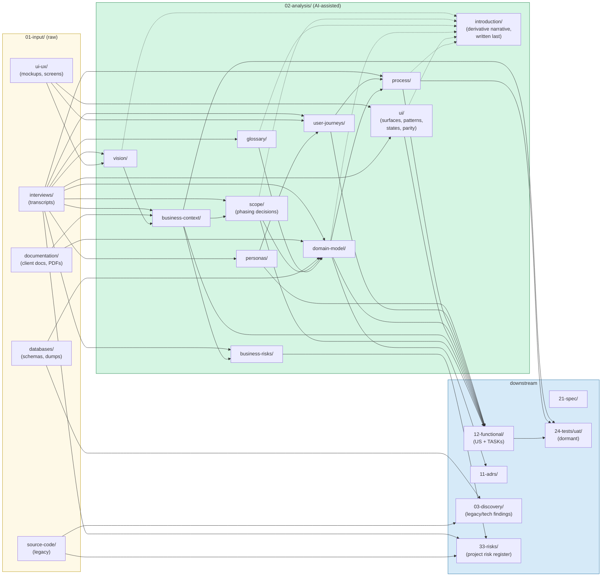

# Analysis (AI-assisted Domain Analysis)

**Methodology version:** 1.1

## Purpose

This folder is where **raw material from `01-input/` becomes structured product
knowledge**. Using AI as the primary analyst, we extract from interviews,
legacy code, databases and reference documents the information needed to
answer the core question of any project:

> **What are we building, for whom, in what world, with which language, with
> which entities, through which processes — and how will we know it's done?**

`02-analysis/` is therefore the **bridge between `01-input/` (raw evidence) and
`12-functional/` (User Stories + TASKs)**. Everything downstream — ADRs, Specs,
code, MEMs — rests on the artifacts produced here.

> See MetaFlow §2.2 (Intent), §4.1 (Input-driven inception and
> functional analysis).

---

## What lives here

| Subfolder            | Purpose                                                      | Key artifacts |
|----------------------|--------------------------------------------------------------|---------------|
| `introduction/`      | **Plain-language entry point** — one narrative per feature, written *last* (derivative of the artifacts below, never a source of truth) | One file per feature *(from TEMPLATE-INTRODUCTION.md)* — see [`introduction/README.md`](introduction/README.md) |
| `vision/`            | Product intent: who we serve, what changes, why it matters   | `vision.md` *(from TEMPLATE-VISION.md)*, outcomes, anti-goals |
| `business-context/`  | The world the product lives in                                | Stakeholders, market, compliance, success metrics |
| `business-risks/`   | Business-level threats (market, regulatory, adoption, model)  | `BR-NNN-<description>.md` *(from TEMPLATE-BR.md)* |
| `scope/`             | **Scope and phasing decisions** — what is in/out per milestone, with rationale | `mvp-scope.md`, `v1-scope.md` *(from TEMPLATE-SCOPE.md)* |
| `personas/`          | User archetypes (concrete profiles of who actually uses it)   | One file per persona |
| `user-journeys/`     | End-to-end experience across channels (user-centric view)     | One file per journey |
| `glossary/`          | **Ubiquitous language** — agreed business terms              | One file per bounded context |
| `domain-model/`      | Entities, properties, relationships and enumerations          | One file per entity + central relationships/enums |
| `ui/`                | **The visual half of the conceptual model** — surfaces, patterns, states and parity contracts | Inventories, pattern galleries, visual contracts *(from TEMPLATE-UI.md)* — see [`ui/README.md`](ui/README.md) |
| `process/`           | Business processes in BPMN (Mermaid — internal/operational)  | One file per process |
| `open-questions/`    | **Centralized backlog of unresolved questions / assumptions during the analysis phase** | One file per question (`OQ-NNN-*.md`) — see [`open-questions/README.md`](open-questions/README.md) |
> **Notes on boundaries:**
> - **Interview transcripts** are raw input, not analysis output — they live
>   in [`../01-input/interviews/`](../01-input/interviews/). Analysis *consumes*
>   them and fans them out into the artifacts above (see the routing table
>   below).
> - **UAT minutes** live in [`../24-tests/uat/`](../24-tests/uat/) — **dormant/reserved
>   in v4.2**; the UAT approval checkpoint was removed. When active they
>   verify the build, not the analysis.
> - **Project risks** live in [`../33-risks/`](../33-risks/) (transversal register,
>   technical + project + team). Only *business risks* identified during
>   analysis live here, inside [`business-risks/`](business-risks/). See
>   the ["Risks: where they live"](#risks-where-they-live) section below.

---

## End-to-end flow

**Reading order for a new project:** `vision/` → `business-context/` →
`business-risks/` → `scope/` → `personas/` → `user-journeys/` → `glossary/` →
`domain-model/` → `ui/` → `process/` → derive `12-functional/` → validate via
`24-tests/uat/`.

**Writing order note:** `introduction/` is *written last* (it derives from the
artifacts above) but *read first* — someone joining the project should start
there before any formal artifact. See
[`introduction/README.md`](introduction/README.md).

---

## AI-assisted workflow (how to actually do this)

The AI agent is the **first-pass analyst**; the **Functional Analyst governs
the result** (§4.1). Processing is iterative and AI-assisted — it is **not**
a Delivery Loop. Humans validate and consolidate.

### 1. Ingest `01-input/`
Point the agent at the raw material with a clear scope, for example:
> *"Read every transcript in `01-input/interviews/` from sprint-0. Fan the
> findings out into the routing table below — create or update files in
> each target folder; never let a finding stay in the transcript only."*

### 2. One interview → many artifacts (routing table)

This is the **canonical contract for AI ingestion**: every finding
extracted from an interview, document, recording or observation note must
land in one of these destinations. Nothing is allowed to die in the
transcript.

| Finding in the input                                              | Routes to                                                                 |
|-------------------------------------------------------------------|---------------------------------------------------------------------------|
| Why the product exists, who it serves, what success looks like    | `vision/vision.md` *(create from TEMPLATE-VISION.md)*                     |
| Stakeholders, market, competitors, regulations, business metrics  | `business-context/*.md`                                                    |
| **Business risks** (market, adoption, regulatory, model)          | `business-risks/BR-NNN-<description>.md` *(create from TEMPLATE-BR.md)*                  |
| **Project / technical / team / dependency risks**                 | [`../33-risks/RISK-NNN-<description>.md`](../33-risks/) *(transversal register, NOT analysis)* |
| What is in/out of each milestone, phase boundaries, deferrals     | `scope/<milestone>-scope.md` *(create from TEMPLATE-SCOPE.md)*              |
| End-user archetypes, goals, pain points, context of use           | `personas/<PersonaName>.md`                                                |
| End-to-end user experiences across channels                       | `user-journeys/<goal>.md`                                                  |
| Business terms, synonyms, conflicting definitions                 | `glossary/*.md`                                                            |
| Candidate entities, properties, relationships, enums              | `domain-model/entities/`, `relationships/`, `enumerations/`                |
| Surfaces, screens, UI patterns, their states, parity with a surface being replaced | `ui/*.md` *(create from TEMPLATE-UI.md)*                  |
| Business workflows: triggers, activities, decisions, exceptions   | `process/PROC-*.md`                                                        |
| Business-level acceptance criteria for a Unit / Milestone         | [`../24-tests/uat/UAT-*.md`](../24-tests/uat/)                                   |
| Open questions / assumptions to validate later                    | [`open-questions/OQ-NNN-*.md`](open-questions/) *(single source of truth during analysis; artifact's *Open questions* section just links here)* |
| Legacy code / DB / API observations ("how it works today")        | [`../03-discovery/DISC-*.md`](../03-discovery/)                                  |

**For the AI agent:** when you ingest an interview, your job is not to
produce one summary — it is to **fan out**. Walk the table top to bottom
and, for every applicable row, create or update the target file. If a
finding fits more than one row, write it in each (with cross-links).

### 3. Human consolidation
For each draft the analyst:
- Validates with stakeholders (new interviews if needed → `01-input/interviews/`).
- Resolves conflicts (same term, different meanings → glossary decides).
- Marks state (`draft` / `stable` / `deprecated`).
- Cross-links: every entity / process / persona / journey / risk should
  trace back to at least one source in `01-input/`.

### 4. Feed downstream
Once `domain-model/` and `process/` are stable enough, the team writes
**User Stories** in `12-functional/` using those terms, entities and personas.
Feature USs stop at `CP-US-Approval` (Functional Analyst) before being
decomposed; US-000 is a permanent container with no approval lifecycle.
ADR-class decisions surfaced during analysis become `11-adrs/` entries.

---

## Risks: where they live

We split risks on purpose. Both kinds are surfaced during analysis, but
they have different lifecycles and audiences.

| Risk type | Examples | Home | Why there |
|-----------|----------|------|-----------|
| **Business risk** | Market shrinks, regulation changes, low adoption, business model fails | [`business-risks/BR-NNN-<description>.md`](business-risks/) | Part of *understanding threats to the product's viability*. Stabilizes early. |
| **Project / technical / team risk** | Third-party integration unreliable, key dependency at risk, scaling unknowns, team capacity, security exposure, schedule pressure | [`../33-risks/RISK-NNN-<description>.md`](../33-risks/) | Lives during the **entire project**, fed by Discovery, Reviews, Retros, Incidents — not just analysis. Has its own lifecycle (open / mitigated / materialized / closed) and contingency plans. |

**Operational implication for the AI agent:** when a finding from an
interview reads like *"if X happens, the project / product is in trouble"*,
ask:

- *Is it about the **business** (market, customers, regulation, adoption)?*
  → create `business-risks/BR-NNN-<description>.md`.
- *Is it about **execution** (technology, integrations, team, dependencies,
  delivery)?* → create `../33-risks/RISK-NNN-<description>.md`.
- *Both?* → record in both, cross-link.

The `business-risks/` register is the *input* to the project
risk register; the register `../33-risks/` is what the team manages weekly.

---

## Analysis vs. Discovery

Use this table when you're unsure where something belongs:

| You're investigating…                                              | Goes in       |
|--------------------------------------------------------------------|---------------|
| Business rules, domain entities, processes, stakeholders           | `02-analysis/`   |
| Legacy code, DB schemas, external APIs, integrations               | `03-discovery/`  |
| A stakeholder interview                                            | raw → `01-input/interviews/`; extracted knowledge → `02-analysis/` |
| A legacy database analysis                                         | `03-discovery/`  |
| A glossary of business terms                                       | `02-analysis/glossary/` |
| Endpoint map of a legacy system                                    | `03-discovery/`  |
| Both at once                                                       | Domain in `02-analysis/`, tech in `03-discovery/`, cross-link them. |

**Rule of thumb:** if the finding describes **what the business does** →
`02-analysis/`. If it describes **how the current system works** → `03-discovery/`.

---

## Relation to other folders

| Folder         | Relation                                                                      |
|----------------|-------------------------------------------------------------------------------|
| `01-input/`       | Raw evidence (recordings, client docs, legacy code) — read-only input to analysis |
| `03-discovery/`   | Technical / legacy findings that complement the business analysis             |
| `12-functional/`  | User Stories and TASKs are derived from entities, processes, personas, journeys, surfaces and their states, and scope decisions |
| `11-adrs/`        | Domain-modelling decisions are formalized as ADRs                              |
| `21-spec/`        | Specs implement what analysis defined — entities, processes and acceptance criteria |
| `33-risks/`       | **Project risk register** (technical / team / dependency / process). Fed from `business-risks/` and from many other sources during the full project lifecycle. See ["Risks: where they live"](#risks-where-they-live). |
| `24-tests/uat/`   | UAT minutes — **dormant/reserved in v4.2**; the UAT approval checkpoint was removed          |
| `open-questions/` | Analysis-phase question backlog. Sunsets at readiness: an `open` or `in-validation` OQ targeting a TASK's parent or governing artifacts blocks its `CP-TASK-READY-Approval` — it is part of the TASK DoR (§2.9, §3.2, G35). See [`open-questions/README.md`](open-questions/README.md). |

---

## Operating notes

- Every artifact is a **living document**. Mark a `status` in the frontmatter.
- Anything quantitative must cite its source (interview, document) or be
  flagged as `assumption`.
- A change that affects how the domain is modelled (entity split, relationship
  change, process rewrite) requires an **ADR**.
- Each subfolder has its own `README.md` and an `INDEX.md` (curated inventory
  where its documents carry no sequential ID, §5.15) plus templates. Start
  from those.

### Status lifecycle in `02-analysis/`

| Status | Meaning | Used in |
|--------|---------|---------|
| `draft` | Work in progress, not yet reviewed | All subfolders |
| `stable` | Reviewed and accepted — current truth | Most subfolders |
| `active` | Reflects the current (or target) business flow — `process/` uses this instead of `stable` | `process/` only |
| `deprecated` | No longer valid — kept for history | Most subfolders |
| `superseded` | Replaced by a newer version of the same artifact | `vision/`, `scope/` only |

> **`superseded` vs `deprecated`:** Use `superseded` when a new document
> explicitly replaces this one (e.g. vision v2 replaces v1). Use `deprecated`
> when the artifact simply becomes irrelevant (e.g. a persona that no longer
> exists). `open-questions/` has its own lifecycle (`open | in-validation |
> answered | deferred | dropped`).

- **`version` in the frontmatter** is carried only by the artifacts that are
  replaced *as a whole* by a numbered successor — `vision/` and `scope/`.
  Everywhere else in `02-analysis/` the document is a living one:
  it is edited in place and its history is the git log, so a version field
  would sit at `1.0` forever. This is the same boundary as the `superseded`
  status above.
- **Language policy** is methodology-wide, not analysis-specific: schema
  (frontmatter keys, status enums, IDs, tags) stays in
  **English**; section headings and prose follow the project's
  `content_language`, declared in
  [`../LANGUAGE`](../LANGUAGE). See MetaFlow
  **§3.15**.
