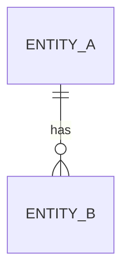

<!--
  LANGUAGE POLICY (§3.15): YAML keys, status enums, IDs stay in English
  (the schema). Section
  headings (##) follow the project's content_language. All prose — relationship
  descriptions, business rules — goes in the project's content_language.
  See metaflow/README.md -> Language policy.
  `CP-*-Approval` codes are never translated.
-->

# Relationships — [Module name]

## 1. ER Diagram

## 2. Relationship Catalog

| Source | Target | Cardinality (source — target) | Description | Business rule |
|--------|--------|-------------------------------|-------------|---------------|
| Entity A | Entity B | 1 — 0..N | ... | ... |

## 3. Notes

<!-- Additional context, constraints, or design decisions about these relationships. -->

## 4. History

| Date | Change | Author |
|------|--------|--------|
| YYYY-MM-DD | Created | ... |
