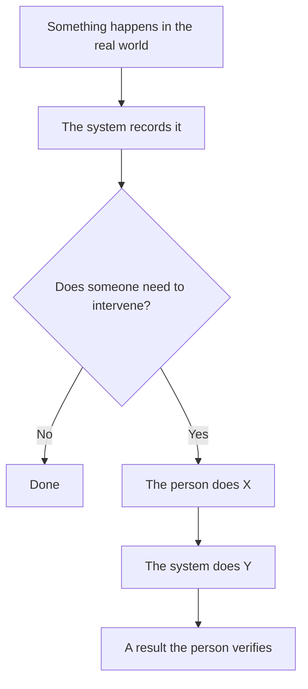

<!--
  ⛔ PREREQUISITE — STOP AND CHECK BEFORE WRITING A SINGLE LINE.

  This is the LAST artifact of the analysis phase. It can only be written once
  the artifacts it summarizes already exist, at least in draft:

    [ ] vision/vision.md
    [ ] scope/ — at least one milestone
    [ ] domain-model/ — entities and enumerations of the feature
    [ ] process/ — at least one process
    [ ] glossary/ — the feature's ubiquitous language
    [ ] open-questions/ — the register, even if every question is still open
    [ ] 03-discovery/ — the relevant DISC, if a legacy system is involved

  If any of these is missing, DO NOT WRITE THIS DOCUMENT YET. This artifact is
  derivative (`derivative: true`): with nothing to derive from, writing it means
  inventing the domain — which is exactly what this artifact class forbids.

  Note that the gate is about EXISTENCE, not approval. Draft artifacts are
  enough, and open questions are part of the story: "what we still don't know"
  belongs in the narrative.

  ✅ AND USE IT AS A TEST: if you cannot tell the story simply from the
  artifacts, that is a finding about the ARTIFACTS, not about the narrative.
  Do not paper over the gap with a vague sentence — route it (open a
  OQ-NNN, or fix the artifact) and then come back to the narrative.

  LANGUAGE POLICY (§3.15): YAML keys, status enums, IDs stay in English
  (the schema). Section (##) headings and narrative prose go in the
  project's content_language. See metaflow/README.md -> Language policy.
  `CP-*-Approval` codes are never translated.

  ⚠️ GOLDEN RULE OF THIS FOLDER: this document is DERIVATIVE. It introduces no
  business rule, decision or finding of its own. Everything it states must be
  backed by an artifact in 02-analysis/ or 03-discovery/, linked in the "Where to
  read next" section. Where the
  narrative and the artifact disagree, the artifact wins. See README.md.

  TONE: tell, don't enumerate. Short sentences, no jargon, no unexplained
  acronyms. If a sentence only works for a reader who already knows the system,
  rewrite it.
-->

# [Feature] — [plain-language explanation]

## 1. Who this is for

<!--
  Two or three lines: who should read this, how long it takes, and what it does
  NOT require them to know. Then the banner below, kept verbatim and rendered in
  the project's content_language — it is what stops this document from being
  mistaken for a specification.
-->

> ⚠️ **This document is not a source of truth.** It is a narrative summary derived from the
> artifacts in `02-analysis/` and `03-discovery/`. Where something here disagrees with those
> documents, **they win**.

---

## 2. The world before the system

<!--
  Start in the real world, not in the system. Who does what, out there, and what
  happens inside as a consequence? The first sentence must not mention a table,
  a screen or a process.

  Ending this section on a turn ("everything is fine — until it isn't") sets up
  section 3 naturally.
-->

## 3. The problem

<!--
  What breaks, gets complicated or does not scale in that world, and why the
  feature exists. The strongest shape: show the small case that solves itself,
  then the big case that needs this tool.
-->

## 4. The story, end to end

<!--
  A deliberately simple diagram of the full cycle — from the real-world action to
  the real-world result. Simple on purpose: the precise detail lives in process/.
  Then the narrative, step by step, with "### Step N — ..." subheadings named in
  the person's language, not the system's.

  Where a behaviour is counter-intuitive, say so and explain it — that is where
  a newcomer's real misunderstandings come from.
-->

### Step 1 — […]

### Step 2 — […]

## 5. What we are building

<!--
  The project itself: what is being built or migrated, and why. If a constraint
  changes the meaning of everything (coexistence with a legacy system, an
  external dependency, a frozen database), explain it here with both its upside
  and its uncomfortable side. Honesty before enthusiasm: the reader will find the
  contradictions anyway.
-->

## 6. The essentials

<!--
  For the reader who will not read everything: the few things they cannot
  misunderstand. Bold the idea, then explain it in one line. More than five or
  six means some are not essential.
-->

1. **[…]**
2. **[…]**

## 7. Where to read next

<!--
  Ordered by QUESTION, not by folder. Drop the rows that do not apply and add
  the ones this feature needs.
-->

| To understand… | Go to |
|----------------|-------|
| Why we are doing this and what we want to achieve | [vision/vision.md](../vision/vision.md) |
| What is in and out of this milestone | [scope/](../scope/) |
| The flow, step by step, in detail | [process/](../process/) |
| What each unfamiliar term means | [glossary/](../glossary/) |
| The "things" in the domain | [domain-model/INDEX.md](../domain-model/INDEX.md) |
| Who uses this and what they need | [personas/](../personas/) |
| What can go wrong and how much it matters | [business-risks/INDEX.md](../business-risks/INDEX.md) |
| What we still do not know | [open-questions/INDEX.md](../open-questions/INDEX.md) |
| How the current system works internally (technical) | [../../03-discovery/](../../03-discovery/) |

## 8. History

| Date | Change | Author |
|------|--------|--------|
| YYYY-MM-DD | Initial version | @user |
