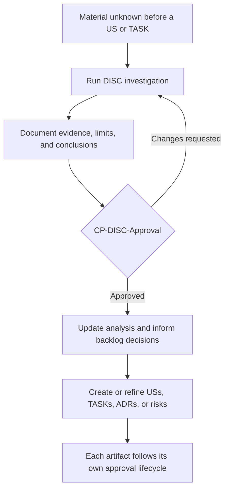
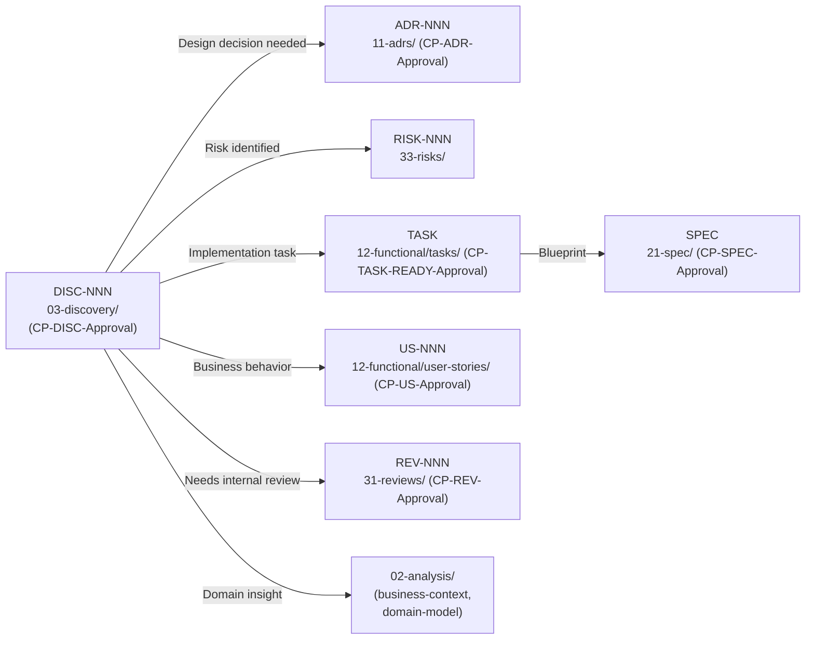

# Discovery (Need-driven Investigation)

**Methodology version:** 1.1

## Purpose

This folder stores **focused, traceable investigations** (`DISC-NNN`) used to
reduce an **important uncertainty before a User Story or TASK is created or
materially refined** (§2.13).

Typical Discoveries examine an external API, an unfamiliar library or
framework, a legacy-system behavior, an integration constraint, a technology
option, data availability, or another question that must be understood before
the team can define the right work.

A Discovery creates **evidence and conclusions for backlog definition** — it
does **not** inspect an existing project artifact for quality and does
**not** authorize implementation.

---

## Need-driven, not mandatory

A Discovery is **not required for every User Story or TASK**. Any stakeholder
or team member may initiate one when a material unknown would otherwise force
the team to guess.

**Once initiated, its governance is mandatory:**

- It remains a **draft** until a qualified human records
  `CP-DISC-Approval`.
- Its conclusions **cannot be used as governed input** (analysis, USs,
  TASKs, ADRs, risks) until approved.
- `CP-DISC-Approval` confirms the research question was answered with
  adequate evidence, the limits and assumptions are explicit, and the
  conclusions are reliable enough to guide backlog or architecture work.
- It does **not** approve any downstream artifact — each US, TASK, ADR or
  risk created from the Discovery follows its own lifecycle and CITL
  approval.
- **No code without a TASK:** if the research requires executable prototype
  or spike code, that experiment must be authorized by an **approved
  non-functional TASK under `US-000-non-functional.md`** before any code is
  generated.



---

## Discovery vs. Review vs. Adversarial Review

| Dimension | Discovery (`DISC`) | Review (`REV`) / Adversarial Review (`AREV`) |
|-----------|--------------------|----------------------------------------------|
| Starting point | A material unanswered question **before** a US or TASK is defined or refined | An existing project artifact, implementation, characteristic, or concern to inspect |
| Primary purpose | Learn, gather evidence, reduce uncertainty | Evaluate, challenge, identify findings |
| Typical subjects | External APIs, unfamiliar libraries, legacy behavior, technology options, data or integration constraints | Documentation, code, tests, USs, TASKs, ADRs, SPECs, architecture, security, performance, or process |
| Governed output | Approved evidence, assumptions, limits, conclusions | Approved findings; AREV exposes them only after its approved Verdict |
| CITL governance | `CP-DISC-Approval` | `CP-REV-Approval`, or the three sequential AREV phase approvals |
| Downstream effect | Informs analysis and the creation/refinement of governed artifacts | May create or update any governed artifact |

> An AREV is a **specialized adversarial form of Review**, not a Discovery.
> A Discovery does not create an exception to the rule that no code-related
> change may exist without an approved TASK (§2.13).

---

## What goes here

- **Third-party API investigation** — endpoints, auth, rate limits, error
  handling, SLAs, versioning strategy.
- **Unfamiliar library / framework evaluation** — how to use it correctly,
  deprecations, breaking changes, fit for the project.
- **Legacy-system behavior analysis** — schema analysis, stored procedures,
  business rules embedded in code, data migration paths.
- **Integration constraint mapping** — how external systems connect, data
  formats, protocols, retry/fallback behaviour.
- **Technology evaluation** — frameworks, libraries, tools under
  consideration (POC results, benchmarks, trade-offs).
- **Data availability research** — what data exists, its quality, and
  whether it is accessible.
- **Vendor documentation analysis** — summarized datasheets, SDK
  walkthroughs, configuration guides.
- **Regulatory / compliance research** — external regulation analysis
  (the compliance *impact on our project* goes to
  `02-analysis/business-context/`).

## What does NOT go here

- **Quality review of existing project artifacts** → `31-reviews/` (`REV-NNN`).
- **Adversarial debate** → `32-adv-reviews/` (`AREV-NNN`).
- **Business analysis** (vision, personas, journeys, domain model)
  → `02-analysis/`.
- **Architectural decisions** → `11-adrs/` (`ADR-NNN`).
  A discovery *feeds* an ADR; it is not the decision itself.
- **Risks** → `33-risks/` (`RISK-NNN`). A discovery may
  *surface* a risk, but the risk is tracked in the register.
- **Bug fixes** → `13-bugs/` (`BUG-NNN`).

---

## Naming convention

```
DISC-NNN-short-description-in-kebab-case.md
```

---

## DISC structure

The authoritative structure is [`TEMPLATE-DISC.md`](TEMPLATE-DISC.md) — its
**11 numbered sections**, plus the frontmatter:

- **Frontmatter** — ID, descriptive title, date, author, `llm`, status, sources and the `review` block.
1. **Research question** — What material unknown is being reduced.
2. **Scope** — What the investigation covers and, explicitly, what it does not.
3. **Executive summary** — Main finding or most relevant conclusion.
4. **Inventory / Mapping** — Detailed listing: endpoints, tables, signals, components, configurations.
5. **Detailed findings** — In-depth description with code snippets, pseudocode or Mermaid diagrams.
6. **Experiments performed (if any)** — What was run, against what, and the result.
7. **Assumptions and limits** — What was NOT found or could not be determined; explicit limits of the investigation.
8. **Conclusions and recommendations** — Next steps, ADRs needed, risks surfaced, estimated impact.
9. **Sources** — Links to datasheets, external docs, vendor portals.
10. **History** — Change log.
11. **`CP-DISC-Approval`** — The checkpoint that makes the findings actionable.

Diagrams in **Mermaid** (mandatory — no ASCII art or embedded images).

---

## How discovery feeds downstream (only after approval)



Each downstream artifact follows its own lifecycle and *applicable* CITL approval —
nothing is implied by `CP-DISC-Approval` (RISK has no CITL checkpoint).

---

## Lifecycle

| Status       | Meaning |
|--------------|---------|
| **draft**    | Investigation running; conclusions not yet usable as governed input. |
| **approved** | `CP-DISC-Approval` recorded; conclusions may inform analysis and backlog decisions. |
| **deprecated** | No longer relevant (legacy retired, technology discarded, API decommissioned). Kept as historical reference. |

`INDEX.md` reflects status: Draft / Approved / Deprecated.

---

## Relations to other folders

| Folder | Relation |
|--------|----------|
| `11-adrs/` | Discoveries feed architectural decisions (approved first) |
| `33-risks/` | Discoveries surface external risks (dependency, SLA, integration) |
| `12-functional/user-stories/` | Approved conclusions may support creation or refinement of feature USs (CP-US-Approval) |
| `12-functional/tasks/` | Discoveries feed TASKs (TASK-first rule) that produce SPECs |
| `21-spec/` | SPECs are created from TASKs triggered by discoveries |
| `31-reviews/` | A review may trigger a discovery (unknown external dep found); a discovery may trigger a review (external change requires internal audit) |
| `32-adv-reviews/` | AREV is a specialized form of Review — never a Discovery |
| `02-analysis/` | External findings may enrich business-context or domain-model |
| `22-memory/` | Implementation informed by discoveries is documented in MEM |
| `01-input/` | Raw external docs (datasheets, vendor manuals) live in `01-input/documentation/` |

---

## Index

See **[INDEX.md](INDEX.md)** for the full listing.

---

## Language

YAML keys, status enums, IDs, and template section headings stay in **English**
(the schema). All prose — descriptions, context, rationale, findings — goes in
the project's `content_language`, declared in [`../LANGUAGE`](../LANGUAGE)
(see §3.15).
