# 0 — Quick Start

If you read nothing else, this is how to ship your first TASK:

1. **Start from raw evidence.** Process the source material in
   `metaflow/01-input/` and iteratively update the relevant artifacts in
   `metaflow/02-analysis/`.
2. **Choose the correct parent.** Business behavior belongs to an approved
   feature US. A technical outcome belongs to the permanent
   `US-000-non-functional.md` traceability container. New or materially changed
   feature User Stories stop at **CP-US-Approval**; US-000 does not require
   functional approval. QA Automation belongs to an approved TC and uses the
   Test TASK naming `TC-NNN.TASK-NNN-<description>.md`.
3. **Approve BUGs before their TASKs, then define and approve every TASK.** If
   the work corrects a defect, a Functional Analyst, Developer, or QA first
   drafts the BUG. `CP-BUG-Approval`—functional by a Functional Analyst,
   non-functional by an Architect or Tech Lead when `severity: critical`,
   otherwise by any team member, the BUG's own author included—must be recorded
   before its one dedicated TASK is created. A Functional Analyst creates a
   functional TASK under the relevant feature US. A Developer, Architect, or
   Tech Lead may create a non-functional TASK under US-000 without Functional
   Analyst approval. Each TASK states what must be delivered, never how to
   implement it, and stops independently at **CP-TASK-READY-Approval**,
   routed to the Functional Analyst for functional TASKs and to an Architect
   or Tech Lead for non-functional TASKs — except the dedicated TASK of a
   non-functional BUG, which mirrors its parent BUG's severity routing
   (§2.16). A Test TASK is created by QA or a
   QA Automation Engineer from one approved TC and is approved by a QA Lead,
   QA Automation Lead, Architect, or Tech Lead.
4. **Design and approve the Test Cases from intent, not implementation.** For
   work that requires QA verification, QA derives each `TC-NNN` from the
   approved feature US/ACs and the exact approved TASK, or from the approved
   non-functional TASK plus its governing ADRs. Existing code may help locate
   interfaces and setup data, but it must never define the expected result.
   Every TC remains a draft until **`CP-TC-Approval`**.
5. **Build and approve one SPEC for the TASK.** Before generating it, the
   agent verifies the approval state of every governed source it will use.
   It then analyzes the approved TASK, its approved feature US and ACs when
   functional, every applicable approved TC, all applicable approved ADRs, relevant `01-input/` and `02-analysis/`
   material, approved DISC/REV/AREV evidence when used, and the existing code,
   tests, configuration and schemas. The SPEC remains a draft until
   **CP-SPEC-Approval**.
6. **Launch the agent only after `CP-SPEC-Approval`** — it generates code +
   tests and runs the tests itself
    until green. If the agent stalls beyond its turn budget (the configured
    number of agent loops without a green test suite, §3.3), it **stops and
   asks only after creating the Delivery Loop MEM and manifest entry** with the
   blocker and current evidence; you may patch manually and record that
   intervention in the MEM.
7. **CI gates run automatically** — tests, security, performance and the
   applicable AI-native gates (prompt-injection, secret-leak, hallucination
   lint, IP provenance, PII/DLP, dependency-confusion). Every applicable gate
   must finish as `pass` or as an explicitly approved `waived`; `fail` blocks
   merge, acceptance and promotion. Non-applicable gates are recorded as
   `n/a` with a reason.
8. **Generate the mandatory MEM** — after implementation and verification, the
   agent creates exactly one `MEM` for the Delivery Loop, listing what was done,
   every file added, changed, or deleted, verification evidence, decisions,
   deviations, risks, and traceability to the TASK and approved SPEC. It then
   updates the manifest and pauses.
9. **Approve the MEM and close the Delivery Loop** — a Dev-validator reads the
   **actual diff, test/gate evidence, MEM, and manifest** and records
   **`CP-MEM-Approval`**. Only this approval completes and approves the
   Delivery Loop. If it is the latest Delivery Loop for the TASK, approval also marks the
   TASK as **`Development Completed`**. A request for changes leaves that
   Delivery Loop unapproved, keeps the TASK **`In Development`**, and the next
   autonomous execution becomes a new Delivery Loop with a new MEM.
10. **Demo, accept, and promote** — PO/PM for functional TASKs, the routed
   technical owner for non-functional TASKs, or QA Lead/QA Automation Lead for
   Test TASKs record
   **`CP-TASK-DONE-Approval`**. Release and promotion follow the adopting
   team's own process (§4.6); MetaFlow does not prescribe Unit/UAT approval
   checkpoints in this release.

Everything else in this document explains the **why**, the **edge cases**
and the **governance** behind these steps.

**Non-negotiable rules:**

- A TASK without a manifest in `metaflow/23-metrics/tasks/` does not exist (and
  every US and TC has its own manifest too, §3.12).
- A feature User Story without **CP-US-Approval** remains a draft and cannot
  be decomposed into candidate functional TASKs. US-000 is a permanent
  technical traceability container, not a feature US awaiting functional
  approval.
- A TASK without its own **CP-TASK-READY-Approval** remains a candidate and cannot
  enter SPEC preparation or technical execution.
- No code, configuration, infrastructure, schema, or test change happens
  without an approved TASK — every SPEC references that TASK.
- Test Cases are specification-side verification artifacts. They are derived
  from approved US/ACs and approved TASKs, never reverse-engineered from the
  current code as the source of expected behavior. A TC without
  `CP-TC-Approval` remains a draft and cannot authorize QA Automation.
- Every approved TC selected for QA Automation originates one or more
  dedicated Test TASKs. Each such TASK references exactly one TC, is a direct
  child of that TC, and is named `TC-NNN.TASK-NNN-<description>.md`; it follows
  the complete TASK → SPEC → Delivery Loop → MEM lifecycle.
- A TASK has exactly one current canonical SPEC, and a SPEC belongs to exactly
  one TASK. A SPEC without `CP-SPEC-Approval` cannot start a code-run or
  Delivery Loop.
- Every Delivery Loop produces exactly one MEM. A Delivery Loop without a complete MEM,
  an updated manifest, and `CP-MEM-Approval` is not approved and cannot
  advance to merge, promotion, or TASK acceptance.
- A TASK may execute 1..n Delivery Loops against its canonical SPEC. Every
  Delivery Loop has a different MEM; previous MEMs are immutable history. Only an
  approved MEM for the latest Delivery Loop marks the TASK `Development Completed`.
  `CP-TASK-DONE-Approval` is still required to mark it `Done`.
- The agent does not generate a SPEC while any governed artifact it needs is
  draft, rejected, stale, or missing its applicable CITL approval. It reports
  the blocker instead. Raw inputs, analysis artifacts and existing code do not
  have independent approval checkpoints, but must be inspected and traced.
- Every general-purpose non-functional TASK is assigned to the permanent
  `US-000-non-functional.md` User Story. There are no "quick fix", "chore",
  refactor, hardening, or infrastructure exceptions to TASK traceability. QA
  Automation uses the dedicated Test TASK type parented by an approved TC.
- Functional TASKs deliver business behavior under a feature US;
  non-functional TASKs deliver general technical outcomes under US-000; Test
  TASKs deliver QA Automation under one approved TC. No TASK type contains
  architectural decisions or implementation instructions.
- Functional TASKs are owned and approved by Functional Analysts.
  Non-functional TASKs may be created by Developers, Architects, or Tech Leads
  and receive technical approval without requiring a Functional Analyst.
- Every BUG remains a draft until `CP-BUG-Approval`. Only then may its
  dedicated TASK be created. A functional BUG recommends a Functional Analyst;
  a non-functional BUG recommends an Architect or Tech Lead when
  `severity: critical`, otherwise any team member — but the routing is guidance,
  never a gate: any qualified team member, the BUG's own author included, may
  record it at any severity.
- Every approved BUG has exactly one dedicated TASK. A functional BUG's TASK
  is a child of the affected approved feature US; a non-functional BUG's TASK
  is a child of `US-000-non-functional.md`. The BUG alone never authorizes a
  code or test change.
- BUG correction uses strict TDD inside the same Delivery Loop: first create and run
  the automated test that reproduces the defect and observe it fail (red),
  then change the implementation and run the tests until they pass (green).
- A checkpoint is occupied by a human **by default**; a virtual MetaFlow Agent
  only by explicit, valid configuration — absent or invalid configuration,
  every checkpoint is human-only and no AI-signed approval is possible (§3.0).
- A failed quality gate cannot be waived without an ADR approved through
  `CP-ADR-Approval`; the gate then records `waived`, never `pass`.
- The reviewer reads the **diff**, not the agent's self-summary.
- Agent/model selection between AREV phases is a manual human action in the
  development tool (§3.13); the framework never switches it automatically.
- One working day is the sizing target for a TASK, not a destructive boundary.
  A TASK is never split merely because it required multiple Delivery Loops or its
  latest Delivery Loop continued into the next day.

---

# 1 — Introduction

Methodically integrating Artificial Intelligence (AI) into the software life
cycle produces verifiable gains in **delivery speed** and **quality**, provided
it is combined with solid engineering and governance practices.

From a **delivery** standpoint, empirical evidence shows substantial
improvements in development time when teams use code agents: tasks that
previously took hours or days are completed in minutes or hours.

In **quality**, AI helps expand test coverage and review depth. Empirical
evaluations of LLM-based test generation report competitive average coverage —
better than recent automated techniques — accelerating early detection of
defects and regressions. Results improve with careful *prompting* and human
review.

To make sure these benefits translate into **sustainable outcomes**, it is
essential to instrument and **monitor delivery performance metrics** such as
Delivery Flow (change lead time, deployment frequency, failed deployment recovery
time, change fail rate and deployment rework rate), using
them as efficiency signals of the SDLC and linking them to business goals.
The longitudinal research on software delivery shows that
systematic improvement of these metrics correlates with higher organizational
performance and operational stability; within this framework, AI — when
correctly integrated into the development and operations pipeline — **acts as
an accelerator** of these capabilities.

This document presents **MetaFlow** as the operational methodology and
framework for AI-assisted software development, based on the paper *"AI-Driven
Development Life Cycle: Reimagining Software Engineering"* published on the AWS DevOps Blog.

<https://aws.amazon.com/es/blogs/devops/ai-driven-development-life-cycle/>

We use the term "methodology" for the organized set of processes, practices
and metrics that guide the work; and "framework" for the conceptual and
technical scaffolding that articulates roles, artifacts, flows and controls.
The framework relies on software life cycle and security standards that favor
traceability and governance from day one.

The approach aligns with established software life cycle processes and is
**inspired by** the verification/validation discipline of the classic
**V-Model**, without claiming to be a strict V-Model derivative. Delivery Loop is
a **horizontal iteration cycle** (SPEC approved through `CP-SPEC-Approval`
→ autonomous generation and verification → mandatory MEM + manifest →
`CP-MEM-Approval`); the V-Model is a
**vertical V&V mapping** (unit/integration/system/acceptance). We borrow the
*spirit* of explicit V&V, not the geometry.

**MetaFlow is the proprietary methodology and framework of Eugenio Serrano
LATAM**, developed by the research team to systematize AI-assisted software
development.

The process is governed by **flow and quality metrics** aligned with empirical
evidence on delivery performance, encourages knowledge transfer and stays
compatible with industry standards without losing focus on operational
reality. The outcome: turning ideas into deliverables in hours or a few days
in a predictable, auditable and scalable way.

MetaFlow structures work into **TASKs** (units of work and tracking with
a sizing target of **1 hour to 1 working day of active delivery time** and a
demonstrable, measurable result) and
operationalizes each TASK through **Delivery Loop**.

**Delivery Loop** is the operational micro-cycle of MetaFlow defined by this
research team: it starts from a SPEC approved through `CP-SPEC-Approval` (with an approved feature US and
covered ACs when functional, the US-000 container when non-functional, and
approved ADRs), and the
**AI agent generates the intended-final artifacts by default** (design, code,
tests) **while
running and validating tests as part of the same autonomous loop**. The agent
then creates exactly one MEM, updates the TASK manifest, and submits the
complete package for `CP-MEM-Approval`. Autonomous retries remain internal
to that Delivery Loop. The Delivery Loop is approved only when this checkpoint is
approved. If the human requests changes, the current Delivery Loop remains
unapproved and the next agent execution is recorded as a new Delivery Loop with a
new MEM.

Conceptually derived from the **V-Model** by making verification and
validation explicit, Delivery Loop maps the established life cycle processes. Its
core is **actor-in-the-loop as validator** — a human by default, a virtual
MetaFlow Agent only by explicit, valid configuration — ensuring end-to-end
quality, robustness and traceability. Management is anchored in **flow
metrics** (lead time, throughput and commitment rate) consistent with
delivery-performance
evidence (Delivery Flow).

> **Foundational principle (Actor-in-the-Loop — CITL, non-negotiable):** The AI
> agent generates the **intended-final draft** of code, design and tests by
> default, and
> **runs and iterates on the tests in the same loop** until green. Every named
> checkpoint (§3.0) is occupied by an **actor** who **steers** (Spec, prompts,
> ADRs), **reviews** (diff + evidence) and **approves** — a **human by default**,
> and a virtual MetaFlow Agent only by explicit, valid configuration. With no or invalid configuration the project behaves exactly like
> pure Human-in-the-Loop: every checkpoint is a human approval and **no AI-signed
> approval is possible** (the safe-default invariant). Direct human code patches
> are a **legitimate fallback** — not the default — and are logged explicitly in
> the MEM. TASK time is measured along **three axes** (AI-time, human-review-time,
> total cycle time; §3.7), not in person-hours. **No artifact reaches production
> without an approved checkpoint.** Bypassing a checkpoint breaks the flow and
> invalidates the TASK. See §3.0 *Actor-in-the-Loop Charter*.

Operationally, the flow begins with the **raw source material preserved in
`metaflow/01-input/`**, including stakeholder interviews, business documents,
legacy databases, third-party documentation, source code, and UI/UX evidence.
AI-assisted analysis iteratively updates the artifacts in `metaflow/02-analysis/`
and may generate or update User Stories. A Functional Analyst must explicitly
approve each feature User Story at **CP-US-Approval** and approve each
functional TASK separately at **CP-TASK-READY-Approval**. Non-functional TASKs are
created under US-000 by Developers, Architects, or Tech Leads and receive
technical `CP-TASK-READY-Approval` from an Architect or Tech Lead, without requiring
Functional Analyst approval. Only an approved TASK may enter SPEC preparation
and technical execution. For verifiable ACs, the
**Given/When/Then** BDD format is recommended.

Finally, the rationale relies on **mixed empirical evidence**: there are
productivity and satisfaction gains on bounded tasks with code assistants,
but also results pointing to **slowdowns** for senior developers working in
familiar repositories without proper orchestration and governance. Hence the
importance of controlled micro-cycles (Delivery Loop), measurable artifacts
(TASKs) and flow metrics to capture benefits and limit risks.

## Methodology objectives

1. Accelerate value delivery using AI from conception to operation.
2. Raise quality by embedding testing and validation in every Delivery Loop, with
   a clear Definition of Done.
3. Increase predictability by using TASKs as the unit of promise and
   measurement.
4. Improve traceability between interviews, requirements, design, code, tests
   and decisions (**ADRs**).
5. Reduce rework with clear **Definition of Ready / Done** and **automated
   gates** in CI/CD, backed by security and supply-chain practices.

## Expected benefits

1. Shorter cycles (**hours / days**) without losing rigor.
2. Better alignment with the business team: every TASK has a specific demo
   criterion.
3. Transparency: **simple metrics** for management and **technical signals**
   for engineering.
4. Continuous learning: every Delivery Loop captures decisions and lessons learned
   (**ADRs**).

## Target audience

Engineering, QA, product and project leaders who want to operate with AI as
the **primary generator of design, code and tests**, keeping the human as
validator and approver at critical points.

## When MetaFlow fits — and when it does not

The methodology is empirically biased toward contexts where AI agents add
leverage. We name the limits explicitly (METR 2025 found senior developers
can be **slowed down** in familiar legacy repos without proper orchestration).

**Strong fit:**

- Greenfield or near-greenfield projects.
- Codebases with clear contracts (typed APIs, well-defined ACs).
- Teams with at least one Dev-validator trained to critically review LLM
  output (hallucinated APIs, plausible-but-wrong logic).
- Use cases where Delivery Flow-style telemetry is feasible.

**Use with care (run a 2-week pilot first):**

- Large legacy codebases highly familiar to senior developers.
- Domains under heavy regulation requiring model attestation.
- Teams without code review culture or CI baseline.

**Do not adopt as-is:**

- Safety-critical software (medical devices, avionics) without an additional
  certification layer on top.
- Codebases containing data classified as `confidential` or higher that
  cannot be sent to the configured LLM provider — require an on-prem /
  vetted model first.

**Repository topology assumption:** MetaFlow assumes **one
product repository with the `metaflow/` documentary root versioned inside
it** (§5.1). Cross-repository work — a TASK that touches several repos, or
a monorepo where `metaflow/` is shared across services — is **not** covered
by this version: the canonical SPEC, the TASK manifest and the MEM all resolve
paths against the single repository baseline. Teams needing multi-repo
traceability must adapt the location of `metaflow/` and the manifest's
repository-relative `ref`/`sources` semantics before adopting the
framework.

The next sections cover the glossary, principles, full flow (from raw input
to deployment), operational templates (US+AC, ADR, TASK, Delivery Loop), metrics
and a phased adoption plan.

---

# 2. Glossary and key concepts

This section is the normative source for concepts, definitions, taxonomies and
artifact contracts. Section §3 is the normative source for lifecycle, CITL,
gates, autonomy and metrics. Section §4 is an explanatory walkthrough and §5
is normative only for artifact locations, filenames and folder
responsibilities. When repeated text appears to diverge, the section that owns
that dimension governs and the other text must be corrected; no summary creates
an alternative rule. Where §2 and §3 both state an approval transition, §2 owns
the artifact's resulting status and §3 owns the lifecycle consequence of that
transition; the statements must remain identical.

## 2.1 Raw inputs (primary evidence)

**What they are:** The unprocessed source materials stored in
`metaflow/01-input/`: business and regulatory documents, database evidence,
third-party documentation, recorded stakeholder interviews, legacy source
code, and UI/UX evidence.

**Purpose:** Raw inputs are the evidence base of the entire MetaFlow.
AI agents and Functional Analysts process them to create or update the
artifacts in `metaflow/02-analysis/`, which in turn support User Stories,
Acceptance Criteria, risks, ADRs, ADR-defined constraints, and candidate TASKs.

**Recorded interviews:** Interviews are one especially valuable input type.
The AI may help transcribe them and extract goals, constraints, risks, success
metrics, and open questions, but interview-derived conclusions must remain
traceable to the original recording or transcript. The transcript itself is
raw input: it is **deposited by a human** into `01-input/interviews/` — agents
never write there, even when they produced the transcription (G31, §5.6).

**Good practices:** Preserve originals, record provenance, avoid silent
normalization, classify sensitive data, and document consent where recordings
or personal information are involved.

## 2.2 Intent

**What it is:** The high-level business or technical intention (the "why").
The objectives of the software product. A project may have one or more
Intents that aim to satisfy stakeholder needs.

**Expected output:** 1–3 sentences with tentative success metrics (e.g.,
"reduce onboarding time by 30%").

**Use:** The AI breaks it down into **Units** and proposes **initial TASKs**.

## 2.3 Unit

**What it is:** A cohesive block of value (similar to an Epic / Subdomain)
with clear boundaries, deployable and able to evolve relatively
autonomously.

**Relationship:** An **Intent** is split into **Units**; each **Unit** is
implemented through **TASKs**.

## 2.4 TASK (Work and Tracking Unit)

**What it is:** A small unit that authorizes, delimits, assigns, tracks, and
measures a concrete piece of work. It states **what must be delivered and what
observable result will demonstrate completion**. It does not specify how the
solution must be implemented.

Every TASK targets **1 hour to 1 working day of active delivery time** and must
produce a demonstrable, measurable result. Several Delivery Loops may occur within
that day. If human feedback causes a later Delivery Loop to continue on the next
working day, the same TASK and canonical SPEC continue; the TASK is not split
retroactively and its traceability is preserved.

**Ownership is determined by the TASK's type:**

- A **Functional Analyst** creates and refines each functional TASK from an
  approved feature User Story and its Acceptance Criteria.
- A **Developer, Architect, or Tech Lead** may create and refine a
  non-functional TASK under US-000 from an approved ADR, approved Discovery
  conclusion, approved Review finding, technical-debt evidence, existing code,
  or another governed technical source.

For every type, the owner defines the work boundary and expected outcome
without designing the implementation inside the TASK. A Functional Analyst is
neither required to create nor approve a non-functional or Test TASK.

QA Automation uses a dedicated **Test TASK** type. A QA or QA Automation
Engineer may create and refine Test TASKs from an approved Test Case; a QA
Lead, QA Automation Lead, Architect, or Tech Lead records their
`CP-TASK-READY-Approval`. Each Test TASK references exactly one approved TC, is a
direct child of that TC, and uses the filename
`TC-NNN.TASK-NNN-<description>.md`. One TC may require 1..n Test TASKs only
when it contains independently deliverable automation outcomes, not because a
Delivery Loop or human feedback crossed a day boundary.

**Role:** The TASK is the **assignment, planning, tracking, and measurement
currency** (ownership, lead time, throughput, and commitment rate). No code or
code-related artifact may be generated or modified without an approved TASK.

**Three and only three TASK types:**

| Type | Parent | Creation and refinement | CITL approval owner | What it delivers |
|--------|--------|-------------------------|---------------------|------------------|
| **Functional TASK** | A numbered, approved feature User Story (`US-NNN`) | Functional Analyst | Functional Analyst | A demonstrable slice of user- or business-visible behavior that covers identified Acceptance Criteria |
| **Non-functional TASK** | The permanent `US-000-non-functional.md` | Developer, Architect, or Tech Lead | Architect or Tech Lead¹ | A demonstrable technical outcome whose primary purpose is not new business behavior, such as reducing technical debt, refactoring, hardening, improving an existing technical characteristic, infrastructure work, or developer tooling |
| **Test TASK** | One approved Test Case (`TC-NNN`) | QA or QA Automation Engineer | QA Lead, QA Automation Lead, Architect, or Tech Lead | QA Automation code and its supporting test-only assets for exactly one approved TC |

> ¹ Except: the dedicated TASK of a non-functional BUG mirrors its parent
> BUG's severity-based routing — Architect/Tech Lead when `severity:
> critical`, otherwise any team member, the TASK's own author included (§2.16).

A functional TASK may reference its covered ACs — it never restates or
invents them, they belong to the parent US (§2.6) — and may contain its
objective, scope, exclusions,
dependencies, risks, and expected evidence. A non-functional TASK may contain
its objective, current technical problem, scope, exclusions, dependencies,
governing artifact references, and measurable evidence. A Test TASK contains
its approved source TC, automation outcome, scope, exclusions, dependencies,
supported execution context, and expected evidence. None may contain
architecture decisions, ADR-owned constraints copied as local definitions,
technologies, classes, endpoints, schemas, algorithms, or detailed
implementation instructions.

Functional versus non-functional classification is determined by the product
TASK's **primary outcome**, not by the repository, layer, files, or technology
it touches. A Functional TASK may be
constrained by approved ADRs without becoming non-functional. A Non-functional
TASK may affect a feature without becoming functional; it remains assigned to
`US-000-non-functional.md` and may link the affected feature US for
traceability. A Test TASK is selected by its explicit QA Automation purpose and
approved TC parent; it is not reclassified as non-functional merely because
its deliverable is technical test code.

BUG reporting does not alter this classification rule. A Functional Analyst,
Developer, or QA may create a BUG, but it remains a draft until its nature,
evidence, and expected behavior are approved through `CP-BUG-Approval`.
Only after that checkpoint may the BUG's dedicated TASK be created:

- if the defect violates functional behavior governed by a feature US or its
  Acceptance Criteria, a Functional Analyst approves the BUG and creates its
  functional TASK under that approved feature US;
- if the defect violates an ADR-defined constraint or another technical
  expectation whose primary outcome is non-functional, an Architect or Tech
  Lead approves the BUG, and its non-functional TASK is created under
  `US-000-non-functional.md`.

The reporter's role, the affected code layer, and the team that detected the
failure do not determine the TASK nature. The standard ownership and
`CP-TASK-READY-Approval` route for the selected nature still apply independently
after `CP-BUG-Approval`.

Test Cases may verify functional or non-functional expectations. Once an
approved TC is selected for QA Automation, the resulting work uses the Test
TASK type and retains direct traceability to the TC, the TC's source TASK, and
the original feature US/ACs or technical governing sources.

**TASK numbering scope:** `TASK-NNN` is sequential within its direct parent.
Functional and non-functional TASK numbers are scoped to `US-NNN` (therefore
US-000 has the shared sequence for all non-functional TASKs); Test TASK numbers
are scoped to their `TC-NNN`. Reusing the same `TASK-NNN` under two different
parents is valid because the complete ID includes the parent. **Numbers are
never reused**: a rejected, deprecated or superseded TASK leaves a gap in the
sequence of its parent; the next TASK takes the next unused number. Gaps are
normal and must not be filled.

`TASK-NNN` is zero-padded to **three digits, widening to four past 999**
(`TASK-001` … `TASK-999`, then `TASK-1000` … `TASK-9999`). Three digits are
the norm; the fourth exists because `US-000` collects every non-functional
TASK of the project for its whole life and numbers are never reused, so a
long-lived project would otherwise meet a hard ceiling. Once a parent crosses
999, alphabetical filename order stops matching numeric order for that parent
— sort by the parsed number, not by filename. `US-NNN` and `TC-NNN` stay at
three digits.

**The boundary between governed artifacts is normative:**

> **TASK = what work must be delivered.**  
> **ADR = which architectural decisions and non-functional constraints govern it.**  
> **SPEC = how the TASK will be implemented.**

A TASK references its governing sources; it does not copy or redefine them. If
technical implementation detail appears while the TASK is being drafted, that
detail must be removed from the TASK and considered later during SPEC
preparation. If it represents a durable architectural decision or a
non-functional constraint, it must first be governed through an approved ADR.

**Approval status:** Every drafted TASK is a **candidate TASK** until it passes
**CP-TASK-READY-Approval**. A Functional Analyst approves a functional TASK; an
Architect or Tech Lead approves a non-functional TASK; a QA Lead, QA
Automation Lead, Architect, or Tech Lead approves a Test TASK. The decision is
made independently for every TASK. A candidate TASK cannot be assigned for
execution, used to prepare a SPEC, start a Delivery Loop, or authorize a code
change.

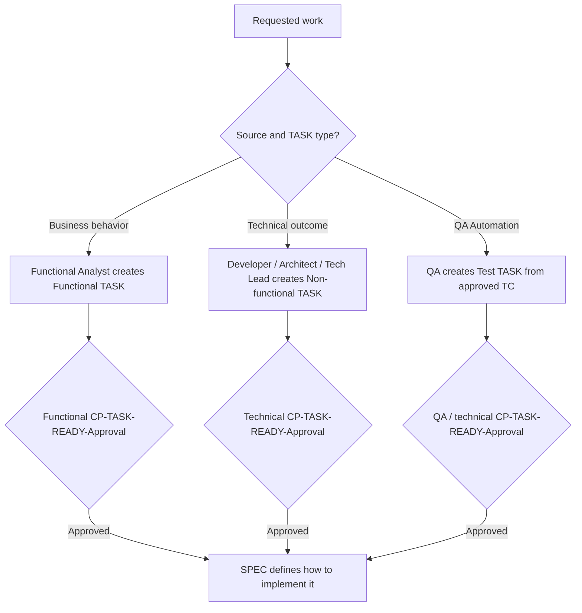

**Relationship with Delivery Loop:** A **TASK** is executed using **1..n
Delivery Loops** until it meets its **Definition of Done** (DoD).

> **Sizing and elapsed-time measurement:** The one-working-day target is based
> on **active delivery time** (AI agent generation + active human review +
> active rework), not developer person-hours and not approval wait time.
> End-to-end elapsed cycle time is still measured separately for flow
> improvement. Crossing into another day because of a later Delivery Loop or human
> availability is accepted and never forces the TASK to be divided.
> **AI-time** is the sub-metric for how long the agent spent generating
> the TASK, SPEC revisions, code and MEMs. It is recorded as
> `duration_seconds` in the corresponding manifest generation object and
> may be aggregated for flow analysis.

> **AI-native estimation rule:** When estimating a TASK's active delivery
> time, never price code creation as human typing time — code, tests and
> documents are agent-generated in minutes, and the dominant cost is human
> review and rework. Compose the estimate from the delivery cycle itself:
>
> `estimate ≈ expected Delivery Loops × (agent generation + MEM/Delivery Loop review
> budget for the risk_class) + SPEC review + acceptance + setup/integration
> overhead`
>
> using the recommended review budgets (§3.0). Under this rule most low- and
> medium-risk TASKs land between **1 and 4 hours** of active delivery; a full
> working day is the ceiling, not the norm. An estimate exceeding one day is
> **first** a signal of manual-effort anchoring, and only after that a reason
> to evaluate a split. Retrospectives compare estimates against actual
> manifest durations and decomposed TASK Lead Time to recalibrate (§3.7.4).

### 2.4.1 Implementation SPEC (one per TASK)

**What it is:** The implementation plan that translates one approved TASK into
precise, repository-grounded instructions for the code agent. The TASK defines
what must be delivered; the SPEC defines how that TASK will be implemented.

**One-to-one rule:** Every approved TASK has exactly one current canonical
SPEC, and every SPEC references exactly one TASK through its mandatory `task`
field. A SPEC may be revised and versioned, but a second concurrent SPEC for
the same TASK or a SPEC spanning multiple TASKs is invalid.

**Stable naming:** Every SPEC uses the filename pattern
`SPEC-YYMMDD-HHmm-<description>.md`, where `<description>` is a kebab-case
ASCII slug in the project's `content_language` (§3.15), derived from the
TASK. The same canonical SPEC retains its
original filename across material revisions; the revision number lives inside
the SPEC metadata and the manifest's `spec_revisions[]`, not in the filename.
This prevents filename collisions when multiple developers commit
concurrently and makes it unambiguous which SPEC belongs to which TASK.

**Pre-SPEC evidence gate:** Before writing any SPEC content, the agent builds a
source inventory and verifies that every approval-bearing artifact it intends
to use is approved:

- The exact TASK has `CP-TASK-READY-Approval`.
- If the TASK corrects a BUG, that exact BUG has `CP-BUG-Approval` and the
  BUG and TASK reference each other.
- A functional TASK's parent feature US and covered ACs have
  `CP-US-Approval`; a non-functional TASK references the permanent US-000
  container, which has no approval lifecycle; a Test TASK's exact parent TC
  has `CP-TC-Approval`.
- Every applicable ADR has `CP-ADR-Approval`.
- No two active ADRs in the SPEC's `sources` contradict each other: if the
  decision log shows mutually exclusive decisions (e.g., two ADRs choosing
  different technologies for the same use case, neither superseding the
  other), the gate blocks the SPEC with a conflict report naming the ADRs
  and the required superseding ADR (§2.8, §3.5).
- Every Discovery conclusion used has `CP-DISC-Approval`.
- Every Review finding used has `CP-REV-Approval`.
- Every Adversarial Review finding used comes from a Verdict reached after all
  three sequential AREV phase approvals.
- Every Test Case used as a verification contract has `CP-TC-Approval`. A
  Test TASK must reference exactly one such approved TC.

If any required approval is absent, rejected, outdated or unverifiable, the
agent **does not generate the SPEC**. It emits only a blocking report naming
the artifact and required checkpoint. Optional DISC, REV and AREV mechanisms
do not need to exist; the rule applies when their conclusions or findings are
used by the SPEC.

**Required analysis context:** After the evidence gate passes, the agent must
inspect all material relevant to the TASK rather than rely on the TASK alone:

- the TASK, its parent and covered ACs, plus its approved BUG when applicable;
- every applicable approved TC, including the exact source US/ACs and source
  TASK from which its expected results were derived;
- all applicable approved ADRs and approved DISC/REV/AREV evidence;
- relevant raw files in `01-input/` and affected documents in `02-analysis/`;
- the existing implementation: code, tests, configuration, infrastructure,
  schemas, migrations, dependencies, APIs and repository conventions;
- related risks, open questions, prior MEMs and manifests when they affect the
  implementation baseline.

The SPEC records exact paths, identifiers, versions or commit baseline for the
sources it used. When evidence conflicts, context is incomplete, or an
architectural decision is unresolved, the agent stops and requests resolution;
it must not fill the gap with an assumption. An unresolved architectural
decision follows the ADR lifecycle and the SPEC may resume only after
`CP-ADR-Approval`.

**Approval status:** A generated SPEC is a draft until a qualified human
records `CP-SPEC-Approval`. This checkpoint verifies source completeness,
approval evidence, consistency with the TASK, US/ACs and ADRs, fidelity to the
existing codebase, implementation feasibility, test strategy, risks and
rollback needs. Only then may a code-run or Delivery Loop begin.

Any material change to the BUG when applicable, an applied TC, the TASK, functional parent US/ACs, an applied ADR, a
used DISC/REV/AREV finding, or the relevant code baseline invalidates the
current SPEC approval. The same canonical SPEC must be revised and approved
again before technical execution continues.

**Material vs. cosmetic (default conservative):** a change is **material**
when it alters the source inventory, the planned behavior or AC mapping, the
implementation approach (files, components, interfaces, algorithms), or the
test strategy/expected evidence of the approved revision — including a
change to any governing source or to the repository baseline the SPEC
recorded. A change is **cosmetic** only when it is limited to typos,
formatting or wording that cannot alter behavior or implementation.
When in doubt, treat the change as **material** and re-approve: silent or
merely logged mid-run SPEC changes are forbidden (§3.2.1).

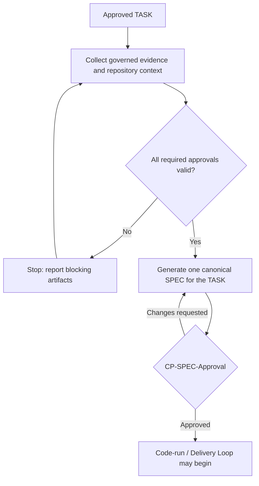

## 2.5 Delivery Loop (standard execution form)

**What it is:** A complete, traceable, and governed cycle in which an **AI
agent transforms a SPEC approved through `CP-SPEC-Approval` into an implementation package submitted
for human validation**.

During its autonomous execution, the agent generates the required design,
code, tests, configuration, and documentation; runs the tests; detects
failures; and iterates as many times as necessary until the package is ready
for review. These autonomous internal iterations are part of the same
Delivery Loop and do **not** increase the Delivery Loop count.

Once execution is complete, the agent **must create exactly one MEM for that
Delivery Loop**, update the TASK manifest, and pause for human validation. The MEM
is not an optional summary: it is the mandatory narrative and evidence index
of the execution. The reviewer validates it against the generated code, the
actual diff, tests, gates, and supporting evidence, then records
`CP-MEM-Approval`. This checkpoint decides the current Delivery Loop:

- If `CP-MEM-Approval` is approved, the Delivery Loop is completed and approved.
- If changes are requested, the MEM and its Delivery Loop remain in the historical
  record with a non-approved outcome. The agent's next autonomous execution,
  incorporating that feedback, is a **new Delivery Loop** with a new MEM.

The TASK's development state is derived from the most recent Delivery Loop. An
approved `CP-MEM-Approval` on the latest Delivery Loop marks the TASK
`Development Completed`. A latest Delivery Loop that is pending approval or has
`changes_requested` keeps the TASK `In Development`. This development state is
distinct from `Done`, which requires `CP-TASK-DONE-Approval`.

Each Delivery Loop is recorded as a separate entry in the TASK manifest's
`delivery_loops[]`. The
total number required to obtain human approval is measured as **Delivery Loops per
TASK**.

**Role:** Guarantees quality from minute zero (tests embedded **and executed**
in the autonomous loop), preserves the history of every human-requested
rework cycle, and makes first-pass quality measurable.

## 2.6 User Stories (US) + Acceptance Criteria (AC)

**US:** "As a [role] I want [capability] so that [value]."

**AC:** Verifiable conditions in **Given/When/Then** style (functional
criteria only).

**Role:** They act as the **human ↔ AI contract**: they drive code and test
generation and enable quick validation.

**Approval status:** A generated or updated feature User Story remains a
**draft** until a Functional Analyst approves it at **CP-US-Approval**. The
approval confirms that the US and its ACs faithfully represent the evidence in
`01-input/` and the current understanding in `02-analysis/`. Only an approved feature
US may be decomposed into candidate functional TASKs. US-000 is outside this
approval lifecycle.

**Story points (functional complexity signal):** A feature US may carry a
`story_points` value on the **Fibonacci scale (1, 2, 3, 5, 8, 13)**
expressing the **relative complexity of its functional scope** — the number
and intricacy of its ACs, business rules, flows, integration surfaces and
unknowns — never time. The agent may propose the value when drafting the US;
the Functional Analyst confirms or corrects it as part of `CP-US-Approval`.
Story points are **informational only**: no checkpoint, gate or guardrail
depends on them, weekly planning keeps forecasting with throughput and TASK
Lead Time (§4.3), and no velocity metric or performance target may be derived
from them. Converting points into hours defeats their purpose — the time
dimension belongs to TASK estimation and its AI-native estimation rule
(§2.4). US-000 never carries story points. Retrospectives may correlate
points against the US's actual aggregated TASK Lead Time to recalibrate
future scoring (§3.7.4).

**Scoring rubric (how the agent proposes a value):** score each dimension
against the anchors below and take the **highest dimension, never the
average** — complexity is dominated by the worst factor (a US with 3 ACs but
one poorly documented external integration is a 5, not a 3). When approved
USs already exist in `12-functional/INDEX.md`, score relative to them; for the
first USs of a project, use the anchors as absolute. Open OQs in
`02-analysis/open-questions/` targeting the US are objective evidence for the
*Unknowns* dimension — check the OQ INDEX rather than guessing.

| Points | ACs | Business rules | Flows | Integrations | Unknowns |
|--------|-----|----------------|-------|--------------|----------|
| **1** | 1–2 trivial | None beyond field validation | One linear flow | None | None |
| **2** | 2–3 | Simple, single-entity | One flow, minor variation | None | None |
| **3** | 3–5 | Several, still single-entity | Main flow + alternate/error flows | One internal | None material |
| **5** | 5–8 | Cross-entity interactions | Multiple flows or roles | One external, or a new domain concept | Minor, already scoped |
| **8** | Many, hard to enumerate | Rule interactions need their own table | Multiple personas/journeys touched | Several, or one poorly documented | Open OQs targeting this US |

**13 is a splitting signal, not a target size:** a US that exceeds the 8
anchors on any dimension scores 13, and the agent proposes decomposing it
before `CP-US-Approval` — the US-level equivalent of the one-day TASK
ceiling (§2.4). The Functional Analyst may still approve it as 13 when
splitting is genuinely not viable.

**Expected decomposition bands (plausibility check, never a conversion):**
story points relate to the expected **number of independently deliverable
outcomes** — never to hours (W18):

| Story points | Typical decomposition |
|--------------|----------------------|
| 1–2 | 1–2 TASKs |
| 3–5 | 2–4 TASKs |
| 8 | 4+ TASKs |
| 13 | splitting signal — decompose the US first |

A decomposition falling far outside its band is a **signal to re-examine
either the score or the TASK slicing** — never a target to force. TASKs are
sliced by independently deliverable outcomes (§2.4), and the band only
cross-checks that the complexity score and the resulting structure tell a
consistent story.

**Permanent non-functional container (US-000):**
`12-functional/user-stories/US-000-non-functional.md` is the permanent
traceability parent for every TASK whose primary outcome is non-functional.
Despite its filename and location, it is a container rather than an actual
User Story: it has no Acceptance Criteria, approval status, approver, or CITL
checkpoint. It does not represent a user-facing capability and does not
replace ADRs or quality gates; it ensures that technical work is still
governed through an individually approved TASK, SPEC, Delivery Loop, MEM, manifest,
and human validation.

### 2.6.1 Test Case (TC) and QA Automation

**What it is:** A `TC-NNN-<description>.md` is an implementation-independent
verification contract. It defines preconditions, input data, steps or
stimulus, expected results, covered ACs or technical constraints, and the
evidence needed to determine pass or fail.

**Cardinality and required traceability:** Every TC references exactly one
approved `source_task`. A functional TC also records one `source_us` and one or
more `covered_acs`; a non-functional TC records `source_us: US-000` for
traceability plus every governing ADR or other technical source. A TC may
contain one coherent scenario with its variants or data sets, but it must be
split when independent outcomes, approvals, or setup would make pass/fail
ambiguous. Its minimum metadata includes `id`, `type` (`functional` or
`non-functional`), `source_task`, `source_us`, `covered_acs`, `governing_sources`,
`status`, `owner`, and the `CP-TC-Approval` record.

**Test-basis rule:** The expected behavior of a Test Case must be derived from
approved intent, never from the current implementation:

- A functional TC is based on the approved feature US/ACs and the exact
  approved functional TASK whose outcome it verifies.
- A non-functional TC is based on the exact approved non-functional TASK and
  its approved ADRs or other governed technical sources. US-000 provides
  traceability only and never supplies expected results.
- A BUG-related TC also references the approved BUG and its expected behavior.

Existing code, existing automated tests, configuration, schemas and runtime
behavior may be inspected only to understand interfaces, setup, data,
feasibility, regression surface and execution constraints. They are
**contextual evidence, not the test oracle**. The agent must not copy current
behavior into the expected result merely because the code already behaves
that way. When implementation behavior conflicts with the approved test
basis, the conflict is reported and routed through the BUG, analysis, ADR, or
change-control lifecycle rather than silently normalizing the TC to the code.

**Independent lifecycle:** A TC remains `draft` until a qualified human
records `CP-TC-Approval`. Functional expected results require QA review plus
Functional Analyst or delegated business-domain approval. Non-functional
expected results require QA review plus the applicable Architect, Tech Lead,
Security, Performance, Data, or other technical owner. Approval confirms the
test basis, coverage, preconditions, data, steps, expected results, and
pass/fail evidence; it does not approve implementation code. Role routing here
is guidance, not a gate: if a named role has no holder, the available qualified
human records the approval, noting the self-assigned role.

When QA verification is applicable, Test Cases are drafted after
`CP-TASK-READY-Approval` and approved **before the implementation SPEC is
generated**, so the verification contract exists independently of both the
technical plan and the generated solution.
A functional TASK normally has one or more approved TCs. A justified `n/a`
may be recorded during TASK approval for documentary or purely internal work
that has no QA-verifiable outcome.

**QA Automation:** Automating a TC is optional, but any generated or modified
QA Automation code requires one or more dedicated Test TASKs parented by that
TC. The rules are:

- only an approved TC may originate Test TASKs;
- each Test TASK names that one TC in its `us` parent field and uses it as
  its direct parent;
- one TC may originate 1..n Test TASKs when automation has independently
  deliverable outcomes; elapsed time or additional Delivery Loops alone do not
  justify a split;
- each filename is `TC-NNN.TASK-NNN-<description>.md`;
- the parent TC satisfies the Test TASK's verification-contract requirement;
  no recursive "TC for the Test TASK" is created;
- every such TASK receives its own `CP-TASK-READY-Approval`, one canonical SPEC,
  `CP-SPEC-Approval`, 1..n Delivery Loops, one MEM per Delivery Loop,
  `CP-MEM-Approval`, and `CP-TASK-DONE-Approval`;
- its SPEC treats the approved TC as a governed source and defines how to
  implement the automation without changing the TC's expected result;
- the TASK authorizes QA test code and supporting test assets only. If
  automation exposes a product defect, production-code correction follows the
  approved BUG → dedicated TASK lifecycle.

Test TASK numbering is scoped to its parent TC. For example,
`TC-002.TASK-001-prepare-invoice-test-data.md` and
`TC-002.TASK-002-automate-invoice-download.md` are two independently approved
automation slices for `TC-002`; the number does not imply another US or a
shared SPEC.

Test TASKs are distinct from the developer tests required inside a
product or BUG TASK's Delivery Loop. Unit, integration, and strict TDD regression
tests required by that implementation SPEC remain part of the original TASK;
they do not require a second QA Automation TASK unless an approved TC is later
selected for independent QA automation.

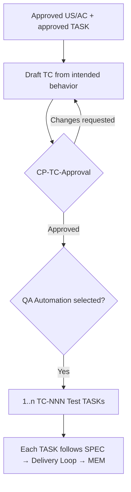

## 2.7 Non-functional constraints (ADR-owned)

The expression **Non-Functional Requirements (NFRs)** is used only as shorthand
for performance, security, availability, compliance, observability, and other
quality constraints that are **defined and governed inside approved ADRs**.
They are not independent MetaFlow artifacts and must not be defined in User
Stories, Acceptance Criteria, TASKs, or SPECs.

When implementing or improving an ADR-defined constraint requires dedicated
work, a Developer, Architect, or Tech Lead creates one or more non-functional
TASKs under `US-000-non-functional.md`. The approved ADR remains the governing
source; US-000 and its TASKs provide assignment, execution, and measurement
traceability. No Functional Analyst approval is required for this technical
work definition.

## 2.8 ADR (Architecture Decision Record)

**What it is:** A short record of a relevant technical decision (context,
alternatives, decision, consequences).

**Role:** Maintains the traceability of trade-offs and prevents forgetting. It
must be drafted and approved before a SPEC may rely on its decision. If an
unresolved architectural decision emerges during SPEC preparation or
execution, work stops, the ADR lifecycle is completed, and the canonical SPEC
is revised and re-approved before the code-run continues.

**Approval status:** Every ADR remains a **draft** until an Architect or Tech
Lead approves it at `CP-ADR-Approval`. Approval of a User Story, TASK, SPEC,
or Delivery Loop does not implicitly approve the ADR. A draft ADR cannot govern a
SPEC, establish a non-functional constraint, authorize an exception, or be treated as an accepted
architecture decision.

## 2.9 DoR / DoD (Definition of Ready / Definition of Done)

**DoR (evaluated inside `CP-TASK-READY-Approval`):** A functional TASK has an
approved feature parent US and clear covered ACs; a non-functional TASK is
correctly linked to US-000 with a clear technical outcome and governed source;
a Test TASK has exactly one approved parent TC. Relevant ADRs are approved
with their architectural decisions and non-functional constraints; risks are
identified; context is accessible to the AI agent; no `open` or
`in-validation` Open Question targets the TASK's parent or governing
artifacts; and completion evidence is
defined. DoR is a readiness criterion, not a separate sign-off or checkpoint.

**Delivery Loop completion:** The applicable implementation checks and
agent-generated tests are green (or the applicable gates are explicitly
waived), exactly one complete MEM is created, the TASK manifest is updated,
and an approved
`CP-MEM-Approval` recorded for that MEM and Delivery Loop. Creating the MEM is
inevitable; approving it is what approves and completes the Delivery Loop. A
request for changes retains the unapproved MEM and starts a new Delivery Loop. The
latest approved Delivery Loop places the TASK in `Development Completed`; a latest
Delivery Loop awaiting approval or changes places it in `In Development`.

**DoD (per TASK):** Every Delivery Loop has its own immutable MEM and recorded
`CP-MEM-Approval` decision; earlier `changes_requested` attempts remain
unapproved history, while the latest Delivery Loop and MEM are approved. Every
applicable ADR is approved, gates have evidence, traceability is complete, the
result is ready for demo, and
`CP-TASK-DONE-Approval` has marked the TASK `Done`. Development
completion and TASK acceptance are separate lifecycle transitions.

## 2.10 Quality Gates (automated)

**What they are:** Universal plus SPEC-selected conditional checks in CI/CD
(tests, coverage, SAST/DAST, licenses/SBOM, performance smoke, policies).

**Role:** Approved TCs, ACs and ADR-defined constraints are **translated** into
automated checks; a TASK cannot reach **Done** while an applicable gate is
`fail`. A waiver requires an approved ADR; a non-applicable gate is `n/a` with
a reason.

## 2.11 Deployment Unit

**What it is:** An artifact ready to be promoted (image / function / IaC)
that has **already passed** every gate and is demonstrable.

**Role:** The "releasable" output of one or more TASK sequences within a
Unit.

**Deployment definition:** for Delivery Flow purposes, a **production
deployment** is the promotion of a Deployment Unit to the **production
environment**, made traceable by a release tag, image digest or equivalent
identifier that links the deployment event to its included TASKs and
commits. Merge to `main` is **not** a production deployment by itself.
Teams define the granularity (per service, per platform, or whole-platform)
as part of their internal Delivery Flow baseline (§3.7.1) and record it in the
project's metrics conventions; the definition is reviewed in each retro.

## 2.12 Project memory

**What it is:** The set of artifacts (transcripts, US/AC, ADRs, code, tests,
metrics) accessible to AI and the team.

**Role:** Lets the AI generate with the correct context and ensures
**end-to-end** traceability.

**MEM (implementation memory):** Every Delivery Loop generates exactly one
`MEM-YYMMDD-HHmm-<description>.md` after autonomous implementation and
verification, before human review.

**Stable naming across Delivery Loops:** Every MEM produced for the same TASK and
its canonical SPEC must reuse exactly the same kebab-case
`<description>` slug — ASCII, in the project's `content_language` (§3.15).
Only the creation timestamp (`YYMMDD-HHmm`) changes from
one Delivery Loop to the next. If the Delivery Loops occur on the same day, normally only
`HHmm` differs; if they cross a date boundary, `YYMMDD` changes as well. Do not
append `v2`, `retry`, `fix`, `bounce-2`, or similar suffixes. The Delivery Loop
number belongs in the MEM metadata and the manifest's `delivery_loops[]`, not in
the filename. Implementations must reserve filenames atomically; two Delivery Loops
of the same TASK never complete in the same minute, but if a collision would
otherwise occur, the later MEM is created in the next minute. Overwriting,
suffixing or reusing the earlier MEM is forbidden.

Example for three Delivery Loops of one TASK/SPEC:

- `MEM-260802-1015-invoice-download.md`
- `MEM-260802-1128-invoice-download.md`
- `MEM-260803-0904-invoice-download.md`

These are three immutable execution records for the same canonical plan; they
are not versions that overwrite one another.

At minimum, the MEM records:

- the Delivery Loop iteration, TASK, canonical SPEC version, repository baseline,
  and applicable ADRs;
- a concise summary of what was implemented and why;
- every file added, modified, renamed, or deleted, with its path, change type,
  and reason;
- tests and quality gates executed, their commands or evidence references, and
  results;
- implementation decisions, SPEC deviations, assumptions, manual
  interventions, unresolved risks, and follow-up items;
- links or identifiers for the diff, commit/PR when present, and the cumulative
  TASK manifest entry;
- the final `CP-MEM-Approval` record: reviewer, role, timestamps, decision,
  review evidence, comments, and findings.

The agent creates the MEM and never self-approves it. The MEM has no mutable
approval `status`: its review state is derived from the associated
`CP-MEM-Approval` record—no decision means pending review, `approved` means
an approved Delivery Loop, and `changes_requested` or `rejected` means an immutable
historical attempt that did not advance. The MEM is mandatory for every
Delivery Loop attempt, including one that reaches a
stop condition, remains blocked, exhausts its turn budget, or cannot obtain
green tests. The qualified human must inspect the underlying evidence—not
merely trust the narrative—and record `CP-MEM-Approval` in both the MEM and
the manifest. Approval is possible only when the implementation package and
required gates satisfy the approved SPEC. After the human decision, the MEM is
immutable. An approved MEM makes its Delivery Loop approved; a non-approved MEM
remains evidence of that attempt, and the next attempt receives a new MEM.
When that approved MEM belongs to the latest Delivery Loop, it also changes the
TASK's development state to `Development Completed`. It does not make the TASK
`Done`; acceptance remains governed by `CP-TASK-DONE-Approval`.

## 2.13 Discovery

**What it is:** A focused, traceable investigation (`DISC-NNN`) used to reduce
an important uncertainty **before a User Story or TASK is created or
materially refined**. Typical Discoveries examine an external API, an
unfamiliar library or framework, a legacy-system behavior, an integration
constraint, a technology option, data availability, or another question that
must be understood before the team can define the right work.

**Role:** A Discovery creates evidence and conclusions for backlog definition;
it does not inspect an existing project artifact for quality and does not
authorize implementation. Its approved findings may update `02-analysis/` and may
support the creation or refinement of User Stories, TASKs, ADRs, risks, or
other governed artifacts.

**Need-driven in the E2E flow:** A Discovery is not required for every User
Story or TASK. Any stakeholder or team member may initiate one when a material
unknown would otherwise force the team to guess. Once initiated, it remains a
draft and its conclusions cannot be used as governed input until a qualified
human records `CP-DISC-Approval`.

`CP-DISC-Approval` confirms that the research question was answered
with adequate evidence, the limits and assumptions are explicit, and the
conclusions are reliable enough to guide backlog or architecture work. It does
not approve any downstream artifact. Each User Story, TASK, ADR, or other
artifact created or changed from the Discovery follows its own lifecycle and
CITL approval.

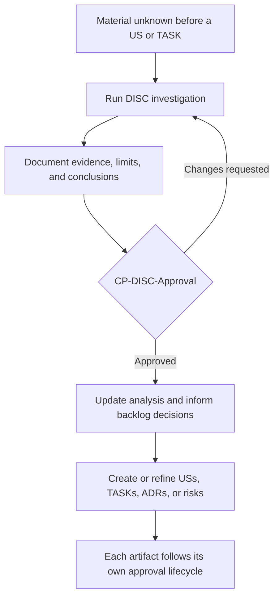

**Discovery versus Review:** A Discovery researches an **unknown that must be
understood before defining work**. A Review (`REV`) examines **documentation,
code, tests, ADRs, or any other existing project artifact or characteristic**
and produces findings about it. A Review may review a Discovery document, but
that optional Review and `CP-REV-Approval` are separate from the
Discovery's own `CP-DISC-Approval`.

| Dimension | Discovery (`DISC`) | Review (`REV`) / Adversarial Review (`AREV`) |
|-----------|--------------------|----------------------------------------------|
| Starting point | A material unanswered question before a US or TASK is defined or refined | An existing project artifact, implementation, characteristic, or concern to inspect |
| Primary purpose | Learn, gather evidence, and reduce uncertainty | Evaluate, challenge, and identify findings |
| Typical subjects | External APIs, unfamiliar libraries, legacy behavior, technology options, data or integration constraints | Documentation, code, tests, USs, TASKs, ADRs, SPECs, architecture, security, performance, or process |
| Governed output | Approved evidence, assumptions, limits, and conclusions | Approved findings; AREV exposes them only after its approved Verdict |
| CITL governance | `CP-DISC-Approval` | `CP-REV-Approval`, or the three sequential AREV phase approvals |
| Downstream effect | Informs analysis and the creation or refinement of governed artifacts | May create or update any governed artifact |

An AREV is therefore a specialized adversarial form of Review, not a
Discovery.

A Discovery does not create an exception to the rule that no code-related
change may exist without an approved TASK. If the research requires executable
prototype or spike code, that experiment must be authorized by an approved
non-functional TASK under `US-000-non-functional.md` before any code is
generated.

> **Why this is not circular (§2.4):** the spike TASK is an **investigation
> instrument**, not the product TASK the Discovery informs. The Discovery
> may proceed entirely documentarily without code; only when it needs an
> executable experiment does it spawn a separate non-functional spike TASK
> (a general technical outcome under US-000). The experiment's results then
> inform the Discovery's conclusions, which feed the *product* USs/TASKs.
> The spike TASK does not depend on the Discovery's conclusions to exist —
> it depends only on the decision to experiment.

## 2.14 Review

**What it is:** An open, structured examination (`REV-NNN`) that may be
initiated by **any stakeholder or team member**, regardless of role. A Review
may examine functional or non-functional characteristics, User Stories,
TASKs, ADRs, SPECs, code, tests, architecture, security, performance,
processes, risks, documentation, or any other relevant concern.

**Optional in the E2E flow:** A Review is never a mandatory stage of the
standard end-to-end flow. Each stakeholder is responsible for initiating one
when additional scrutiny, evidence, or a second perspective is warranted.
Once initiated, however, its approval and traceability rules are mandatory.

**Role:** A Review produces findings that can feed the creation or update of
**any MetaFlow artifact**. Findings remain draft and cannot be used as governed
input until a qualified human records `CP-REV-Approval`.

`CP-REV-Approval` validates the Review and its findings: scope,
supporting evidence, clarity, classification, and actionability. It does not
approve any downstream artifact or implementation. Every artifact created or
updated from an approved finding follows its own lifecycle and applicable
CITL approval. If a finding requires a code-related change, that change must
be authorized by an approved TASK before a SPEC or Delivery Loop can begin.

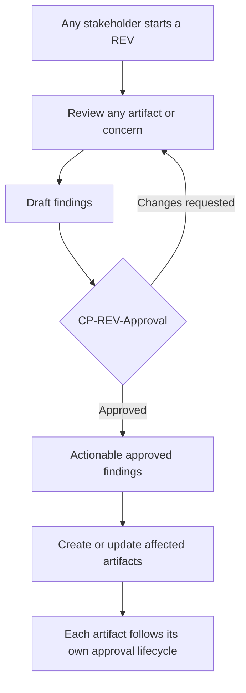

## 2.15 Adversarial Review

**What it is:** A structured review protocol (`AREV-NNN`) in **three
sequential phases** — Critique → Defense → Verdict — performed by independent
agent roles. A Challenger identifies weaknesses, a Defender responds to the
critique and explains or revises the reasoning, and a Judge produces an
impartial verdict.

**Principle:** A model reviewing its own work may preserve the same blind
spots. Independent adversarial roles introduce competing perspectives, while
human approval governs every transition.

**Scope and initiation:** Any stakeholder or team member may initiate an
Adversarial Review. It may examine any functional or non-functional
characteristic or artifact, including User Stories, TASKs, ADRs, SPECs, code,
tests, architecture, security, performance, risks, processes, and
documentation. It may be TASK-bound, themed, or ad hoc.

**Optional in the E2E flow:** An Adversarial Review is never a mandatory stage
of the standard end-to-end flow, including for high- or critical-risk work.
Each stakeholder is responsible for triggering it when adversarial challenge
would add value. Once initiated, all three phases and their approvals are
mandatory and sequential. **Running an AREV requires at least three models**
available — one each for the Critique, the Defense and the Verdict — so the
Judge is always a neutral third model (§3.13, G37); a single operator running
three models is valid. A team without a third model does not initiate the
AREV; an AREV already open that cannot reach a neutral Verdict is set
`cancelled` (§3.15).

**Not a stage of the Delivery Loop:** an AREV is a standalone governance mechanism,
exactly like a Review (§2.14). It is **not** a step of the Delivery Loop anatomy
(§3.3), it needs no TASK, SPEC, User Story or any other prior artifact to
exist, and it never opens, closes or modifies a Delivery Loop. Its approved Verdict
produces findings, and nothing else:

- A **TASK-bound** AREV examines the closed package of a completed Delivery Loop
  (diff, tests, gates, MEM, manifest), and its approved Verdict is a
  **pre-filter for the `CP-MEM-Approval` decision** (§3.0). If the reviewer
  then requests changes, the ordinary rule applies — the MEM stays as
  unapproved history and the next agent execution is a **new Delivery Loop with a
  new MEM and a new `delivery_loops[]` entry** (§2.5). AREV-driven rework is
  therefore measured like any other rework; it is never absorbed silently into
  the Delivery Loop that produced it.
- A **themed** or **ad hoc** AREV is attached to no TASK at all. Its approved
  findings route to their own artifacts — BUG, TASK, ADR, RISK, DISC — each
  with its own lifecycle and CITL approval, exactly as REV findings do
  (§2.14).

**Mandatory phase approvals:** Each phase remains draft until its named human
checkpoint is approved:

1. `CP-AREV-CRITIQUE-Approval`
2. `CP-AREV-DEFENSE-Approval`
3. `CP-AREV-VERDICT-Approval`

If changes are requested, that phase is revised and submitted again; the next
phase cannot begin until the current one is approved. Critique and Defense are
intermediate arguments and do not create usable findings. Only an approved
Verdict produces actionable findings. Any artifact created or updated from
those findings must still follow its own lifecycle and applicable CITL
approval.

**Manual agent/model change:** Agent or model selection for AREV is performed
manually by the human in whichever development tool is being used. After each
phase checkpoint is approved, the human selects the agent/model for the next
phase before launching it. MetaFlow does not auto-switch models, create a
regression-eval TASK, or require a model-change ADR for this operational
selection. Each phase file records the agent/model that produced it so that
the AREV remains self-contained and auditable.

**No manifest impact:** AREV status, phase approvals, selected models and
Verdict are recorded only in the `AREV-NNN` artifacts. They are not written to
or derived from the TASK manifest. If an approved Verdict causes a downstream
US, BUG, TASK, ADR or SPEC change, that downstream artifact follows its own
normal lifecycle and is traced through its own identifiers.

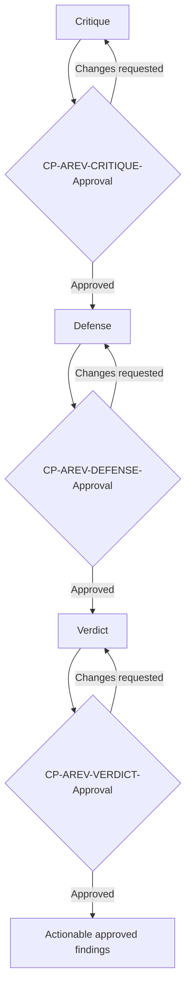

> **Reference:** Concept inspired by
> [Adversarial Coding — Using Competing Models as Code Reviewers](https://www.subaud.io/adversarial-coding-competing-models-reviewers/)
> (Court Schuett, 2026).

## 2.16 BUG (confirmed defect)

**What it is:** A traceable record (`BUG-NNN`) of a confirmed difference
between expected and actual system behavior. A BUG captures the observation,
evidence, affected context, reproduction conditions, expected result, actual
result, impact, severity, and known links. It is not a work authorization and
does not contain the implementation plan.

**Who may create it:** A Functional Analyst, Developer, or QA may create a BUG,
depending on who detects and can document the defect. Creator role does not
determine whether the BUG is functional or non-functional.

**Approval before TASK creation:** Every BUG starts as `draft`. No TASK may be
created for it until the competent human validates that the defect is real,
the expected behavior and evidence are sufficiently clear, and its nature and
parent route are correct:

- a Functional Analyst records `CP-BUG-Approval` for a functional BUG;
- for a non-functional BUG, an Architect or Tech Lead is the recommended
  approver when `severity: critical`, and any team member for `severity: high`,
  `medium`, or `low`.

**Guidance, never a gate:** the recommended approver above is advice, not a
precondition. Any qualified team member — the BUG's own author included — may
record `CP-BUG-Approval` at any severity, noting the self-assigned role where
the recommended holder is unavailable. (The AI self-approval prohibition,
G18/G24, is a separate axis and still holds.)

Approval confirms the BUG as governed input; it does not approve its future
TASK, SPEC, implementation, MEM, or acceptance. Each keeps its own checkpoint.

**Mandatory classification and TASK:** Every approved BUG receives exactly one
dedicated TASK:

| BUG nature | Violated expectation | Dedicated TASK parent | TASK creation and approval |
|------------|----------------------|-----------------------|----------------------------|
| **Functional BUG** | Approved feature behavior or Acceptance Criteria | The affected approved feature `US-NNN` | Functional Analyst creates/refines and separately approves the TASK through `CP-TASK-READY-Approval` |
| **Non-functional BUG** | ADR-defined constraint or another technical expectation with a non-functional primary outcome | `US-000-non-functional.md` | Developer, Architect, or Tech Lead creates/refines the TASK; the dedicated TASK's `CP-TASK-READY-Approval` mirrors the parent BUG's routing — Architect or Tech Lead recommended when `severity: critical` — but is guidance, never a gate: any qualified team member, the TASK's own author included, may approve it at any severity |

The BUG and dedicated TASK reference each other. A BUG cannot be fixed under an
unrelated existing TASK, directly from a ticket, or as an untracked addition to
another Delivery Loop. If the defect contains several independently confirmable
defects or outcomes, `CP-BUG-Approval` may request decomposition into
independently traceable BUGs. Each resulting BUG is approved separately and
receives its own dedicated TASK. Additional Delivery Loops or continuation on the
next working day are not, by themselves, reasons to split the BUG or its TASK.

**One SPEC per BUG TASK:** The normal SPEC cardinality applies. The dedicated
TASK has one canonical SPEC, and that SPEC explicitly references the approved
BUG and all relevant approved governed evidence. The BUG does not bypass
`CP-TASK-READY-Approval`, `CP-SPEC-Approval`, or any approval required by the
US, ADR, DISC, REV, or AREV evidence used by the SPEC. An unapproved or stale
BUG blocks both its TASK creation and any SPEC that attempts to use it.

**Strict TDD correction rule:** Every BUG SPEC must prescribe this order inside
the same Delivery Loop:

1. create or modify the smallest automated test that reproduces the reported
   defect against the pre-fix behavior;
2. execute that test and record objective evidence that it fails for the
   expected reason (**red**);
3. only after the red evidence exists, modify the production implementation;
4. execute the targeted test and all applicable regression gates until the
   required suite passes (**green**);
5. record the red and green evidence, commands, changed files, and results in
   that Delivery Loop's MEM. The manifest records only the Delivery Loop execution
   outcome and MEM
   reference.

Creating the reproduction test and implementing the correction are not two
TASKs and not two Delivery Loops: they are mandatory phases of the same BUG TASK,
the same approved SPEC, and the same Delivery Loop. Autonomous retries remain
inside that Delivery Loop. If the agent cannot produce a valid red test, it must not
change production code; it stops, creates the mandatory MEM and manifest entry
with the blocker, and pauses at `CP-MEM-Approval`.

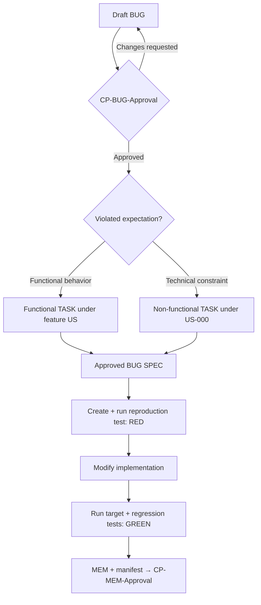

## 2.17 Key metrics (Delivery Flow-first — teaser)

MetaFlow uses **three concentric layers** of metrics. The full
definition, targets, slicing rules and decision logic live in **§3.7**.

- **A. Delivery Flow software-delivery metrics (primary, mandatory)** — delivery
  performance using the current five-metric model.
- **B. AI-native flow metrics (secondary)** — methodology health.
- **C. CITL governance metrics (mandatory)** — proof that human-by-default
  governance is real, not nominal.

See §3.7 for the full tables and decision rules.

---

# 3. Operating principles and rules

This section defines the **MetaFlow framework**: how we think and how
we act. It can be used as a "working contract" for the team.

## 3.0 Actor-in-the-Loop Charter (CITL)

**Checkpoint-in-the-Loop (CITL)** is the **load-bearing principle** of MetaFlow.
The AI agent is the generator; the **actor** at each checkpoint is the governor —
a **human by default**, and a virtual MetaFlow Agent only by explicit, valid
configuration. **A human actor is the default case inside CITL** (actor = human), not a separate paradigm: with no or invalid
configuration every checkpoint is a human approval and **no AI-signed approval is
possible** (the safe-default invariant). Speed is never traded for the loss of a
checkpoint.

**Role routing is guidance, never a gate (single-operator operability).** The
owner named for each checkpoint below is the *recommended* approver — it
records who *should* review, not a precondition that blocks. When the named
role has no holder in the team, the checkpoint is satisfied by the qualified
human(s) actually present: they record the approval, noting the self-assigned
role (e.g. "approved as QA: <user>"). **One person may hold several roles at
once**, and role assignment is living data, not a decision requiring approval
(a team roster may later resolve holders, including external reviewers). Every
CITL checkpoint is therefore satisfiable by a single-operator team. The **only
exceptions** — hard requirements because they concern a *different person or
model*, not a *different role* — are the identity-separation rules: the handoff
incoming-executor rule (§3.3), Judge-model neutrality (G37), and the
prohibition on the AI self-approving or fabricating a reviewer (G18, G24).

**Core mandatory human checkpoints (none are skippable when applicable):**

**Canonical naming rule:** Every human checkpoint uses
`CITL-<CANONICAL-ARTIFACT-OR-PHASE-CODE>-Approval`. The artifact and phase
codes are always uppercase (`US`, `BUG`, `TC`, `TASK-READY`, `TASK-DONE`, `ADR`, `SPEC`, `MEM`,
`DISC`, `REV`, `AREV-CRITIQUE`, `AREV-DEFENSE`, `AREV-VERDICT`). Legacy numbered
aliases and mixed-case artifact identifiers are invalid.

| Identifier | Checkpoint | Owner | Decision | Human by default |
|------------|------------|-------|----------|----------------------------|
| `CP-US-Approval` | **Feature User Story approval** | Functional Analyst (or, if the named role has no holder, the available qualified human records it, noting the self-assigned role) | Does the feature US, including its ACs and source traceability, accurately represent the business need and the current analysis? This checkpoint does not apply to US-000. | ✅ |
| `CP-BUG-Approval` | **Confirmed BUG approval** | Functional Analyst for functional BUGs; for non-functional BUGs, Architect or Tech Lead recommended when `severity: critical`, otherwise any team member — guidance, never a gate: any qualified team member, the BUG's own author included, may record it at any severity | Is this a real, sufficiently evidenced defect with clear expected and actual behavior, correctly classified and routed to the proper future TASK parent? Only approval permits creation of its dedicated TASK. | ✅ |
| `CP-TC-Approval` | **Test Case approval** | QA plus Functional Analyst/domain owner for functional expectations; QA plus applicable technical owner for non-functional expectations (or, if a named role has no holder, the available qualified human records it, noting the self-assigned role) | Is this TC independently derived from approved intent, complete, executable, free from implementation-derived expected-result bias, and ready to govern verification or QA Automation? | ✅ |
| `CP-TASK-READY-Approval` | **TASK readiness** | Functional Analyst for functional TASKs; Architect or Tech Lead for non-functional TASKs (except: the dedicated TASK of a non-functional BUG mirrors its parent BUG's severity routing — see §2.16); QA Lead, QA Automation Lead, Architect, or Tech Lead for Test TASKs (or, if a named role has no holder, the available qualified human records it, noting the self-assigned role) | Does this TASK clearly define a valid, appropriately sliced outcome under the correct parent—an approved feature US, US-000, or one approved TC—without specifying the implementation? | ✅ |
| `CP-ADR-Approval` | **Architecture Decision Record approval** | Architect/Tech Lead (or, if the named role has no holder, the available qualified human records it, noting the self-assigned role) | Is this ADR complete, technically sound, and accepted as a governing decision? | ✅ |
| `CP-SPEC-Approval` | **Implementation SPEC approval** | Dev-validator + applicable domain owner(s) — minimum one approver (or, if a named role has no holder, the available qualified human records it, noting the self-assigned role) | Is this one-TASK implementation plan complete, grounded in approved governed artifacts and the actual repository, feasible, testable, and safe to execute? | ✅ |
| `CP-MEM-Approval` | **MEM and Delivery Loop approval** | Dev-validator who executed the TASK; the incoming executor after a recorded handoff (one approver, any risk; additional QA/Sec/domain reviewers optional) | Does the MEM faithfully account for the complete Delivery Loop, and does direct inspection of the diff, tests, gates, and evidence show that the output is correct, safe, and aligned with the SPEC and ADRs? Approval of the latest Delivery Loop marks the TASK `Development Completed`. | ✅ |
| `CP-TASK-DONE-Approval` | **TASK acceptance** | PO/PM for functional TASKs; routed technical owner for non-functional TASKs; QA Lead or QA Automation Lead for Test TASKs (or, if a named role has no holder, the available qualified human records it, noting the self-assigned role) | Does the approved Delivery Loop output satisfy the TASK's completion evidence? | ✅ |

**Need-driven research and optional review mechanisms with mandatory governance
once triggered:**

DISC, REV and AREV are **not mandatory stages of every E2E flow**. Any
stakeholder or team member may initiate them when their purpose applies. Once
initiated, their named CITL checkpoints cannot be skipped.

| Identifier | Checkpoint | Owner | Decision | Human by default |
|------------|------------|-------|----------|----------------------------|
| `CP-DISC-Approval` | **Discovery approval** | Qualified human designated for the research domain | Is the investigation sufficiently evidenced, explicit about limits, and reliable enough to guide backlog or architecture decisions? | ✅ |
| `CP-REV-Approval` | **Review approval** | Qualified human designated for the Review | Are the Review and its findings evidence-based, clear, correctly classified, and actionable? | ✅ |
| `CP-AREV-CRITIQUE-Approval` | **AREV Critique approval** | Qualified human designated for the AREV | Is the Critique sufficiently rigorous, relevant, and supported to advance? | ✅ |
| `CP-AREV-DEFENSE-Approval` | **AREV Defense approval** | Qualified human designated for the AREV | Does the Defense address the approved Critique completely and with evidence? | ✅ |
| `CP-AREV-VERDICT-Approval` | **AREV Verdict approval** | Qualified human designated for the AREV | Does the Verdict fairly adjudicate the approved arguments and produce actionable findings? | ✅ |

> **Human by default (§3.0):** a virtual MetaFlow Agent may
> occupy a checkpoint only by explicit, valid configuration with independence;
> `critical` and `regulatory` stay human (§3.3 ceiling). With no or invalid
> configuration every checkpoint is human-only and no AI-signed approval is
> possible (the safe default).

`CP-US-Approval` applies once to each feature User Story version that
materially changes its business intent or Acceptance Criteria. It **never
applies to US-000**, which is a permanent, non-approvable traceability
container rather than a business User Story. `CP-TASK-READY-Approval` applies to
**every TASK**, with approval routed according to its type: functional to a
Functional Analyst, non-functional to an Architect or Tech Lead, and Test to a
QA Lead, QA Automation Lead, Architect, or Tech Lead. No TASK
approval is inherited merely because a related artifact was approved.

`CP-BUG-Approval` applies to every BUG before its dedicated TASK exists. It
confirms the defect, evidence, nature, and routing. It never authorizes code
and never substitutes for `CP-TASK-READY-Approval`. A functional BUG is routed to
a Functional Analyst; a non-functional BUG is routed to an Architect or Tech
Lead when `severity: critical`, otherwise to any team member, the BUG's own
author included. The recommended approver is guidance, never a gate: any
qualified team member — the BUG's own author included — may record it at any
severity, noting the self-assigned role where the recommended holder is
unavailable (the operability principle — role routing never blocks). Developers
and QA may create either kind as a draft.

`CP-TC-Approval` applies to every Test Case before it is used as a governed
verification contract or parent of a Test TASK. Approval is independent from
the source US and TASK approvals: those approve intent and work boundaries;
the TC checkpoint approves the independent verification design. A TC may not
inherit approval from current code, existing tests, its US, or its source
TASK.

`CP-ADR-Approval` applies separately to **every ADR**. The decision must be
recorded on the ADR with the approver, role, timestamp, outcome, and
review-quality evidence. Approval is never inherited from a related US, TASK,
SPEC, Delivery Loop, Review, or Adversarial Review.

`CP-SPEC-Approval` applies to the one canonical SPEC for every TASK and to
every material revision of that SPEC. It is independent from
`CP-TASK-READY-Approval`: TASK approval includes its DoR and authorizes SPEC
generation, while SPEC approval authorizes technical execution. A SPEC
approval is never inherited from approval of its TASK, US, ADR, Review,
Discovery or AREV.

`CP-MEM-Approval` applies separately to **every Delivery Loop and its unique
MEM**. The agent must generate the MEM and update the manifest before the
checkpoint. The reviewer approves or requests changes only after inspecting
the MEM against the actual implementation and verification evidence. An
approved `CP-MEM-Approval` approves and completes that Delivery Loop; no other
checkpoint implies it. A `changes_requested` decision preserves the MEM and
matching `delivery_loops[]` entry as an unapproved attempt and requires a new Delivery Loop for
additional autonomous execution.

The TASK's current development state is derived from its latest Delivery Loop. If
that Delivery Loop has approved `CP-MEM-Approval`, the TASK is
`Development Completed`. If it is pending or `changes_requested`, the TASK is
`In Development`. `CP-MEM-Approval` never substitutes for
`CP-TASK-DONE-Approval`, which alone changes the TASK from
`Development Completed` to `Done`.

`CP-DISC-Approval` applies to every initiated DISC. An approved
Discovery becomes governed research input, but it does not approve any User
Story, TASK, ADR, SPEC, or implementation derived from it.

`CP-REV-Approval` applies to every initiated REV. The three AREV
approvals apply sequentially to every initiated AREV. Approval of a REV or an
AREV Verdict makes its findings usable as governed inputs; it never approves
the downstream artifacts created or changed from those findings.

A material change to an approved feature US invalidates its previous US
approval and requires the Functional Analyst to reassess every derived
functional TASK. Each affected TASK must obtain a new
`CP-TASK-READY-Approval` before it can advance again. This rule does not apply to
US-000 because US-000 has no approval lifecycle.

A material change to an approved TC invalidates its previous
`CP-TC-Approval`. Every active dependent Test TASK and canonical SPEC must
undergo impact assessment and re-approval before execution continues. A
completed automation implementation is updated through a new Test TASK rather
than rewriting its historical execution evidence.

A material change to an approved TASK invalidates its previous
`CP-TASK-READY-Approval` and the approval of its canonical SPEC. The TASK returns
to its role-appropriate owner, and no new Delivery Loop may begin until both the
TASK and the materially revised SPEC are approved again. Historical MEMs and
manifest entries remain immutable.

A material change to an approved BUG invalidates its previous
`CP-BUG-Approval` and pauses its dedicated TASK. The BUG must be re-approved,
then the TASK and its canonical SPEC must undergo impact assessment and
re-approval before execution resumes. Historical red→green evidence is never
rewritten.

**CITL operating rules:**

- Work in `01-input/` and `02-analysis/`, including the generation and refinement of
  draft feature User Stories and candidate functional TASKs, may be iterative
  and AI-assisted. Technical contributors may likewise iteratively define
  candidate non-functional TASKs from governed technical evidence. These
  work-definition iterations are **not Delivery Loops**.
- QA may iteratively draft TCs from approved intent and candidate Test TASKs
  from approved TCs. Neither drafting loop is a Delivery Loop, and no Test TASK may
  be created before its parent TC has `CP-TC-Approval`.
- A Discovery remains draft until `CP-DISC-Approval`. Its unapproved
  conclusions may not govern analysis, backlog, architecture, or
  implementation decisions.
- Discoveries investigate pre-definition unknowns; Reviews inspect existing
  project artifacts or characteristics. Neither approval substitutes for the
  other or for any downstream artifact approval.
- If the Functional Analyst requests changes at `CP-US-Approval`, the US
  returns to the analysis and drafting loop. No candidate TASK from that draft
  may advance.
- If the applicable approver requests changes at `CP-TASK-READY-Approval`, that
  specific TASK returns to its owner for refinement. Other TASKs require their
  own decisions and are unaffected unless a feature US changes materially; in
  that case, every affected functional TASK returns to approval.
- A BUG may be drafted by a Functional Analyst, Developer, or QA, but no TASK
  may be created from it until `CP-BUG-Approval` is recorded by the
  role-appropriate approver. A BUG approval cannot be inherited from its US,
  ADR, Review, or incident.
- No SPEC may be prepared for execution, and no Delivery Loop may begin, unless the
  specific TASK has recorded `CP-TASK-READY-Approval`. A functional TASK also
  requires `CP-US-Approval` on its feature parent. A non-functional TASK
  requires no approval on US-000. A Test TASK requires
  `CP-TC-Approval` on its exact parent TC.
- Before generating a SPEC, the agent verifies every governed source it will
  use. If any applicable BUG, TC, TASK, feature US, ADR, DISC, REV or AREV phase is not
  approved, the agent emits a blocking report instead of a SPEC. After a SPEC
  is generated, no code-run, code generation, test generation, configuration
  change or Delivery Loop may begin until `CP-SPEC-Approval` is recorded.
- Every ADR used by a SPEC, Delivery Loop, gate waiver, or architecture policy
  must have a recorded `CP-ADR-Approval`. If an unresolved architectural
  decision emerges during SPEC preparation or a Delivery Loop, generation pauses;
  the ADR must be approved and the canonical SPEC revised and re-approved
  before technical execution resumes.
- DISC is need-driven and REV and AREV are stakeholder-triggered and optional
  in the E2E flow. A DISC cannot reach approved status without
  `CP-DISC-Approval`. A REV cannot reach approved status without
  `CP-REV-Approval`. An AREV cannot
  advance from Critique to Defense, from Defense to Verdict, or expose usable
  findings without the corresponding phase approval.
- Findings from an approved REV or AREV Verdict may create or update any
  MetaFlow artifact, but every affected artifact retains its own lifecycle and
  CITL approval. A code-related outcome still requires an approved TASK.
- A TASK cannot move from any checkpoint to the next **without a named human
  reviewer, review timestamps and review-quality evidence**. Every approvable
  artifact uses this minimum review contract in its own machine-readable
  metadata (YAML or an equivalent structured block):

  ```yaml
  review_ready_at: 2026-08-02T11:45:00-03:00
  review:
    decision: approved
    reviewers:
      - actor: human:eugenio.serrano   # human:<user> | agent:<id>
        role: dev_validator
        model: null                     # null for a human; the model id for an agent
    started_at: 2026-08-02T11:55:00-03:00
    decided_at: 2026-08-02T12:10:00-03:00
    findings: []
    acknowledged_without_comment: true
    acknowledgment_reason: "Evidence inspected; no findings identified."
  ```

  `review_ready_at` is when that exact artifact version is formally submitted
  and made available for human review; it is independent from whether the
  artifact was produced by an AI agent or a person. It is a sibling key of
  `review`, not a field inside it, so validators can distinguish submission
  from review without ambiguity. `started_at` is when direct
  human inspection begins; `decided_at` is when the decision is recorded.
  `findings` contains the review findings or
  comments raised. When it is empty, `acknowledged_without_comment` must be
  `true` and `acknowledgment_reason` must explain the evidence inspected.

  **Canonical identity — the actor grammar (§3.0):** every recorded identity
  is an **actor** in one of two namespaces: **`human:<user>`**, where `<user>`
  is the **local part of the person's `git config user.email`**
  (e.g. `eugenio.serrano@metaflow.com` → `human:eugenio.serrano`), or
  **`agent:<id>`**, the stable kebab-case id of a MetaFlow Agent (resolved
  against the roster / agent definition). It carries no spaces, accents or
  display formatting and is compared verbatim.
  - **Machine records and review/enforcement fields are prefix-mandatory**
    (`^(human|agent):.+`): `review.reviewers[].actor`,
    `acceptance_review.reviewers[].actor`, `risk_history[].decided_by[].actor`,
    and the manifest's `created_by` and `decided_by[].actor`.
  - **Descriptive frontmatter person fields take a bare shorthand:** `author:`,
    `owner:`, `validator:`, `closed_by:`, `facilitator:` accept a bare `<user>`
    meaning `human:<user>`; an agent is **always** written `agent:<id>`, so a
    bare value is never ambiguous.
  - **Normalization:** wherever identities are compared or projected, a bare
    value compares equal to its `human:`-prefixed form — so self-approval
    routing (G29) and the review↔manifest projection and its mismatch detection
    (G18, G24) work verbatim as actor comparisons.

  `git config user.name` remains the human-readable label in prose; it is
  never the identity field.

  Each governed artifact carries the authoritative and complete approval
  evidence. For lifecycle checkpoints represented in the manifest family, the
  manifest entry is the minimal lifecycle projection of that same decision, and
  because both sides now use the actor grammar the projection is a
  **field-for-field copy**:
  `review.reviewers[]` (`{actor, role, model}`) maps directly to
  `checkpoint_approvals[].decided_by[]`, `review.decision` to
  `checkpoint_approvals[].decision`, and `review.decided_at` to
  `checkpoint_approvals[].decided_at`; `review.findings` may
  be summarized in the
  optional manifest `comment`. (Whether a decision is virtual is **derived**
  from an `agent:` actor prefix, not stored — there is no `mode` field, §3.12.) `review_ready_at` and `review.started_at` are
  **copied** to the manifest as `review_ready_at` / `review_started_at`
  (§3.12 timing contract); the complete findings and acknowledgment fields
  are not. A TASK's **acceptance review** (`CP-TASK-DONE-Approval`) uses
  the same contract on the same artifact — `acceptance_review_ready_at` and
  `acceptance_review:` — and projects to `task.acceptance.review_ready_at` /
  `task.acceptance.review_started_at`, so the readiness and acceptance
  review timings coexist without overwriting each other.
  A mismatch between the authoritative artifact evidence and its manifest
  projection is a validation error; it does not transfer authority to the
  manifest. Workflow telemetry may index review timestamps for metrics. AREV
  approvals and verdicts remain exclusively in the AREV artifacts.
- The human reviewer reads the **diff and the test evidence**, not only the
  agent's summary. "AI says it's fine" is not approval.
- `CP-MEM-Approval` is recorded by the **Dev-validator who executed the
  TASK**, after inspecting the actual diff, test/gate evidence, MEM and
  manifest. "Executed the TASK" means the human who **operated the Delivery Loop
  session** for that iteration — the one who launched the agent, steered its
  inputs and supervised the run; this is normally the TASK's assigned owner
  in the weekly plan (§4.3). For a **Test TASK**, the executing
  Dev-validator is the **QA / QA Automation Engineer** who operated the
  Delivery Loop — "Dev-validator" denotes the technical validator of
  the output, not a specific department. The MEM is approved by the executing
  Dev-validator alone (one approver, any risk); after a recorded handoff, the
  incoming executor. QA, Security or domain reviewers may be added at the
  team's discretion but are never required by count. The executing
  Dev-validator is never the AI agent, and the agent never self-approves.
- Every Delivery Loop inevitably produces exactly one MEM. The agent may not omit,
  defer, reuse, or overwrite it. `CP-MEM-Approval` is prohibited until the
  MEM and manifest entry are complete, and merge/promotion is prohibited until
  this checkpoint is approved.
- If the agent loops more than the configured turn budget without a green
  test suite, it must **stop and ask a human**, not push through. The human
  may patch the code manually; this is logged in the MEM (not hidden, not
  punished — measured).
- **Turn budget (definition):** the maximum number of autonomous agent
  iterations — measured in agent loops without a green test suite — before
  the agent must stop and ask a human instead of pushing through. The default
  is configured in the agent definition installed for the team's tool (§5.2;
  e.g., 10 loops without green); a SPEC may override it per TASK via the optional `turn_budget`
  frontmatter field (an integer ≥ 1). It is not measured in tokens or wall
  clock: only failed-or-non-green iterations count. Exhausting it does not
  end or fail the Delivery Loop; it triggers the mandatory stop-and-ask, and the
  MEM records the blocker and the current evidence (§0, §2.12, §3.3).
- Adversarial Review (when stakeholder-triggered) is a **pre-filter for later
  human decisions**, never a replacement for them.
- **Review-time budget for technical and delivery checkpoints** (recommended;
  tune per team):

  | Risk class | SPEC approval | MEM / Delivery Loop approval | TASK acceptance |
  |-----------|---------------|-------------|---------|
  | `low`      | ~5 min        | ~15 min     | ~5 min  |
  | `medium`   | ~10           | ~30         | ~10     |
  | `high`     | ~15           | ~60         | ~15     |
  | `critical` | ~30           | ~90         | ~30     |

  This table applies only to SPEC, MEM/Delivery Loop and TASK acceptance.
  Budgets for US, BUG, TC, ADR, DISC, REV and AREV reviews are defined by
  each project or team because their scope varies materially. These are
  recommendations, not mandatory minimums. Each reviewer is
  responsible for the quality of their sign-off. Review duration, when
  measured, is derived from the manifest timing contract
  (`decided_at` − `review_started_at`, §3.12) or, where a step timestamp is
  missing, from workflow telemetry.

- **Human-review escalation (Time-to-Human-Review consequence):** the target
  for starting a review is **< 4 h of working time** from `review_ready_at`
  (§3.7.3). Exceeding it has defined consequences — the checkpoint itself is
  never skipped, delegated or auto-approved:

  | Elapsed working time since `review_ready_at` | Action |
  |-------------|--------|
  | ≥ 4 h | The agent reminds the assigned reviewer (visibility); the pending review is recorded as a process defect for the next retro (§3.0, §3.7.3) |
  | ≥ 8 h | The agent escalates to the artifact owner / applicable lead, who either reviews it or reassigns the reviewer |
  | ≥ 24 h | The agent escalates to the PO / Tech Lead of the project, who resolves the assignment (review, reassign, or formally deprioritize with a reason) |

  These thresholds are per-artifact pending reviews, tuned per team like the
  budgets above. Escalation never replaces the reviewer's decision: the human
  who signs is still responsible for review quality, and an approval without
  evidence review remains a violation. Every escalated review is measured and
  reviewed in the retro; persistent lateness (> 24 h repeatedly) is addressed
  as a process defect, not by weakening the checkpoint.

- **CITL Coverage targets by TASK type and applicable conditions** (§3.7.3):

  Every TASK requires its own role-routed `CP-TASK-READY-Approval`, its canonical
  SPEC approved through `CP-SPEC-Approval`, and
  `CP-ADR-Approval` for every applicable ADR. A functional TASK additionally
  requires traceable `CP-US-Approval` for its feature parent. A
  non-functional TASK is traced to US-000, which has no approval lifecycle. If
  the TASK is a Test TASK, it additionally requires `CP-TC-Approval` for its
  exact parent TC. If
  the TASK corrects a BUG, that BUG additionally requires
  `CP-BUG-Approval` before the TASK was created. If
  a DISC, REV or AREV is used by the TASK or SPEC, all conditional approvals
  for that initiated mechanism are also required. The table below lists the additional
  execution and delivery checkpoints.

  | TASK type | Required CITL checkpoints | Conditional additions | Coverage target |
  |-----------|---------------------------|-----------------------|-----------------|
  | `functional` | CP-US-Approval + CP-TASK-READY-Approval + CP-SPEC-Approval + CP-MEM-Approval + CP-TASK-DONE-Approval | CP-BUG-Approval when BUG-driven | **100%** |
  | `non-functional` | CP-TASK-READY-Approval + CP-SPEC-Approval + CP-MEM-Approval + CP-TASK-DONE-Approval | CP-BUG-Approval when BUG-driven | **100%** |
  | `test` | CP-TC-Approval + CP-TASK-READY-Approval + CP-SPEC-Approval + CP-MEM-Approval + CP-TASK-DONE-Approval | — | **100%** |

  **Per-TASK coverage is the whole coverage story in this release.** Release-level
  grouping, promotion and customer acceptance are the adopting team's own process
  (§4.6); MetaFlow does not prescribe Unit/UAT approval checkpoints in this release
  (a redesigned model is planned for a future version). A `Done` TASK already reports **100%**
  coverage on its own checkpoints.

  `incident_hotfix`, `regulatory`, `feature_value` and `debt_hardening` are
  service classes used for prioritization (§3.8), not TASK types. Likewise,
  `feature`, `refactor`, `infra`, `hardening`, `debt` and `qa_automation` are
  work categories used for reporting and approval routing (§3.11). A
  BUG-driven or hotfix TASK remains one of the three canonical TASK types.

  Anything below is a process defect logged in the next retro.

**What CITL is NOT:**

- Not micromanagement: the human may orient the SPEC and prompts and may
  correct course between executions, but does not micromanage the agent's
  autonomous loop. Manual code patches are an allowed, explicitly recorded
  fallback rather than the normal authorship mode.
- Not a rubber stamp: an approval without evidence review is a violation.
- Not optional under deadline pressure: hotfixes still require the applicable
  feature US approval (or US-000 routing), TASK approval, SPEC approval and
  the same Delivery Loop/MEM/acceptance path; checkpoints are never silently
  skipped.

### 3.0.1 The Actor

An **Actor** is a **member of the team** with two responsibilities: it
**produces** the governed artifacts its role owns — functional analyst →
US, architect → ADR, developer → SPEC + code, QA → TC/tests — in
**executor** mode; and it **participates** in CITL approvals in
**approver** mode when configured, under the independence floor. By
default an Actor is a **human**; a **virtual MetaFlow Agent** participates
only by explicit, valid project configuration. **A human actor is the default case** (actor = human): with no agents configured every checkpoint
is a human approval and **no AI-signed approval is possible** (the
safe-default invariant). An Actor's relationship to a checkpoint is
**executor**, **approver** or **neither** — e.g. the Coordinator routes
and records but never signs. The Actor is not merely a checkpoint
participant: **production is first-class** — the AI generates, the human
governs at every checkpoint.

**Identity and grammar.** Identity belongs to the **actor**, never to the
model: a human actor is recorded `human:<user>`, a MetaFlow Agent actor
`agent:<id>`; the model is an **attribute** of the agent actor (`model: null`
for humans).

**Independence layers.** Approval independence is measured first on the
actor: `approver.id ≠ executor.id` — the **actor floor**, generalizing the
human handoff rule (§3.3). At `high` risk it is hardened at the model level:
`approver.model ≠ executor.model`. At `critical`/`regulatory` the ceiling is
**human-only**, regardless of roster contents.

**Roles are open.** The methodology does not freeze a role enum; the kit
names recommended archetypes as examples — coordinator, functional-analyst,
architect, developer, qa, reviewer, project-defined… Independence is always
measured on the actor `id`, never on the role taxonomy.

**Safe default.** With no virtual agents configured — no roster entry, or
no schema-valid approver entry — every checkpoint resolves to a human
actor (zero-config = pure CITL). Enabling virtual approvers is always a
**human configuration act — a schema-valid roster entry granting the
checkpoint class** (`modes: [approver]` + a non-empty `approves`, listed
in the team's `roster.yaml`, `metaflow/53-actors/`) — never a silent flag,
never the agent's own act.

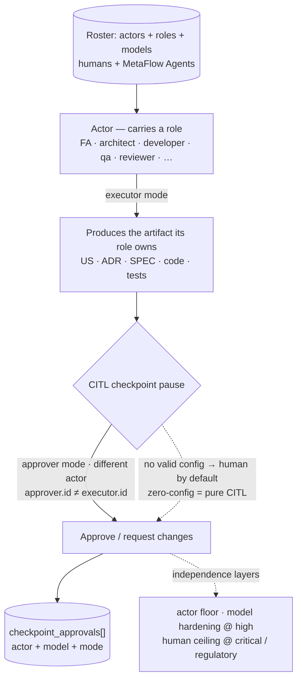

## 3.1 Principles (non-negotiable)

- **AI generates by default; humans govern.**
  AI agents generate the intended-final deliverables (docs / design / code /
  tests) and **run their own tests**; the team steers through governed inputs,
  reviews, validates and approves. Direct human code patches are a legitimate
  fallback when the agent is blocked or correction is safer; they must be
  recorded in the MEM and remain subject to the same gates and approvals.

- **Small, demonstrable work.**
  Everything is broken down into TASKs with a target of **1 hour to 1 working
  day of active delivery time**, with a clear, observable completion
  criterion. Approval waits are measured separately and do not consume this
  sizing target.

- **Delivery Loop as the standard execution form.**
  Each TASK is executed through one or more cycles of: *CITL-approved SPEC → AI
  agent generates the intended-final change, runs tests, and iterates
  autonomously → mandatory MEM
  + manifest update → `CP-MEM-Approval`*. Approval completes the Delivery Loop. A
  request for changes preserves it as an unapproved cycle; the next agent
  execution is a new Delivery Loop with a new MEM.

- **Design and testing first.**
  Test Cases are derived and approved from intended behavior before the
  implementation plan is approved. Design (Domain / Logical) and
  **auto-generated, auto-executed tests** are born with the functionality, not
  afterwards.

- **End-to-end traceability.**
  From **raw inputs or governed sources** → analysis → approved feature US/AC
  or permanent US-000 container → approved TASK → approved Test Cases when
  applicable → approved applicable ADRs →
  canonical SPEC → `CP-SPEC-Approval` → code → tests
  and their constraints → evidence. Everything linked.

- **Simple metrics, data-driven decisions.**
  We measure flow (TASK Lead Time decomposed, weekly throughput,
  % commitment delivered) and first-pass quality (Delivery Loops per TASK, SPEC and
  Delivery Loop first-review approval rates, spec drift). The normative
  definitions — and the limits on what may be derived from them — live in
  §3.7; nothing outside that section is a metric of this methodology.

- **Light cadence, focus on flow.**
  1 week for plan/demo; real work happens in **TASKs** and **Delivery Loops**.

- **Automated quality.**
  A TASK is not "Done" while any applicable **gate** (tests, security,
  licenses, perf-smoke) is `fail`. Applicable gates must be `pass` or
  explicitly `waived` through an approved ADR; non-applicable gates are `n/a`
  with a reason.

- **Knowledge is product.**
  Decisions and lessons learned are captured in every Delivery Loop; secrets and
  sensitive payloads are never copied.

- **LLM traceability:** Every AI-generated Markdown artifact carries an `llm`
  field in its YAML frontmatter recording the exact model identifier reported
  by the tool. Code and JSON do not use YAML frontmatter: code-generation
  usage is recorded in the manifest and described in the MEM. This supports
  model-level analysis without duplicating telemetry across formats. The AREV
  phase templates are the exception: they record the executing model via
  `challenger_model` / `defender_model` / `judge_model` (§2.15, §3.13) and
  carry no separate `llm:` field.

- **Security and compliance by default.**
  Policies and *gates* are part of the flow, not an "extra".

## 3.2 TASK rules (promise / measurement unit)

- **Size:** **1 hour to 1 working day** of active delivery time is the target.
  Several Delivery Loops may belong to the same TASK. If feedback or a later
  Delivery Loop carries work into the next day, keep the same TASK and record the
  elapsed time; do not split it retroactively. Split only when the scope
  contains independently deliverable outcomes that should be governed and
  accepted separately.

- **Creation responsibility:**
  - A functional TASK is created and refined by a Functional Analyst.
  - A non-functional TASK may be created and refined by a Developer,
    Architect, or Tech Lead without Functional Analyst participation or
    approval.
  - A Test TASK is created and refined by QA or a QA Automation Engineer from
    one approved TC.
  - Other qualified specialists may provide governed inputs and evidence; the
    accountable creator and approval route are determined by the TASK type.

- **Content:** A TASK defines the requested outcome, scope, exclusions,
  dependencies, applicable governed sources, expected evidence, and an
  observable completion criterion. It defines **what work must be delivered**;
  it never becomes an ADR or an implementation SPEC.

- **Type:** Every TASK is explicitly classified as `functional`,
  `non-functional`, or `test`:
  - A **functional TASK** delivers a slice of behavior and belongs to the
    approved feature US whose Acceptance Criteria it covers.
  - A **non-functional TASK** delivers a technical outcome and belongs only to
    `US-000-non-functional.md`, even when it affects or benefits a feature US.
  - A **Test TASK** delivers QA Automation for exactly one approved TC, uses
    that TC as its direct parent, and is named
    `TC-NNN.TASK-NNN-<description>.md`.
  - Functional/non-functional classification is independent of `layer`:
    backend, frontend,
    infrastructure, data, or full-stack work can participate in either nature.
    The Test type is determined by its QA Automation purpose.

- **Layer:** Each TASK declares a `layer` in its frontmatter (`Backend`,
  `Frontend`, `Mobile`, `Data`, `Infra`, `QA-Automation`, `Full-stack`, or
  `Documentation`) to indicate the primary technology surface it touches.
  Project templates may extend this enum through normal methodology
  governance. Layer is orthogonal to the TASK type.

- **DoR (Ready):**
  - Functional TASK: correct feature parent approved through
    `CP-US-Approval`.
  - Non-functional TASK: assigned to the permanent US-000 container; no parent
    approval applies.
  - Test TASK: assigned to exactly one TC approved through
    `CP-TC-Approval`.
  - This specific TASK approved through the role-appropriate
    `CP-TASK-READY-Approval`.
  - Functional TASK: clear covered Acceptance Criteria and expected behavior.
  - Non-functional TASK: clear technical outcome, originating evidence, and
    applicable governed sources.
  - Test TASK: clear automation outcome, one source TC, test-only change
    boundary, supported execution context, and expected evidence.
  - Every relevant ADR approved through `CP-ADR-Approval`.
  - Risks / controls identified.
  - Context available for the AI agent (links / artifacts).
  - **No unresolved analysis question:** no `OQ-NNN` in
    `02-analysis/open-questions/` whose `targets` include this TASK's parent US
    or one of its governing artifacts is still `open` or `in-validation`.
    Each must be `answered` and propagated to its target, `deferred` with a
    revisit trigger, or `dropped` with a reason (§5.7, G35). An unanswered
    question about the parent is missing context by definition, which is why
    this belongs to the DoR rather than to a later checkpoint.
  - Demo criterion + estimation (active delivery time, composed per the
    AI-native estimation rule in §2.4), with approval wait measured
    separately.

- **DoD (Done):**
  - Applicable implementation checks and **agent-generated tests are executed
    and green**; gates are `pass` or approved `waived`, with justified `n/a`
    where a gate does not apply.
  - Human review **approved**.
  - Every ADR created or applied by the TASK approved through
    `CP-ADR-Approval`.
  - Evidence of **gates** (security, licenses, performance).
  - **Complete traceability** (story ↔ design ↔ code ↔ tests) and demo ready.

- **Weekly planning:** use **Commit (P85)** + **Stretch (P50)** with a
  **10–20% buffer** (operational procedure in §4.3).

- **WIP:** ideally **1 active TASK per person / agent**. Avoid multitasking.

- **File overlap between active TASKs (§2.4.1):** planning should avoid two
  active TASKs modifying the same file or component (the WIP limit and
  weekly planning are the primary prevention). If overlap happens anyway,
  there is **no priority ordering**: each TASK's approved SPEC records the
  repository baseline it was generated against, and any material change to
  that baseline — including a merge from another TASK — invalidates the
  SPEC approval (G15). The affected TASK's executor must stop, revise and
  re-approve the SPEC before resuming. Conflicts are resolved by whoever
  merges second, following the normal re-approval path; no implicit
  ownership transfer is created.

- **No code without a TASK:** An AI agent or human may not generate, propose,
  apply, or merge a code-related change unless an approved TASK authorizes
  it. This includes source code, tests, configuration, infrastructure as code,
  database schemas and migrations, build scripts, and deployment definitions.
  Every implementation SPEC must reference exactly which approved TASK
  authorizes the work. Urgency and size do not create an exception.

- **US-000 (all general-purpose non-functional TASKs):**
  `12-functional/user-stories/US-000-non-functional.md` is a permanent,
  always-active governance and traceability container. **Every TASK whose
  primary outcome is non-functional must be assigned to US-000.** This
  includes infrastructure, refactoring, technical debt, hardening, security,
  performance, availability, observability, CI/CD, dependency upgrades,
  database maintenance, developer tooling, and similar technical changes.
  A relationship to one or more feature User Stories may be recorded as a
  dependency or related reference, but it does not change the TASK's parent:
  a non-functional TASK remains under US-000.

  US-000 is not a substitute for approved ADRs or automated quality gates.
  ADRs define the applicable architectural decisions and non-functional
  constraints; US-000 groups the TASKs that implement technical outcomes.
  US-000 is not approved, rejected, version-approved, or re-approved by any
  role. It exists only as the canonical parent and grouping mechanism. Every
  US-000 TASK requires its own technical `CP-TASK-READY-Approval` by an Architect
  or Tech Lead and follows the same SPEC, Delivery Loop, MEM, manifest, review, and
  metric rules as any functional TASK.

- **Test TASKs (all QA Automation code):**
  A Test TASK is a third first-class TASK type whose canonical parent is one
  approved Test Case rather than a feature US or US-000. Its ID and filename
  use `TC-NNN.TASK-NNN-<description>`. Each Test TASK may automate only its
  parent TC; one TC may have multiple Test TASKs when the automation must be
  sliced. Test TASKs may change QA Automation code, test data, fixtures,
  mocks, runners, and test-only pipeline configuration within their approved
  scope, but they may not modify production behavior. A detected product
  defect enters the BUG lifecycle.

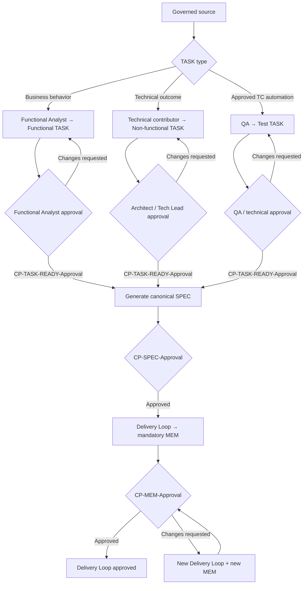

### 3.2.1 SPEC rules (implementation plan per TASK)

- **Purpose:** The SPEC is the executable technical plan for one TASK. It may
  contain the concrete files, components, interfaces, schemas, algorithms,
  implementation phases, tests, observability, migration and rollback steps
  that must not appear in the TASK.

- **Cardinality:** One TASK has one current canonical SPEC; one SPEC references
  one and only one TASK. Revisions update and version that SPEC rather than
  creating parallel plans for the same TASK.

- **Generation owner:** The AI agent creates the SPEC. A human may steer it,
  request corrections and approve it, but the agent must first perform the
  pre-SPEC evidence gate.

- **Mandatory governed sources:** The exact approved TASK; the approved parent
  feature US and covered ACs for functional work; the exact approved parent TC
  for Test TASKs; every approved TC used as a verification contract; all applicable approved ADRs;
  and every approved DISC, REV or AREV conclusion or finding the SPEC uses.
  US-000 is referenced without approval for non-functional TASKs. A BUG-driven
  SPEC also requires the exact BUG with `CP-BUG-Approval`.

- **Mandatory contextual sources:** Relevant `01-input/` files, affected
  `02-analysis/` documents, existing code and tests, configuration,
  infrastructure, database schemas and migrations, external interfaces,
  dependency versions, repository conventions, risks, open questions and
  prior execution evidence. The agent determines relevance from the TASK's
  scope, then records the exact sources and repository baseline used.

- **No hallucinated gap-filling:** The agent may derive implementation detail
  only from the collected evidence and the existing repository. Conflicting,
  missing or ambiguous material is a blocker. The agent records the question
  and stops instead of inventing behavior, architecture, APIs, schemas or
  constraints.

- **Pre-generation blocking:** If a required approval-bearing artifact is not
  approved, the output is a blocking report, not a partial or draft SPEC.
  Optional DISC, REV and AREV artifacts are not required to exist, but once
  used they must have completed their applicable approval lifecycle.

- **Required contents:** Source inventory and approval references; repository
  baseline; scope and exclusions; impacted components and files; detailed
  implementation plan; mappings to ACs or measurable technical outcomes;
  applicable ADR constraints; test strategy and expected evidence; quality
  gates; security, data and observability considerations; migration,
  compatibility and rollback plan when applicable; risks, assumptions and
  explicit stop conditions.

- **BUG-specific contents:** A BUG SPEC explicitly defines the single-Delivery Loop
  TDD sequence and evidence: reproduce the pre-fix defect with an automated
  test, execute and capture red for the expected reason, then modify production
  code and execute targeted plus applicable regression tests to green. The
  SPEC forbids the production change before red evidence exists.

- **Test-TASK-specific contents:** A Test TASK SPEC maps exactly one approved
  parent TC to the QA Automation code and test-only assets needed to execute
  it. It preserves the TC's expected results, prohibits production-code
  changes, and defines the execution evidence that will demonstrate faithful
  automation.

- **Approval:** The completed draft stops at `CP-SPEC-Approval`. The
  Dev-validator and applicable domain owner(s) review the actual SPEC and its
  source evidence. Approval authorizes the first code-run/Delivery Loop; it does not
  approve the generated implementation.

- **Invalidation:** A material change to any governing source or relevant code
  baseline invalidates the current approval. The code-run pauses, the same
  canonical SPEC is revised, and `CP-SPEC-Approval` is repeated before work
  resumes. Silent or merely logged mid-run SPEC changes are forbidden.

- **No implementation before approval:** Humans and agents may inspect the
  repository while preparing the SPEC, but may not generate or modify source
  code, automated tests, configuration, infrastructure, migrations, schemas,
  build scripts or deployment definitions until the SPEC is approved.

## 3.3 Delivery Loop rules (execution form)

- **No commits without an explicit user request:** the agent never stages,
  commits, pushes, or opens pull requests on its own. Version-control
  actions happen only when the human explicitly asks (G34). Artifacts are
  written to the working tree; the human owns the repository history.
- **No unsolicited internet research:** the agent does not search the web
  proactively or crawl pages recursively. Web tools are used only when the
  human explicitly asks for an internet search, or when an approved
  SPEC/ADR/TC requires verifying third-party information (e.g. a library's
  API at implementation time). MetaFlow investigations live in governed
  artifacts (DISC, analysis) — the web is not a default step and consumes
  tokens without governed value.
- **Fixed anatomy:**
  1. **Approved SPEC** with recorded `CP-SPEC-Approval`, referencing a TASK with its individual
     `CP-TASK-READY-Approval`; a functional TASK additionally references the
     `CP-US-Approval` of its feature parent, while a non-functional TASK
     references US-000 without parent approval. A BUG TASK additionally
     references its exact BUG and `CP-BUG-Approval`. A Test TASK references
     exactly one parent TC and its `CP-TC-Approval`.
  2. **AI agent generates the intended-final docs/design/code/tests by
     default** and **runs the applicable tests inside the same autonomous loop
     until they pass or a mandatory stop condition is reached**. Any retries
     or corrections performed without human intervention remain internal to
     this Delivery Loop. A direct human patch is an allowed fallback only when it is
     recorded in the MEM and verified through the same gates and CITL review.
  3. **AI agent creates the mandatory MEM + updates manifest** — the agent
     writes exactly one narrative record
     (`22-memory/MEM-YYMMDD-HHmm-<description>.md`) for the
     Delivery Loop, with all required content from §2.12 and no mutable approval
     status, then appends the corresponding `delivery_loops[]` entry to the TASK
     manifest in `metaflow/23-metrics/tasks/`. This happens **before** human review so
     the reviewer receives the complete package.
  4. **`CP-MEM-Approval`** (dev / QA / security / applicable domain) — the
     reviewer reads the **actual diff + test/gate evidence + MEM + manifest**,
     records the complete review evidence in the MEM/checkpoint record and the
     minimal decision in `checkpoint_approvals[]`, and thereby decides the current
     Delivery Loop. An Adversarial Review, when a stakeholder triggered one on this
     package, is a **pre-filter for this decision** and not a stage of the
     Delivery Loop (§2.15).
  5. **Outcome recorded:**
     - **Approved:** `CP-MEM-Approval` approves and completes the Delivery Loop;
       when this is the latest Delivery Loop, the TASK becomes
       `Development Completed` and the package may proceed to the next
       applicable checkpoint.
     - **Changes requested:** the Delivery Loop and its MEM remain unapproved in
       history and the TASK remains `In Development`. The next autonomous agent
       execution is a new Delivery Loop, creates a new MEM, and is appended as a new
       `delivery_loops[]` entry.

- **Mandatory post-execution sequence (non-negotiable):** After the agent
  reaches a reviewable result or a mandatory stop condition (step 2), and
  **before** yielding control for human review (step 4), it **must** execute
  these steps in this exact order:

  ```
  Record implementation + verification outcome (including blockers)
  → Create mandatory MEM → Update TASK manifest
  → PAUSE at CP-MEM-Approval
  ```

  The human reviewer receives the **complete package**: code + 24-tests/gates +
  MEM + manifest. No partial packages. A Delivery Loop without exactly one complete
  MEM and its manifest update is incomplete and cannot enter
  `CP-MEM-Approval`; without an approved checkpoint it cannot be considered
  an approved Delivery Loop. Red required gates, unresolved blockers, or an
  implementation that does not satisfy the SPEC force a non-approved decision,
  but never excuse omission of the MEM.

- **Single active executor per TASK:** Only one developer/agent controls the
  active Delivery Loop at a time. A handoff may occur only after the current
  Delivery Loop has produced its MEM and manifest entry and paused at
  `CP-MEM-Approval`. Any subsequent autonomous execution is a new Delivery Loop;
  if governed scope or implementation instructions changed materially, the
  TASK and/or canonical SPEC must be re-approved first. Historical entries
  remain immutable.
  - **Handoff protocol:** the handoff is documented in the TASK's History
    section (date, outgoing executor, incoming executor, reason). After
    handoff, the **incoming executor** is the
    Dev-validator who reviews and approves the pending MEM of the previous
    Delivery Loop (it is still their first action on the TASK); `created_by` in
    the manifest records the executor of each generation — the next
    Delivery Loop's `code_generation` uses the incoming executor's identity.
    A pending MEM cannot be approved by the outgoing executor once the
    handoff is recorded.

- **Bounces per TASK:** as needed (typically 1–3). Count every package
  submitted for human validation, including rejected packages. Autonomous
  internal retries before submission do not increment this metric.

- **Time:** Active delivery time is used for the one-day sizing target. Total
  elapsed cycle time, including waits, is measured separately. Crossing a day
  boundary is an accepted variance and never creates a new TASK by itself.
  AI-time remains a sub-metric.

- **Test-first where behavior changes:** For functional and BUG-driven TASKs,
  and for non-functional TASKs whose expected outcome is testable before the
  implementation change, the agent derives tests from ACs and governed
  constraints and uses them as the Delivery Loop's brake. The applicable evidence
  is recorded in the MEM. Documentation-only, infrastructure-only and other
  work for which a pre-change automated test is not meaningful records the
  gate as `n/a` with a reason rather than manufacturing an empty test commit.
  For a BUG TASK, the stronger strict-TDD rule in §3.3.1 applies: the agent
  must execute the reproduction test against pre-fix behavior, record the
  expected red result, and only then modify production code and proceed to
  green in the same Delivery Loop.

- **SPEC changes during a Delivery Loop:** A material SPEC amendment immediately
  stops the current execution. That Delivery Loop is closed with its mandatory MEM
  and manifest entry against the SPEC revision it actually used, normally with
  `execution_outcome: blocked` or `cancelled`. The canonical SPEC is then
  revised, appended to `spec_revisions[]`, and re-approved through
  `CP-SPEC-Approval`. Execution resumes only as a **new Delivery Loop** that
  references the newly approved revision. One Delivery Loop never spans two SPEC
  revisions.

- **Risk class rubric** — the applicable TASK reviewer assigns `risk_class` in
  the TASK frontmatter during `CP-TASK-READY-Approval` as part of the TASK's DoR.
  QA or Security may escalate it at any subsequent review. Once the first MEM
  is approved, it cannot be reduced unless the TASK itself is formally
  re-reviewed and re-approved; historical Delivery Loops retain the risk class that
  governed them. Every reassignment is appended to the TASK frontmatter's
  `risk_history` array; it never rewrites the historical review evidence:

  **Consequences of an escalation:**
  - **No retroactive invalidation.** Delivery Loops and MEMs already approved
    under a lower risk class remain valid history — they are immutable.
  - **Current SPEC:** if the escalation reveals new scope, constraints or
    risks not covered by the approved SPEC, the canonical SPEC must be
    revised and re-approved at `CP-SPEC-Approval` before execution
    resumes (G15). A pure approver-level escalation (e.g. adding QA/Sec to
    the remaining checkpoints) does not require SPEC revision.
  - **Remaining checkpoints** use the new (higher) risk class — e.g. more
    approvers at `CP-MEM-Approval` and at `CP-TASK-DONE-Approval`.
  - **No automatic TASK re-approval** is triggered by escalation alone;
    the TASK's DoR is unchanged. Only a *reduction* requires formal
    re-review of the TASK.

  ```yaml
  risk_history:
    - previous_class: medium
      new_class: high
      decided_by:
        - actor: human:security.name
          role: security
          model: null
      reason: "Authentication boundary affected."
      decided_at: 2026-08-02T14:20:00-03:00
  ```

  | Risk | Examples | REV / AREV | Min approvers at CP-MEM-Approval |
  |------|----------|------------|---------------------|
   | `low`      | Internal tooling, docs, low-blast-radius UI | stakeholder-triggered, optional | 1 (the executing Dev-validator) |
   | `medium`   | Standard feature in product surface         | stakeholder-triggered, optional | 1 (the executing Dev-validator) |
   | `high`     | Auth, payments, data migration, public API  | stakeholder-triggered, optional | 1 (the executing Dev-validator; incoming executor after a handoff) |
   | `critical` | Money movement, PII at scale, prod IaC      | stakeholder-triggered, optional | 1 (the executing Dev-validator; incoming executor after a handoff) |

  Risk informs the stakeholder's decision but never triggers REV or AREV
  automatically. If either mechanism is initiated, its complete approval
  rules apply regardless of risk class.

- **Autonomy levels (L1–L4)** — how much the agent decides on its own.
  `autonomy_level` is declared in the frontmatter of every SPEC revision;
  the manifest does not duplicate it.

  | Level | Name | Agent decides | Human is asked when |
  |-------|------|---------------|---------------------|
  | **L1** | *Suggest*    | Generates a bounded proposal or diff without applying it.     | At the end of the bounded run, or earlier on a stop condition. |
  | **L2** | *Bounded*    | Implementation details within a documented choice set.       | Choosing pattern / library / strategy. |
  | **L3** | *Autonomous* | Full implementation of the Spec, including library choice.   | Stuck, ambiguous AC, ADR-class change. |
  | **L4** | *Orchestrated* | Selects and sequences several already approved TASKs, while executing each through its own SPEC, Delivery Loops, MEM and manifest. | Cross-TASK dependency, ADR, schema change, security/perf trade-off. |

  Defaults by risk: `low → L3`, `medium → L3`, `high → L2`, `critical → L1`.
  L4 is reserved for sandboxed experiments and is **never** allowed without
  an explicit ADR approved through `CP-ADR-Approval`.

- **Quality criteria:**
  - **First-pass approval** as a target (reduces rework).
  - Universal and conditional CI gates are selected and evaluated exactly as
    defined in §3.6; no TASK fabricates unit/integration, SAST/DAST or
    performance evidence for an inapplicable artifact type.

### 3.3.1 BUG correction rules (strict TDD)

- A Functional Analyst, Developer, or QA may draft a `BUG-NNN`, but the BUG
  cannot produce a TASK until `CP-BUG-Approval` confirms its evidence,
  classification, and correct parent route.
- Every approved BUG has exactly one dedicated TASK. Functional BUG TASKs are
  children of the affected approved feature US; non-functional BUG TASKs are
  children of `US-000-non-functional.md`.
- The BUG, TASK, SPEC, MEM, and manifest reference each other. The BUG never
  authorizes code by itself.
- Before generating a BUG SPEC, the agent verifies `CP-BUG-Approval`,
  `CP-TASK-READY-Approval`, the functional parent's `CP-US-Approval` when
  applicable, and every approval required by the other governed sources used.
- Every BUG SPEC defines a strict TDD sequence in the same Delivery Loop: create the
  reproduction test → run it and capture the expected red result → modify
  production code → run the targeted and applicable regression suites until
  green.
- Production code may not be changed before objective red evidence exists. If
  the failure cannot be reproduced as an automated test, the agent stops,
  creates the mandatory MEM and manifest `delivery_loops[]` entry with the blocker
  outcome, and
  pauses for `CP-MEM-Approval` without applying the fix.
- The MEM records the red command/result and the green command/result
  separately; the manifest records the Delivery Loop and its MEM reference. A BUG
  Delivery Loop without both pieces of evidence in the MEM
  cannot receive approved `CP-MEM-Approval`.
- Human-requested changes create a new Delivery Loop and a new MEM. The same strict
  red-to-green evidence is required for every correction Delivery Loop; prior MEMs
  remain immutable history.

## 3.4 Interview-based inception rules (backlog engine)

- **Recorded interviews** (audio/video) with consent; agenda of goals and
  metrics.

- **Transcription + AI elaboration:** US, AC, architectural concerns, risks, **grouping into
  Units** and proposal of **initial TASKs**.

- **Human validation:** close ambiguities, fix metrics and prioritize.

- **Minimum output:** prioritized backlog, **Risk Register**, Units → TASKs
  map, and demo criteria for the first 1–2 weeks.

## 3.5 Design and decisions rules (ADRs)

- **Dual design:**
  - **Domain Design** (tactical DDD) for business models.
  - **Logical Design** (patterns / quality attributes / platform) for technical decisions.

- **1-page ADR** per relevant decision (context, alternatives, decision,
  consequences).

- **Mandatory approval:** Every ADR stops at `CP-ADR-Approval`. An Architect
  or Tech Lead either approves the decision or requests changes. Until approved,
  the ADR remains a draft and has no governing authority.

- **Timing:** An ADR that constrains implementation must be prepared and
  approved before the SPEC is generated. If the need for a new architectural
  decision emerges during SPEC preparation or a Delivery Loop, the work stops; the
  ADR is drafted and approved, then the canonical SPEC is revised and approved
  again before technical execution resumes.

- **Immutability:** Once approved, an ADR is **read-only**. The substantive
  content (context, decision, consequences) is never modified. If an approved
  decision is reversed, create a new ADR that supersedes the original; the old
  ADR stays as-is with status `superseded`. Drafts may be refined in response
  to `CP-ADR-Approval` feedback before approval.

- **Conflicts between approved ADRs:** two active ADRs may not contradict
  each other.
  - *Detection (at creation):* before requesting `CP-ADR-Approval`, the
    drafter checks the decision log for active ADRs whose decisions this
    ADR contradicts and records them in the `conflicts_with` frontmatter
    field. The approver (Architect or Tech Lead) verifies this check as
    part of the approval review.
  - *Resolution (the rule):* a conflict between approved ADRs is always
    resolved by a **new ADR that supersedes the contradicting one(s)**
    — the new ADR states the contradiction in its context, lists the
    superseded ADRs in `supersedes`, and the old ADRs are marked
    `superseded`. No AREV or REV is required by default; they remain
    available as stakeholder escalation for high/critical conflicts.
  - *Enforcement (at use):* the pre-SPEC evidence gate (§2.4.1) blocks any
    SPEC whose `sources` include two or more active ADRs whose decisions
    are mutually exclusive, until the conflict is resolved by a superseding
    ADR (§3.5).

- **Approval evidence:** The ADR records `status`, approver, role, timestamp,
  decision, and review evidence. When the ADR governs a SPEC revision, its
  repository-relative path appears in that revision's `sources`; the ADR
  remains the source of truth for its own approval.

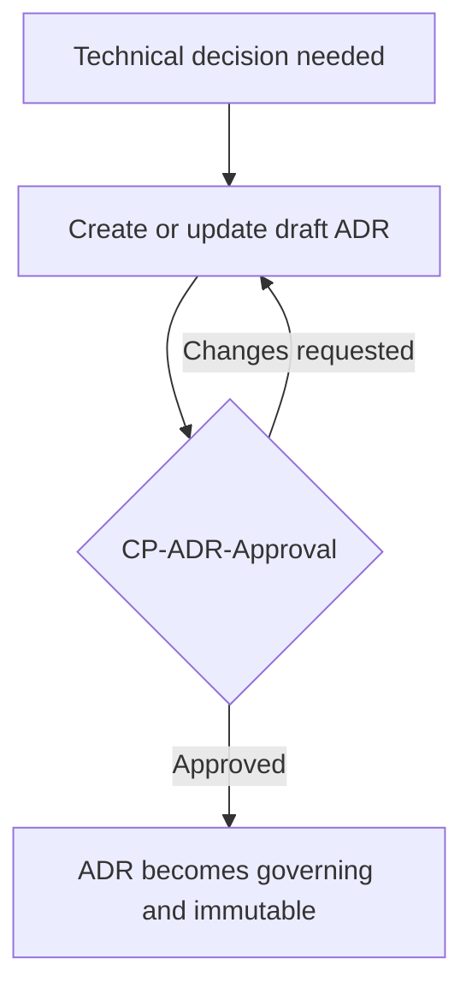

## 3.6 Quality Gates (minimum mandatory)

Gates are the **automated arm** of CITL: they reject obviously broken or
unsafe agent output before a human spends time on it. Quantitative gate
results use the CI evidence and MEM format; the manifest deliberately does not
duplicate them.

**Data classification (`data_classification`):** every TASK and SPEC declares
one of `public` · `internal` · `confidential` · `restricted` — schema values,
never translated (§3.15) — in **increasing sensitivity order**:
`public < internal < confidential < restricted`. The SPEC's value mirrors
its TASK's and may tighten it, never loosen it. The PII/DLP gate blocks any
data **above** the Spec-declared class from the prompt-submit boundary, and
`confidential` or higher is never sent to an external LLM (§1).

**Universal gates (every TASK):**

- the TASK manifest exists and validates against its normative
  manifest-family JSON Schema (§3.12);
- repository policies, required reviews and applicable style/format rules are
  satisfied;
- secret scanning passes for every changed artifact;
- every gate selected as applicable by the approved SPEC ends as `pass` or an
  explicitly approved `waived`; a non-applicable gate is recorded as `n/a`
  with its reason.

**Conditional classic gates (required when applicable to the change):**

- **Behavioral code:** unit and integration tests **green**; contract or E2E
  tests when the change crosses component boundaries **within this TASK's
  scope** — this per-TASK gate is distinct from the Unit-level regression
  suite below, and one never substitutes for the other.
- **Security-relevant/runtime code:** SAST; DAST when an executable attack
  surface exists; dependency scanning and **licenses / SBOM** when dependencies
  or distributable software are involved.
- **Externally reachable surface:** **OWASP Top 10** coverage when the change
  exposes or alters an interface reachable from outside the process — public
  endpoints, web UIs, authentication boundaries. Otherwise the gate is `n/a`
  with a reason in the SPEC: the Top 10 is a web-security catalogue, and a
  gate that is almost always `n/a` is noise, so the SPEC decides applicability
  per TASK.
- **Performance-sensitive code:** **perf-smoke** with SPEC-defined p95 and/or
  p99 thresholds for the affected critical endpoints or workloads.
- **Backend/services:** required logs, metrics and traces.
- **Infrastructure/data/documentation/Test TASKs:** the SPEC selects the
  meaningful validation for the artifact; irrelevant product-code gates are
  `n/a`, never fabricated.

**Conditional AI-native gates (required when the stated risk exists):**

- **Prompt-injection scan:** detect untrusted input being concatenated into
  prompts or system messages.
- **Secret-leak scan:** block commits containing API keys, tokens,
  credentials — even in tests or fixtures.
- **Hallucination lint:** static check for imports / APIs / files / env vars
  the agent referenced but that do not exist.
- **IP / license provenance scan:** detect AI-generated code that matches
  public/open-source snippets under incompatible licenses. Use GitHub Copilot
  code referencing/public-code matching, Black Duck Snippet Analysis/Snippet
  API, or an equivalent provenance control.
- **PII / DLP gate:** the prompt-submit boundary scans for PII, secrets and
  data above the Spec-declared `data_classification`. Confidential data is
  never sent to an external LLM.
- **Dependency-confusion scan:** every agent-suggested dependency name is
  cross-checked against a known-good registry **before install**; unknown
  package names block the TASK.
- **Test-first evidence:** required for functional, BUG-driven and other
  behavior-changing TASKs where a meaningful pre-change automated test exists.
  The MEM records the red/green or equivalent sequence; otherwise the gate is
  `n/a` with a reason.
- **Behavioral reproducibility check** *(replaces the older “determinism
  check” — LLMs are not bit-deterministic)*: re-running the Delivery Loop from
  the captured SPEC + exact model run(s) must
  produce a solution where
  (a) the original tests still pass, (b) the public contract is unchanged,
  (c) the approved ADRs are still satisfied.
- **TASK-manifest validation:** the manifest in `metaflow/23-metrics/tasks/` (§3.12) must
  be present, valid against the manifest schema (§3.12), and contain the applicable
  lifecycle decisions in `checkpoint_approvals[]`. Approval detail that belongs to
  an ADR, DISC, REV or other source artifact is validated at that artifact.

**Release-level gates (aggregated above the per-TASK loop, NOT per TASK):**

- **Mutation testing** (where the language allows) at release / milestone level
  — not at every TASK. Mutation tooling is too slow to be a per-TASK gate and a
  low per-TASK score is noisy; aggregating above the inner loop gives a signal
  without crushing it.
- **End-to-end / contract tests** for **cross-TASK** regressions introduced
  by AI output that looked locally correct. This release-level suite does not
  replace the per-TASK conditional gate above: a TASK whose change crosses
  component boundaries still runs its own contract/E2E verification and may
  not record it as `n/a` on the grounds that a later release suite will cover it.

**Rule:** Every applicable gate must finish as `pass` or `waived`. `fail`
blocks merge, `CP-MEM-Approval`, TASK acceptance and promotion. A waiver
requires an ADR approved through `CP-ADR-Approval` that records the reason,
owner, compensating control and expiry date; the gate result remains
`waived`, not `pass`. `n/a` is valid only when the approved SPEC explains why
the gate does not apply.

## 3.7 Official metrics — Delivery Flow-first

Metrics are the **steering wheel** of the methodology. MetaFlow uses
the current **five Delivery Flow software-delivery metrics** as the primary signal of delivery performance,
extended with **AI-native flow metrics** and **CITL governance metrics**.
Every weekly demo opens with these numbers.

### 3.7.1 Delivery Flow Five (primary — mandatory)

| # | Delivery Flow metric | Canonical definition used by MetaFlow | Source of truth |
|---|-------------|--------------------------------------|-----------------|
| D1 | **Deployment Frequency** | Number of successful production deployments per defined reporting period | CI/CD production-deployment events |
| D2 | **Change Lead Time** | Time from a change being committed to version control until it is deployed to production | VCS commit timestamp + CI/CD production timestamp |
| D3 | **Failed Deployment Recovery Time** | Time required to recover from a production deployment failure that needs immediate intervention | Deployment event + incident/recovery event |
| D4 | **Change Fail Rate** | Percentage of production deployments that require immediate intervention because they caused a failure | CI/CD deployments joined to deployment-caused incidents, rollbacks or fixes |
| D5 | **Deployment Rework Rate** | Percentage of production deployments that are unplanned work performed to address a user-facing production issue | CI/CD deployments classified by planned delivery versus production rework |

Teams define internal baselines and improvement objectives from their own
context and review them in retrospectives. MetaFlow does not label fixed
thresholds as universal Delivery Flow "Elite" targets and does not turn a Delivery Flow metric
into an individual performance target. **TASK Lead Time** remains a separate
MetaFlow flow metric; it begins at `CP-TASK-READY-Approval` and must not be reported
as Delivery Flow Change Lead Time.

**AI-aware analysis without corrupting Delivery Flow definitions:**

- Keep the five Delivery Flow metrics calculated at deployment/service level from the
  sources above.
- Join deployments to their included TASKs and manifest model runs only for
  diagnostic slicing. When a deployment contains several TASKs or models,
  classify it as a `model_mix`; never attribute the whole outcome to one model
  without an unambiguous causal link.
- Decompose **TASK Lead Time**, not Delivery Flow Change Lead Time, into
  `ai_generation_minutes | human_review_minutes | wait_minutes` and keep
  deployment time in CI/CD telemetry.
- Pair deployment frequency with first-pass and rework signals to detect high
  cadence with low quality, without redefining the Delivery Flow metric.

### 3.7.2 AI-native flow metrics (secondary)

| Metric | Definition | Why we track it |
|--------|-----------|-----------------|
| **Lead Time per TASK (decomposed)** | From `CP-TASK-READY-Approval` to `CP-TASK-DONE-Approval`; AI generation comes from the manifest and human review/wait from the manifest timing contract or workflow telemetry (§3.12) | Sizes TASKs realistically; reveals the actual bottleneck without being confused with Delivery Flow Change Lead Time |
| **Model runs per TASK** | Count of `runs[]` across TASK, SPEC, code and MEM generation in the manifest | Provider-independent proxy for AI orchestration complexity |
| **Weekly Throughput** | # of TASKs closed per week | Forecasting input |
| **% Commitment delivered** | Committed vs. closed TASKs | Planning health |
| **Delivery Loops per TASK** | Total Delivery Loops required to obtain human approval for a TASK | Measures first-pass quality and the human-requested rework needed to complete the TASK |
| **SPEC first-review approval rate** | SPEC revisions whose first `CP-SPEC-Approval` decision is `approved` / SPEC revisions reviewed | SPEC preparation quality |
| **Delivery Loop first-review approval rate** | TASKs whose first Delivery Loop receives approved `CP-MEM-Approval` / TASKs with at least one reviewed Delivery Loop | Implementation first-pass quality |
| **Rework Ratio** | Additional Delivery Loops after the first human review / total completed TASKs | Real DoR quality signal |
| **Spec Drift** | Agent questions plus material SPEC revisions per TASK | Inverse signal of SPEC completeness and repository grounding; gameable if you only count questions |
| **Manual Intervention Rate** | % of TASKs whose MEMs report direct human code changes | Honest signal of where the agent fails; not punished, measured |

### 3.7.3 CITL governance metrics (mandatory)

These exist to **prove that human-by-default governance is real**, not nominal:

| Metric | Definition | Target |
|--------|-----------|--------|
| **CITL Coverage** | % of TASKs whose required named checkpoints (per TASK type and applicable conditions, §3.0), including individual role-routed `CP-TASK-READY-Approval`, `CP-BUG-Approval` for every BUG-driven TASK, `CP-US-Approval` only for functional TASKs, `CP-TC-Approval` for every applicable verification contract and every Test TASK parent, `CP-SPEC-Approval` for the canonical SPEC version executed, `CP-ADR-Approval` for every applicable ADR, `CP-MEM-Approval` for every Delivery Loop/MEM pair, and every conditional DISC/REV checkpoint linked to the TASK, are all signed off **with review-quality evidence**. AREV governance is measured from AREV artifacts, never from the TASK manifest. | **100%** per TASK type and applicable condition |
| **BUG Governance Coverage** | % of BUGs with `CP-BUG-Approval` recorded before creation of exactly one correctly parented dedicated TASK, plus red→green evidence for every executed BUG Delivery Loop | **100% of approved BUGs and BUG Delivery Loops** |
| **TC Governance Coverage** | % of TCs whose source US/ACs, source TASK, test basis, and `CP-TC-Approval` are complete before the TC governs a SPEC or originates a Test TASK | **100% of used TCs** |
| **QA Automation TASK Coverage** | % of QA Automation code changes authorized by a correctly parented `TC-NNN.TASK-NNN`, with exactly one approved source TC and the complete standard TASK lifecycle | **100% of QA Automation changes** |
| **Research and Review Governance Coverage** | % of initiated DISC artifacts with `CP-DISC-Approval`, initiated REV artifacts with `CP-REV-Approval`, and initiated AREV artifacts with all three sequential phase approvals | **100% of initiated mechanisms** |
| **MEM Governance Coverage** | % of `delivery_loops[]` entries that reference exactly one complete MEM and have a matching manifest `CP-MEM-Approval`; review-quality detail remains in the MEM/checkpoint evidence | **100% of Delivery Loops** |
| **Time-to-Human-Review** | Working time from the governed artifact's canonical `review_ready_at`—when that exact version is formally submitted and available for review—to `review.started_at` | < 4 h working time; ≥ 4 h → recorded as process defect for the retro; ≥ 8 h → escalate to artifact owner/lead; ≥ 24 h → escalate to PO/Tech Lead (§3.0) |
| **Approval-without-Comment Rate** | % of approved CITL decisions with empty `review.findings`; slice by checkpoint and compare `started_at`→`decided_at` with the applicable review budget in §3.0 where one exists (US, BUG, TC, ADR, DISC, REV and AREV budgets are project-defined) | Investigate if > 70% together with unusually short reviews — possible rubber-stamping |
| **Human Override Rate** | % of Delivery Loops where the human changed/rejected the agent's output, **sliced by risk class** | Empirical bands (tune in 90 days): `low` 5–20% · `medium` 10–30% · `high` 15–40% · `critical` 20–50% |
| **Adversarial Review Adoption** | % of work items for which a stakeholder elected to initiate AREV, sliced by scope, trigger source, and risk | Monitor only — no mandated adoption rate |
| **Defect escape rate** | Defects that reached UAT / prod; deployment-caused production defects may feed D4 after causal classification | ↓ trend |
| **Gate Override Rate** | % of gate failures bypassed with an approved waiver ADR in CI/MEM evidence | Monitor — investigate if rising |
| **Escalation Rate** | % of TASKs escalated from L3→L2 or L2→L1 during execution | Monitor — signals DoR or Spec quality issues |

The governance-metrics collector joins checkpoint evidence from the governed
artifacts by canonical artifact ID and checkpoint, then joins TASK lifecycle
decisions from the manifest family by TASK ref, SPEC revision and Delivery Loop
number. Queue and review times (Time-to-Human-Review, active review,
review duration) come from the manifest timing contract
(`review_ready_at` / `review_started_at` / `decided_at`, §3.12), with
workflow telemetry as fallback when a step timestamp is missing. DISC, REV,
AREV, ADR and other artifact-owned approvals are read from those
artifacts rather than inferred from their absence in the TASK manifest.
Workflow telemetry may index the same IDs and timestamps, but it must never
manufacture an approval that is absent from the governed source artifact.

### 3.7.4 How metrics drive decisions

- **Weekly retro opens with Delivery Flow Five** + CITL Coverage. No Delivery Flow review → no
  retro.
- If **Commit is missed** → reduce TASK size or improve DoR.
- If **Rework Ratio rises** → the bottleneck is DoR / Spec quality, not the
  agent.
- If **Human Override Rate drops below 10%** → risk of rubber-stamping;
  rotate reviewers and let stakeholders consider a targeted REV or AREV.
- If **D4 (Change Fail Rate) rises** → tighten gates and ask the relevant
  stakeholders whether targeted REV or AREV coverage would help before
  increasing throughput.
- If **Spec Drift is high** → invest in `02-analysis/` (better domain model and
  glossary).
- If **TASK estimates drift ≥ 2× from actual active delivery** → recalibrate
  with the AI-native estimation rule (§2.4) and check for manual-effort
  anchoring; where story points are used, correlate them against actual
  aggregated TASK Lead Time per US (§2.6).

## 3.8 Prioritization and service classes

MetaFlow keeps three orthogonal taxonomies; none creates an additional TASK
type:

| Dimension | Field | Values | Purpose |
|-----------|-------|--------|---------|
| TASK type | `task_type` | `functional`, `non-functional`, `test` | Parentage, scope boundary and core CITL routing |
| Work category | `work_category` | `feature`, `refactor`, `infra`, `hardening`, `debt`, `qa_automation` | Reporting and TASK-acceptance routing |
| Service class | `service_class` | `regulatory`, `incident_hotfix`, `feature_value`, `debt_hardening` | Priority and capacity policy |

A BUG-driven TASK and a hotfix TASK remain functional or non-functional; a
Test TASK remains `test`. BUG and hotfix are conditions, not TASK types.

**Mapping constraint:** every work category maps to exactly one TASK type —
`feature` pairs only with `task_type: functional` (a feature US);
`refactor`, `infra`, `hardening`, and `debt` pair only with
`task_type: non-functional` (US-000); `qa_automation` pairs only with
`task_type: test` (an approved TC), and `task_type: test` always carries
`work_category: qa_automation`. No other combination is valid (§3.11
restates this mapping where it routes `CP-TASK-DONE-Approval`).

- **Rules:**
  - Regulatory / Incident take **immediate precedence**.
  - A TASK retains its identity across all required Delivery Loops; split
    it only when independent deliverables or approvals justify separate TASKs.
  - Debt / Hardening: reserve **10–20%** per week.

## 3.9 Minimum roles

- **PO / PM:** Defines Intent / value, prioritizes **TASKs**, accepts demos.

- **Functional Analyst:** Governs `02-analysis/`, creates and approves feature
  User Stories and functional TASKs, and approves functional BUGs before their
  TASKs are created. Has no mandatory role in creating or
  approving non-functional TASKs under US-000.

- **Architect / Tech Lead:** Governs ADRs and approves non-functional TASKs.
  May also create and refine non-functional TASKs directly and approves
  `critical`-severity non-functional BUGs (and their dedicated TASK) before
  the TASK is created.

- **Dev-validator:** Orchestrates **Delivery Loops**, reviews and validates the
  outputs generated by the AI agent, and is accountable for
  `CP-SPEC-Approval` together with applicable domain owners. Drafts or
  maintains ADRs for approval by the Architect or Tech Lead. As a Developer,
  may draft functional or non-functional BUGs, create and refine
  non-functional TASKs under US-000, and approve non-functional BUGs (and
  their dedicated TASK) at any severity — any qualified team member, the BUG's
  own author included, may record the approval (G29: guidance, never a gate).
  Does not normally author production code
  by hand, but may apply a recorded manual fallback under the approved SPEC;
  the same tests, gates and CITL review still apply.

- **AI Orchestrator / TL:** Tooling, memory, prompts, policies; supervises
  vibe-coding practices, gates and traceability. Configures and maintains the
  AI agents.

- **QA / Security:** Defines and maintains *gates*, co-designs the testing
  strategy with the AI agent, drafts Test Cases from approved intent, and may
  draft functional or non-functional BUGs from observed failures and evidence.
  QA or a QA Automation Engineer may create Test TASKs from approved TCs; a QA
  Lead, QA Automation Lead, Architect, or Tech Lead approves them.

## 3.10 Anti-patterns (what we DO NOT do)

- **"Elephant" TASKs** with several independent outcomes, or vague ones
  ("improve performance" with no thresholds). Elapsed time alone does not
  make a TASK an elephant.

- **Delivery Loops without tests** (no objective brake).

- **Test Cases reverse-engineered from code:** current implementation behavior
  is copied into expected results instead of deriving them from approved
  intent, creating confirmation bias.

- **QA Automation without a Test TASK:** test code is created inside an
  unrelated product TASK, or one Test TASK spans several source TCs.

- **Direct BUG fixes:** creating the BUG's TASK before `CP-BUG-Approval`,
  fixing it under an unrelated TASK, or changing production code before a
  reproduction test has produced the expected red evidence.

- **"Ghost" design** (decisions without ADR).

- **"Ghost" SPEC approval:** starting a code-run from a draft, stale or
  unapproved SPEC, or treating TASK approval as implicit SPEC approval.

- **Sprints as "buckets"** to hide delays (the meaningful number is
  **TASKs Done**, not "being busy").

- **Dirty memory:** unlinked artifacts; decisions or lessons not captured.

- **Unrecorded human coding:** a human patch is hidden, bypasses the approved
  SPEC or gates, or is presented as AI-generated. Recorded manual fallback is
  permitted and measured; ungoverned implementation is the anti-pattern.

## 3.11 Approval and acceptance levels (Policy)

**Goal:** Clarify what "Approval" means at each instance and who decides.
These map 1:1 to the CITL checkpoints defined in §3.0.

**Levels:**

1. **User Story Approval — `CP-US-Approval`**
   - **Validates:** the US, its Acceptance Criteria, and its traceability to
     raw inputs and analysis artifacts.
   - **Who:** Functional Analyst. If the named role has no holder, the
     available qualified human records the approval, noting the self-assigned
     role (role routing is guidance, not a gate).
   - **Output:** US status = approved. Only then may candidate TASKs be derived
     from it.
   - **Applicability:** Feature User Stories only. US-000 is a permanent
     container and is never submitted for approval.

2. **BUG Approval — `CP-BUG-Approval`**
   - **Validates:** that the reported defect is real and sufficiently
     evidenced, expected and actual behavior are clear, and functional versus
     non-functional classification and future TASK parent are correct.
   - **Who:** Functional Analyst for a functional BUG; for a non-functional
      BUG, Architect or Tech Lead when `severity: critical`, otherwise any team
      member, the BUG's own author included — the recommended approver is
      guidance, never a gate; the author may approve at any severity. A Developer or QA may create either as
      draft. The named-role routing above is guidance, not a gate: if a named
      role has no holder, the available qualified human records the approval,
      noting the self-assigned role.
   - **Output:** BUG status = approved. Only then may its one dedicated TASK be
     created. This does not approve that TASK or authorize implementation.

3. **Test Case Approval — `CP-TC-Approval`**
   - **Validates:** that the TC was derived from its approved US/ACs and source
     TASK, or from an approved non-functional TASK and governing technical
     sources; that preconditions, data, steps, expected results, coverage, and
     evidence are complete; and that current code was not treated as the
     source of expected behavior.
   - **Who:** QA plus a Functional Analyst or delegated business-domain owner
     for functional expectations; QA plus the applicable Architect, Tech Lead,
     Security, Performance, Data, or other technical owner for non-functional
     expectations. If a named role has no holder, the available qualified
     human records the approval, noting the self-assigned role (role routing
     is guidance, not a gate).
   - **Output:** TC status = approved. It may govern verification and may
     originate 1..n Test TASKs. It does not approve automation code or any
     downstream TASK.

4. **TASK Readiness — `CP-TASK-READY-Approval`**
   - **Validates:** the scope, value, slicing, dependencies, risks, and demo
     criterion of one specific TASK against its correct parent. For a
     functional TASK this is the approved feature US; for a non-functional
     TASK it is the permanent US-000 container plus the referenced governed
     technical source; for a Test TASK it is exactly one approved TC.
   - **Who:** Functional Analyst for a functional TASK; Architect or Tech Lead
     for a non-functional TASK (except: the dedicated TASK of a non-functional
     BUG mirrors its parent BUG's severity-based routing — see §2.16); QA
     Lead, QA Automation Lead, Architect, or Tech Lead for a Test TASK.
     Functional Analyst approval is not required on the non-functional or
     Test TASK paths. If a named role has no holder, the available qualified
     human records the approval, noting the self-assigned role (role routing
     is guidance, not a gate).
   - **Output:** TASK status = approved. This authorizes SPEC preparation for
     that TASK, but does not authorize technical execution by itself.

5. **ADR Approval — `CP-ADR-Approval`**
   - **Validates:** the ADR context, considered alternatives, decision,
     consequences, impact on ADR-defined constraints, and source traceability.
   - **Who:** Architect or Tech Lead. If the named role has no holder, the
     available qualified human records the approval, noting the self-assigned
     role (role routing is guidance, not a gate).
   - **Output:** ADR status = accepted. The decision becomes governing and the
     ADR becomes immutable. A request for changes leaves it in draft status.

6. **SPEC Approval — `CP-SPEC-Approval`**
   - **Validates:** that the single-TASK SPEC was generated from a complete
     inventory of approved governed artifacts and relevant repository evidence;
     faithfully implements the TASK, feature US/ACs when applicable, and ADRs;
     and defines a feasible, testable and safe execution plan without invented
     assumptions.
   - **Who:** Dev-validator plus the applicable domain owner(s): Functional
     Analyst/PO for functional fidelity, Architect/Tech Lead for architectural
     or non-functional scope, and QA/Security/Data specialists when required by
     risk or affected domain. If a named role has no holder, the available
     qualified human records the approval, noting the self-assigned role (role
     routing is guidance, not a gate).
   - **Output:** SPEC status = approved. Only then may the code-run or Delivery Loop
     begin. A request for changes leaves it in draft; a material source or
     baseline change invalidates the approval and requires re-approval.

7. **Discovery Approval — `CP-DISC-Approval`** *(conditional)*
   - **Validates:** the research question, evidence, assumptions, limits, and
     conclusions of an initiated Discovery.
   - **Who:** Qualified human designated for the research domain.
   - **Output:** DISC status = approved and its conclusions become governed
     inputs for analysis and backlog or architecture decisions. Downstream
     artifacts are not implicitly approved.

8. **Review Approval — `CP-REV-Approval`** *(conditional)*
   - **Validates:** an initiated REV, its evidence, classification, and
     actionable findings.
   - **Who:** Qualified human designated for that Review.
   - **Output:** REV status = approved and findings become governed inputs.
     Downstream artifacts are not implicitly approved.

9. **AREV Critique Approval — `CP-AREV-CRITIQUE-Approval`** *(conditional)*
   - **Validates:** rigor, relevance, coverage, and evidence of the Critique.
   - **Who:** Qualified human designated for that AREV.
   - **Output:** approved Critique; only then may Defense begin.

10. **AREV Defense Approval — `CP-AREV-DEFENSE-Approval`** *(conditional)*
   - **Validates:** whether the Defense addresses the approved Critique
     completely and with evidence.
   - **Who:** Qualified human designated for that AREV.
   - **Output:** approved Defense; only then may Verdict begin.

11. **AREV Verdict Approval — `CP-AREV-VERDICT-Approval`** *(conditional)*
   - **Validates:** impartial adjudication of the approved Critique and
     Defense, plus the clarity and actionability of the resulting findings.
   - **Who:** Qualified human designated for that AREV.
   - **Output:** approved AREV Verdict and governed actionable findings.
     Downstream artifacts are not implicitly approved.

   DISC, REV and AREV are optional or need-driven to initiate. These five
   conditional approvals become mandatory only after the corresponding
   mechanism is started.

12. **MEM and Delivery Loop Approval — `CP-MEM-Approval`**
   - **Validates:** completeness and accuracy of the mandatory MEM against the
     actual diff, code, tests, gate results, approved SPEC, applicable ADRs,
     manifest, and other execution evidence.
   - **Who:** the Dev-validator who executed the TASK — one approver at any
     risk. QA, Security, Data, SRE, or other domain reviewers may be added as
     optional reviewers, never required by risk.
   - **Output:** MEM status = approved and the corresponding Delivery Loop =
     approved. If it is the latest Delivery Loop, TASK development status =
     `Development Completed`. This permits the package to advance to the next
     applicable acceptance or promotion checkpoint; it does not imply business
     acceptance, TASK `Done`, or production promotion.
   - **Changes requested:** The MEM and matching manifest `delivery_loops[]` entry remain as evidence
     of an unapproved Delivery Loop. Any subsequent autonomous implementation is a
     new Delivery Loop and must generate a new MEM with its own
     `CP-MEM-Approval`.

13. **TASK Acceptance (Value / outcome) — `CP-TASK-DONE-Approval`**
   - **Validates:** the TASK's completion criterion is met: relevant US+AC for
     functional work, measurable technical evidence for non-functional work,
     or faithful automation of the approved parent TC for Test TASKs.
   - **Who:** PO / PM for functional TASKs; routed technical owner for
     non-functional TASKs; QA Lead or QA Automation Lead for Test TASKs. If a
     named role has no holder, the available qualified human records the
     approval, noting the self-assigned role (role routing is guidance, not a gate).
   - **When:** during the weekly demo or asynchronously (comment on PR /
     ticket).
   - **Output:** TASK = Done. If feedback exists, new TASKs are created.

  **Post-acceptance defects (§2.9):** `CP-TASK-DONE-Approval` is a
  point-in-time decision and is **never revoked retroactively**. A defect
  discovered after acceptance follows the normal **BUG lifecycle** — create
  `BUG-NNN`, record `CP-BUG-Approval`, create its dedicated TASK (under
  the affected approved feature US or US-000), and fix through strict TDD in
  one Delivery Loop (§2.16, §3.3.1). The accepting PO/PM or technical owner may
  *pause* downstream promotion pending the fix, but the accepted TASK's
  history remains immutable.

> **Release, promotion and customer acceptance are not prescribed by MetaFlow
> in this release.** The governed flow ends at TASK acceptance
> (`CP-TASK-DONE-Approval`); grouping TASKs into a deployable unit,
> environment promotion and customer acceptance (UAT) follow the **adopting
> team's own process**. A redesigned Unit/UAT model — informed by real
> environment/promotion complexity — is planned for a future version.
> The Deployment-Unit concept (§2.11) and Delivery Flow (§3.7.1) still describe how
> deployments are packaged and measured.

**CP-TASK-DONE-Approval routing by work category** — not every TASK has a business-visible demo.
The `work_category` declared by the TASK routes the
`CP-TASK-DONE-Approval` approver; the manifest does not duplicate it:

| Work category | CP-TASK-DONE-Approval approver | Demo form |
|-----------|-------------|-----------|
| `feature`   | PO / PM           | Business demo |
| `refactor`  | Tech Lead         | Before/after diff + test parity |
| `infra`     | Tech Lead + SRE   | Deployment evidence + perf-smoke |
| `hardening` | Tech Lead + Sec   | Fixed control + regression test |
| `debt`      | Tech Lead         | Metric/maintainability improvement |
| `qa_automation` | QA Lead / QA Automation Lead | Approved TC automated with execution evidence |

> **Availability (operability principle, §3.0):** these approvers are the
> recommended defaults. Where a paired or named role has no holder (e.g. no
> SRE or Security member), the available qualified human records the
> acceptance, noting the self-assigned role — the routing never blocks.

`feature` uses `task_type: functional` and belongs to a feature US. The
`refactor`, `infra`, `hardening`, and `debt` categories use
`task_type: non-functional` and belong to `US-000-non-functional.md`.
`qa_automation` uses `task_type: test` and belongs to an approved `TC-NNN`.
Work categories refine reporting and approval routing without changing the
three canonical TASK types or their parents.

A `feature` TASK without a PO sign-off is **not Done**, regardless of how
green the gates are.

## 3.12 Manifest family v1 (minimal traceability, timing and AI usage)

Every **User Story, TASK, and Test Case** produces exactly one JSON manifest
in `metaflow/23-metrics/`, created by the agent at the same moment the artifact
document is created and updated at every lifecycle step. Filenames mirror the
artifact document with `.md` replaced by `.json`:

- `23-metrics/tasks/US-NNN.TASK-NNN-<description>.json` — functional and
  non-functional TASKs.
- `23-metrics/tasks/TC-NNN.TASK-NNN-<description>.json` — Test TASKs.
- `23-metrics/user-stories/US-NNN-<description>.json` — feature User Stories
  (US-000 is a container and has none).
- `23-metrics/test-cases/TC-NNN-<description>.json` — Test Cases.

The manifest family **v1** is intentionally small. Each manifest records
only:

1. the artifact, its documentary sources and its AI-generation usage;
2. every material revision of the canonical SPEC (TASK manifests), including
   its sources and AI-generation usage;
3. every Delivery Loop, the SPEC revision executed, its code-generation usage,
   outcome and mandatory MEM (TASK manifests);
4. the CITL decisions directly associated with that artifact's lifecycle;
5. the **timing of every step** — `created_at`, `review_ready_at`,
   `review_started_at`, `decided_at` — so lead times, queue times and review
   latencies are measurable for reports (§3.7, `42-reports/`).

The manifest is a traceability, timing and AI-consumption record. It is not a
duplicate project-management system, test report, deployment log, Delivery Flow
database or cost ledger.

The normative machine-readable contracts are:

- `metaflow/23-metrics/manifest-v1-task.schema.json` — TASK manifests;
- `metaflow/23-metrics/manifest-v1-us.schema.json` — User Story manifests;
- `metaflow/23-metrics/manifest-v1-tc.schema.json` — Test Case manifests.

Every manifest must validate against its matching schema. The example below
is illustrative but valid against the TASK contract.

**Schema v1 example (valid JSON):**

```json
{
  "schema_version": "1.0",
  "task": {
    "id": "US-012.TASK-003",
    "type": "functional",
    "ref": "metaflow/12-functional/tasks/US-012.TASK-003-invoice-download.md",
    "sources": [
      "metaflow/12-functional/user-stories/US-012-invoices.md"
    ],
    "generation": {
      "created_at": "2026-08-02T10:15:00-03:00",
      "created_by": "human:eugenio.serrano",
      "runs": [
        {
          "tool": "opencode",
          "provider": "openrouter",
          "model": "anthropic/claude-sonnet-4.7",
          "tokens": {
            "input_uncached": 4900,
            "input_cached_read": 1200,
            "input_cache_write": 0,
            "output": 950
          },
          "agent": null
        }
      ],
      "duration_seconds": 38
    },
    "review_ready_at": "2026-08-02T10:20:00-03:00",
    "review_started_at": "2026-08-02T10:22:00-03:00",
    "acceptance": {
      "review_ready_at": "2026-08-02T12:15:00-03:00",
      "review_started_at": "2026-08-02T12:18:00-03:00"
    }
  },
  "spec_revisions": [
    {
      "revision": 1,
      "ref": "metaflow/21-spec/SPEC-260802-1042-invoice-download.md",
      "sources": [
        "metaflow/12-functional/tasks/US-012.TASK-003-invoice-download.md",
        "metaflow/12-functional/user-stories/US-012-invoices.md",
        "metaflow/24-tests/test-cases/TC-027-invoice-download.md",
        "metaflow/11-adrs/ADR-009-billing-storage.md"
      ],
      "git_commit": "7f6c9a2",
      "generation": {
        "created_at": "2026-08-02T10:42:00-03:00",
        "created_by": "human:eugenio.serrano",
        "runs": [
          {
            "tool": "codex",
            "provider": "openai",
            "model": "gpt-5.6",
            "tokens": {
              "input_uncached": 13200,
              "input_cached_read": 5200,
              "input_cache_write": 0,
              "output": 3200
            },
            "agent": null
          }
        ],
        "duration_seconds": 164
      },
      "review_ready_at": "2026-08-02T10:50:00-03:00",
      "review_started_at": "2026-08-02T10:55:00-03:00"
    },
    {
      "revision": 2,
      "ref": "metaflow/21-spec/SPEC-260802-1042-invoice-download.md",
      "sources": [
        "metaflow/12-functional/tasks/US-012.TASK-003-invoice-download.md",
        "metaflow/12-functional/user-stories/US-012-invoices.md",
        "metaflow/24-tests/test-cases/TC-027-invoice-download.md",
        "metaflow/11-adrs/ADR-009-billing-storage.md"
      ],
      "git_commit": "7f6c9a2",
      "generation": {
        "created_at": "2026-08-02T11:18:00-03:00",
        "created_by": "human:eugenio.serrano",
        "runs": [
          {
            "tool": "codex",
            "provider": "openai",
            "model": "gpt-5.6",
            "tokens": {
              "input_uncached": 6500,
              "input_cached_read": 3100,
              "input_cache_write": 0,
              "output": 1250
            },
            "agent": null
          }
        ],
        "duration_seconds": 71
      },
      "review_ready_at": "2026-08-02T11:25:00-03:00",
      "review_started_at": "2026-08-02T11:26:00-03:00"
    }
  ],
  "delivery_loops": [
    {
      "number": 1,
      "spec_revision": 2,
      "git_commit": "7f6c9a2",
      "execution_outcome": "ready_for_review",
      "code_generation": {
        "created_at": "2026-08-02T11:35:00-03:00",
        "created_by": "human:dev1",
        "runs": [
          {
            "tool": "opencode",
            "provider": "anthropic",
            "model": "claude-sonnet-4.7",
            "tokens": {
              "input_uncached": 30800,
              "input_cached_read": 11800,
              "input_cache_write": 0,
              "output": 8900
            },
            "agent": null
          }
        ],
        "duration_seconds": 1220
      },
      "mem": {
        "ref": "metaflow/22-memory/MEM-260802-1138-invoice-download.md",
        "generation": {
          "created_at": "2026-08-02T11:38:00-03:00",
          "created_by": "human:dev1",
          "runs": [
            {
              "tool": "opencode",
              "provider": "anthropic",
              "model": "claude-sonnet-4.7",
              "tokens": {
                "input_uncached": 6100,
                "input_cached_read": 2100,
                "input_cache_write": 0,
                "output": 1450
              },
              "agent": null
            }
          ],
          "duration_seconds": 42
        }
      },
      "review_ready_at": "2026-08-02T11:40:00-03:00",
      "review_started_at": "2026-08-02T12:05:00-03:00"
    }
  ],
  "checkpoint_approvals": [
    {
      "checkpoint": "CP-US-Approval",
      "subject": {
        "ref": "metaflow/12-functional/user-stories/US-012-invoices.md"
      },
      "decision": "approved",
      "decided_by": [
        {
          "actor": "human:fa.name",
          "role": "functional_analyst",
          "model": null
        }
      ],
      "decided_at": "2026-08-02T09:55:00-03:00",
      "comment": null
    },
    {
      "checkpoint": "CP-TASK-READY-Approval",
      "subject": {
        "ref": "metaflow/12-functional/tasks/US-012.TASK-003-invoice-download.md"
      },
      "decision": "approved",
      "decided_by": [
        {
          "actor": "human:fa.name",
          "role": "functional_analyst",
          "model": null
        }
      ],
      "decided_at": "2026-08-02T10:25:00-03:00",
      "comment": null
    },
    {
      "checkpoint": "CP-SPEC-Approval",
      "subject": {
        "ref": "metaflow/21-spec/SPEC-260802-1042-invoice-download.md",
        "revision": 1
      },
      "decision": "changes_requested",
      "decided_by": [
        {
          "actor": "human:eugenio.serrano",
          "role": "dev_validator",
          "model": null
        },
        {
          "actor": "human:fa.name",
          "role": "functional_analyst",
          "model": null
        }
      ],
      "decided_at": "2026-08-02T11:05:00-03:00",
      "comment": "Add explicit concurrency handling."
    },
    {
      "checkpoint": "CP-SPEC-Approval",
      "subject": {
        "ref": "metaflow/21-spec/SPEC-260802-1042-invoice-download.md",
        "revision": 2
      },
      "decision": "approved",
      "decided_by": [
        {
          "actor": "human:eugenio.serrano",
          "role": "dev_validator",
          "model": null
        },
        {
          "actor": "human:fa.name",
          "role": "functional_analyst",
          "model": null
        }
      ],
      "decided_at": "2026-08-02T11:32:00-03:00",
      "comment": null
    },
    {
      "checkpoint": "CP-MEM-Approval",
      "subject": {
        "ref": "metaflow/22-memory/MEM-260802-1138-invoice-download.md",
        "delivery_loop": 1
      },
      "decision": "approved",
      "decided_by": [
        {
          "actor": "human:dev1",
          "role": "dev_validator",
          "model": null
        }
      ],
      "decided_at": "2026-08-02T12:10:00-03:00",
      "comment": null
    },
    {
      "checkpoint": "CP-TASK-DONE-Approval",
      "subject": {
        "ref": "metaflow/12-functional/tasks/US-012.TASK-003-invoice-download.md"
      },
      "decision": "approved",
      "decided_by": [
        {
          "actor": "human:po.name",
          "role": "product_owner",
          "model": null
        }
      ],
      "decided_at": "2026-08-02T12:30:00-03:00",
      "comment": null
    }
  ]
}
```

The example shows a functional TASK. The same structure applies to all three
canonical TASK types:

- A functional TASK lists its approved feature US among `task.sources`.
- A non-functional TASK lists `US-000-non-functional.md` among
  `task.sources`.
- A Test TASK lists exactly one approved parent `TC-NNN` among `task.sources`.
- A BUG-driven functional or non-functional TASK additionally lists its
  approved `BUG-NNN` among `task.sources`; BUG-driven is not a fourth TASK
  type.

`checkpoint_approvals[]` records the applicable lifecycle checkpoints for this TASK:

- all origin approvals that apply: `CP-US-Approval`,
  `CP-BUG-Approval` and/or `CP-TC-Approval`;
- `CP-TASK-READY-Approval`;
- one `CP-SPEC-Approval` decision for every reviewed SPEC revision;
- one `CP-MEM-Approval` decision for every reviewed Delivery Loop/MEM;
- `CP-TASK-DONE-Approval` when the TASK is finally accepted.

Approval records are historical decisions, not only successful approvals.
`decision` therefore accepts `approved`, `changes_requested` or `rejected`.
Every new decision is appended; an earlier decision is never overwritten.
The exact subject is disambiguated with `revision` for a SPEC or `delivery_loop` for
a MEM. `decided_by` is an array because
some checkpoints require joint approval; every element records the **actor**
(`human:<user>` or, under CITL, `agent:<id>`), its **role**, and its **model**
(`null` for a human, the model id for an agent). A single-approver decision
simply has one element. Whether a decision is **virtual** is **derived** from an
`agent:` actor prefix in `decided_by[]` — it is **not** a stored field (there is
no `mode`; a stored derived state would violate §3.15/G39). The safe default —
no virtual approver configured — records only `human:<user>` actors (CITL,
§3.0).

**Lifecycle:**

| Moment | Manifest update |
|--------|-----------------|
| **Artifact creation (US, TASK, TC)** | Create the JSON from the matching manifest template with `schema_version`, the artifact object (`us` / `task` / `tc` with `id`, `ref`, `sources`, `generation`), timing fields `null`, and the applicable arrays. For a TASK, `checkpoint_approvals[]` starts with the **origin decisions that already exist** at this moment: `CP-US-Approval` for a functional TASK, `CP-TC-Approval` for a Test TASK, and nothing for a non-functional TASK under US-000, which has no origin approval. A BUG-driven TASK additionally carries `CP-BUG-Approval` — BUG is a **condition**, not a fourth TASK type (§2.4). A US manifest starts with `story_points: null`; a TC manifest starts with `verifies` (exactly one `source_task`, its `source_us` and the covered ACs — `covered_acs` is empty for a non-functional TC under US-000). |
| **Ready for review** | Set the artifact's `review_ready_at` when it enters the human review queue (§3.0). |
| **Review started** | Set the artifact's `review_started_at` when the human begins reviewing. |
| **Artifact review (US / TC / TASK)** | Append the matching decision (`CP-US-Approval` / `CP-TC-Approval` / `CP-TASK-READY-Approval`). Only an approved artifact may advance; only an approved TASK may enter SPEC generation. On US approval, set `story_points` to the confirmed value. |
| **SPEC generation or material revision** | Append one `spec_revisions[]` entry with its exact sources, repository baseline, generation usage and `review_ready_at`. |
| **SPEC review** | Set the revision's `review_started_at`; append the matching `CP-SPEC-Approval` decision. Only an approved revision may be used by a Delivery Loop. |
| **Delivery Loop ready for review, failure, blocker or cancellation** | Append one `delivery_loops[]` entry, including its execution outcome, code-generation usage, exactly one MEM with its own generation usage, and the entry's `review_ready_at` (the MEM review timing lives at Delivery Loop level). |
| **MEM review** | Set the Delivery Loop's `review_started_at`; append the matching `CP-MEM-Approval` decision. Changes requested cause a new Delivery Loop; they never rewrite the previous entry. |
| **Child TASK created (US/TC manifests)** | Append the child TASK's `ref` to the US `tasks[]` or TC `test_tasks[]`. |
| **TASK acceptance** | Set `task.acceptance.review_ready_at` when the TASK is submitted for acceptance, then `task.acceptance.review_started_at` when the human begins; append `CP-TASK-DONE-Approval`. |

**Rules:**

- `schema_version` is exactly `"1.0"` for this family — the `<major>.0` convention: the manifest family carries its own major, bumped when the schema changes (the change that renamed the approval array to `checkpoint_approvals[]` and moved identity to the actor grammar), so the family major may lead the methodology version.

  **Schema evolution policy — one schema version per repository.** A project
  runs under a single methodology version (§5.16) and its manifests follow it
  by **major**: `schema_version` is the `<major>.0` of the family that the
  repository's `metaflow/VERSION` declares — `1.x` keeps `1.0`, a schema change means a new major — which is exactly what the normative filenames
  (`manifest-v1*.schema.json`) already say. Within the same major, a version
  bump changes documentation, templates and structure — never the manifest
  family: no manifest is converted and `schema_version` does not change. If
  the schemas evolve (a new major), the normative `manifest-v1*.schema.json`
  files are versioned alongside and **every existing manifest is converted
  forward as part of the version upgrade** (§5.16). A repository therefore
  never holds two manifest families at once: validators and dashboards read
  exactly one, and a manifest declaring a `schema_version` from another
  family is an unfinished migration rather than legacy evidence. The
  methodology change that bumps the version is recorded in `CHANGELOG.md`.

  **Conversion is lossless or it does not happen.** Converting a manifest
  forward may only add the fields the new schema introduces — set to `null`
  where the value was never captured — and apply whatever that version renamed
  or relocated. It may never overwrite a recorded value, drop a recorded
  field, or infer a value nobody observed: `null` states *"not recorded"*,
  which is what actually happened, whereas a plausible timestamp is a
  fabrication. What a manifest preserves is the evidence it carries, not the
  envelope around it. Where a future delta cannot be applied under that rule,
  the migration stops and reports the affected manifests instead of guessing
  (§5.16, G36).
- Every manifest validates against its own schema: `task` against
  `manifest-v1-task.schema.json`, US against `manifest-v1-us.schema.json`, TC
  against `manifest-v1-tc.schema.json`. An artifact without its manifest, or
  with an invalid one, does not exist (G33).
- `task.type` accepts exactly `functional`, `non-functional` or `test`.
- All timestamps use RFC 3339 (the ISO 8601 profile of `format: date-time`)
  **with seconds** and a zone designator — `Z` or an explicit UTC offset, e.g.
  `2026-08-02T11:45:00-03:00`. A document's `date:` frontmatter carries a time
  **only when the document records a point-in-time event** (an incident
  detection, a UAT session); every other artifact uses a plain `YYYY-MM-DD`,
  because what needs sub-day precision already has its own field in the review
  contract (§3.0). Dates are
  compared as instants: convert to UTC and compare — the methodology
  prescribes no tool or language for this. JSON Schema's
  `format: date-time` is an **annotation only**: any validator or report
  tooling that wants to enforce the format, the monotonic order below, or
  the derived durations must implement those checks itself with whatever
  stack it already uses. The methodology never requires a specific runtime
  outside the reports generator (`42-reports/`, which is a tooling convenience,
  not a methodology dependency).
- **Timing contract:** every step records its timestamp — `created_at`
  (generation), `review_ready_at`, `review_started_at`, `decided_at`
  (approval). The three lifecycle fields are required but `null` until the
  step happens. They are copied from the artifact's own review contract
  (§3.0) and written once, in order — never invented, never backdated.
  The TASK's acceptance review follows the same contract and is projected
  to `task.acceptance.review_ready_at` / `review_started_at`, keeping the
  readiness pair (`task.review_ready_at` / `task.review_started_at`) intact
  for the two distinct review moments of the TASK.
  The timestamps of one lifecycle are monotonic:
  `created_at ≤ review_ready_at ≤ review_started_at ≤ decided_at`; a
  violation is a validation error enforced by tooling, since no JSON Schema
  can express ordering.
- All `ref` and `sources` values are repository-relative paths. `sources`
  contains only documents actually used to generate that artifact.
- `created_by` identifies the **actor** (`human:<user>` by default, or
  `agent:<id>`) who initiated or controlled the generation; it is not the model
  name. It is prefix-mandatory in the actor grammar (§3.0).
- Every generation block contains `runs[]`. One tool/model invocation produces
  one run; fallbacks, subagents or model changes add runs rather than combining
  unlike usage. The normal single-model case therefore has one element.
- In every run, `tool` identifies the development surface, `provider`
  identifies the billing route, `model` uses the exact identifier reported
  by that tool, and **`agent`** records the MetaFlow Agent id when a role agent
  executed the run (`null` when it did not — a human-operated run).
  Tool/provider/model are needed because the same model may have different
  prices through different providers; `agent` attributes the run to the actor,
  not merely the model (two role agents may share a model).
- Token values are provider-reported values, never estimates.
  `input_uncached`, `input_cached_read`, `input_cache_write` and `output` are
  separate because providers may price them differently. These categories are
  mutually exclusive for cost calculation; total tokens and cost are derived
  and are not duplicated.
- If a tool does not report a token category or duration, that value is `null`.
  For fully manual authoring, `created_by` is populated and `runs` is empty.
- The generation block's `duration_seconds` measures active wall-clock
  generation time for the artifact across its runs. Human review and approval
  waiting time are excluded; the value is `null` when the tool cannot report
  it reliably.
- `git_commit` identifies the repository baseline used for that SPEC revision
  or Delivery Loop. It is `null` only when the work has not yet been versioned.
- Material changes to the canonical SPEC append a sequential
  `spec_revisions[]` entry and require a new `CP-SPEC-Approval`. Earlier
  revisions and their decisions remain immutable.
- Every Delivery Loop references exactly one existing and approved `spec_revision`.
  Internal autonomous retries remain inside that Delivery Loop and their usage is
  accumulated in `code_generation`.
- `execution_outcome` accepts `ready_for_review`, `failed`, `blocked` or
  `cancelled`. It describes execution before human review; it never claims the
  Delivery Loop is approved or completed. Every Delivery Loop, regardless of execution
  outcome, produces exactly one MEM and one manifest entry. Completion is
  derived only from the matching approved `CP-MEM-Approval`.
- `delivery_loops[]`, `spec_revisions[]` and `checkpoint_approvals[]` are append-only.
  Existing entries are never rewritten; corrections are represented by new
  revisions, Delivery Loops or decisions.
- TASK development state is derived from the latest applicable approvals; it
  is not duplicated as a mutable manifest field. An approved latest
  `CP-MEM-Approval` means `Development Completed`; an approved
  `CP-TASK-DONE-Approval` means `Done`.
- The US and TC progress states are derived the same way, never stored: a
  User Story progresses `draft` → `approved` (its `CP-US-Approval`) →
  `in_progress` (first child TASK approved) → `completed` (all child TASKs
  `Done`); a Test Case progresses `draft` → `approved` (its
  `CP-TC-Approval`) → `automated` (any Test TASK `Done`).
- Source documents such as ADRs, DISCs, REVs or TCs keep their own approval
  evidence. When used, their paths appear in `sources`; their internal content
  is not copied into the manifest.

The following remain deliberately outside manifest v1:

- test and gate results, TDD evidence and modified-file lists, which belong in
  the MEM and CI evidence;
- risk, autonomy, data classification and duplicated functional metadata;
- Delivery Flow metrics, deployment, promotion, UAT and incident data;
- pre-calculated monetary cost;
- AREV phases, selected 51-agents/models and approvals;
- PR lists and any state already derivable from the artifacts and CITL
  decisions.

## 3.13 Manual agent/model selection for AREV

MetaFlow does not automate agent or model switching during an AREV. The human
orchestrating the review selects the agent/model directly in the development
tool used by the team.

- The human launches the Critique with the selected Challenger agent/model.
- After `CP-AREV-CRITIQUE-Approval`, the human manually changes the
  tool's agent/model before launching the Defense.
- After `CP-AREV-DEFENSE-Approval`, the human manually changes it again
  before launching the Verdict.
- Each AREV phase records its own agent/model in that phase artifact.
- This operational selection does not create a regression-eval TASK, does not
  require an ADR merely to switch phases, and does not update the TASK
  manifest.

**Judge neutrality and the three-model requirement.** The Verdict's model must
differ from **both** the implementor's and the Challenger's: a Judge that
shares either one is not arbitrating, it is repeating. Running an AREV
therefore **requires at least three models** — one each for the Critique, the
Defense and the Verdict — so the Judge is always a genuine third model. A
single operator running three models is valid: the operator approves the three
AREV documents at their human checkpoints but does **not** arbitrate the
Verdict; the third model does. There is **no human-arbiter fallback**: a team
without a third model does not run the AREV (it is optional, §2.15), and an
AREV already initiated that cannot reach a neutral Verdict is set `cancelled`
(§3.15). A Judge sharing the implementor's or the Challenger's model is never a
valid Verdict.

Agent definitions for the supported development tools are installed from the
methodology distribution (§5.2), each at the location its own tool expects.
Governance of the manifest schema and any future organization-wide
model-baseline policy are intentionally handled separately from the AREV
phase-switching rule.

## 3.14 Developer development plan (skill atrophy mitigation)

If the agent writes everything, juniors never get the practice that turns
them into the seniors who can review the agent. This is a 2–5 year SDLC
risk; we manage it explicitly. **This plan is descriptive only**: it creates
no artifacts, records no evidence in `metaflow/` documents, and uses none of
the governed ones.

- **Rotation:** every dev-validator rotates through Spec-author,
  Dev-validator and AI-Orchestrator roles at least once per quarter.
- **AI-review training:** onboarding includes a 1-day module on common LLM
  failure modes (hallucinated APIs, plausible-but-wrong logic, security
  smells the model misses).
- **Quarterly skill review:** team composition and skill gaps are reviewed
  quarterly; this drives hiring and training.

## 3.15 Language policy (schema in English, content in the project's language)

MetaFlow artifacts are read by **two audiences**: humans (often
working in their local language) and the **AI agent + automated tooling**
(grep, CI gates, manifest validators, dashboards). To serve both without
friction we apply a **bilingual contract**: the *skeleton* of every artifact
stays in English; the *prose* follows the project's chosen language.

**Always in English (the schema — machine-facing):**

- YAML frontmatter **keys** (`status`, `priority`, `owner`, `targets`,
  `sources`, `closed_on`, `risk_class`, `autonomy_level`, …).
- **Enumerated values** of those keys (`low | medium | high | critical`,
  `L1 | L2 | L3 | L4`, `pass | fail | waived | n/a`, …). The per-family
  `status` vocabulary is normative and listed in full at the end of this
  section.
- **IDs** (`OQ-NNN`, `ADR-NNN`, `RISK-NNN`, `US-NNN`, `US-NNN.TASK-NNN`,
  `TC-NNN`, `TC-NNN.TASK-NNN`, `SPEC-YYMMDD-HHmm`, `MEM-YYMMDD-HHmm`,
  `INT-NNN`, `UAT-NNN`, …). IDs and prefixes are **never translated or
  renamed** — `US-001` stays `US-001` in every language.
- **Section headings of templates** when those headings act as anchors the
  agent or the gates look up (`## Resolution`, `## Investigation log`,
  `## History`, `## Sources`, `## Open questions`, …) — except in the
  localized families below, where headings follow the project's language
  and the agent matches anchors semantically. Template section numbers
  (`## 3. History`) are cosmetic ordering only: matching is by heading
  keyword, never by number, so inserting a section never breaks anchors.
  `CP-*-Approval` checkpoint codes are **never translated**, even inside
  a localized heading.
- **Tags, labels and folder names.**
- **TASK manifest field names and string enums** (§3.12).
- **Commit messages, branch names and PR titles.**

**In the project's language (the content — human-facing):**

- The narrative inside each section (description, context, decision
  rationale, investigation notes, justifications, comments).
- The manifest's optional CITL `comment` field.
- Interview transcripts and minutes (kept in the language they were
  recorded in).
- Demo scripts and UAT scenarios shown to business stakeholders.
- **File names (the descriptive part).** Every generated artifact filename
  keeps its English ID/prefix and localizes only the `<description>` slug:
  `US-001-procesamiento-de-pagos.md`, not `HU-001-…` and not
  `US-001-payment-processing.md` in a Spanish project. Slugs are always
  **kebab-case ASCII** — lowercase `a–z`, digits and hyphens, no accents,
  no `ñ`, in any language — so filenames stay stable across filesystems,
  tools and search.
- **Section headings in the localized families.** In `02-analysis/` (all its
  subfolders), feature User Stories and Test Cases, the `##` headings
  follow the project's language (`## 6. Resolución`, `## 7. Historial`);
  `CP-*-Approval` codes inside those headings stay verbatim. In every
  other artifact family (TASK, SPEC, MEM, ADR, BUG, DISC, REV, AREV, INC,
  RISK, RETRO, UAT), headings stay in English.
- **ADR titles** — like the body, they follow the project's language
  (`ADR-006-estrategia-de-logging.md`); the `ADR-NNN` ID stays English.

**Rules:**

- A project declares its content language **once**, in the `metaflow/LANGUAGE`
  file (like `VERSION`; e.g. `en`, `es`). The AI agent reads it and writes
  content in that language for every artifact it generates. The value is
  updated as soon as the language of the project's raw inputs is detected.
- **Never translate the schema.** A `status: abierta` is a bug — the gates,
  the INDEX counters and the agent's queries all expect `status: open`.
- **Never mix languages inside the same prose field.** Either Spanish or
  English per section; do not interleave.
- Templates ship **with English schema, English placeholder prose and English
  headings**. When a project adopts them in another language, the team translates the placeholder prose and — in the
  localized families — the headings, never the schema.
- If a stakeholder name, a regulation, a product name or a domain term has
  no good translation, keep it in the original language and add it to
  `02-analysis/glossary/` once.

**Document `status` vocabulary (normative):** every artifact family declares
its lifecycle through a `status` frontmatter key. The table below is the
complete set: a family never uses a value outside its row, and a new value is
added here **before** it appears in a template, a folder README or an INDEX
(G39). The values are schema — never translated. Templates write them
pipe-separated in the frontmatter comment; they are listed here with `·`
only for readability.

| Artifact family | `status` values | Notes |
|-----------------|-----------------|-------|
| `02-analysis/` — business-context, business-risks (`BR`), glossary, personas, user-journeys, domain-model (entities, enumerations, relationships), ui, introduction | `draft` · `stable` · `deprecated` | `stable`, not `approved`: these artifacts carry no CITL checkpoint, so nothing ever approves them (§3.0) |
| `02-analysis/vision/`, `02-analysis/scope/` | `draft` · `stable` · `superseded` | The two families replaced as a whole by a numbered successor; they alone in `02-analysis/` also carry `version` (§5.7) |
| `02-analysis/process/` (`PROC`) | `draft` · `active` · `deprecated` | `active` instead of `stable`: a process describes a current or target business flow, not a reviewed statement |
| `02-analysis/open-questions/` (`OQ`) | `open` · `in-validation` · `answered` · `deferred` · `dropped` | `answered` requires propagation to the target artifact; `deferred` requires a revisit trigger; `dropped` requires a reason (§5.7) |
| Feature User Story | `draft` · `approved` · `deprecated` | `approved` means `CP-US-Approval` is recorded (§2.6) |
| `US-000-non-functional.md` | `active` (fixed) | Permanent container with no approval lifecycle: never `draft`, never `approved`, never `deprecated`. A validator reading US statuses must special-case it (§2.6, §3.2) |
| TASK — functional, non-functional, test | `candidate` · `approved` · `deprecated` | `candidate` until `CP-TASK-READY-Approval` (§2.4). The TASK's development state (`In Development` · `Development Completed` · `Done`) is **derived from approvals and never stored** as a status (§3.12) |
| SPEC | `draft` · `approved` · `blocked` · `obsolete` | `blocked`: approved and correct but unexecutable because of an external dependency — it resumes unchanged once the blocker clears. `obsolete`: the work itself was cancelled, so no successor document exists |
| MEM | *(none — deliberately)* | The MEM has no mutable status: its review state is derived from the associated `CP-MEM-Approval` (§2.12) |
| Test Case (`TC`) | `draft` · `approved` · `deprecated` | `approved` means `CP-TC-Approval` is recorded (§2.6.1) |
| UAT | `draft` · `approved` · `approved-with-observations` · `rejected` | `approved-with-observations` is a document status only; it never appears in the `review.decision` enum |
| ADR | `draft` · `accepted` · `rejected` · `deprecated` · `superseded` | `accepted`, not `approved` (§3.11). Only `accepted` governs; the other four never do (§2.8, §3.5) |
| BUG | `draft` · `approved` · `in-fix` · `fixed` · `closed` | `approved` means `CP-BUG-Approval` is recorded and its one dedicated TASK may be created (§2.16) |
| DISC | `draft` · `approved` · `deprecated` | `approved` means `CP-DISC-Approval` is recorded (§2.13) |
| REV | `draft` · `approved` · `closed` | `closed` only once every approved finding has been routed to its own artifact (§2.14) |
| AREV (`AREV-NNN` index) | `draft` · `in-progress` · `active` · `closed` · `cancelled` | `cancelled` is the terminal state for an initiated AREV that cannot proceed (e.g. fewer than three models available and no neutral Verdict). Each phase additionally carries its own state inside the index: `pending` · `in-review` · `approved` · `changes_requested` (§2.15) |
| INC | `open` · `mitigated` · `closed` | |
| RISK | `open` · `mitigated` · `materialized` · `closed` | |
| RETRO | `draft` · `final` | |

`status` is a **document** state and never substitutes for a CITL decision.
The review contract's `review.decision` enum — `approved`,
`changes_requested`, `rejected` (§3.0) — is universal across every approvable
artifact and is unaffected by the table above. Likewise, states the
methodology **derives** rather than stores — the TASK development state, the
MEM review state, and the US/TC progress states of §3.12 — never appear as a
`status` value.

**Why this matters:** the AI agent searches by `status: open`, gates check
machine-facing enum values, the INDEX of OQs aggregates by enum value, and
manifest validators expect exact names such as `schema_version`, `provider`,
`model`, `execution_outcome` and `approved`. Localizing those values breaks the
machinery silently. Localizing the prose, the filename slugs and the localized
family headings does not.

---

# 4. End-to-end process (from raw input to production)

This section describes **how we work from start to finish**: what comes in,
what goes out, who is involved and which artifacts remain. The backbone is
**raw input → iterative analysis → approved User Story → individually approved
product TASKs → independently designed and approved Test Cases when applicable
→ Test TASKs when QA Automation is selected → repository-grounded SPEC → `CP-SPEC-Approval` → Delivery Loops executed by
AI agents → mandatory MEM per Delivery Loop → `CP-MEM-Approval` → demonstrable
delivery**.

This section is an explanatory walkthrough. Section §2 governs concepts,
definitions, taxonomies and artifact contracts; §3 governs lifecycle, CITL,
gates, autonomy and metrics; and §5 governs structure, locations and names. If
a summary here appears to diverge, the section responsible for that dimension
governs and this walkthrough must be corrected. Normative keywords such as
*must*, *never* and *exactly one* are not independently redefined here.

## 4.1 Input-driven inception and functional analysis (backlog engine)

**Goal:** Turn the raw evidence in `metaflow/01-input/` into analyzed, traceable,
and human-approved functional artifacts.

**Input**

- Every applicable raw source in `metaflow/01-input/`: business material,
  databases, third-party documentation, interviews, legacy source code, and
  UI/UX evidence.
- Business goals, constraints, success metrics, and privacy or consent
  policies contained in or derived from those sources.

**Steps**

1. **Preserve raw evidence:** Store source material in the appropriate
   `01-input/` folder without silently normalizing or overwriting it.
2. **Process and analyze:** AI agents assist Functional Analysts in updating
   every affected artifact in `02-analysis/`, including vision, business context,
   risks, scope, personas, journeys, glossary, domain model, UI surfaces and
   patterns, processes, and open questions. Once the artifacts for a feature exist at least in draft,
   a plain-language introduction narrative may be derived in
   `02-analysis/introduction/` as the last analysis artifact (derivative,
   non-governed — §5.5).
3. **Resolve material unknowns through Discovery when needed:** Before
   creating or materially refining a User Story or TASK, create a `DISC-NNN`
   when the team must investigate an external API, unfamiliar library, legacy
   behavior, integration constraint, technology option, or another material
   unknown. Its conclusions remain draft until `CP-DISC-Approval`.
   Approved conclusions update the affected analysis artifacts; this research
   loop is not a Delivery Loop.
4. **Classify the primary outcome:** A need for new business behavior follows
   the feature-US path. A need for a technical outcome follows the permanent
   `US-000-non-functional.md` path. The classification concerns the outcome,
   not the layer or technology affected.
5. **Generate or update the applicable User Story:** For business behavior,
   produce a draft feature US with Acceptance Criteria and source
   traceability. For technical work, use the permanent US-000 container and
   reference the governed source of the need, such as an approved ADR,
   approved Review finding, approved Discovery conclusion, technical-debt
   evidence, existing code, or other project evidence. US-000 itself is not
   submitted for approval.
6. **Stop at `CP-US-Approval` when the US is new or materially changed:**
   For a feature US, the Functional Analyst either approves it or requests
   changes. A request for changes returns the work to analysis and drafting.
   These iterations do not count as Delivery Loops. This step does not apply to
   US-000.
7. **Generate candidate TASKs:** The Functional Analyst decomposes an approved
   feature US into functional TASKs. A Developer, Architect, or Tech Lead may
   define a non-functional TASK under US-000 from its governed technical
   source, without Functional Analyst participation. Each candidate states the
   requested outcome, scope, exclusions, dependencies, risk, and expected
   evidence, but no implementation instructions. If a material unknown
   appears, pause the definition and run the Discovery cycle in step 3.
8. **Stop at `CP-TASK-READY-Approval` for each TASK:** A Functional Analyst reviews
   each functional TASK; an Architect or Tech Lead reviews each non-functional
   TASK. A rejected TASK returns to its owner for refinement; approval of
   another TASK does not approve it by association.
9. **Release approved TASKs to refinement:** Only approved TASKs may proceed
   to SPEC preparation and the technical readiness flow.

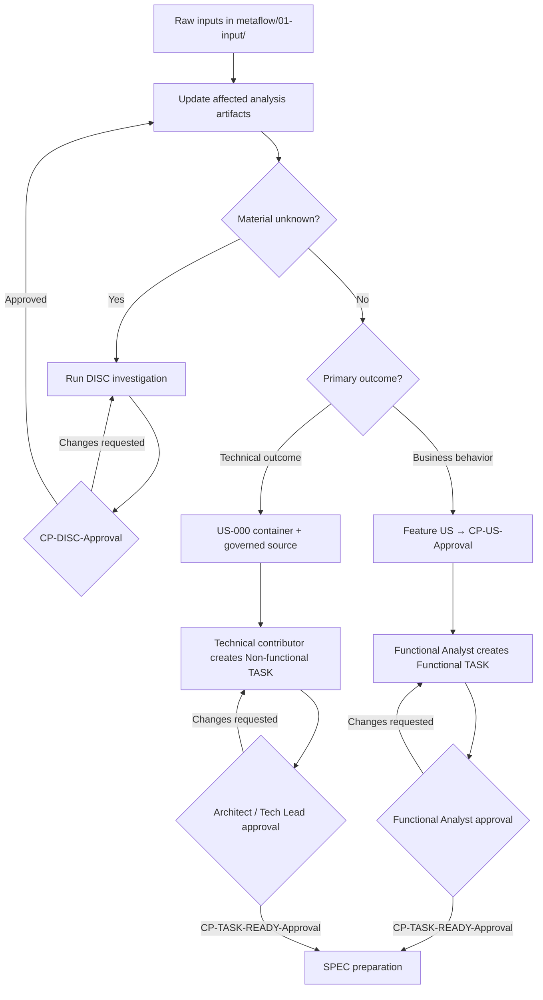

The loops shown above belong to functional analysis and backlog refinement.
They do not count as Delivery Loops. A Delivery Loop begins only after the approvals
applicable to the TASK's nature and the subsequent `CP-SPEC-Approval` have
been obtained.

**Output**

- **Approved feature User Stories** (US + AC + source traceability) and the
  permanent, non-approvable `US-000-non-functional.md` container. Architectural decisions and
  non-functional constraints are documented in ADRs approved through
  `CP-ADR-Approval`.
- **Approved Discovery conclusions when research was needed**, linked from the
  analysis and backlog artifacts they informed.
- **Individually approved product TASKs**, explicitly classified as functional
  under a feature US or non-functional under US-000. Test TASKs are created
  later from approved TCs through §4.1.1.
- **Initial Risk Register.**
- **Units → TASKs map** (first 1–2 weeks).
- **Demo criteria** per TASK.
- **Updated project report** (links to everything).

**Inception checklist**

- Applicable raw inputs preserved and processed.
- Affected analysis artifacts updated and traceable to their sources.
- Feature US+AC generated and approved at `CP-US-Approval` when functional
  work is in scope; US-000 available as the non-approvable container for
  technical work; architectural decisions and non-functional constraints
  captured in approved ADRs.
- Risks with owner / control.
- Suggested Units and TASKs.
- Every TASK selected for refinement approved at `CP-TASK-READY-Approval`.
- Demo criteria defined.

### 4.1.1 Test Case design, approval, and Test TASK creation

**Goal:** Define verification independently from the implementation so that QA
tests the approved intent rather than reproducing the assumptions or defects
of the current code.

**Steps**

1. **Select an approved source TASK.** A functional TC uses the approved
   feature US/ACs and the exact approved functional TASK. A non-functional TC
   uses the exact approved non-functional TASK plus approved ADRs or other
   governed technical expectations.
2. **Draft the TC without using code as the oracle.** Define preconditions,
   data, steps or stimulus, expected results, covered criteria, and pass/fail
   evidence from the approved test basis. Inspect existing code only for
   interface, setup, data, feasibility, and regression context.
3. **Stop at `CP-TC-Approval`.** QA and the applicable functional or
   technical domain owner approve the exact TC or request changes. A draft TC
   cannot govern verification or originate automation work.
4. **Feed the approved TC into the product TASK SPEC.** When QA verification
   applies, the approved TC is part of the SPEC's governed source inventory
   and test strategy before `CP-SPEC-Approval`.
5. **Optionally select the TC for QA Automation.** Create 1..n candidate Test
   TASKs as direct children of that TC, using
   `TC-NNN.TASK-NNN-<description>.md`. Each Test TASK covers exactly one TC and
   represents one independently deliverable automation outcome.
6. **Stop at `CP-TASK-READY-Approval` for each Test TASK.** A QA Lead, QA
   Automation Lead, Architect, or Tech Lead approves it. It then follows the
   same one-SPEC, Delivery Loop, MEM, acceptance, and manifest lifecycle as every
   other TASK.

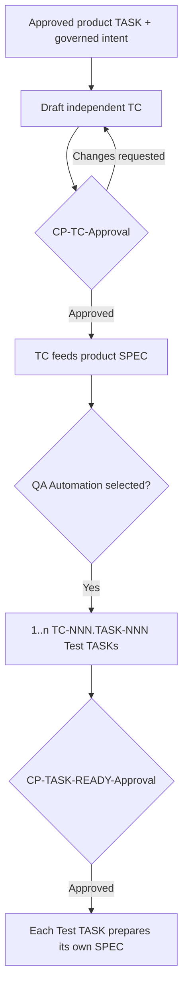

## 4.2 SPEC preparation and approval

**Goal:** Convert exactly one approved TASK into a complete, evidence-grounded
and human-approved implementation plan without allowing the agent to invent
missing behavior or architecture.

**Steps**

1. **Admit one approved TASK:** Its `CP-TASK-READY-Approval` includes the TASK DoR.
   There is no separate DoR sign-off. A functional TASK also links the current
   `CP-US-Approval`; a non-functional TASK links US-000 without parent
   approval; a Test TASK links its exact parent TC and
   `CP-TC-Approval`. If this is a BUG TASK, it also links the exact approved BUG and
   its `CP-BUG-Approval`; a draft, rejected, or stale BUG blocks admission.
2. **Run the pre-SPEC evidence gate:** Verify approval of every applicable TC,
   ADR, Discovery, Review and AREV output that will govern or inform the plan. If any required
   artifact is not approved, stop and report it; do not generate a SPEC.
3. **Analyze the complete relevant context:** Read the TASK, its parent artifact,
   applicable approved TCs, source US/ACs,
   approved BUG when applicable, applicable ADRs, relevant `01-input/` and `02-analysis/` documents, approved
   DISC/REV/AREV evidence, existing code and tests, configuration,
   infrastructure, schemas, migrations, dependencies, interfaces, risks, open
   questions, repository conventions and relevant previous execution evidence.
4. **Resolve gaps before drafting:** Conflicting evidence, unknown behavior or
   an unresolved architectural decision blocks SPEC generation. Route the gap
   through analysis, Discovery, Review or ADR as appropriate and complete its
   own approval lifecycle.
5. **Generate the one canonical SPEC:** Record its TASK, repository baseline,
   complete source inventory, approval references, implementation steps,
   impacted files and components, test strategy and evidence, gates, risks,
   migration/rollback needs and stop conditions.
   For a BUG TASK, also record the approved BUG and prescribe the strict
   single-Delivery Loop TDD order: create/run the reproduction test to red before
   any production-code change, then implement and run targeted plus applicable
   regression tests to green.
   For a Test TASK, define only the QA Automation code and supporting test
   assets needed to automate its one approved parent TC; production-code
   changes are outside scope.
6. **Stop at `CP-SPEC-Approval`:** Applicable human reviewers inspect the
   plan and its sources. Changes requested return to steps 3–5. Approval alone
   unlocks the code-run/Delivery Loop.

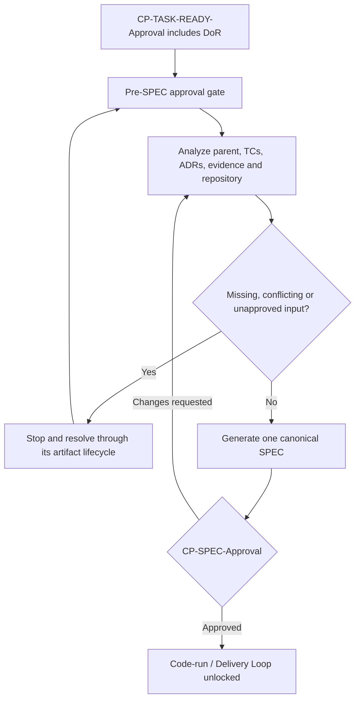

**Output**

- One approved, versioned SPEC for one TASK, with approval evidence and a
  repository baseline.
- A blocking report instead of a SPEC whenever required governed evidence is
  missing or unapproved.

## 4.3 Weekly planning (light cadence)

**Goal:** Set clear expectations without bureaucracy.

**Steps**

1. **Forecast with data:** historical throughput and task lead time
   (P50/P85).
2. **Commit + Stretch:** commit the **P85** and leave 1–3 **Stretch**
   (optional) items — the **P50** slice (§3.2).
3. **10–20% buffer:** reserve time for blockers, support, hardening.

**Output**

- **Weekly plan:** Commit and **Stretch** TASK list, owners and demo
  criteria.

## 4.4 Executing TASKs with Delivery Loop

**Goal:** Close each TASK with built-in quality.

**Delivery Loop anatomy (AI-agent cycle)**

1. **Approved SPEC** with `CP-SPEC-Approval`, referencing an individually approved TASK. For functional
   work, the feature parent US and its covered ACs are also approved. For
   non-functional work, the TASK references the non-approvable US-000 container
   and the originating governed technical evidence, together with relevant
   approved ADRs. A BUG TASK also references its exact approved BUG and
   `CP-BUG-Approval`. A Test TASK references exactly one approved parent TC,
   its `CP-TC-Approval`, and the TC's original US/AC and source-TASK
   traceability.
2. **AI agent generates the intended-final change by default** (design / code /
   tests) and **executes
   the tests as part of the same autonomous loop** until the suite is green or
   a mandatory stop condition is reached. Retries performed without human
   intervention are internal iterations, not additional Delivery Loops. If an unresolved
   architectural decision appears, the agent stops: an ADR must be approved
   and the canonical SPEC revised and re-approved before execution continues.
   For a BUG TASK, the agent first creates and runs the reproduction test
   against the pre-fix behavior and records the expected red result. Only then
   may it modify production code and run targeted plus applicable regression
   tests to green. Both phases belong to this same Delivery Loop.
   For a Test TASK, the agent changes only QA Automation code and supporting
   test assets required by its parent TC. A need to change production behavior
   stops the Delivery Loop and enters the BUG lifecycle.
3. **AI agent creates the mandatory MEM + updates manifest** — the agent
   writes exactly one MEM for this Delivery Loop, including the complete content
   required by §2.12 and any failure or blocker, and appends the matching
   `delivery_loops[]` entry to the TASK manifest in `metaflow/23-metrics/tasks/`. This happens
   **before** human review and is mandatory even when execution stopped without
   green tests.
4. **`CP-MEM-Approval`** (dev / QA / security / applicable domain) — the
   reviewer reads the **actual diff + test/gate evidence + MEM + manifest**,
   with findings pre-filtered if a stakeholder ran an AREV on this package,
   and records the approval decision.
5. If `CP-MEM-Approval` is **approved**, the Delivery Loop is approved and
   completes successfully; when it is the latest Delivery Loop, the TASK becomes
   `Development Completed`. If **changes are requested**, the MEM and Delivery Loop
   remain unapproved, the TASK remains `In Development`, and the next agent
   execution starts a new Delivery Loop with a new MEM and `delivery_loops[]` entry.

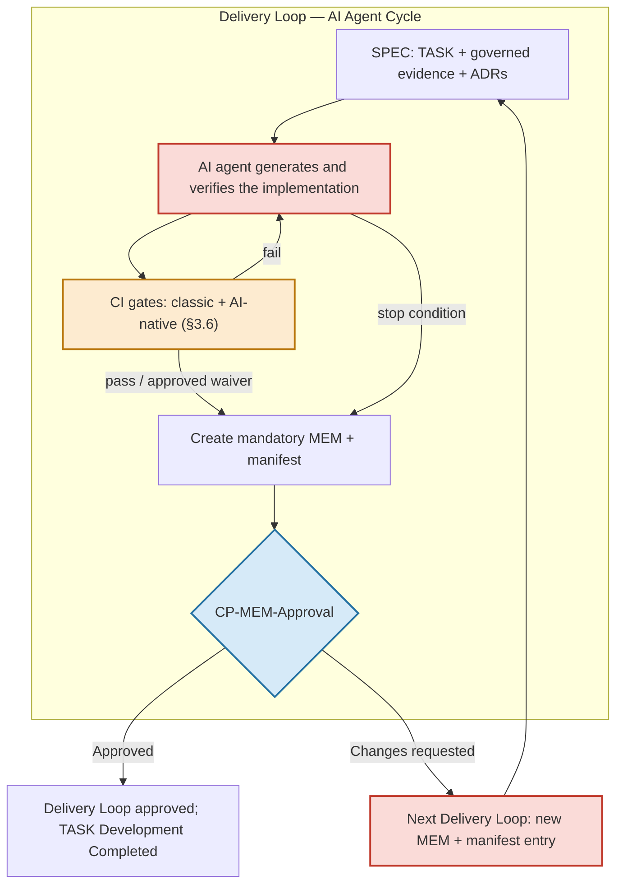

**Rules**

- **1..n Delivery Loops per TASK** (typically 1–3).
- One working day is the active-delivery target. More Delivery Loops or continuation
  on the next day keep the same TASK; no retroactive split is performed.
- **Tests from minute zero where meaningful**, derived from ACs and governed
  constraints and run by the agent itself; otherwise the approved SPEC records
  the appropriate verification and `n/a` reason.
- **BUG TASKs require strict red→green evidence in the same Delivery Loop**: the
  failing reproduction test precedes every production-code change and both
  results are captured in the MEM. The manifest keeps only the Delivery Loop
  execution outcome and MEM reference.

**TASK DoR (summary, validated within `CP-TASK-READY-Approval`)**

- Functional TASK: correct feature parent approved at
  `CP-US-Approval`. Non-functional TASK: correctly assigned to US-000; no
  parent approval applies. Test TASK: exactly one parent TC approved at
  `CP-TC-Approval`, with test-only scope and a clear automation outcome.
- This TASK approved at the role-appropriate `CP-TASK-READY-Approval`.
- Functional TASK: clear covered ACs and expected behavior.
- Non-functional TASK: clear technical outcome and governed source evidence.
- Test TASK: clear automation outcome, supported execution context and expected
  evidence for its one approved parent TC.
- Applicable ADRs approved through `CP-ADR-Approval`.
- Risks / controls identified.
- Context accessible for the AI agent.
- No `open` or `in-validation` `OQ-NNN` targets this TASK's parent or
  governing artifacts (§3.2, G35).
- Estimation (active delivery time) and demo criteria; approval wait and total
  elapsed cycle time are reported separately.

There is no independent DoR checkpoint. After TASK approval, the separate
`CP-SPEC-Approval` validates the implementation plan before this Delivery Loop.

**TASK DoD (summary)**

- Applicable implementation, tests and gates are **green** or explicitly
  `waived`; non-applicable gates are `n/a` with a reason.
- Every Delivery Loop has exactly one immutable MEM and one
  `CP-MEM-Approval` decision. Earlier `changes_requested` MEMs remain
  unapproved history; the latest MEM must be approved.
- The latest Delivery Loop has approved `CP-MEM-Approval`, so the TASK is
  `Development Completed` before acceptance.
- Every applicable ADR approved through `CP-ADR-Approval`.
- Evidence of gates (security / licenses / performance).
- **Complete traceability** and ready to demo.

**Output**

- TASK **Development Completed**, with evidence and traces to code / tests /
  ADRs, ready for `CP-TASK-DONE-Approval`.
- After that separate acceptance checkpoint, TASK **Done**.

## 4.5 Continuous integration and Quality Gates

**Goal:** Turn ACs and ADR-defined constraints into **automated
checks**.

**Minimum gates**

- Universal manifest, policy and secret-scanning gates.
- Unit/integration/contract/E2E verification when behavior changes.
- SAST/DAST, dependencies, licenses/SBOM when their risk surface applies.
- Perf-smoke with SPEC-defined p95 and/or p99 thresholds for performance-
  sensitive endpoints or workloads.
- Observability checks for backend/services.
- AI-native gates selected by the risks in §3.6.

**Rule:** Every applicable gate must be `pass` or `waived` through an approved
ADR. `fail` blocks merge, approval and promotion; `n/a` requires a reason in
the approved SPEC.

## 4.6 Packaging and deployment (Deployment Units)

**Goal:** Produce **deployable** artifacts.

**Steps**

1. Package (image / function / IaC) with traceable version (issue / commit /
   build).
2. Run **deployment gates** (smoke, security checks, policies).
3. Deploy per the **adopting team's own release/promotion process** — MetaFlow
   does not prescribe Unit/UAT approval checkpoints in this release. Grouping
   and promotion are still described by the Deployment-Unit concept (§2.11) and
   measured by Delivery Flow (§3.7.1).

**Output**

- **Deployment Unit** deployable, with evidence.

## 4.7 Release and customer acceptance (not prescribed in this release)

The Unit/UAT approval-and-release layer was removed in v4.2: the governed flow
ends at TASK acceptance (`CP-TASK-DONE-Approval`), and grouping into a
deployable unit, environment promotion and customer acceptance (UAT) follow the
**adopting team's own process**. A redesigned model — informed by real
environment/promotion complexity — is planned for a future version.

## 4.8 Production, observability and AI-assisted operations

**Goal:** Operate with **intelligent alerts** and **suggested actions**.

**Steps**

- Deploy the named Deployment Unit per the team's release process (plus change
  management when applicable).
- Real-time monitoring (metrics / logs / traces) with **anomaly detection**.
- AI suggests **actions** (scaling, tuning, rollback) → **human approval**.

**Output**

- Output mapped to TASKs / Units.
- **Runbooks** and **post-release checks** (errors / telemetry / UX).

## 4.9 Feedback loop and continuous improvement

**Goal:** Learn **throughout the week**.

**Rituals**

- **Weekly demo:** show **TASKs Done** (tangible value).
- **Short retro:** review metrics and anti-patterns; tune DoR/DoD, prompts
  and gates.
- **Memory update:** consolidate lessons, best prompts, frequent ADRs.

**Key metrics**

- Lead time per TASK (median, total cycle time)
- AI-time per TASK (agent generation time sub-metric)
- Weekly throughput (# TASKs)
- % Commitment delivered
- Average Delivery Loops per TASK
- SPEC first-review approval rate
- Delivery Loop first-review approval rate
- Defect escape (UAT / prod)
- (Optional) Tokens per TASK

## 4.10 Exception flows (Incidents and Hotfix)

**Goal:** Give urgent work immediate priority without creating a parallel or
weaker method.

**Service classes**

- **Incident / Hotfix:** **immediate priority**; target a small, bounded TASK of no
  more than 4 active delivery hours when the scope permits.
- **Regulatory:** high priority with dates; reserve fixed capacity.
- **Debt / Hardening:** reserve **10–20%** per week.

**Rules**

- Classify the outcome through the normal paths. A functional hotfix uses an
  approved feature US and its dedicated functional TASK. A non-functional
  hotfix uses a dedicated non-functional TASK under `US-000-non-functional.md`.
  When the hotfix corrects a defect, first create and approve its functional or
  non-functional BUG through `CP-BUG-Approval`, then create the dedicated
  TASK under the corresponding parent.
- The hotfix TASK follows the same `CP-TASK-READY-Approval → SPEC →
  CP-SPEC-Approval → Delivery Loop → MEM → CP-MEM-Approval →
  CP-TASK-DONE-Approval` lifecycle as any other TASK. Urgency changes
  priority, never traceability or approvals.
- MetaFlow defines no separate after-hours approver, on-call substitution,
  checkpoint expiry, or retroactive acceptance mechanism. Team availability
  and operational staffing remain outside the methodology.
- Keep **minimum gates** even on hotfix (at least tests + basic security).
- Light post-mortem → **hardening tasks** if applicable.

## 4.11 End-to-end traceability

**Goal:** Everything **linked** for people and AI.

**Link map**

1. Raw Input → Analysis (domain-model / BPMN / Glossary) → classify primary
   outcome → approved feature US for functional work **or** permanent US-000
   container plus governed source for non-functional work → Candidate TASK →
   `CP-TASK-READY-Approval` → independent TC design → `CP-TC-Approval` when QA
   verification applies → applicable ADRs approved through
   `CP-ADR-Approval` → canonical SPEC → `CP-SPEC-Approval` → Delivery Loop(s) →
   Code/PR → Tests/gates → MEM + manifest → `CP-MEM-Approval` →
   `Development Completed` → `CP-TASK-DONE-Approval` → `Done` →
   Build → Deployment Unit → Prod (team release process)

   BUG branch: `BUG draft` → `CP-BUG-Approval` → exactly one dedicated
   functional or non-functional TASK → canonical SPEC → same-Delivery Loop TDD
   red→green → MEM evidence plus the manifest's Delivery Loop/MEM traceability.

   QA Automation branch: approved `TC-NNN` → 1..n
   `TC-NNN.TASK-NNN` Test TASKs → individual `CP-TASK-READY-Approval` → one
   canonical SPEC per Test TASK → standard Delivery Loop/MEM lifecycle.

**Good practices**

- Use IDs / URLs of cards / issues / PRs.
- Capture **decisions** in every Delivery Loop (knowledge is product).

## 4.12 Sample agenda (first week)

**Monday**

- 30-minute planning: **Commit** 6 TASKs + **Stretch** (aspirational) 2
  (team of 4 dev-validators + AI agents).
- Approve the first 3 TASKs, including their DoR criteria, through the
  applicable `CP-TASK-READY-Approval`.

**Tuesday–Thursday**

- Execute TASKs with **Delivery Loop** (1–3 bounces each, run by AI agents).
- CI with gates (tests / security / performance).
- Promote to staging those meeting **DoD**.

**Friday**

- **Demo:** 5–7 TASKs Done (depending on throughput).
- **Metrics:** median lead time, % Commit, average bounces, gate failures.
- **Retro:** adjust TASK size / DoR / gates; record lessons learned.

## 4.13 Operational summary

1. **Everything starts from evidence** preserved in `01-input/` or already
   governed elsewhere in the project → AI-assisted functional analysis updates
   `02-analysis/` as applicable → a Functional Analyst defines functional TASKs
   from approved feature USs, while Developers, Architects, or Tech Leads
   define non-functional TASKs under US-000 → each TASK follows its own
   role-appropriate approval route.
2. **Test Cases are independent contracts:** QA derives them from approved
   US/ACs and TASKs, never from current code as the expected-behavior oracle;
   `CP-TC-Approval` governs their use.
3. **QA Automation uses Test TASKs:** every approved TC selected for automation
   originates 1..n `TC-NNN.TASK-NNN` work units with the full standard
   lifecycle.
4. **Light weekly plan** with **Commit + Stretch**.
5. **TASKs targeting 1 hour to 1 working day of active delivery** as the unit
   of promise and measurement; elapsed cycle time and approval waits are
   measured separately, and an additional Delivery Loop never forces a split.
6. **One canonical SPEC per TASK:** the agent analyzes every relevant governed
   artifact and the actual repository; `CP-SPEC-Approval` is mandatory before
   any code-run.
7. **Delivery Loop** as the standard execution form: the AI agent generates the
   intended-final change by default, runs
   tests, creates the mandatory MEM and manifest entry, and pauses at
   `CP-MEM-Approval`; only approval completes the Delivery Loop and marks the
   latest development attempt `Development Completed`. TASK `Done` remains a
   separate acceptance decision.
8. **BUGs are governed before work definition:** any Functional Analyst,
   Developer, or QA may draft one; `CP-BUG-Approval` is mandatory before its
   one dedicated TASK is created. Its approved SPEC enforces red-before-fix and
   green-after-fix inside the same Delivery Loop.
9. **Applicable gates** → `pass` or approved `waived`; `fail` blocks **Done**.
10. **Demo and metrics** every week → continuous improvement.
11. **Complete traceability** for people and AI.

---

# 5 — Repository structure and documentary implementation

Every methodology artifact is materialized as Documentation as Code. The
repository structure below is normative: teams may add project-specific files
inside the appropriate folders, but they must not rename, relocate, or change
the responsibility of the canonical folders without an approved methodology
change.

This section is normative only for artifact locations, filenames and folder
responsibilities. Lifecycle and governance descriptions in the folder tables
summarize §3 and do not create a second rule source.

**The tree below is a project's, not the methodology's.** A repository that
adopts MetaFlow receives exactly two things at its root — the `metaflow/`
documentary root and the cross-tool `AGENTS.md` — plus the agent definition
for the tool the team uses, installed wherever that tool expects it (§5.2).

- `metaflow/` is the single source of truth for project documentation,
  traceability, governance evidence, and implementation memory.
- `AGENTS.md` is the cross-tool entry point several agents auto-load from the
  repository root; it names the source of truth, the guardrails and the
  language policy.

## 5.1 Canonical folder tree

```text
<project-repo>/
├── AGENTS.md                  ← cross-tool agent entry point
├── CLAUDE.md                  ← the agent definition for the tool in use;
│                                other tools read it from .github/agents/,
│                                .opencode/agents/ or .agents/skills/
├── CHANGELOG.md               ← the project's own history, including its
│                                methodology upgrades (§5.16). MetaFlow does
│                                not ship one — this file belongs to the
│                                repository, not to the framework
│
└── metaflow/
    ├── README.md
    ├── VERSION
    ├── LANGUAGE
    ├── GUARDRAILS.md
    ├── ONBOARDING.md
    │
    ├── 01-input/
    │   ├── business/
    │   ├── databases/
    │   ├── documentation/
    │   ├── interviews/
    │   ├── source-code/
    │   └── ui-ux/
    │
    ├── 02-analysis/
    │   ├── introduction/
    │   ├── vision/
    │   ├── business-context/
    │   ├── business-risks/
    │   ├── scope/
    │   ├── personas/
    │   ├── user-journeys/
    │   ├── glossary/
    │   ├── domain-model/
    │   │   ├── entities/
    │   │   ├── enumerations/
    │   │   └── relationships/
    │   ├── ui/
    │   ├── process/
    │   └── open-questions/
    │
    ├── 03-discovery/
    ├── 12-functional/
    │   ├── user-stories/
    │   └── tasks/
    ├── 53-actors/                 ← who is in the team: the roster home (humans + MetaFlow Agents as actors; §3.0.1)
    ├── 11-adrs/
    ├── 21-spec/
    ├── 22-memory/
    ├── 23-metrics/
    │   ├── manifest-v1-task.schema.json
    │   ├── manifest-v1-us.schema.json
    │   ├── manifest-v1-tc.schema.json
    │   ├── tasks/
    │   ├── user-stories/
    │   └── test-cases/
    ├── 42-reports/
    ├── 31-reviews/
    ├── 32-adv-reviews/
    ├── 13-bugs/
    ├── 34-incidents/
    ├── 33-risks/
    ├── 35-retros/
    ├── 24-tests/
    │   ├── test-cases/
    │   └── uat/
    ├── bin/                    ← compiled tooling executables (optional by contract; replaced on upgrade, never copied forward, §5.16)
    ├── 52-agents-data/
    ├── 41-prompts/
    └── ai-sdlc/
        ├── MetaFlow.md
        ├── README.md
        └── INDEX.md
```

## 5.2 Agent definitions

**What a project installs.** Two files reach the project repository from the
methodology distribution, and they are separate concerns:

| Installed file | Where it goes | What it is |
|----------------|---------------|------------|
| `AGENTS.md` | the project's repository root, next to `metaflow/` | Cross-tool entry point, auto-loaded from the root by several agents regardless of platform. It points at the platform definition rather than replacing it. **Two owners, one file:** everything above its `METAFLOW:PROJECT-SECTION` marker is framework and is replaced on upgrade; everything from the marker onward is the project's own and is never touched (§5.16). |
| One platform definition | wherever that tool expects it — `CLAUDE.md` at the root, `.agents/skills/`, `.github/agents/`, `.opencode/agents/` | The compact orchestration of the methodology for that specific tool |

Both files are installed from the MetaFlow distribution, which ships one
definition per supported tool with the exact destination for each. They are
operational instructions consumed directly by development tools rather than
project documentation, which is why they live at the repository root and in
tool-specific locations instead of inside `metaflow/`.

The platform definitions share their methodology sections **verbatim** — they
differ only in the wrapper each tool requires (tool names, todo mechanism,
memory wording). A team installs the one for the tool it uses; the others are
not needed.

**Platform memory is out of scope — the methodology defines the *what*, not
the *where*.** An agent definition never names a platform's memory location
(file path, folder, or frontmatter convention): each agent uses its own
platform's native mechanism, which the platform may change without notice.
What the methodology does define is which *kind* of information goes where:
personal preferences and session memory → the platform's native mechanism;
durable, team-shared knowledge → the agent's own `52-agents-data/<agent-name>/`
area (§5.12); governed implementation memory → `22-memory/` MEMs (§2.12), which
nothing else replaces.

These folders provide the reusable agent definitions for each tool. During an
AREV, the human manually selects and changes the active agent/model at the
phase checkpoints described in §3.13. The selected agent/model is recorded in
the corresponding AREV phase artifact and does not update a TASK manifest.

## 5.3 `metaflow/` root files

The `metaflow/` directory is the documentary root and single source of truth for
the methodology as applied to a project.

| File | Purpose |
|------|---------|
| `metaflow/README.md` | Entry point and map of the framework: workflow, naming conventions, language policy, CITL checkpoints, golden rules, and project quick start. |
| `metaflow/VERSION` | Declares the MetaFlow version used by the project. |
| `metaflow/LANGUAGE` | Declares the project's `content_language` (ISO 639-1, e.g. `en`, `es`). Updated as soon as the language of the raw inputs is detected; the AI agent reads it and writes prose accordingly (§3.15). |
| `metaflow/GUARDRAILS.md` | Contains the non-negotiable agent rules for blocking conditions, warnings, naming, traceability, Delivery Loop execution, CITL coverage, and approval routing. |
| `metaflow/ONBOARDING.md` | Provides the recommended reading order, role-based guidance, glossary, FAQ, and developer skill-development guidance. |

## 5.4 Archiving — `_archive/` in each folder

Every `metaflow/` folder may contain an `_archive/` subfolder to keep the
active workspace manageable as documents accumulate. This is the standard
mechanism for governing document growth (e.g., `US-000` with dozens of
completed non-functional TASKs).

- **Criterion (G38):** only documents whose lifecycle is closed are
  archived — `Done` TASKs with their complete package (TASK, SPEC, MEMs),
  `superseded`/`deprecated` ADRs, closed DISC/REV/AREV records with every
  finding routed to the artifacts it affects, closed BUGs, retired RISKs,
  and completed UAT minutes. **Archiving never causes closure, it
  presupposes it:** the move is housekeeping, not a lifecycle step, and it
  grants no approval the document does not already hold. Never archive an
  active, draft, or in-review document — because `_archive/` is excluded
  from agent scans and its contents are treated as generally invisible
  (below), that move is the only one that removes open work from
  governance without ever closing it. When closure cannot be established
  from the document itself, the agent does not archive it and asks.
- **Mechanism (CITL, periodic):** archiving is a housekeeping activity
  (e.g., end of sprint or when a folder's INDEX becomes unwieldy). It may be
  performed manually or by the agent under the same CITL governance as
  everything else: the agent proposes the moves and executes them only with
  the human's decision, and every move is visible in the conversation and
  in the diff. Move the closed documents from the folder into its
  `_archive/` subfolder.
- **References are NOT rewritten:** archived documents keep their original
  content, IDs and internal links. Cross-references from other documents or
  manifests point to the archived location only when a human updates them;
  traceability remains guaranteed by the immutable IDs (`SPEC-YYMMDD-HHmm`,
  `MEM-YYMMDD-HHmm-<description>`, `ADR-NNN`, `US-NNN.TASK-NNN`), not by
  paths. A path that still points at the old location is acceptable for
  archived evidence.
- **INDEX discipline:** each folder's `INDEX.md` lists the active documents
  only; archived documents are excluded from it (optionally summarized in a
  dedicated `_archive/INDEX.md`). Naming and numbering rules still apply:
  archived IDs are never reused.
- **`_archive/` is excluded from agent scans** for token economy: agents do
  not search, list, or read `_archive/` proactively. They access it only
  when the user explicitly asks, or when an active document explicitly
  references an archived artifact (e.g., an incident linking to the
  deployment that caused it).
- **Transparency to the user:** whenever a task would require archived
  content, the agent states that `_archive/` files are excluded from its
  scan and asks the user whether to consult them. Users should treat
  archived files as generally invisible to agents.

## 5.5 Derivative narrative documents

Some folders hold **derivative documents**: plain-language narratives whose
entire content is derived from governed artifacts. They are marked with
`derivative: true` in their frontmatter and follow four rules:

- They are **never a source of truth**: where a narrative and an artifact
  disagree, the artifact wins.
- They are **outside the CITL chain**: they have no approval checkpoint of
  their own and are never governed input — they may not be cited as the
  basis of a SPEC, TASK, ADR, User Story, or Test Case.
- They introduce **no business rule, decision, or finding of their own**;
  a gap discovered while writing one is routed to the proper artifact
  (`OQ-NNN`, or a fix to the source artifact), never papered over.
- They may be written, corrected, or discarded **at any time without a
  checkpoint**, and are marked `deprecated` when they go stale rather than
  left circulating with false information.

The canonical example is `02-analysis/introduction/` (§5.7): the plain-language
entry point written at the end of the analysis phase, once the artifacts it
summarizes exist at least in draft.

**Generated artifacts that cannot carry frontmatter** belong to this class by
their location instead of by a marker: the sprint reports in `42-reports/`
(§5.12) are rendered HTML derived entirely from the manifest family, so they
are governed by the four rules above and are never citable as the basis of a
governed artifact (G28), even though no `derivative: true` field can be
written into them.

## 5.6 Raw inputs — `metaflow/01-input/`

`01-input/` contains source material exactly as received from stakeholders,
customers, vendors, or legacy systems. It is treated as read-only evidence:
derived or normalized information belongs in `02-analysis/`, `03-discovery/`, or
another downstream folder. Only humans deposit material here: agents may
read `01-input/` as evidence but must never create, modify, or move files into
it (G31). These raw inputs are the evidence base for the
entire methodology: adding or materially changing an input triggers an impact
assessment and updates every affected analysis artifact before downstream
functional artifacts are approved or re-approved.

| Folder | Purpose |
|--------|---------|
| `01-input/business/` | Contractual, business, and regulatory source material such as RFPs, BRDs, SOWs, compliance requirements, and regulations. |
| `01-input/databases/` | Legacy database evidence such as DDL, schemas, entity-relationship diagrams, and approved data extracts. |
| `01-input/documentation/` | Third-party documentation such as API manuals, vendor PDFs, datasheets, and product guides. |
| `01-input/interviews/` | Original stakeholder interview transcripts, normally named `INT-NNN-<description>.md` and preserved in their source language. |
| `01-input/source-code/` | Legacy source code and configuration used as contextual evidence during analysis and implementation. |
| `01-input/ui-ux/` | Visual inputs such as screenshots, mockups, brand guidelines, prototypes, and UX research. |

## 5.7 Domain understanding — `metaflow/02-analysis/`

`02-analysis/` turns raw evidence into a shared understanding of the product,
business, users, domain, scope, and unresolved questions. It describes the
problem space before implementation decisions are made. Processing may be
iterative and AI-assisted, but the Functional Analyst governs the result. The
analysis artifacts provide the immediate foundation for generating or updating
User Stories and their Acceptance Criteria.

| Folder | Purpose |
|--------|---------|
| `02-analysis/introduction/` | Plain-language, jargon-free narrative explanations of each feature — the entry point for someone joining the project. Derivative documents (`derivative: true`, §5.5): written at the end of the analysis phase from the existing artifacts, never a source of truth, never governed input, outside the CITL chain. One descriptively named file per feature. |
| `02-analysis/vision/` | Product vision, intended outcomes, strategic direction, and high-level Intents. |
| `02-analysis/business-context/` | Business goals, constraints, stakeholders, market context, compliance concerns, and success measures. |
| `02-analysis/business-risks/` | Pre-execution business risks (`BR-NNN`) involving regulation, market, adoption, or business-model viability. These are distinct from project and technical risks in `33-risks/`. |
| `02-analysis/scope/` | Scope decisions and milestone phases such as MVP, v1, and v2, including deferred items and dependencies between phases. |
| `02-analysis/personas/` | User personas and archetypes, preferably three to five. A persona may be `real`, when grounded in interviews, or an `archetype`, when it is a role-based composite. |
| `02-analysis/user-journeys/` | End-to-end user experiences, one goal or journey per file, including stages, touchpoints, pain points, moments of truth, and relevant measures. |
| `02-analysis/glossary/` | The agreed ubiquitous language of the domain, including definitions and usage notes. |
| `02-analysis/domain-model/` | The domain model as Markdown and Mermaid: entities, properties, relationships, states, codes, and reusable enumerations. |
| `02-analysis/domain-model/entities/` | One domain entity per file, normally using PascalCase filenames. |
| `02-analysis/domain-model/enumerations/` | Reusable domain enumerations, statuses, and code catalogs. |
| `02-analysis/domain-model/relationships/` | Centralized relationship views and entity-relationship diagrams. |
| `02-analysis/ui/` | The visual and interaction half of the conceptual model: surface inventories, canonical pattern galleries, the states each surface must present, visual contracts between a surface and its successor, and parity plans. Derived from `01-input/ui-ux/` and finished before the first User Story; `domain-model/` answers what things exist, `ui/` what the user sees and how it behaves. Living documents, no IDs, no CITL checkpoint. |
| `02-analysis/process/` | Business processes represented in BPMN or Mermaid and identified as `PROC-NNN`. |
| `02-analysis/open-questions/` | The centralized backlog of analysis questions (`OQ-NNN`), with lifecycle `open → in-validation → answered / deferred / dropped`. Unresolved questions must be handled by the applicable readiness checkpoint. |

## 5.8 Discovery — `metaflow/03-discovery/`

| Folder | Purpose |
|--------|---------|
| `03-discovery/` | Need-driven investigations (`DISC-NNN`) that reduce a material unknown before a User Story or TASK is created or materially refined. Examples include external API analysis, learning an unfamiliar library or framework, legacy-system behavior, gap analysis, technology options, data availability, and integration constraints. Each Discovery records its question, scope, evidence, experiments, assumptions, limits, conclusions, affected analysis artifacts, and approval evidence. It remains draft until `CP-DISC-Approval`; only then may its conclusions feed analysis, User Stories, TASKs, ADRs, risks, or other governed artifacts. A Discovery is not a Review and does not authorize code. |

## 5.9 Functional definition — `metaflow/12-functional/`

`12-functional/` defines what must be delivered and contains the work units used
for assignment, execution, and measurement. The folder name reflects the
location of User Stories and TASK work definitions; it does not imply that
every TASK has a functional outcome or Functional Analyst ownership.

| Folder | Purpose |
|--------|---------|
| `12-functional/user-stories/` | User Stories (`US-NNN-<description>.md`) and their Acceptance Criteria, preferably expressed in Given/When/Then form. Each feature US remains a draft until a Functional Analyst records `CP-US-Approval`; only then may it be decomposed into functional TASKs. `US-000-non-functional.md` is the permanent traceability parent for **every non-functional TASK**. It is a container rather than a feature User Story, is never submitted for approval, and does not define architecture or non-functional constraints; approved ADRs do that. |
| `12-functional/tasks/` | TASKs are the atomic units of assignment, planning, tracking, and measurement. The three canonical types are functional (`US-NNN.TASK-NNN-<description>.md` under an approved feature US), non-functional (`US-000.TASK-NNN-<description>.md` under US-000), and Test (`TC-NNN.TASK-NNN-<description>.md` under one approved TC). Functional Analysts govern functional TASKs; Architects or Tech Leads govern non-functional TASKs; QA or QA Automation Engineers create Test TASKs and QA Leads, QA Automation Leads, Architects, or Tech Leads approve them. A BUG TASK may be created only after its exact `BUG-NNN` has `CP-BUG-Approval`. Every type states what must be delivered and expected evidence, never how; every TASK independently requires `CP-TASK-READY-Approval`. |

## 5.10 Architecture decisions — `metaflow/11-adrs/`

| Folder | Purpose |
|--------|---------|
| `11-adrs/` | Architecture Decision Records (`ADR-NNN`) that capture technical decisions, alternatives, consequences, and all applicable non-functional constraints. Every ADR remains a draft until an Architect or Tech Lead records `CP-ADR-Approval`. Once approved, it is governing and immutable; a changed decision is recorded in a new ADR that supersedes the previous one. |

## 5.11 Delivery Loop execution evidence

The following three directories form the core documentary trail of each
Delivery Loop: approved implementation instructions, narrative execution memory,
and mechanically measurable evidence.

| Folder | Purpose |
|--------|---------|
| `21-spec/` | One canonical implementation specification (`SPEC-YYMMDD-HHmm-<description>.md`) per TASK. Before generating it, the agent verifies the required CITL approvals and inventories the approved BUG when applicable, approved TCs, relevant US/ACs, ADRs, DISC/REV/AREV evidence, `01-input/`, `02-analysis/`, repository code, tests, configuration, schemas and interfaces. A Test TASK SPEC references exactly one approved parent TC and limits changes to QA Automation code and supporting test assets. The SPEC records its exact TASK, source paths, approval references and repository baseline, then defines implementation phases, impacted components, test strategy, observability, gates, migration/rollback needs, risks and stop conditions. A BUG SPEC must explicitly enforce reproduction-test red before production changes and targeted/regression green afterward in the same Delivery Loop. It remains draft until `CP-SPEC-Approval`; no code-run or Delivery Loop may begin before that checkpoint. Material revisions update the same canonical SPEC and require re-approval. |
| `22-memory/` | Mandatory narrative implementation records (`MEM-YYMMDD-HHmm-<description>.md`), exactly one per Delivery Loop. All MEMs for the same TASK and canonical SPEC reuse the identical `<description>` slug; only their creation timestamp changes. The Delivery Loop number is stored inside the MEM and manifest, never appended to the filename. Each MEM identifies the TASK, SPEC version, Delivery Loop iteration, repository baseline and ADRs; summarizes the implementation; enumerates every added, modified, renamed or deleted file with its reason; records tests, gates, decisions, deviations, risks, manual interventions and evidence links; and links to the final `CP-MEM-Approval`. The MEM has no mutable approval status: its state is derived from the associated CITL decision. Approval of this checkpoint approves the Delivery Loop; changes requested preserves the MEM as immutable evidence and requires a new Delivery Loop with a new timestamped MEM. |
| `23-metrics/` | The manifest family v1: three normative schemas (`manifest-v1-task.schema.json`, `manifest-v1-us.schema.json`, `manifest-v1-tc.schema.json`) plus one validating manifest JSON per User Story (`user-stories/US-NNN-<description>.json`), per TASK (`tasks/US-NNN.TASK-NNN-<description>.json` or `tasks/TC-NNN.TASK-NNN-<description>.json`) and per Test Case (`test-cases/TC-NNN-<description>.json`). Each manifest records sources, provider/tool/model runs and token/time usage for generation, material SPEC revisions, `delivery_loops[]`, lifecycle CITL decisions, and the timing of every step (`created_at`, `review_ready_at`, `review_started_at`, `decided_at`). Gates, Delivery Flow, deployment and pre-calculated cost remain outside it. |

Internal autonomous agent retries remain inside a single Delivery Loop and are not
added as separate `delivery_loops[]` entries. If `CP-MEM-Approval` records changes
requested, the subsequent agent execution is a new Delivery Loop with a new MEM and
therefore a new `delivery_loops[]` entry.

## 5.12 Governance and learning

The `metaflow/` folder structure is **canonical** (§5.1–§5.14 and the folder
map in `metaflow/README.md`): no new folder may be created inside `metaflow/`
outside this structure (G30). The only sanctioned agent-created areas are the
per-agent folders under `52-agents-data/` — each agent creates its own on first
use, is responsible for it, and is free to organize files and subfolders
**within** it — the per-AREV folders
`32-adv-reviews/AREV-NNN-<description>/` (§2.15), and the `_archive/`
subfolders the agent creates when archiving closed documents (§5.4).

| Folder | Purpose |
|--------|---------|
| `52-agents-data/` | Per-agent shared knowledge area, versioned with the repository and shared with the whole team. There are no pre-created subfolders: each agent creates its own `52-agents-data/<agent-name>/` folder on first use and is **responsible for everything inside it** — free to create files and subfolders there. It holds durable, useful knowledge (patterns, decisions, reusable information), never temporary data (W21). It is not governed input: it may not be cited as the source or justification of any governed artifact or checkpoint (G32), carries no CITL checkpoint, agents do not scan other agents' folders by default (token economy), and it is not a substitute for `22-memory/` MEMs (§2.12). |
| `41-prompts/` | Project prompts (`PROMPT-NNN-<description>.md`) — versioned, team-shared, copy-paste ready. Prompts are living data: created, modified and improved in this folder, with no approval and no manifest; they are never scattered into `52-agents-data/` (§5.12). |
| `42-reports/` | Sprint progress reports for project management, generated from the manifest family in `23-metrics/`. Self-contained HTML (one per sprint). **Report generation is planned**: a report template design reference ships with the tooling track, and no generator — nothing in `metaflow/` reads the manifests to emit a report yet; the generator arrives with the tooling track (`tools/`), not with the methodology. Reports are not governed evidence — never citable as the source of a SPEC, TASK, ADR, US, TC or BUG (same class as derivative documents, §5.5). Reports follow the naming `REPORT-YYYY-Www.html` and may be archived under `_archive/` (§5.4). |
| `31-reviews/` | Optional, stakeholder-triggered Reviews (`REV-NNN`) of any functional or non-functional characteristic or artifact. Any team member or stakeholder may initiate one. Findings remain draft until `CP-REV-Approval`, after which they may feed any MetaFlow artifact; each affected artifact still follows its own lifecycle and approval. |
| `32-adv-reviews/` | Optional, stakeholder-triggered Adversarial Reviews (`AREV-NNN-<description>/`) composed of `01-CRITIQUE.md`, `02-DEFENSE.md`, and `03-VERDICT.md`. Each phase requires its corresponding CITL approval before the next begins. At each approved checkpoint, the human manually selects the agent/model for the next phase in the development tool. Each phase records its own agent/model; only an approved Verdict exposes actionable findings, and no AREV state or approval is written to a TASK manifest. |
| `13-bugs/` | Defect records (`BUG-NNN`) that may be drafted by Functional Analysts, Developers, or QA. A functional BUG requires Functional Analyst `CP-BUG-Approval`; a non-functional BUG requires `CP-BUG-Approval` from an Architect or Tech Lead when `severity: critical`, otherwise from any team member, the BUG's own author included. Only then may its exactly one dedicated TASK be created under the affected approved feature US or US-000 respectively. The BUG, TASK, canonical SPEC, red→green Delivery Loop evidence, MEMs, and manifest remain bidirectionally traceable. |
| `34-incidents/` | Production incidents and blameless post-mortems (`INC-NNN`, severity `sev1`–`sev4`). Deployment-caused incident data feeds Change Fail Rate and Failed Deployment Recovery Time; production-fix deployments also support Deployment Rework Rate. Incidents link to the affected deployment and originating TASKs without forcing single-model attribution. |
| `33-risks/` | Project, technical, team, and dependency risks (`RISK-NNN`). Business risks originate in `02-analysis/business-risks/` and may feed this register when they affect delivery. |
| `35-retros/` | Weekly retrospectives (`RETRO-NNN-YYYY-Www`) driven by Delivery Flow, Delivery Loop, and CITL evidence. Actions may adjust DoR, DoD, prompts, agent instructions, or quality gates through the applicable governance process. |

## 5.13 Human verification — `metaflow/24-tests/`

Automated tests live with the source code and, when applicable, are generated
and executed by the agent during the Delivery Loop. `metaflow/24-tests/` contains
human-facing verification evidence only.

| Folder | Purpose |
|--------|---------|
| `24-tests/test-cases/` | Implementation-independent Test Cases (`TC-NNN-<description>.md`) derived from approved US/ACs and approved source TASKs, or from approved non-functional TASKs plus governed technical sources. Existing code may inform setup but never defines expected results. Each TC remains draft until `CP-TC-Approval`; an approved TC may originate 1..n Test TASKs named `TC-NNN.TASK-NNN-<description>.md`. |
| `24-tests/uat/` | User Acceptance Testing minutes and stakeholder evidence (`UAT-NNN`) for a Unit or Milestone. |

## 5.14 Methodology reference — `metaflow/ai-sdlc/`

| File | Purpose |
|------|---------|
| `ai-sdlc/MetaFlow.md` | The complete methodology: foundations, glossary, principles, Delivery Loop and TASK rules, CITL governance, gates, metrics, manifest schema, language policy, end-to-end process, and repository structure. |
| `ai-sdlc/README.md` | A concise introduction and usage guide for the methodology documentation. |
| `ai-sdlc/INDEX.md` | The navigable index of the methodology content. |

## 5.15 Artifact routing summary

| Artifact | Canonical folder | Naming pattern |
|----------|------------------|----------------|
| Interview transcript | `01-input/interviews/` | `INT-NNN-<description>.md` |
| Introduction narrative (derivative, §5.5) | `02-analysis/introduction/` | `<feature-description>.md` (descriptive, no ID) |
| Business risk | `02-analysis/business-risks/` | `BR-NNN-<description>.md` |
| Open question | `02-analysis/open-questions/` | `OQ-NNN-<description>.md` |
| Business process | `02-analysis/process/` | `PROC-NNN-<description>.md` |
| Discovery investigation | `03-discovery/` | `DISC-NNN-<description>.md` |
| User Story | `12-functional/user-stories/` | `US-NNN-<description>.md` |
| Product TASK | `12-functional/tasks/` | `US-NNN.TASK-NNN-<description>.md` |
| Test TASK | `12-functional/tasks/` | `TC-NNN.TASK-NNN-<description>.md` |
| Architecture decision | `11-adrs/` | `ADR-NNN-<description>.md` |
| Implementation specification | `21-spec/` | `SPEC-YYMMDD-HHmm-<description>.md` |
| Implementation memory | `22-memory/` | `MEM-YYMMDD-HHmm-<description>.md` |
| US manifest | `23-metrics/user-stories/` | `US-NNN-<description>.json` |
| TASK manifest | `23-metrics/tasks/` | `US-NNN.TASK-NNN-<description>.json` or `TC-NNN.TASK-NNN-<description>.json` |
| TC manifest | `23-metrics/test-cases/` | `TC-NNN-<description>.json` |
| Manifest JSON Schema | `23-metrics/` | `manifest-v1*.schema.json` |
| Sprint report | `42-reports/` | `REPORT-YYYY-Www.html` |
| Project prompt | `41-prompts/` | `PROMPT-NNN-<description>.md` |
| Formal review | `31-reviews/` | `REV-NNN-<description>.md` |
| Adversarial review | `32-adv-reviews/` | `AREV-NNN-<description>/` |
| Confirmed defect | `13-bugs/` | `BUG-NNN-<description>.md` |
| Production incident | `34-incidents/` | `INC-NNN-<description>.md` |
| Project risk | `33-risks/` | `RISK-NNN-<description>.md` |
| Retrospective | `35-retros/` | `RETRO-NNN-YYYY-Www.md` |
| Test Case | `24-tests/test-cases/` | `TC-NNN-<description>.md` |
| UAT evidence | `24-tests/uat/` | `UAT-NNN-<description>.md` |

`<description>` slugs in every filename follow the project's
`content_language` (kebab-case ASCII, no accents — §3.15); the IDs and
prefixes listed above are never translated or renamed.

Each documentary folder should include its own `README.md`, explaining local
purpose and conventions. Where a folder has none, **the parent folder's
README governs it** — as `12-functional/README.md` does for `user-stories/` and
`tasks/`.

**Whether a folder has an `INDEX.md` follows one rule:** an INDEX exists where
the ID is **sequential and needs a central allocator**, does not exist where
the **timestamp already assigns and orders it** or the contents are
machine-generated, and exists as a **curated inventory** where the folder
holds a small manually maintained set of documents without IDs.

- **With INDEX — sequential `NNN` (allocator):** US, TASK, TC, ADR, BUG, DISC,
  REV, RISK, INC, RETRO, UAT, OQ, INT, BR, PROC, AREV. The INDEX is where the
  next free number is claimed, which makes it also the place a duplicate claim
  surfaces: two branches taking the same `NNN` collide there as a merge
  conflict. That is the intended behaviour — an ID collision must be visible,
  never silent.
- **Without INDEX — timestamp IDs:** `21-spec/` (`SPEC-YYMMDD-HHmm`) and
  `22-memory/` (`MEM-YYMMDD-HHmm`). The timestamp assigns and orders every SPEC
  and MEM on its own, so no allocator is needed and **no shared file is edited
  on every Delivery Loop** — an INDEX here would conflict on every concurrent
  branch while detecting nothing, because timestamps do not collide. The
  same-minute edge case is handled by the naming rules themselves (§2.4.1,
  §2.12). The file listing is the inventory.
- **Without INDEX — unstructured or machine-readable:** `01-input/` (except
  `interviews/`, which allocates sequential `INT-NNN` and therefore has one,
  and `documentation/`, which keeps a curated inventory — see below),
  `23-metrics/` (inventory = file system) and `42-reports/` (generated HTML).
- **With INDEX — curated inventory (no IDs):** the `02-analysis/` families
  without sequential IDs — business-context, domain-model, glossary,
  introduction, personas, scope, ui, user-journeys, vision —,
  `01-input/documentation/`, and `ai-sdlc/` (the methodology itself:
  a curated inventory of the current version). Their INDEX is a
  **manually maintained inventory**:
  it lists each document with its `status`, never allocates IDs and never
  acts as an allocator (there is no `NNN` to claim). It is rebuilt by listing
  the folder, never from memory.
- Subfolders covered by their parent's INDEX (`12-functional/user-stories/` and
  `12-functional/tasks/` → `12-functional/INDEX.md`) do not repeat it.

Before creating or routing an artifact, both humans and agents must read the
target folder's `README.md`, or the parent's where the folder has none.

## 5.16 Methodology version upgrade (migrating an existing project)

`metaflow/VERSION` declares the **single** methodology version the whole
project runs under. Governed artifacts carry no per-artifact version field:
there is one version, and it is the current one. When a project adopts a newer
methodology version, its existing documentation is therefore **migrated
forward** so the repository stays coherent under that single version. The
upgrade is an explicit activity — normally AI-assisted — not something that
happens by editing `VERSION`.

**What the migration updates:** the framework documentation as instantiated in
the project — every folder `README.md` and `INDEX.md`, including its
`**Methodology version:**` header (§5.15); the `TEMPLATE-*` files; and the
structure of governed documents wherever the new version changed a required
section, a frontmatter key or a `status` value (§3.15).

**What a migration never touches — history is not documentation** (G36):

| Never rewritten | Why |
|-----------------|-----|
| Approved MEMs | Immutable after the `CP-MEM-Approval` decision (§2.12). |
| Approved ADRs | Read-only once accepted; a changed decision is a new superseding ADR (§3.5). |
| Recorded CITL decisions and `review:` contracts | Approval evidence describes what happened, not what the current version prescribes (§3.0). |
| `CHANGELOG.md` history | A changelog is a record; correcting past entries would falsify it. |
| `01-input/` | Human-deposited raw evidence, read-only for agents (§5.6, G31). |

`23-metrics/**/*.json` is **not** on that list: manifests move forward with the
repository, and the values they already carry are what the guardrail protects.
See *"Manifests are migrated, never frozen"* below.

**Rules:**

- `metaflow/VERSION` is updated **last**, once every other change is applied. A
  repository whose `VERSION` already claims the new version while its
  documents still describe the old one is worse off than one that has not
  started.
- A migration **never changes an approval outcome**. An artifact approved
  under an earlier version stays approved. If the new version adds a required
  checkpoint, it applies to work started after the upgrade — never
  retroactively to closed history.
- The migration is a change to governed documentation and is reviewed by a
  human before it is committed, like any other change.
- The upgrade is recorded in the project's own `CHANGELOG.md` **at the
  repository root**, naming the source and target versions. MetaFlow ships no
  `CHANGELOG.md` of its own: the framework's history lives in the methodology's
  repository, and a project that has no changelog yet creates one.

**The migration procedure.** The upgrade runs inside the project repository,
with the two folders side by side: the existing `metaflow/` renamed to
`metaflowOLD/`, and the new version installed as `metaflow/`. Install the new
agent definitions first — the migration is executed by the **new** agent,
because it is the one that knows the new structure.

What moves is defined by an **allowlist of origin**, never by comparing the
two folders file by file:

1. **`01-input/` in full — 100%, exactly as it stands, byte for byte — with one
   carve-out: the scaffolding the kit itself installs inside `01-input/`** (its
   `README.md` and `INDEX.md` files — the same framework files every other
   folder carries) **comes from the new version**, exactly like the
   README/INDEX of any other folder (below). If the project modified one of
   those scaffolding files, the modification is project content and the whole
   file is treated as evidence, preserved byte for byte like any other file
   in `01-input/`. Every other file in `01-input/` is raw evidence: never
   normalized, reorganized, filtered, renamed or partially copied (§5.6,
   G31). Afterwards, verify that `metaflow/01-input/` and `metaflowOLD/01-input/`
   have the identical tree and the identical file count, and that every
   non-scaffolding file is byte-identical — a byte-level diff of the
   evidence (e.g. `git diff --no-index metaflowOLD/input metaflow/input`) must
   show differences only in the scaffolding files. Any difference in an
   evidence file means the copy lost data and the migration stops.
2. **Every file the project created.** Two signals identify one: it carries an
   **artifact ID** from the naming table (§5.15, N01–N23) — `US-NNN`,
   `US-NNN.TASK-NNN`, `TC-NNN.TASK-NNN`, `SPEC-YYMMDD-HHmm`, `MEM-YYMMDD-HHmm`,
   `ADR-NNN`, `BUG-NNN`, `TC-NNN`, `DISC-NNN`, `REV-NNN`, `INC-NNN`,
   `RISK-NNN`, `RETRO-NNN`, `UAT-NNN`, `OQ-NNN`, `BR-NNN`, `PROC-NNN`,
   `INT-NNN`, the manifest `.json` files, `REPORT-YYYY-Www.html` — **or** it
   lives in an area the project created: `52-agents-data/<agent-name>/`,
   `32-adv-reviews/AREV-NNN-<description>/`, and any `_archive/` — **or**
   it is an ID-less document of an `02-analysis/` family (business-context,
   domain-model, glossary, introduction, personas, scope, ui, user-journeys,
   vision, §5.15). ID-less documents move with their folder and are placed at
   the destination **by family**, never by the folder they sat in (below).

**Everything else comes from the new version.** Folder `README.md` and
`INDEX.md` files, every `TEMPLATE-*`, the manifest schemas, `GUARDRAILS.md`,
`ONBOARDING.md`, `ai-sdlc/`, `US-000-non-functional.md` and **`bin/`**
(compiled tooling executables, the one non-Markdown content of the
distributable) are never copied forward. The `01-input/` scaffolding
README/INDEX files are covered by this rule with the carve-out stated in
rule 1: they are replaced by the new version unless the project modified
them — in which case they are evidence and are preserved byte for byte.
This is
what lets the procedure survive future versions without being rewritten, and
what makes it impossible to resurrect a file a new version deliberately
removed.

**`LANGUAGE` is the single exception:** it ships with the framework but is
configured by the project, so it keeps its **old** value. Overwriting it
silently reverts the project's `content_language` and the agent starts writing
prose in the wrong language. `VERSION` is its mirror — it takes the **new**
value, and it is written last.

**`metaflow/CHANGELOG.md` no longer exists.** Versions up to 4.1 installed one
inside `metaflow/`, which meant every project carried the framework's own
development history and agents wrote project entries into it. This version
ships none: a changelog belongs to the repository, not to the framework. In an
upgrade from a version that still had one, the old file is **superseded** —
with one step before it is discarded: if the project wrote its own entries
there (upgrade records, local notes), those entries move to the
repository-root `CHANGELOG.md`. Moving them preserves the record; dropping
them would be the G36 violation.

**The root `AGENTS.md` is merged, never replaced.** It is the one installed
file with two owners: the framework writes everything above its
`METAFLOW:PROJECT-SECTION` marker, and the project writes everything from
the marker onward — which is exactly what §5.2 invites it to do. An upgrade
that copies the new version over it destroys that section silently, so the
migration **merges** instead: take the new version's text up to its marker,
keep the existing file's text from its own marker onward, byte for byte.

**The install step excludes `AGENTS.md` from the copy.** The safest merge is the
one that never has to recover anything: when the new version is installed over
the project root, this one file is left out of the copy and the new framework
block is merged into it **in place**. Nothing the project authored is destroyed
at any point, so the guarantee stops depending on anyone having taken a
precaution first.

**Recovering from the last commit is the fallback, not the mechanism.** A
project that installs by copying everything — the natural thing to do — will
find the file already overwritten. In that case the previous content is read
from the **last commit** rather than from the working tree, and the merge is
still correct. This path exists because that copy will happen; it is the
second-best outcome, not the prescribed one.

**Precondition: the working tree is committed before a migration runs.** The
fallback reads from the last commit, so a project whose section was never
committed has nothing there to recover: the migration finds no marker, stops,
and the content is unrecoverable from the repository. Committing first is part
of the procedure, not a good habit around it.

The result is checkable, and the check is part of the migration rather than an
afterthought: after the merge, the text above the marker is byte-identical to
the new version's, and a diff of the file shows **no change from the marker
onward**. A difference below it means the merge failed and the migration stops.

Two boundary cases are resolved rather than guessed. If the **existing** file
carries no marker — it predates this rule, or someone removed it — the
migration **stops and reports it**: the boundary between framework and project
text is not inferable, and a human places it (§5.16, *stop and ask, never
guess*). If the file carries the marker **more than once**, the same applies.
The marker is matched as a **prefix** of the comment, so a version that
rewords the human-facing explanation beside it does not break the merge for
projects already carrying it.

The platform agent definitions have no such split: `CLAUDE.md`,
`.agents/skills/`, `.github/agents/` and `.opencode/agents/` are pure framework,
carry nothing the project authored, and are **overwritten** from the new
version like any other framework file.

**An artifact's destination is derived, never inherited.** Place each copied
file by its ID against the routing table (§5.15), not by where it sat in
`metaflowOLD/`. A version that relocated a family therefore lands correctly
without any special-casing. **A document with no ID is placed by its family,
not by its old folder** — the ID-less `02-analysis/` families (§5.15) are routed
by what the document *is*, so a version that splits one family out of another
lands those documents in the new folder rather than carrying them along in the
old one.

**Manifests are migrated, never frozen.** `23-metrics/**/*.json` moves forward
like every other project file. Within the same major, they advance
**intact**: `schema_version` is the `<major>.0` of the family (§3.12), so a
4.x bump changes no manifest value at all and no conversion runs. Across a
major, the migration is what makes them valid again: each manifest is
**re-routed** to the folder its family now uses (§5.15) and **converted** to
the new family's `schema_version`, so that the repository ends the upgrade
holding exactly one manifest family (§3.12). A repository whose documents
describe the new version while its manifests declare a `schema_version`
from another family has an unfinished migration, not preserved history.

Conversion follows the lossless rule of §3.12: add the fields the new schema
introduces — `null` wherever the value was never captured — apply its renames,
and carry every recorded value across untouched. **History of the previous family (not applicable to MetaFlow v1.1):** the earlier lineage migrated manifests `3.0` → `4.0` → `5.0` (timing fields arriving as `null`, the approval array gaining a richer approver shape, the actor grammar). Under MetaFlow v1.1 the family is v1: a conversion adds the new schema's fields as `null`, applies its renames, and keeps `schema_version` at `"1.0"` with checkpoints `CP-*`. G36 still forbids altering the recorded actor, timestamp, outcome or evidence, or rewriting an approved MEM/ADR body. Every other value crosses unchanged.

**A manifest level the old version lacked is reconstructed from the
repository's own evidence.** A new version may introduce a level that did not
exist before — `4.0` added the US and TC manifests to a family that had only
TASKs — and G33 makes an artifact without its manifest nonexistent. Leaving
those gaps would render every migrated US and TC formally nonexistent the
moment `VERSION` is written, so the migration creates them, deriving every
field from something already in the repository:

| Field | Read from |
|-------|-----------|
| `id`, `ref` | the artifact's own ID and its path under the new routing table |
| `sources` | the document's frontmatter `sources:` (for a non-functional TC, `governing_sources:`) |
| `generation.created_at` | the commit that added the document; the frontmatter `date:` when the file was never committed |
| `generation.created_by` | the document's frontmatter `author:`, as `human:<author>` (actor grammar, §3.0) |
| `generation.runs` | `[]` — no generation telemetry was recorded, which is what an empty `runs[]` already means (§3.12) |
| `generation.duration_seconds` | `null` |
| `review_ready_at`, `review_started_at` | the frontmatter `review_ready_at:` and `review.started_at` |
| `checkpoint_approvals[]` | the document's `review:` contract, through the standard manifest projection (§3.0) — reviewers as `human:<user>` actors |
| `story_points` (US) | the frontmatter `story_points:` |
| `tasks[]` (US), `test_tasks[]` (TC) | the TASK manifests already converted in this migration |
| `verifies` (TC) | the frontmatter `source_task:`, `source_us:` and `covered_acs:` |

Every one of those is transcription. A field with no such source — a document
carrying no `sources:`, an artifact whose `created_at` cannot be established —
makes that manifest **unresolved**: it is listed in the report with the field
that is missing, and the human supplies it. Reconstructing what the repository
records is part of the migration; inventing a value it does not is the thing
G36 exists to stop.

**Rebuild every `INDEX.md` after the copy, from the migrated files
themselves** — never from the old INDEX, which may itself be stale. Every
artifact that arrived from `metaflowOLD/` appears in the INDEX of its folder,
classified by reading its own frontmatter `status` against the new version's
section structure and status vocabulary (§3.15). An INDEX left with the
template's empty placeholder rows while its folder holds migrated artifacts is
an unfinished migration.

**Numbering continuity is part of the rebuild.** The INDEX is where the next
free `NNN` is claimed (§5.15), so a rebuilt INDEX must leave each sequence
exactly where the project left it: the next number continues from the
**highest migrated ID** of that family, existing gaps stay as gaps, and no ID
is ever reused or renumbered (§2.4). An INDEX rebuilt as if the folder were
new would hand out a number the project has already spent.

**Then report, before the human reviews:** how many files were copied per
family; how many manifests were converted forward and how many were
reconstructed for a level the old version lacked; every `INDEX.md` rebuilt and
with how many entries; the `LANGUAGE` value preserved; and, explicitly,
**anything that could not be classified or converted**.

**Stop and ask, never guess.** A file in `metaflowOLD/` that matches neither
signal above is not silently dropped and not silently copied: it is listed in
the report and the human decides. The same applies to an ID that collides with
one already present in the new folder.

**Reconciliation — nothing is lost.** Copying is not the last step. Walk
`metaflowOLD/` in full and give **every file and every folder** exactly one
disposition:

| Disposition | Meaning |
|-------------|---------|
| **copied** | matched the allowlist and now exists under `metaflow/` — for a manifest, re-routed and converted to the current `schema_version` |
| **superseded** | a framework file the new version replaces **or removes** (`README.md`, `INDEX.md`, `TEMPLATE-*`, schemas, `GUARDRAILS.md`, `ONBOARDING.md`, `ai-sdlc/`, `US-000-non-functional.md`, `VERSION`, and `CHANGELOG.md` when upgrading from a version that still shipped one) |
| **unresolved** | matched neither, or is a manifest whose conversion or reconstruction lacks a value the repository does not record — the human decides, one by one |

The report states the three counts, and they must **sum to the total number of
files in `metaflowOLD/`**. A migration that cannot account for every file is
not finished, and an unresolved file is never resolved by the agent's
judgement. Folders count too: a directory present in `metaflowOLD/` and absent
from `metaflow/` is reported, never silently discarded.

**The files outside `metaflow/` are reconciled too.** The walk above cannot see
them — they never lived inside `metaflowOLD/` — so they are accounted for
separately, and the report states what happened to each:

| Installed file | Disposition |
|----------------|-------------|
| The platform agent definitions (`CLAUDE.md`, `.agents/skills/`, `.github/agents/`, `.opencode/agents/`) | **overwritten** from the new version — pure framework |
| `AGENTS.md` at the repository root | **merged** at its `METAFLOW:PROJECT-SECTION` marker — framework above replaced, project section below preserved byte for byte |

Anything else the project keeps at its repository root is the project's own and
the migration does not touch it.

`metaflowOLD/` is removed only after the human has reviewed the migration and
the upgrade entry is recorded in the repository-root `CHANGELOG.md`.

---

# References

- **AWS DevOps Blog**.
  <https://aws.amazon.com/es/blogs/devops/ai-driven-development-life-cycle/>

- **Amershi, S., Begel, A., Bird, C., DeLine, R., Gall, H., Kamar, E., Nagappan, N., Nushi, B., & Zimmermann, T.** (2019). Software engineering for machine learning: A case study. *2019 IEEE/ACM 41st International Conference on Software Engineering: Software Engineering in Practice (ICSE-SEIP)*, 291–300. IEEE. <https://doi.org/10.1109/ICSE-SEIP.2019.00042>

- **Butler, J., Suh, J., Haniyur, S., & Hadley, C.** (2024). *Dear Diary: A randomized controlled trial of generative AI coding tools in the workplace*. arXiv. <https://arxiv.org/abs/2410.18334>

- **Cucumber.** (2025, January 26). *Gherkin reference*. <https://cucumber.io/docs/gherkin/reference/>


- **Forsberg, K., & Mooz, H.** (1992). The relationship of systems engineering to the project cycle. *Engineering Management Journal, 4*(3), 36–43. <https://doi.org/10.1080/10429247.1992.11414684>


- **GitHub.** (2022, September 7). *Research: Quantifying GitHub Copilot's impact on developer productivity and happiness*. <https://github.blog/news-insights/research/research-quantifying-github-copilots-impact-on-developer-productivity-and-happiness/>

- **GitHub.** (2026). *GitHub Copilot code referencing*. <https://docs.github.com/en/copilot/concepts/completions/code-referencing>

- **Black Duck.** (2025, February 3). *Analyze AI-generated code with the Black Duck Snippet API*. <https://www.blackduck.com/blog/analyze-ai-generated-code-black-duck-snippet-api.html>

- **International Council on Systems Engineering (INCOSE).** (2015). *INCOSE systems engineering handbook: A guide for system life cycle processes and activities* (4th ed.). Wiley. <https://www.wiley.com/en-ie/INCOSE+Systems+Engineering+Handbook>

- **International Organization for Standardization, International Electrotechnical Commission, & Institute of Electrical and Electronics Engineers.** (2017). *ISO/IEC/IEEE 12207:2017—Systems and software engineering—Software life cycle processes*. <https://www.iso.org/standard/63712.html>

- **METR (Model Evaluation & Threat Research).** (2025, July 10). *Measuring the impact of early-2025 AI on experienced open-source developer productivity*. <https://metr.org/blog/2025-07-10-early-2025-ai-experienced-os-dev-study/>

- **Mosqueira-Rey, E., Hernández-Pereira, E., Alonso-Ríos, D., Bobes-Bascarán, J., & Fernández-Leal, Á.** (2023). Human-in-the-loop machine learning: A state of the art. *Artificial Intelligence Review, 56*(4), 3005–3054. <https://doi.org/10.1007/s10462-022-10246-w>

- **Nygard, M.** (2011, November 15). *Documenting architecture decisions*. Cognitect Blog. <https://www.cognitect.com/blog/2011/11/15/documenting-architecture-decisions>

- **Peng, S., Kalliamvakou, E., Cihon, P., & Demirer, M.** (2023). *The impact of AI on developer productivity: Evidence from GitHub Copilot*. arXiv. <https://arxiv.org/abs/2302.06590>

- **Schäfer, M., Nadi, S., Eghbali, A., & Tip, F.** (2023). *An empirical evaluation of using large language models for automated unit test generation*. arXiv. <https://arxiv.org/abs/2302.06527>

- **Schwaber, K., & Sutherland, J.** (2020, November). *The Scrum Guide*. <https://scrumguides.org/docs/scrumguide/v2020/2020-Scrum-Guide-US.pdf>

- **Souppaya, M., Scarfone, K., & Dodson, D.** (2022, February). *Secure Software Development Framework (SSDF) Version 1.1* (NIST SP 800-218). National Institute of Standards and Technology. <https://csrc.nist.gov/pubs/sp/800/218/final>

- **Yang, L., Chen, J., Zhao, Y., & Movaghar, A.** (2024). *Unit test generation with large language models*. arXiv. <https://arxiv.org/abs/2406.18181>

- **National Institute of Standards and Technology.** (2023). *Artificial Intelligence Risk Management Framework (AI RMF 1.0)* (NIST AI 100-1). <https://doi.org/10.6028/NIST.AI.100-1>

- **European Union.** (2024). *Regulation (EU) 2024/1689 (Artificial Intelligence Act)*. Official Journal of the European Union. <https://eur-lex.europa.eu/eli/reg/2024/1689/oj>

- **Schuett, C.** (2026, March). *Adversarial coding — Using competing models as code reviewers*. SubAud.io. <https://www.subaud.io/adversarial-coding-competing-models-reviewers/>

- **GitHub.** (2024). *GitHub Copilot Workspace technical preview — design & evaluation notes*. <https://githubnext.com/projects/copilot-workspace>

- **Anthropic.** (2024). *Building effective agents*. <https://www.anthropic.com/research/building-effective-agents>
